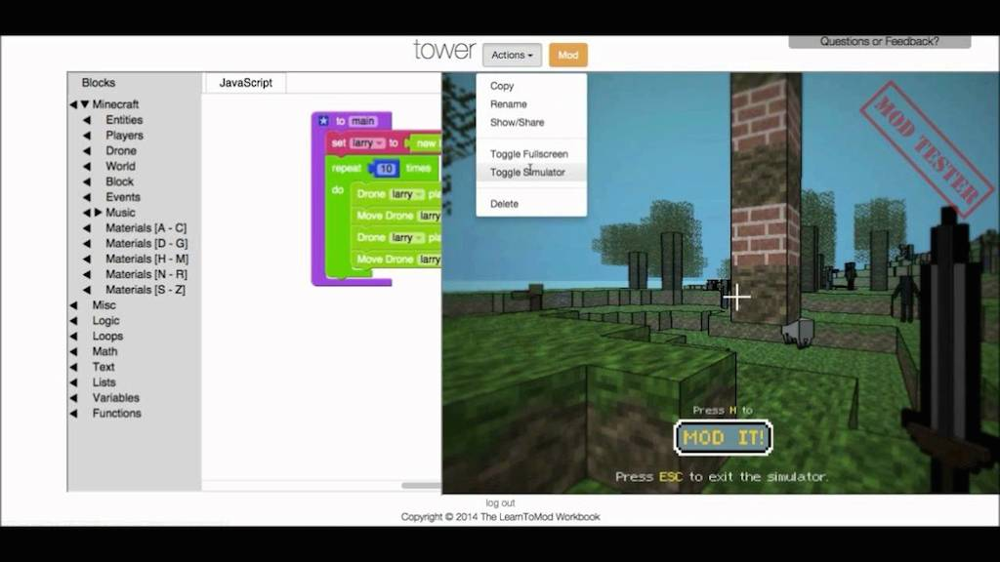
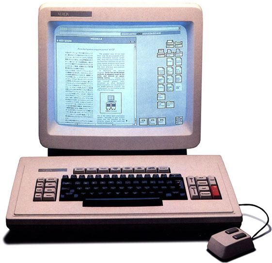

# Ορισμός

> Ο προγραμματισμός είναι ένας τρόπος σκέψης, όχι μια μηχανιστική δεξιότητα. Το να μάθεις τους βρόγχους 'for' δε σημαίνει πως μαθαίνεις να προγραμματίζεις, όπως δε σημαίνει πως μαθαίνεις να ζωγραφίζεις μαθαίνοντας για τα μολύβια. Bret Victor

### Περίληψη

Η διάδραση του ανθρώπου με υπολογιστές έχει καθιερωθεί στις περισσότερες ανθρώπινες δραστηριότητες, από την εργασία μέχρι την εκπαίδευση και τη διασκέδαση. Ο προγραμματισμός της διάδρασης που απαιτείται για την κατασκευή άρτιων συστημάτων είναι μια σύνθετη έννοια και μια διαδικασία που προϋποθέτει δεξιότητες τόσο τεχνολογικές, όσο και ανθρωπιστικές. Για παράδειγμα, δεν αρκεί ένας κατασκευαστής να είναι ικανός προγραμματιστής, θα πρέπει να έχει και άριστη κατανόηση του ανθρώπινου παράγοντα αλλά και της διαδικασίας σχεδίασης. Αν και υπάρχουν πολλοί ικανοί κατασκευαστές συστημάτων, όπως και σχεδιαστές με γνώσεις ανθρωπιστικών επιστημών, για να λύσουμε ένα πρόβλημα από δυο οπτικές (μηχανή-άνθρωπος) χρειάζεται ο γόνιμος συνδυασμός τους. Η ενότητα αυτή ορίζει ποιος είναι αυτός ο γόνιμος συνδυασμός και γιατί είναι απαραίτητος στον προγραμματισμό διαδραστικών συστημάτων.

## Η αξία της κατασκευής συστημάτων διάδρασης

Για κάθε σύστημα που δίνει ρόλο στον ανθρώπινο παράγοντα θα πρέπει πρώτα να τεκμηριώσουμε πως ορίζουμε και καταλαβαίνουμε τον άνθρωπο. Η κατανόηση αυτή δεν μπορεί να είναι αντικειμενική γιατί ανάλογα με την γνωστική περιοχή υπάρχει μια διαφορετική οπτική γωνία, ενώ ακόμη και μέσα στην ίδια γνωστική περιοχή έχουμε διαφορετικές σχολές. Για παράδειγμα, στην περιοχή της σύγχρονης δυτικής ιατρικής η έμφαση είναι στα επιμέρους όργανα, ενώ στις αντίστοιχες παραδοσιακές ανατολικές, η έμφαση είναι σε μια ολιστική αντίλειψη. Ακόμη, στην περιοχή της βιολογίας η έμφαση είναι στις αντικειμενικές διαδράσεις που έχουν τα κύταρα σε κλίμακα, τα οποία λίγο διαφέρουν από τα αντίστοιχα συγγενικών βιολογικών οργανισμών. Από την άλλη, στην ψυχολογία και στην κοινωνιολογία υπάρχουν σχολές που δίνουν έμφαση στην ατομική και συλλογική συμπεριφορά τα οποία διαμορφώνονται κυρίως από το εκπαιδευτικό και πολιτισμικό περιβάλλον των ανθρώπων. Πράγματι, το αξιακό σύστημα ενός πολιτισμού καθορίζει στον μεγαλύτερο βαθμό και τον ορισμό που έχουμε για τον άνθρωπο, ενώ σημαντικό ρόλο παίζει και η οπτική γωνία των επιμέρους γνωστικών περιοχών.

![Figure 1: Η πρώτη εφαρμογή των υπολογιστών στην βασική εκπαίδευση εντοπίζεται σχεδόν παράλληλα με τα πρώτα γραφικά περιβάλλοντα διάδρασης. Ο Seymour Papert σχεδίασε ένα σύστημα που επιτρέπει ακόμη και σε παιδιά προσχολικής ηλικίας να εξερευνήσουν σημαντικές έννοιες από τα μαθηματικά, τις φυσικές επιστήμες, και την μηχανική χωρίς να απαιτεί γνώσεις από τα ανώτερα γνωστικά και συμβολικά επίπεδα αυτών των περιοχών. Σταδιακά το ρομπότ συμπληρώθηκε με την οθόνη των γραφικών, η οποία καθώς το κόστος μειώθηκε έδωσε πρόσβαση σε περισσότερα σχολεία και μαθητές.](images/logo-robot.jpg){#fig:logo-robot}

Τα συστήματα διάδρασης έχουν ενσωματώσει διαχρονικά πολλές επιρροές από διαφορετικές γνωστικές περιοχές, ενώ και το πολιτισμικό υπόβαθρο των σημαντικότερων συντελεστών διαφέρουν σημαντικά σε κάθε περίοδο. Η αρχική θεμελίωση της περιοχής της κατασκευής των συστημάτων διάδρασης έγινε την δεκαετία του 1960[^1], όπου οραματίζονται έναν συχνό και προχωρημένο χρήστη, ο οποίος συνεργάζεται με άλλους χρήστες μέσω του συστήματος[^2], με στόχο την κατανόηση πολύπλοκων φυσικών ή κοινωνικών φαινομένων. Εδώ, ο άνθρωπος είναι μια δυναμική οντότητα, η οποία μετασχηματίζεται μέσα από την συνεργασία και την διάδραση, ενώ και τα προβλήματα που αντιμετωπίζει δεν είναι σαφώς ορισμένα. Λίγο αργότερα, οι ερευνητές προσπάθησαν να διευκολύνουν την εξέλιξη των δυνατοτήτων του ανθρώπου με διαδραστικά συστήματα μάθησης,[^3] τα οποία δεν εξασκούν απλά τις γνώσεις και τις δεξιότητες, αλλά καλλιεργούν τον τρόπο σκέψης[^4]

Η πιο συστηματική θεμελίωση έγινε από γνωστικούς ψυχολόγους[^5], οι οποίοι μοντελοποιούν τον άνθρωπο σαν έναν επεξεργαστή πληροφορίας, ο οποίος βρίσκεται μόνος του μπροστά σε ένα τερματικό και εκτελεί επαναλαμβανόμενες απλές διεργασίες, οι οποίες δεν απαιτούν δεξιότητα. Στη περίπτωση αυτή, ο άνθρωπος είναι κάτι σταθερό, σαν ένα γρανάζι μιας μηχανής που εκτελεί συνέχεια την ίδια διεργασία. Το τελευταίο παράδειγμα είναι αυτό που επικράτησε, γιατί σίγουρα είναι το πιο εύκολο να μάθουν οι χρήστες και ταυτόχρονα είναι το πιο αποδοτικό για όσους οργανώνουν τις διεργασίες των χρηστών. Αν δηλαδή θεωρήσουμε τον άνθρωπο σαν το στατικό εξάρτημα μιας μηχανής που είναι πάντα το ίδιο και σχετικά προβλέψιμο, τότε το συνολικό σύστημα είναι πιο εύκολο να κατασκευαστεί.

{#fig:human-computers}

Έχοντας δώσει ένα πλαίσιο για τον ορισμό του ανθρώπου, θα πρέπει να κάνουμε το ίδιο και για τον υπολογιστή. Για παράδειγμα, η χρήση της λέξης υπολογιστής για την περιγραφή των δημοφιλών επιτραπέζιων και κινητών συστημάτων είναι μια σχετικά πρόσφατη σύμβαση. Μέχρι και την δεκαετία του 1950, η λέξη υπολογιστής αναφέρεται με απόλυτη σαφήνεια σε μια ανθρώπινη δουλειά γραφείου[^6], που αφορούσε τον υπολογισμό λογαριθμικών πινάκων για χρήση στον υπολογισμό της τροχιάς πυραύλων. Η εφεύρεση και διάδοση των πρώτων κεντρικών υπολογιστών λίγο αργότερα άλλαξε εντελώς το νόημα της λέξης, αφού την ίδια ακριβώς δουλειά, δηλαδή τον υπολογισμό των λογαριθμικών πινάκων, την έκαναν πλέον μηχανήματα.

![Figure 3: Το τρανζιστοράκι της δεκαετίας του 1950 ήταν συνώνυμο με την πρώτη πραγματικά φορητή και δημοφιλή εκδοχή του ραδιοφώνου με τρανζίστορ. Ταυτόχρονα ήταν και η πρώτη δημοφιλής εφαρμογή της εφεύρεσης του τρανζίστορ, το οποίο στην συνέχεια θα μπει σε πολλές συσκευές που μέχρι τότε δούλευαν με λυχνίες, όπως ο υπολογιστής. Εκτός από την χρήση τρανζίστορ, αυτό που είναι κοινό και στις δύο αυτές περιπτώσεις (τρανζιστοράκι, υπολογιστής) είναι πως τα ονομάζουμε με αναφορά στην εσωτερική τους λειτουργία και όχι αναφορικά με την χρήση τους, η οποία στην περίπτωση του υπολογιστή είναι ένα ανοιχτό θέμα.](images/transistor-radio.png){#fig:transistor-radio}

Την ίδια ακριβώς περίοδο, η εφεύρεση του τρανζίστορ επέτρεψε την κατασκευή μικρών φορητών ραδιοφώνων, τα όποια έμειναν γνωστά για μια γενιά ανθρώπων ως τρανζιστοράκια[^7]. Με το ίδιο σκεπτικό, θα μπορούσαμε να ονοματίσουμε τους λεγόμενους κινητούς και φορετούς υπολογιστές επίσης τρανζιστοράκια, αφού είναι γεμάτοι από αυτά. Ταυτόχρονα, η ονομασία έξυπνο τηλέφωνο και η συσχέτιση της με τις δημοφιλείς συσκευές Android και iOS αποτελεί μια ακόμη χειρότερη παρανόηση για μια κατηγορία προϊόντων που οι κατασκευαστές τους θέλουν να θεωρούνται έξυπνα. Επομένως, το γεγονός ότι ένα κατασκεύασμα χρησιμοποιεί κάποιο υλικό ή λογισμικό για να κάνει κάποια λειτουργία δεν μπορεί να καθορίζει την ονομασία του, ούτε φυσικά μπορούμε να βασιζόμαστε σε χαρακτηρισμούς από τον κατασκευαστή.

![Figure 4: To Xerox Alto ήταν ένα ενδιάμεσο πρωτότυπο για το Dynabook, που απευθύνεται σε παιδιά, οπότε οι χρήστες στις πρώτες δοκιμές ήταν πολύ συχνά παιδιά από το δημοτικό. Με αυτόν τον τρόπο, το σύστημα διάδρασης με ποντίκι και με γραφικό περιβάλλον που αναπτύχθηκε εκεί απευθύνεται κυρίως σε χρήστες μικρότερης ηλικίας. Ταυτόχρονα, το σύστημα αυτό δεν περιλαμβάνει λειτουργικό σύστημα ή αρχεία και προτρέπει τους μικρούς χρήστες να αναπτύξουν μαζί με την καθοδήγηση του δασκάλου τις εφαρμογές που τους ενδιαφέρουν.](images/children-alto.png){#fig:children-alto}

Έχοντας περιγράψει ένα πλαίσιο επιμέρους ορισμών για τον άνθρωπο και τον υπολογιστή, μπορούμε να περάσουμε στο κεντρικό μας θέμα που είναι η διάδραση τους. Μια από τις αρχικές και πολύ δημοφιλείς θεωρήσεις της διάδρασης είναι αυτή του αυτοματισμού, δηλαδή ο στόχος της κατασκευής της διάδρασης είναι να μην έχουμε καθόλου διάδραση, ή αν η διάδραση είναι απαραίτητη, αυτή να γίνεται με φυσικούς τρόπους, όπως είναι η ομιλία. Η περιοχή της Τεχνητής Νοημοσύνης εστιάζει πάνω σε αυτόν τον στόχο και μετά από πενήντα χρόνια έχει σημειώσει πρόοδο, αλλά με αρκετούς περιορισμούς, καθώς και με παραδοχές που δεν είναι πάντα εποικοδομητικές για τις δυνατότητες του ανθρώπου. [^8] Από την άλλη πλευρά, η τεχνολογία της διάδρασης μπορεί να θεωρηθεί σαν μια νέα τεχνολογία γραφής. Πράγματι, οι άνθρωποι μαθαίνουν σχετικά εύκολα να μιλάνε, αλλά η δεξιότητα της ανάγνωσης απαιτεί πολλά χρόνια εκπαίδευσης. Επομένως, μια γόνιμη αναλογία είναι να θεωρήσουμε την διάδραση σαν ένα νέο σύστημα γραφής, το οποίο απαιτεί πολλά χρόνια εκπαίδευσης [^9] ειδικά για όσους θέλουν να βελτιωθούν, ενώ ταυτόχρονα δεν φαίνεται να έχει κάποιο τερματικό σημείο.[^10]

![Figure 5: Το σύστημα NLS περιέχει μια σειρά από διαχρονικές τεχνολογίες, όπως το υπερκείμενο, διάδραση με το ποντίκι, και τηλεδιάσκεψη, οι οποίες δεν υλοποιήθηκαν απλά ως μια τεχνολογική παρουσίαση, αλλά γιατί ο συνδυασμός τους εξυπηρετεί τον μεγαλύτερο στόχο της συνεργασίας των ανθρώπων ώστε να κατανοήσουν πολύπλοκα προβλήματα. Το σύστημα NLS είναι δύσκολο στην χρήση γιατί η ευχρηστία δεν προσφέρει κάποιο πλεονέκτημα σε ειδικούς που έχουν τακτική πρόσβαση και ασχολούνται με δύσκολα και ασαφή προβλήματα.](images/nls-group.jpg){#fig:nls-group}

Αυτή η ευρεία ανθρωπιστική θεώρηση της διάδρασης δεν έχει καθιερωθεί, αλλά έχει υποδεχθεί στην ομάδα της πολλές συμπληρωματικές συνεισφορές, που την έχουν επεκτείνει προς την κοινωνική διάδραση. Μια από τις σημαντικές θεωρήσεις της διάδρασης εμπνέεται από το θέατρο, όπου οι άνθρωποι παίζουν ρόλους και συνεργάζονται. Με αυτόν τον τρόπο, ένα σύστημα διάδρασης μπορεί να θεωρηθεί ως μια συνεργατική αναπαράσταση. [^11] Και σε αυτήν τη περίπτωση, όπως στην απλή διάδραση, η έμφαση βρίσκεται περισσότερο στην επαύξηση της συλλογικής νοημοσύνης παρά στην προσομοίωση της φυσικής συνεργασίας. Στην πράξη όμως, φαίνεται πως έχει επικρατήσει η αντίληψη πως οι άνθρωποι πρέπει να επικοινωνούν και να συνεργάζονται μέσω των υπολογιστών, όπως το κάνουν και στην πραγματικότητα. Το αποτέλεσμα είναι πως οι αντίστοιχες εφαρμογές συνεργασίας εστιάζουν μόνο στην μεταφορά του προσώπου και της φωνής, όπως ακριβώς η επεξεργασία ενός εγγράφου εστιάζει μόνο στο πως θα φαίνεται όταν θα τυπωθεί στο φυσικό χαρτί.

{#fig:xerox-bravo}

Το πιο χαρακτηριστικό παράδειγμα διάδρασης είναι αυτό του επιτραπέζιου υπολογιστή και της γραφικής επιφάνειας εργασίας, που ελέγχεται από τον χρήστη με συσκευές εισόδου όπως το πληκτρολόγιο και το ποντίκι. Η επιτραπέζια μορφή υπολογιστή και διάδρασης είναι σημαντική, γιατί ήταν η πρώτη που ξέφυγε από τις μέχρι τότε πολύ εξειδικευμένες εφαρμογές όπως είναι οι βάσεις δεδομένων. Έτσι, μπόρεσε να διευκολύνει τις εργασίες και την καθημερινότητα πάρα πολλών χρηστών με την επεξεργασία κειμένου, την ανάκτηση πληροφορίας από τον ιστό, και την επικοινωνία μέσω του ηλεκτρονικού ταχυδρομείου. Αν και το μοντέλο διάδρασης με τον επιτραπέζιο υπολογιστή δεν είναι ούτε τόσο δημοφιλές, ούτε τόσο εύκολο, όσο αυτό του κινητού υπολογισμού με τα έξυπνα κινητά και τις ταμπλέτες, έχει ιδιαίτερο ενδιαφέρον, γιατί έχει μείνει σχετικά ίδιο από τότε που δημιουργήθηκε, πράγμα που επιβεβαιώνει ότι ανεξάρτητα από τη ραγδαία τεχνολογική εξέλιξη, η ανθρώπινη διάδραση κινείται σε πιο αργούς ρυθμούς. Σε αυτό το πλαίσιο, η ευχρηστία και η εμπειρία του χρήστη αποτελούν τους κεντρικούς ορισμούς, και έχουν καθορίσει τον τρόπο που επεξεργαζόμαστε έγγραφα [^12] και κάνουμε ανάκτηση της πληροφορίας.[^13]

{#fig:web-search}

Αν και η ευχρηστία είναι μια από τις βασικές αξίες της διάδρασης, δεν είναι η μόνη, ενώ η σημασία της μπορεί να είναι πολύ μικρή σε ορισμένες περιπτώσεις. Αν, για παράδειγμα, το σύστημα διάδρασης έχει εφαρμογή στην διασκέδαση, τότε θέλουμε η διάδραση να προσφέρει, εκτός από απλή ευχρηστία, ψυχαγωγία και μάθηση. Στην περίπτωση της βελτίωσης ενός συστήματος που είτε προϋπάρχει είτε είναι παρόμοιο με υπάρχοντα συστήματα, τότε ο πιο απλός τρόπος από πλευράς κόστους, αποτελεσματικότητας, και ταχύτητας είναι να βασιστούμε σε επιτυχημένα ιστορικά παραδείγματα. Πράγματι, η αντιλαμβανόμενη ευχρηστία σχετίζεται περισσότερο με την οικειότητα του χρήστη με ένα σύστημα[^14], παρά με την αντικειμενική επίδοση του μετά από κάποια μικρή περίοδο εξάσκησης. Για παράδειγμα, η εκμάθηση του πληκτρολογίου ακόρντων ή μιας τροπικής διεπαφής, απαιτεί μερικές ώρες εκπαίδευσης, αλλά έχει διαχρονικό κέρδος τόσο στην απόδοση όσο και στην εργονομία, κατά την επεξεργασία κειμένου. Παρομοίως, η διακόσμηση της διεπαφής με εικονίδια και περίτεχνα περιγράμματα που αλληλοκαλύπτονται παρέχει μόνο υποκειμενική αισθητική οικειότητα, ενώ δεν έχει καμία αντικειμενική απόδοση, ειδικά για τον συχνό χρήστη.

{#fig:acme-editor}

Το γεγονός αυτό, από μόνο του, αποτελεί την σημαντικότερη γνώση σε αυτήν την περιοχή και ταυτόχρονα δείχνει ότι με αυτήν την νοοτροπία η εφικτή καινοτομία μπορεί να παρουσιαστεί μόνο σταδιακά και ποτέ ως μετάβαση παραδείγματος. Η κατανόηση της καινοτομίας περισσότερο ως γραμμική βελτίωση παρά ως σημαντική μετατόπιση παραδείγματος αποτελεί για την περιοχή της διάδρασης μια από τις σημαντικότερες αντιφάσεις, η οποία θεμελειώθηκε στα τέλη της δεκαετίας του 1970 κατά την μετάβαση από το Xerox PARC στην Apple. Πράγματι, η Apple με το κίνητρο της διάδοσης των προσωπικών συστημάτων διάδρασης σε όσο γίνεται μεγαλύτερο πληθυσμό δημιουργεί με μεγάλη ακρίβεια συστήματα τα οποία είναι πολύ εύκολα για τον περιστασιακό χρήστη. Στην συνέχεια μοχλεύει την οικειότητα του χρήστη με μια διεπαφή ώστε να δημιουργήσει την επόμενη έκδοση, όπου το κίνητρο, παραμένει η οικειότητα και όχι η βέλτιση διεπαφή, ειδικά αν ο χρήστης είναι συχνός. Φυσικά τα κυρίαρχα συστήματα έχουν σημαντικές αρετές, εκτός από την υποκειμενική ευχρηστία τους για τον άπειρο και περιστασιακό χρήστη, μας παρέχουν ένα πλαίσιο κατανόησης της κατασκευής συστημάτων διάδρασης, έτσι ώστε να μπορέσουμε να φτιάξουμε εναλλακτικά με τις ίδιες τεχνικές και τεχνολογίες αλλά με διαφορετική φιλοσοφία, κίνητρα και κατεύθυνση.

{#fig:hypercard-notes}

[^1]: @licklider1960man, @engelbart1962augmenting

[^2]: [5](#fig:nls-group)

[^3]: [1](#fig:logo-robot)

[^4]: @papert1980mindstorms, @kay1993early

[^5]: @card1983psychology

[^6]: [2](#fig:human-computers)

[^7]: [3](#fig:transistor-radio)

[^8]: @engelbart1962augmenting, @weizenbaum1976computer

[^9]: [4](#fig:children-alto)

[^10]: @kay1993early

[^11]: @laurel2013computers

[^12]: [6](#fig:xerox-bravo)

[^13]: [7](#fig:web-search)

[^14]: @raskin2000humane

## Κατασκευή υποδείγματος και επανάληψη

Η διαδικασία κατασκευής ενός λειτουργικού υποδείγματος είναι χρήσιμη ως μηχανισμός κατανόησης της διάδρασης που θέλουμε να υλοποιήσουμε, ενώ όταν το υπόδειγμα είναι σε μια πρώτη ικανοποιητική μορφή τότε μπορεί να χρησιμοποιηθεί για δοκιμές με τους τελικούς χρήστες ή ακόμη και να δημοσιευτεί ως αρχική έκδοση (π.χ., έκδοση άλφα, βήτα, από την ορολογία της τεχνολογίας λογισμικού). Αυτή η προσέγγιση είναι γνωστή στη βιβλιογραφία και ως *το υπόδειγμα ως προδιαγραφές*. Δηλαδή, αντί να ετοιμάσουμε ένα λεπτομερές συμβόλαιο που θα περιγράφει με λέξεις και διαγράμματα το αποτέλεσμα, έχουμε το ίδιο το αποτέλεσμα (εν τη γενέσει του) να δηλώνει τις ίδιες τις προδιαγραφές του. Αυτό είναι μια σχετικά απλή ιδέα που όμως φέρνει σε μεγάλη αντίθεση την περιοχή της κατασκευής συστημάτων διάδρασης με τις συγγενείς περιοχές της επιστήμης των μηχανικών, ακόμη και με τη γονική περιοχή της τεχνολογίας λογισμικού. Επίσης, αποδεικνύει την κεντρική θέση αυτού του βιβλίου, ότι η κατασκευή συστημάτων διάδρασης είναι μια νέα περιοχή που, ναι μεν έχει αρκετές ομοιότητες με άλλες, αλλά τελικά έχει τόσες διαφορές που απαιτεί ουσιαστικά διαφορετική αντιμετώπιση.

{#fig:sage-lightgun}

Αν και υπάρχουν πάρα πολλές τεχνικές και μεθοδολογίες και ακόμη περισσότερα εργαλεία και δομές για την κατασκευή της διάδρασης, αν έπρεπε να τα συνοψίσουμε όλα σε μια πρόταση, θα λέγαμε ότι: η κατασκευή της διάδρασης είναι η επαναληπτική κατασκευή ενός υποδείγματος. Αυτή η επανατοποθέτηση του προβλήματος της κατασκευής μας επιτρέπει να στρέψουμε την προσοχή μας στη φύση και στον ρόλο του υποδείγματος ως ένα είδος ζωντανών και ευμετάβλητων προδιαγραφών ενός νέου συστήματος. Η κατασκευή ενός νέου συστήματος διάδρασης, όσο νέο και αν είναι, συνήθως βασίζεται σε κάποια υλικά που υπάρχουν ήδη διαθέσιμα. Για παράδειγμα, ο μετασχηματισμός της διάδρασης πέρα από τον τηλέτυπο ξεκίνησε με νέες συσκευές εισόδου, όπως η πένα, καθώς και με την χρήστη της οθόνης από ραντάρ για την απεικόνηση γραφικών.[^15] Το σύστημα SAGE δημιουργήθηκε στο MIT και οι συσκευές διάδρασης ήταν οικείες. Φυσικά απαιτήθηκε πολυετής εργασία και ένας νέος ψηφιακός υπολογιστής για να μπορέσουν οι ίδιες συσκευές διάδρασης να παίξουν έναν νέο ρόλο στο σύστημα Sketchpad.[^16] Αρκεί μια οπτική σύγκριση των δύο συστημάτων για να δούμε ότι τα αρχέτυπα για τις βασικές συσκευές εισόδου και εξόδου με τον χρήστη είναι οι ίδιες ακριβώς και στα δύο συστήματα. Φυσικά διαφέρει πολύ ο κεντρικός υπολογιστής και κυρίως διαφέρει η κατασκευή της διάδρασης, αφού το Sketchpad δεν είναι απλά μια αναπαράσταση της πραγματικότητας, αλλά ένας συνεργατής που διευκολύνει την σχεδίαση μηχανολογικών συστημάτων.

{#fig:sketchpad-interaction}

Το υπόδειγμα θα πρέπει να είναι διαδραστικό, διαφορετικά είναι σκόπιμο να το χαρακτηρίσουμε ως ένα αρχικό προσχέδιο.

Τα προσχέδια και τα υποδείγματα κάθε άλλο παρά νέα είναι στην περιοχή των μηχανικών. Οι αρχιτέκτονες μηχανικοί ξεκινάνε τη σχεδίαση στο χαρτί, γιατί αυτός είναι παραδοσιακά ο πιο γρήγορος τρόπος αναπαράστασης μια ιδέας και βοηθάει τη σχεδιαστική σκέψη. Αντίστοιχα, η κατασκευή της διάδρασης είναι σκόπιμο να ξεκινήσει από ένα σύντομο αφηγηματικό σενάριο, το οποίο θα συνοδεύεται από μερικές ενδεικτικές οθόνες. Παρά τις ομοιότητες με τους αρχιτέκτονες μηχανικούς, σημαντικές διαφορές στη μέθοδο προκύπτουν επειδή το αποτέλεσμα του προγραμματισμού της διάδρασης δεν είναι κάτι στέρεο και σταθερό, αλλά κάτι πολύ ρευστό, ευμετάβλητο, και φευγαλέο, που αλλάζει ανάλογα με τη χρήση. Επιπλέον, τόσο τα προσχέδια όσο και τα πρωτότυπα θα πρέπει να αντικατοπτρίζουν την κίνηση που υπάρχει εκ των πραγμάτων σε μια διάδραση, κάτι που δύσκολα γίνεται στο χαρτί ή με απλές εικόνες. Για τον λόγο αυτό, στα προσχέδια του προγραμματισμού της διάδρασης θέλουμε να δημιουργήσουμε τουλάχιστον ένα λειτουργικό υπόδειγμα, [^17] ώστε να μπορεί ο σχεδιαστής και οι άλλοι συμμετέχοντες της ομάδας όχι μόνο να φανταστούν το τελικό προϊόν, αλλά να το χρησιμοποιήσουν.

{#fig:pebble-hifi}

Οι διαφορές από τους αρχιτέκτονες μηχανικούς στην κατασκευή του πρωτοτύπου συνεχίζονται στην περίπτωση της μακέτας. Ενώ η μακέτα είναι για τους αρχιτέκτονες ένα προχωρημένο πρωτότυπο που αναπαριστά υπό κλίμακα σε τρεις διαστάσεις το μελλοντικό προϊόν, στον προγραμματισμό της διάδρασης ένα διαδραστικό πρωτότυπο είναι σχεδόν το ίδιο με το τελικό προϊόν. Η σημαντικότερη όμως διαφορά σε σχέση με τους αρχιτέκτονες και τις άλλες συγγενείς επιστήμες του μηχανικού είναι ότι ένα διαδραστικό πρωτότυπο, και φυσικά το τελικό προϊόν, δεν ακολουθούν καθόλου διακριτά στάδια κατά τις φάσεις της σχεδίασης, της παραγωγής και της βελτίωσης. Για παράδειγμα, η πρώτη εμπορική έκδοση του δημοφιλούς Apple iPhone δεν είχε εφαρμογές άλλων κατασκευαστών λογισμικού, παρά μόνο τις επίσημες εφαρμογές της εταιρείας. Ήταν αυτό το *τελικό προϊόν*, ή μήπως ένα πολύ *προχωρημένο πρωτότυπο*; Μπορεί από την πλευρά του υλικού η συσκευή να βελτιώθηκε σταδιακά, όμως από την πλευρά του λογισμικού, η νέα δυνατότητα του συστήματος να δέχεται πρόσθετες εφαρμογές δημιούργησε ουσιαστικά ένα καινούργιο προϊόν. Επομένως, θα μπορούσαμε να χαρακτηρίσουμε το πρώτο εμπορικό iPhone ως ένα προχωρημένο διαδραστικό πρωτότυπο των σύγχρονων iPhone, τα οποία δεν έχουν πάψει να εξελίσσονται. Σε συνδυασμό με το λογισμικό που διατίθεται από την ίδια την εταιρεία (στο οποίο συχνά συνεισφέρουν ανεξάρτητοι προγραμματιστές), νέο, εξωτερικό υλικό προστίθεται και διευκολύνει σημαντικές ανθρώπινες δραστηριότητες που έχουν να κάνουν με τις συναλλαγές, την υγεία, τη δημιουργία και τη διασκέδαση, παράγοντας ουσιαστικά ένα οικοσύστημα διάδρασης.

Οι βασικές τεχνολογίες και ο αντίστοιχος προγραμματισμός της δικτύωσης, της αποθήκευσης και της επεξεργασίας δεδομένων, και κυρίως της εισόδου και εξόδου της διεπαφής με τον άνθρωπο, είναι δομικά στοιχεία του συστήματος. Επομένως, θέλουμε άμεση και εύκολη πρόσβαση σε όλα αυτά μαζί, χωρίς να πρέπει να ανησυχούμε για τις λεπτομέρειες της υλοποίησης. Αν και οι λεπτομέρειες της υλοποίησης θα έχουν μεγάλη σημασία όταν το σύστημά μας θα βρίσκεται στις ζωές πολλών ανθρώπων, σε αυτήν τη φάση της ανάπτυξης (κατά την οποία δεχόμαστε ότι δεν ξέρουμε τι ακριβώς ετοιμάζουμε, ούτε το πώς θα επηρεάσει την καθημερινότητα των ανθρώπων) είναι σκόπιμο να μην ασχοληθούμε με αυτές. Με αυτό το δεδομένο, η επιλογή των εργαλείων ανάπτυξης (ειδικά της γλώσσας προγραμματισμού και των βιβλιοθηκών) απλουστεύεται, αλλά σε καμία περίπτωση δεν μπορεί να χαρακτηριστεί εύκολη, πράγμα που θα δούμε στο αντίστοιχο κεφάλαιο των εργαλείων του προγραμματισμού της διάδρασης.

[^15]: Εικόνα [10](#fig:sage-lightgun)

[^16]: [11](#fig:sketchpad-interaction)

[^17]: [12](#fig:pebble-hifi)

## Η διάδραση σε μεγαλύτερη κλίμακα

Σε αυτήν την ενότητα περιγράφουμε τις ιδιότητες που παρουσιάζει μια γενιά επιχειρήσεων και οργανισμών που προσπαθούν να μεγιστοποιήσουν τους δεσμούς τους με άλλους συγγενείς οργανισμούς. Το όραμά τους στηρίζεται σε μια διαφορετική φιλοσοφία για την ιδιοκτησία και την αξία, ενώ ο ακρογωνιαίος λίθος για αυτό το οικοδόμημα είναι ο προγραμματισμός της διεπαφής του προγραμματιστή, ο οποίος αποτελεί ειδική περίπτωση του προγραμματισμού της διάδρασης με αποδέκτη έναν χρήστη -τον προγραμματιστή.

Η κατασκευή της διάδρασης έχει παραμείνει μια φευγαλέα περιοχή, επειδή σε κάθε χρονική περίοδο έχουμε διαφορετικές τεχνολογικές μορφές υπολογιστών (π.χ., επιτραπέζιος, κινητός, φορετός, διάχυτος) και διεπαφών με τους χρήστες (π.χ., γραμμή εντολών, γραφικό περιβάλλον, χειρονομίες, φυσική γλώσσα). Για παράδειγμα, ένας χρήστης υπολογιστών που έλαβε τη βασική, δευτεροβάθμια, και τριτοβάθμια εκπαίδευση τη δεκαετία του 1970, ή το πολύ μέχρι τα μισά της δεκαετίας του 1980, είναι πολύ πιθανό να έχει μεγάλη εξοικείωση με τη γραμμή εντολών και τους επιτραπέζιους υπολογιστές, αφού αυτή ήταν η βασική μορφή στα χρόνια της εκπαίδευσής του. Αντίστοιχα, ένας χρήστης που έλαβε την εκπαίδευσή του μετά το 2000 και κατά τη δεκαετία του 2010, είναι πολύ πιθανό να μην έχει καθόλου προσωπικό επιτραπέζιο υπολογιστή, αφού οι βασικές διεργασίες του χρήστη αυτήν τη χρονική περίοδο (π.χ., αναζήτηση στον παγκόσμιο ιστό, κοινωνική δικτύωση, ψηφιακό περιεχόμενο, κτλ.) μπορούν να γίνουν εξίσου καλά, αν όχι καλύτερα, με έναν κινητό υπολογιστή. Βλέπουμε, λοιπόν, ότι στην πράξη, ο ψηφιακός αλφαβητισμός είναι μια έννοια περισσότερο σχετική με τη δημογραφία και την ημερομηνία γέννησης, παρά μια διαχρονική αξία.

{#fig:bell-nomograph}

Η θέση του ψηφιακού αλφαβητισμού ως κάτι περισσότερο από εκπαίδευση στην απλή χρήση των τεχνολογιών πληροφόρησης και επικοινωνίας έχει διαπιστωθεί από τα μισά της δεκαετίας του 1990, όταν τα γραφικά περιβάλλοντα διεπαφής με τον χρήστη είχαν κλείσει μια δεκαετία εμπορικής ζωής. Οι ερευνητές διαπίστωσαν, ότι τα παιδιά που μεγάλωσαν με τη γραφική επιφάνεια εργασίας είχαν μεν μεγαλύτερη εξοικείωση με την παρουσία του υπολογιστή στη ζωή τους, αλλά είχαν πολύ μικρότερες δεξιότητες στη δημιουργική χρήση του. Η διαπίστωση αυτή οδήγησε σε μια σειρά από προσπάθειες τόσο στο λογισμικό όσο και στο υλικό υπολογιστών, έτσι ώστε να κρατήσουμε την προσβασιμότητα των σύγχρονων υπολογιστών, χωρίς όμως να χάσουμε τις δεξιότητες που προσφέρει η κατασκευή της διάδρασης. Για παράδειγμα, οι ερευνητές δημιούργησαν λογισμικό όπως τα KidSim, Etoys, και Scratch τα οποία βασίζονται στον οπτικό προγραμματισμό (visual programming) και στον προγραμματισμό με βάση παραδείγματα χρήσης (programming by example). Αντίστοιχα, για την περίπτωση του υλικού υπολογιστή δημιουργήθηκε το RaspberryPi, το οποίο είναι πολύ οικονομικό και συνδέεται με την τηλεόραση, έτσι ώστε να έχει όσο γίνεται μεγαλύτερη διάχυση στους νέους χρήστες υπολογιστών που διαφορετικά θα μεγάλωναν μόνο με οθόνες αφής. Τέλος, δημιουργήθηκαν πολλά απτικά προϊόντα προγραμματισμού, τα οποία δεν έχουν καθόλου οθόνη, και τα οποία βασίζονται στην οργάνωση απτών αντικειμένων, ενώ και το αποτέλεσμά τους μπορεί να είναι η φυσική κίνηση και διάδραση με ένα ρομπότ.

{#fig:math-blaster}

Ο ψηφιακός αλφαβητισμός είναι καθολικά αποδεκτός ως μια πολύ βασική δεξιότητα, ανεξάρτητα από τις προσωπικές και επαγγελματικές επιδιώξεις του κάθε ανθρώπου. Στις πρώτες φάσεις διάδοσης της διάδρασης με υπολογιστές, ο ψηφιακός αλφαβητισμός εξαντλήθηκε στην κατανόηση της χρήσης του υπολογιστή, αλλά τελικά έγινε σαφές ότι ο αλφαβητισμός, εκτός από την ανάγνωση, έχει ως αναγκαία προϋπόθεση και ένα βαθμό δεξιότητας στη συγγραφή. Φυσικά, όπως δεν έχουμε την απαίτηση από τον μέσο άνθρωπο να γράφει κείμενο όπως ένας κορυφαίος συγγραφέας, έτσι ακριβώς δεν έχουμε την απαίτηση να μπορεί να δημιουργήσει τα δικά του προγράμματα διάδρασης. Από την άλλη πλευρά, η δυνατότητα να παρέμβει στη δημιουργία και προσαρμογή προγραμμάτων διάδρασης που του ταιριάζουν είναι μια δεξιότητα που αυξάνει τις δυνατότητές του για έκφραση και δημιουργία, τόσο στην προσωπική όσο και στην επαγγελματική του ζωή. [^18]

{#fig:kidsim}

Με δεδομένη την ανάγκη ανάπτυξης δεξιοτήτων που θεμελιώνουν τον ψηφιακό αλφαβητισμό πέρα από την απλή χρήση -προς τη βαθύτερη κατανόηση λειτουργίας και ιδανικά τη δημιουργία νέων διαδράσεων- ένα ερώτημα που προκύπτει αφορά στην επιλογή του εργαλείου, την οργάνωση, αλλά και τη διαδικασία δημιουργίας της διάδρασης. Για να απαντήσουμε σε αυτό το ερώτημα θα πρέπει να ανατρέξουμε στη φύση του προγραμματισμού της διάδρασης. Το βασικό στοιχείο αυτής της περιοχής είναι ότι οι τελικές προδιαγραφές του συστήματος μάς είναι άγνωστες κατά το αρχικό στάδιο, ενώ είναι σίγουρο ότι ακόμη και αν έχουμε τις πρώτες εκδόσεις σε λειτουργικό επίπεδο, οι προδιαγραφές θα συνεχίζουν να προσαρμόζονται με τη χρήση και τη διαδικασία της επαναληπτικής αξιολόγησης (iterative evaluation process). Επομένως, τα κατάλληλα εργαλεία, οι διαδικασίες και οι δομές θα πρέπει να μπορούν να αλλάζουν γρήγορα, τόσο τα ίδια όσο και τα δημιουργήματά τους.

{#fig:mit-scratch}

Σε πρώτη ανάγνωση, ο προγραμματισμός της διάδρασης φαίνεται το άθροισμα (ή ίσως η τομή) των επιμέρους περιοχών του προγραμματισμού υπολογιστή και της διάδρασης ανθρώπου και υπολογιστή. Στην πράξη όμως, η πρόσθεση των γνώσεων προγραμματισμού σε εκείνες της διάδρασης ανθρώπου και υπολογιστή δεν είναι ικανή συνθήκη για τη δημιουργία νέων επινοήσεων ικανών να επαναπροσδιορίσουν ανθρώπινες και κοινωνικές δραστηριότητες. Αν και είναι σίγουρα αναγκαία συνθήκη να υπάρχουν οι βασικές επιμέρους γνώσεις, είτε στον ίδιο τον κατασκευαστή είτε στα μέλη μιας ομάδας συνεργασίας, υπάρχει επιπλέον η ανάγκη για γνώσεις σε ένα υψηλότερο επίπεδο - στο επίπεδο του προγραμματισμού της διάδρασης. Σε αυτό το υψηλότερο επίπεδο αφαίρεσης των επιμέρους λεπτομερειών εστιάζουμε στα εργαλεία, στις δομές και στις διαδικασίες που θα δώσουν δημιουργικές λύσεις σε υπάρχοντα προβλήματα, και θα επαυξήσουν τις δυνατότητές μας.

Όπως οι οπτικές γλώσσες προγραμματισμού υψηλού επιπέδου (π.χ., Scratch) έχουν μικρή μόνο σχέση με τις αντίστοιχες γλώσσες προγραμματισμού που είναι κοντά στη μηχανή (π.χ., Assembly, C), έτσι και ο προγραμματισμός της διάδρασης έχει μικρή μόνο σχέση με τις βασικές επιμέρους περιοχές του, όπως εκείνη του προγραμματισμού ΗΥ. Στην πράξη, ο προγραμματιστής της διάδρασης είναι χρήσιμο να ξέρει τις βασικές έννοιες του προγραμματισμού, όπως είναι η μεταβλητή και οι συνθήκες, αλλά από εκεί και πέρα η δεξιότητά του θα αυξηθεί περισσότερο αν μάθει να χρησιμοποιεί νέες βιβλιοθήκες και εργαλεία, παρά αν μάθει όλες τις αλγοριθμικές λεπτομέρειες που κάνουν ένα πρόγραμμα υπολογιστή αποδοτικό (π.χ., ταχύτητα, μνήμη). Επομένως, αν και μιλάμε για προγραμματισμό της διάδρασης, στην πράξη ο προγραμματισμός αυτός, όπου υπάρχει, αφορά περισσότερο τη δημιουργική σύνθεση και χρήση έτοιμων βιβλιοθηκών και εργαλείων με απλές δομές ελέγχου, με τελικό σκοπό την επαύξηση των ανθρώπινων και κοινωνικών δραστηριοτήτων.

Πέρα από την ανάγκη κατανόησης του σύγχρονου ψηφιακού κόσμου, οι γνώσεις και οι δεξιότητες της κατασκευής της διάδρασης δημιουργούν νέα προϊόντα και υπηρεσίες που επηρεάζουν τις προσωπικές αντιλήψεις, τις συνήθειες, τους θεσμούς και τις μορφές κοινωνικής οργάνωσης. Στην εποχή μας, που η χρήση του υπολογιστή έχει κατηγορηθεί για την αύξηση της ανεργίας μέσω του αυτοματισμού και της αύξησης της παραγωγικότητας, μπορούμε να δούμε με αισιοδοξία μια αχαρτογράφητη πτυχή του υπολογιστή ως μέσου και εργαλείου δημιουργίας ενός νέου επιπέδου ανθρώπινης δραστηριότητας.

Το λειτουργικό σύστημα των επιτραπέζιων υπολογιστών αρχικά ήταν προς πώληση ως προϊόν, συσκευασμένο σε κουτί. Στη συνέχεια, έγινε αντιληπτό ότι το περιεχόμενο του κουτιού ποτέ δεν ήταν το τελικό, αφού λίγες μέρες μετά τη συσκευασία και διανομή του, γίνονταν ήδη βελτιώσεις στον πηγαίο κώδικα. Η ανάπτυξη του διαδικτύου ως καναλιού διανομής επέτρεψε στο λογισμικό να βρει τον χαρακτήρα που του ταιριάζει περισσότερο, ως υπηρεσία (αν και υπάρχει μια υβριδική ισορροπία ανάμεσα στα δύο όταν το λογισμικό συνοδεύει κάποια συσκευή). Διαπιστώνουμε ότι το λογισμικό είναι αρκετά διαφορετικό από άλλα προϊόντα και υπηρεσίες αναφορικά με τις παρακάτω ιδιότητες: α) την πνευματική ιδιοκτησία, β) την εμπορευσιμότητα, ιδιότητες τις οποίες οποίες μελετάμε στα επόμενα.

{#fig:napster}

Υπάρχουν πολλά είδη δικαιωμάτων πνευματικής ιδιοκτησίας, όπως το εμπορικό σήμα (trademark), η πατέντα (patent), η πνευματική ιδιοκτησία (copyright). Τα περισσότερα έργα λογισμικού αντιμετωπίζονται όπως τα λογοτεχνικά βιβλία και έχουν πνευματική ιδιοκτησία, αν και υπάρχουν περιπτώσεις στο λογισμικό της διεπαφής ανθρώπου και υπολογιστή όπου έχει γίνει προσπάθεια για πατέντα. Για παράδειγμα, στα τέλη της δεκαετίας του 1980 η Apple προσπάθησε να προστατεύσει το Γραφικό Περιβάλλον Εργασίας (Graphical User Interface - GUI) απέναντι στον ανταγωνισμό της Microsoft. Επειδή το λογισμικό δεν είναι ούτε βιβλίο αλλά ούτε και βιομηχανικό αντικείμενο, τα υπάρχοντα είδη πνευματικής ιδιοκτησίας ίσως να μην του ταιριάζουν. Άλλωστε, αυξάνονται οι περιπτώσεις όπου το λογισμικό δίνεται με άδεια ανοικτού κώδικα (open source license) ή παρέχει κάποια Διεπαφή Προγραμματισμού Εφαρμογών (API, από το Application Programming Interface) και στη συνέχεια ο δημιουργός αναζητεί αμοιβή μέσα από την πώληση της τεχνογνωσίας του. Όσο χαρακτηριστική είναι η περίπτωση αυτοδημιούργητων τύπου *κλειστού κώδικα* όπως ο Bill Gates της Microsoft, άλλο τόσο ενδιαφέρουσα είναι η περίπτωση του Linus Torvalds, με τα ανοικτού κώδικα Linux, ο οποίος επέλεξε να δώσει δωρεάν τον καρπό της προσπάθειάς του. Και στις δύο περιπτώσεις είχαμε τη δημιουργία μιας πολύ μεγάλης βιομηχανίας και πολλών θέσεων εργασίας, παρόλο που η προσέγγιση του καθενός ήταν διαμετρικά αντίθετη.

{#fig:linux}

Η εμπορευσιμότητα ενός αγαθού ή υπηρεσίας εξαρτάται από πολλούς παράγοντες, αλλά ο σημαντικότερος είναι η δυνατότητα που υπάρχει για εύκολη γεωγραφική διανομή. Το λογισμικό, που ξεκίνησε ως μέρος του υλικού και στη συνέχεια έγινε δίσκος που αγοραζόταν από τα ράφια του λιανεμπορίου, τον τελευταίο καιρό έχει μετατραπεί σε υπηρεσία διαθέσιμη στο διαδίκτυο. Στην ίδια συζήτηση έχει ενδιαφέρον να αναφερθούμε και στη δουλειά του προγραμματιστή λογισμικού, στις δυνατότητες καθώς και στους κινδύνους από την εμπορευσιμότητα αυτής της εργασίας. Για παράδειγμα, μια υπηρεσία στο Web είναι διαθέσιμη παντού, πράγμα που σημαίνει ότι τελικά θα πρέπει να ανταγωνιστεί αντίστοιχες προσπάθειες από όπου και αν προέρχονται, είτε από τις τεχνολογικά ανεπτυγμένες χώρες είτε από τις χώρες με το εξειδικευμένο εργατικό δυναμικού χαμηλού κόστους. Πέρα από τις ευκαιρίες για μια διευρυμένη αγορά, μέσα σε αυτό το παγκοσμιοποιημένο πλαίσιο επαγγελματικής δραστηριότητας είναι μάλλον αφελές να κρατάμε κλειστή τη διεπαφή με ένα λογισμικό, αφού μέσα σε μικρό σχετικά χρονικό διάστημα κάποιος μπορεί να φτιάξει κάτι παρόμοιο ή κάτι καλύτερο. Μια περισσότερο αποτελεσματική στρατηγική είναι να κάνουμε διαθέσιμο τον πηγαίο κώδικα (ελπίζοντας σε συνεισφορές για τη βελτίωσή του) και ταυτόχρονα να μαθαίνουμε από τις διαδράσεις που κάνουν οι χρήστες. Έτσι, θα βελτιώνουμε την υπηρεσία, και κυρίως θα αυξάνουμε τη γνώση που έχουμε για το τι συνιστά ανά πάσα στιγμή μια χρήσιμη και επιθυμητή υπηρεσία, που είναι και το ζητούμενο για ένα σχετικά βιώσιμο ανταγωνιστικό πλεονέκτημα.

Από την άλλη πλευρά, το λογισμικό λειτουργεί παρόμοια με τη μηχανή εσωτερικής καύσης και τη βιομηχανική ρομποτική αναφορικά με την αυτοματοποίηση της ανθρώπινης δραστηριότητας. Η αυτοματοποίηση συνήθως θεωρείται αρετή, αφού επιτρέπει στον άνθρωπο να ασχοληθεί με κάτι άλλο από τις μηχανικές, επίπονες και επαναλαμβανόμενες διεργασίες. Στην πράξη επέτρεψε τη μετάβαση από την αγροτική στη βιομηχανική εποχή και έπειτα στην εποχή των υπηρεσιών. Η άλλη όψη του νομίσματος, όμως, περιγράφει μια επίπονη περίοδο μετάβασης από τη μια εποχή στην επόμενη. Όπως οι μηχανές εσωτερικής καύσης διευκόλυναν την εργασία και αύξησαν την παραγωγικότητα κατά τη μετάβαση από την αγροτική στη βιομηχανική εποχή, όπως η ρομποτική και ο αυτοματισμός μείωσαν στη συνέχεια την ανάγκη για ανθρώπινη εργασία στα εργοστάσια, με τον ίδιο τρόπο το λογισμικό διάδρασης έρχεται να αυτοματοποιήσει πάρα πολλές εργασίες που γίνονταν με τη μεσολάβηση ανθρώπων στη βιομηχανία των υπηρεσιών (π.χ., τράπεζες, ασφάλειες, ταξίδια, κτλ.). Αν η ιστορία είναι σωστός οδηγός, τότε θα πρέπει να αναζητήσουμε την επόμενη βιομηχανική επανάσταση ανάμεσα στις δυνατότητες που μας προσφέρει ο προγραμματισμός της διάδρασης για νέες υπηρεσίες και αγαθά, τα οποία με τη σειρά τους θα ορίσουν μια νέα αγορά.

Στη βιομηχανική εποχή (19ος αιώνας), όταν οι μηχανές αντικατέστησαν το μεγαλύτερο μέρος της ανθρώπινης χειρωνακτικής εργασίας, σε πρώτη φάση δημιούργησαν στρατιές ανέργων, σε δεύτερη φάση όμως, τα προϊόντα ορισμένων δημιουργικών ανθρώπων που βασίστηκαν στις μηχανές (π.χ., αεροπλάνο, αυτοκίνητο κ.ά.) δημιούργησαν νέους κλάδους εργασίας και ανθρώπινης δραστηριότητας αθροιστικά πολύ μεγαλύτερους από αυτούς που αρχικά κατέστρεψαν. Για παράδειγμα, τόσο η βιομηχανία του τουρισμού, όσο και η αύξηση της οικονομικής δραστηριότητας με τη συγκέντρωση των ανθρώπων στις πόλεις, ήταν παράπλευρες ωφέλειες του αεροπλάνου και του αυτοκινήτου, αντίστοιχα.

Είναι αλήθεια ότι το πρώτο κύμα διάχυσης του ΗΥ, με πρωταγωνιστή τον επιτραπέζιο ΗΥ, κατάφερε να αυτοματοποιήσει πολύ μεγάλο μέρος της εργασίας γραφείου, με αποτέλεσμα την απώλεια θέσεων εργασίας στον πυρήνα της οικονομίας των υπηρεσιών. Σε αναλογία με τη βιομηχανική εποχή, η ενσωμάτωση και η διάχυση του ΗΥ στην καθημερινότητα με νέα προϊόντα και υπηρεσίες ενδέχεται να δημιουργήσει αθροιστικά περισσότερες θέσεις εργασίας από εκείνες που χάθηκαν, αρκεί να βρεθούν οι δημιουργικοί και καταρτισμένοι προγραμματιστές της διάδρασης που θα φανταστούν και θα υλοποιήσουν αυτούς τους νέους κλάδους ανθρώπινης δραστηριότητας.

Ο προγραμματισμός της διάδρασης δεν είναι πανάκεια και σίγουρα δεν είναι λύση σε σημαντικά προβλήματα που έχουν να κάνουν με τη φτώχεια, την υγεία, και την εκπαίδευση. Από την άλλη πλευρά, ο προγραμματισμός της διάδρασης είναι σίγουρα μια λύση συμβατή με την πολύ σημαντική ανάγκη που αφορά στη δυνατότητά μας να φανταστούμε και να δημιουργήσουμε ένα διαφορετικό και νέο επίπεδο ανθρώπινης δραστηριότητας σε σημαντικούς τομείς όπως η εργασία, η ψυχαγωγία, η ευζωία ή η εκπαίδευση. Τέλος, είναι σίγουρα μία από τις λίγες λύσεις που έχουμε για να θέσουμε σε λειτουργία τον εκδημοκρατισμό των ψηφιακών μέσων σχεδίασης και παραγωγής, τα οποία έχουν τη δυνατότητα να περάσουν την οικονομία στο επόμενο στάδιο, στην εποχή μετά τη βιομηχανία των υπηρεσιών γραφείου.

[^18]: [14](#fig:math-blaster)

## Η περίπτωση του Minecraft

Πριν ο προγραμματισμός της διάδρασης αποκτήσει πρωταγωνιστικό ρόλο στην έρευνα και στη βιομηχανία, η επιτυχία ενός προϊόντος μπορούσε να μετρηθεί από τις πωλήσεις που έκανε ή από τις καλές κριτικές που έπαιρνε. Η άνοδος του προγραμματισμού της διάδρασης προσθέτει νέες μετρικές, όπως τη συμμετοχή των χρηστών στην επέκταση του αρχικού προϊόντος. Στον χώρο της ψυχαγωγίας μέσω υπολογιστή, μία από τις πιο επιτυχημένες περιπτώσεις είναι αυτή του Minecraft, στο οποίο οι χρήστες-παίκτες είναι εκείνοι που κατασκευάζουν από κοινού το περιβάλλον του παιχνιδιού.

{#fig:minecraft-end-user}

Η έμφαση στην κατασκευή του εικονικού κόσμου του παιχνιδιού από τους τελικούς χρήστες βασίζεται σε μια συμμετοχική φιλοσοφία που είναι εντελώς διαφορετική από την παροχή μιας προκατασκευασμένης εμπειρίας, όπως είναι το σύνηθες στα περισσότερα βιντεο-παιχνίδια. Οι δημιουργοί του Minecraft ανάγνωσαν έγκαιρα την ανάγκη των χρηστών για μεγαλύτερη δυνατότητα προσωπικής έκφρασης μέσα από τις ψηφιακές δραστηριότητές τους. Εκτός από τη συμμετοχή των χρηστών στην κατασκευή του εικονικού κόσμου του παιχνιδιού, οι κατασκευαστές του Minecraft έχουν προχωρήσει ένα βήμα παρακάτω, στη διευκόλυνση της ανάπτυξης επεκτάσεων (Modifications ή Mods) που αλλάζουν τη συμπεριφορά του παιχνιδιού ή προσθέτουν λειτουργίες. Μία από τις πιο ενδιαφέρουσες λειτουργίες προσθέτει τη δυνατότητα της εκμάθησης προγραμματισμού για τον υπολογιστή. Με δεδομένη την εμβύθιση (immersion) των χρηστών στο σύστημα διάδρασης του Minecraft, η ελπίδα είναι ότι η εκμάθηση του προγραμματισμού υπολογιστών μπορεί να κινητοποιηθεί από το ίδιο το μέσο, με σκοπό την κατασκευή νέων συμπεριφορών για τον κόσμο του Minecraft.

{#fig:learntomod}

Η ενεργή συμμετοχή των χρηστών στην κατασκευή παιχνιδιών δεν είναι κάτι νέο, ούτε ήταν το Minecraft η πρώτη ανάλογη περίπτωση. Στις αρχές της δεκαετίας του 1990 η δημοφιλής σειρά βιντεο-παιχνιδιών Doom έδινε τη δυνατότητα στους χρήστες να κατασκευάσουν τις δικές τους πίστες, πράγμα που διατηρούσε το ενδιαφέρον τους για περισσότερο καιρό. Στη δυνατότητα mods του Minecraft, και ειδικά στην ευελιξία που δίνει για να εξυπηρετήσει διαφορετικούς σκοπούς, βλέπουμε τη διαφορετική φιλοσοφία απέναντι στην ιδιοκτησία που έχουν οι εταιρείες του διαδικτύου σε σχέση με τις παλιότερες εταιρείες κατασκευής παιχνιδιών, οι οποίες ήθελαν να έχουν όσο γίνεται μεγαλύτερο έλεγχο τόσο στους χαρακτήρες όσο και στο εικονικό περιβάλλον του παιχνιδιού, ενώ πολλές φορές είχαν κάνει την πρόσβαση στα βιντεο-παιχνίδια τους δύσκολη σε μια προσπάθεια να αποτρέψουν την παράνομη αντιγραφή.

Η ίδια η ιστορία της ανάπτυξης του Minecraft έχει ιδιαίτερο ενδιαφέρον και πέρα από τη φύση της διάδρασης, η οποία όπως είδαμε παραπάνω βασίζεται στη συμμετοχή των χρηστών τόσο στο περιεχόμενο του παιχνιδιού όσο και στην επέκταση της ίδιας της συμπεριφοράς του με τροποποιήσεις (modifications ή mods). Η αρχική ανάπτυξη του παιχνιδιού έγινε από έναν μόνο έμπειρο κατασκευαστή, ο οποίος άφησε τη θέση υπαλλήλου που είχε σε εταιρεία ανάπτυξης βιντεο-παιχνιδιών για να υλοποιήσει τις δικές του ιδέες. Η έμπνευση ήρθε από την ενασχόλησή του με βιντεο-παιχνίδια από μικρούς ανεξάρτητους παραγωγούς, οπότε δημιουργήθηκε η πρώτη έκδοση ενός παιχνιδιού όπου ο χρήστης μπορούσε να τοποθετήσει αντικείμενα σε χώρο τριών διαστάσεων. Στη συνέχεια πρόσθεσε τη δυνατότητα κατασκευής από πολλούς χρήστες καθώς και από 'εχθρούς' τους. Από εκεί και πέρα, η δημοσιότητα ήρθε από μόνη της, όταν οι χρήστες του παιχνιδιού άρχισαν να δημιουργούν όμορφες κατασκευές. Βλέπουμε, λοιπόν, ότι η προσωπική έκφραση μέσω του υπολογιστή στην περίπτωση του Minecraft δεν είναι μόνο ένα προνόμιο του δημιουργού του αλλά και όλων των τελικών χρηστών, που έτσι νιώθουν το παιχνίδι δικό τους.

## Η περίπτωση του Xerox Star

Η γραφική επιφάνεια εργασίας όπως είναι διαθέσιμη σε πολλούς εμπορικούς επιτραπέζιους υπολογιστές λίγο διαφέρει από εκείνη που είχε ο υπολογιστής Xerox Star που δημιουργήθηκε στο ερευνητικό κέντρο PARC. Η γραφική επιφάνεια εργασίας σε συνδυασμό με το ποντίκι και το πληκτρολόγιο αποτελεί έναν ιδιαίτερα αποδοτικό τρόπο εργασίας με επεξεργαστές κειμένου και προγράμματα επεξεργασίας εικόνας και γραφικών. Η βασική διαφορά που έχει σε σχέση με το εμπορικά επιτυχημένο Apple Macintosh είναι ότι δεν έχει εφαρμογές, γιατί η βασική μεταφορά διάδρασης είναι ένα έγγραφο, όπου ανάλογα με το αντικείμενο που επεξεργάζεται ο χρήστης έχει στην διάθεση του τα αντίστοιχα εργαλεία. Δεν είναι τυχαίο ότι η δημιουργία της γραφικής επιφάνειας εργασίας έγινε από το ερευνητικό κέντρο PARC της εταιρείας XEROX κατά τη διάρκεια μελέτης και αυτοματοποίησης της εργασίας σε εκδοτικούς οργανισμούς. Πράγματι, ο στόχος αυτού του προϊόντος είναι η προσομοίωση του φυσικού χαρτιού στην οθόνη του υπολογιστή, έτσι ώστε να διευκολύνει τις εκδοτικές δραστηριότητες. Αξίζει να δούμε λίγο πιο προσεκτικά τα χαρακτηριστικά του Star γιατί θα καταλάβουμε καλύτερα τους λόγους που η γραφική επιφάνεια εργασίας πήρε αυτήν τη μορφή και όχι κάποια άλλη η οποία θα ήταν αποδεκτή, αν το πλαίσιο ανάπτυξης και οι ανάγκες των χρηστών ήταν διαφορετικές.

{#fig:xerox-star-pc}

Τα βασικά συστατικά της γραφικής επιφάνειας εργασίας υπήρχαν από προηγούμενες ερευνητικές και εμπορικές προσπάθειες (π.χ., ποντίκι, ηλεκτρονική επεξεργασία κειμένου σε οθόνη), αλλά ήταν το Xerox Star ο πρώτος υπολογιστής που ολοκλήρωνε τις κατακερματισμένες προσπάθειες σε μια χρήσιμη και εύχρηστη συσκευή. Η κινητήριος δύναμη αυτής της δημιουργικής και ολοκληρωμένης σύνθεσης ήταν η ανθρωποκεντρική σχεδίαση και ανάπτυξη του συστήματος Star με έμφαση στις ανάγκες ενός πελάτη, ενός εκδοτικού οίκου που έκανε επεξεργασία κειμένου και σελιδοποίηση εγγράφων και βιβλίων. Για τον σκοπό αυτό, οι ερευνητές έκαναν παρατήρηση (observation) του τρόπου εργασίας σε ένα γραφείο της εποχής που διαχειριζόταν έγγραφα. Με αυτόν τον τρόπο διαπίστωσαν ότι υπήρχε ανάγκη για εύκολη επεξεργασία και αποθήκευση ενός εγγράφου που περιείχε πολυμεσικά στοιχεία, καθώς και για τον διαμοιρασμό του. Οι παραπάνω προδιαγραφές που προέκυψαν από τις ανάγκες των χρηστών σε συνδυασμό με το πλαίσιο χρήσης (γραφείο εκδοτικού οργανισμού) οδήγησαν στη δημιουργία της γραφικής επιφάνειας εργασίας.

{#fig:xerox-star-desktop}

Η γραφική επιφάνεια εργασίας είναι μια συμπαγής και συνεπής σύνθεση από επιμέρους στοιχεία διάδρασης. Συνήθως αναφέρεται και ως μοντέλο 'Windows Icons Menus Pointer' (WIMP), καθώς τα βασικά της στοιχεία είναι τα παράθυρα, τα εικονίδια, τα μενού και ο δείκτης. Τα παράθυρα αντιπροσωπεύουν έγγραφα της ίδιας ή άλλων εφαρμογών, τα εικονίδια αντιπροσωπεύουν εφαρμογές, φακέλους και αρχεία, ενώ τα μενού επιτρέπουν ενέργειες πάνω σε αντικείμενα ή αλλαγή της κατάστασης μιας εφαρμογής. Ο δείκτης επιτρέπει την πλοήγηση (navigation) ανάμεσα σε παράθυρα, εικονίδια και μενού, καθώς και την επιλογή αντικειμένων. Ο δείκτης συνήθως ελέγχεται από ένα ποντίκι, αλλά αυτό δεν είναι η μόνη πιθανή συσκευή εισόδου, αφού ένας δείκτης μπορεί επίσης να ελέγχεται από διαφορετικές συσκευές εισόδου όπως είναι η πένα ή ακόμη και απευθείας με την αφή. Σε κάθε περίπτωση, αυτό που είναι σημαντικό στη γραφική επιφάνεια εργασίας είναι να έχουμε απευθείας χειρισμό των στοιχείων της από τον δείκτη. Τα παραπάνω χαρακτηριστικά τα συναντάμε με διαφορετική αισθητική και μικρές παραλλαγές σε εναλλακτικά λειτουργικά συστήματα με γραφική επιφάνεια εργασίας.

{#fig:paper-simulation}

Συνοπτικά, αυτό που ονομάζουμε γραφική επιφάνεια εργασίας είναι το αποτέλεσμα της δημιουργικής ολοκλήρωσης ενός συνόλου από προηγούμενες τεχνολογίες, για την εξυπηρέτηση των αναγκών μιας δεδομένης ομάδας χρηστών. Έχοντας αναλύσει παραπάνω τη γραφική επιφάνεια εργασίας από την πλευρά των χρηστών, οι οποίοι ήταν εργαζόμενοι γραφείου (κυρίως εκδοτικών οίκων ή συναφών οργανισμών), θα αναλύσουμε επίσης την πλευρά της τεχνολογίας, η οποία είχε βασιστεί σε προηγούμενα έργα. Ανάμεσα στις πολλές επιρροές του Xerox Star, η σημαντικότερη ήταν η υιοθέτηση της συσκευής εισόδου ποντίκι, και κυρίως ο τρόπος με τον οποίο ο δείκτης του ποντικιού επέτρεπε τη διάδραση με μια αφαιρετική αναπαράσταση της πληροφορίας σε μια οθόνη. Η σημασία αυτής της τεχνολογικής καινοτομίας μπορεί να γίνει κατανοητή αν αναλογιστούμε ότι μέχρι τότε η χρήση του υπολογιστή βασιζόταν στη στενή σύνδεση της εισόδου με την έξοδο για τον χρήστη, αφού για παράδειγμα είχαμε κείμενο σε οθόνη κειμένου, τα οποία διαχειριζόμασταν μόνο με το πληκτρολόγιο, χωρίς να υπάρχουν ενδιάμεσα επίπεδα αφαιρετικότητας του είδους της πληροφορίας. Τελικά, η συνεισφορά του υπολογιστή Star ήταν πολύ μεγαλύτερη από την αλλαγή του τρόπου που κάνουμε αυτό που λέμε "δουλειά γραφείου", αφού η ιστορία ανάπτυξής του δείχνει τη μέθοδο, τα εργαλεία και τους κανόνες, για να σχεδιάσουμε και να κατασκευάσουμε νέους τρόπους διάδρασης με τον υπολογιστή για άλλες ομάδες χρηστών και διαφορετικό πλαίσιο δραστηριότητας.

{#fig:xerox-star-genealogy}

Συνοπτικά, αυτό που ονομάζουμε γραφική επιφάνεια εργασίας είναι το αποτέλεσμα της δημιουργικής ολοκλήρωσης ενός συνόλου από προηγούμενες τεχνολογίες, για την εξυπηρέτηση των αναγκών μιας δεδομένης ομάδας χρηστών. Έχοντας αναλύσει παραπάνω τη γραφική επιφάνεια εργασίας από την πλευρά των χρηστών, οι οποίοι ήταν εργαζόμενοι γραφείου (κυρίως εκδοτικών οίκων ή συναφών οργανισμών), θα αναλύσουμε επίσης την πλευρά της τεχνολογίας, η οποία είχε βασιστεί σε προηγούμενα έργα. Ανάμεσα στις πολλές επιρροές του Xerox Star, η σημαντικότερη ήταν η υιοθέτηση της συσκευής εισόδου ποντίκι, και κυρίως ο τρόπος με τον οποίο ο δείκτης του ποντικιού επέτρεπε τη διάδραση με μια αφαιρετική αναπαράσταση της πληροφορίας σε μια οθόνη. Η σημασία αυτής της τεχνολογικής καινοτομίας μπορεί να γίνει κατανοητή αν αναλογιστούμε ότι μέχρι τότε η χρήση του υπολογιστή βασιζόταν στη στενή σύνδεση της εισόδου με την έξοδο για τον χρήστη, αφού για παράδειγμα είχαμε κείμενο σε οθόνη κειμένου, τα οποία διαχειριζόμασταν μόνο με το πληκτρολόγιο, χωρίς να υπάρχουν ενδιάμεσα επίπεδα αφαιρετικότητας του είδους της πληροφορίας. Τελικά, η συνεισφορά του υπολογιστή Star ήταν πολύ μεγαλύτερη από την αλλαγή του τρόπου που κάνουμε αυτό που λέμε "δουλειά γραφείου", αφού η ιστορία ανάπτυξής του δείχνει τη μέθοδο, τα εργαλεία και τους κανόνες, για να σχεδιάσουμε και να κατασκευάσουμε νέους τρόπους διάδρασης με τον υπολογιστή.

## Σύντομη βιογραφία του Ivan Sutherland

Ο Ivan Sutherland μεγάλωσε παίζοντας μια γερμανική εκδοχή των Lego, όπου ένα μικρό σετ από γεωμετρικά σχήματα μπορεί να δώσει μορφή σε πολύπλοκες κατασκευές όπως είναι μια γέφυρα. Το 1963 κατασκεύασε το διαδραστικό σύστημα σχεδίασης γραφικών Sketchpad, το οποίο μπορούσε να χρησιμοποιηθεί για την μοντελοποίηση πολύπλοκων συστημάτων όπως μια γέφυρα. Αν και έγινε γνωστός για αυτό το σύστημα, η συνεισφορά του είναι πολύ ευρύτερη καθώς δημιούργησε μια μεγάλη κοινότητα με ανθρώπους και εταιρείες.

{#fig:sutherland-profile}

Αμέσως μετά την δημιουργία του Sketchpad στο MIT, συνέχισε με την δημιουργία του Sword of Damocles στο Harvard, όπου τα γραφικά ακολουθούν την κίνηση του κεφαλιού του χρήστη. Το σύστημα αυτό αρχικά δημιουργήθηκε για την διευκόλυνση της προσγείωσης ενός ελικοπτέρου με κάμερες στην βάση του και προβολή του βίντεο σε δύο οθόνες που βρίσκονται πάνω σε ένα κράνος. Για να το πετύχει αυτό έβαλε στην θέση του βίντεο από τις κάμερες, έναν υπολογιστή που παράγει δυναμικά γραφικά. Το σύστημα αυτό είναι θεμελιώδες για τα συστήματα εικονικής πραγματικότητας των επόμενων δεκαετιών.

{#fig:sketchpad-drafting}

Εκτός από την συνεισφορά του στην επιστήμη των διαδραστικών γραφικών, στην συνέχεια της καριέρας του δημιούργησε μια από τις σημαντικότερες εταιρείες, η οποία κατασκεύασε προσομοιωτές πτήσης για τα αεροσκάφη της Boing, έτσι ώστε να γίνει καλύτερη η εκπαίδευση των πιλότων, αλλά και η σχεδίαση της πολύπλοκης διεπαφής πτήσης. Η βελτίωση της εκπαίδευσης και της διεπαφής στα αεροπλάνα θεωρείται ότι βελτίωσε με την σειρά της την ασφάλεια των πτήσεων. Στον χώρο της ψηφιακής ψυχαγωγίας ο μαθητής του Edwin Catmull εμπνεύστηκε από τις δυνατότητες των γραφικών στον υπολογιστή και προσπάθησε να εκπληρώσει το παιδικό του όνειρο να γίνει σχεδιαστής κινούμενων γραφικών με την κατασκευή νέων τεχνολογιών και εργαζόμενος σε εταιρείες μέχρι την δημιουργία της Pixar.

{#fig:animated-hand}

Παράλληλα με την εταιρεία συμβούλευε διδακτορικούς φοιτητές στο πανεπιστήμιο της Utah, ανάμεσα τους τον Alan Kay, καθώς και τους δημιουργούς άλλων σημαντικών εταιρειών, όπως η Pixar και η Adobe. Επίσης, ήταν υπεύθυνος για την συνέχιση της χρηματοδότησης του προγράμματος DARPA αμέσως μετά την αποχώρηση του Licklider, και με αυτόν τον τρόπο συνέχισε να στηρίζει την βασική έρευνα στις περιοχές των γραφικών και της διάδρασης που γινόταν στα MIT, Stanford, Xerox PARC, RAND. Συνολικά, ο Ivan Sutherland φαίνεται να έχει επηρεάσει ένα πολύ μεγάλο μέρος των σύγχρονων τεχνολογιών, είτε με τις δικές του καινοτομίες, είτε με αυτές των ανθρώπων που επηρέασε με την δουλειά του.

## Βιβλιογραφία {#βιβλιογραφία .unnumbered}
