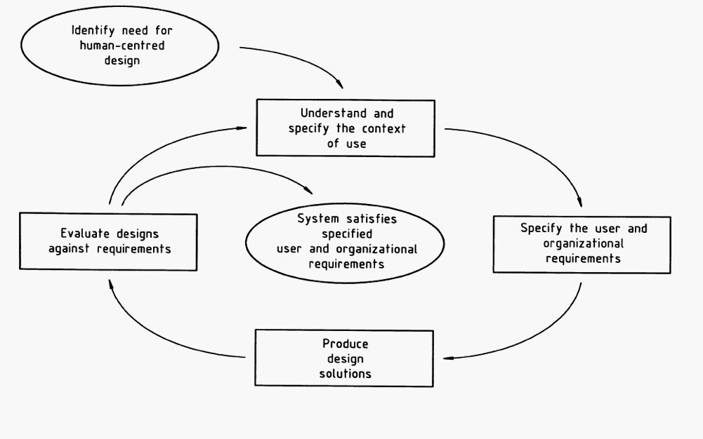
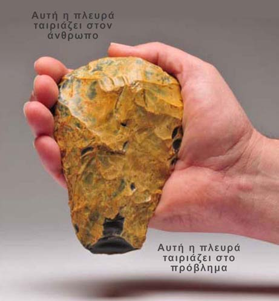
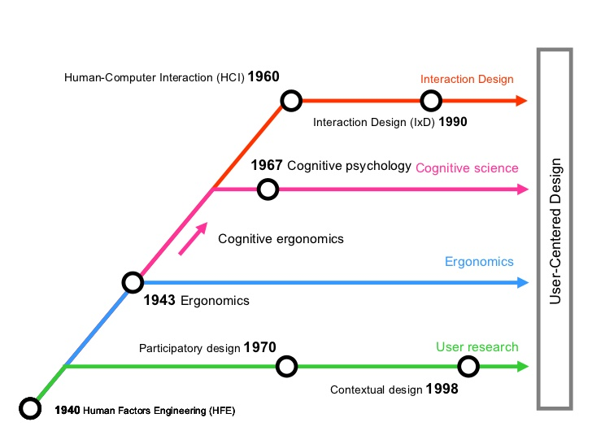
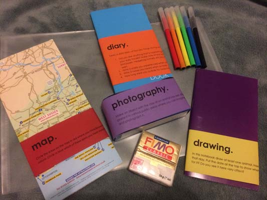
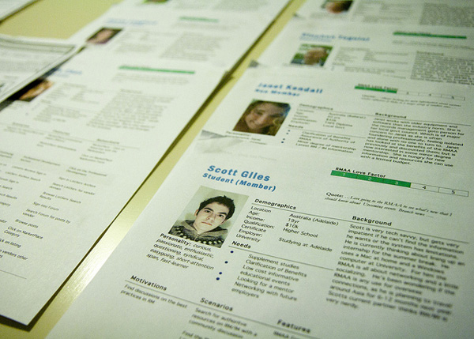
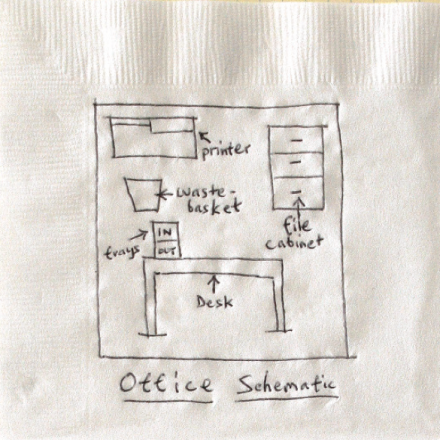
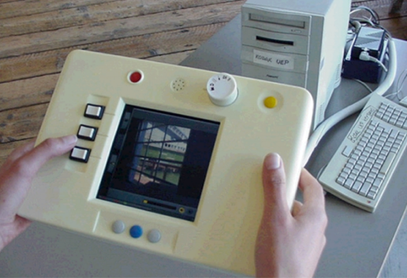
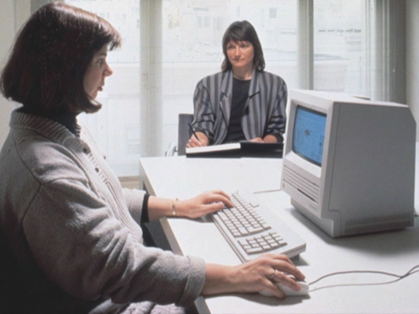
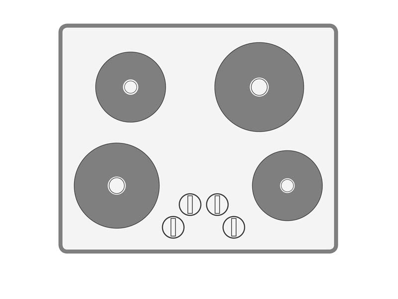

# Μέθοδος

> Κάνοντας σωστά τη σωστή σχεδίαση. Bill Buxton

### Περίληψη

Η ανθρωποκεντρική σχεδίαση έχει στόχο τη σχεδίαση και τη βελτίωση των συστημάτων διάδρασης ανθρώπου και υπολογιστή. Οι περισσότερες τεχνικές, κυρίως στην πρακτική εφαρμογή τους, δίνουν έμφαση στη βελτίωση συστημάτων που υπάρχουν ή συστημάτων που βρίσκονται στο στάδιο της σχεδίασης. Η βελτιστοποίηση ενός συστήματος είναι ένα σημαντικό θέμα, αλλά ακόμη σημαντικότερο είναι το να αποκτήσουμε την αυτοπεποίθηση της καταλληλότητας των προδιαγραφών του. Για αυτόν τον σκοπό, τόσο αυτό το κεφάλαιο όσο και τα υπόλοιπα κεφάλαια του βιβλίου εστιάζουν περισσότερο στην επανάληψη των βημάτων, παρά σε αυτά καθαυτά τα βήματα που συνιστούν τον κύκλο της ανθρωποκεντρικής σχεδίασης.

## Βελτιώνοντας τις ανθρώπινες δυνατότητες

![Το σύστημα NLS που παρουσιάστηκε τελικά είχε ποντίκι με τρία κουμπιά, ακόρντα πέντε πλήκτρων και ορθογώνια οθόνη. Μερικά χρόνια νωρίτερα η ερευνητική ομάδα ξεκίνησε με το διαθέσιμο υλικό εκείνης της εποχής, όπως ήταν η στρογκυλή οθόνη του ραντάρ και ένα χειροποίητο ποντίκι με ένα πλήκτρο, έτσι ώστε να κατασκευάσει μια πρώτη έκδοση για το λογισμικό διάδρασης και να διαπιστώσει στην πράξη ποιες αλλαγές απαιτούνται για την επόμενη έκδοση των συσκευών διάδρασης σε μια επαναλληπτική διαδικασία σχεδίασης.](images/nls-radar-keypad.jpg)

Στην προηγούμενη ενότητα είδαμε τι είναι η διάδραση με συσκευές και ποιες βασικές μορφές πήρε τις πρώτες δεκαετίες. Εδώ θα μελετήσουμε το πώς θα σχεδιάσουμε τη διάδραση. Αν και μας ενδιαφέρει η σχεδίαση των συστημάτων διάδρασης, θα εστιάσουμε περισσότερο στη σχεδίαση της διάδρασης μεταξύ ανθρώπου και συσκευής, με την έννοια ότι αυτή η διάδραση εξαρτάται εξίσου από την αντίληψη που έχει ο άνθρωπος για τη συσκευή, όσο και από τις λειτουργίες και την εμφάνιση της αντίστοιχης συσκευής. Είναι σημαντικό να κατανοήσουμε ότι η λεπτομερής σχεδίαση της διάδρασης πριν την υλοποίηση των αντίστοιχων λειτουργιών του συστήματος μπορεί να προσφέρει αποτελεσματικότερη διάδραση και επιπλέον μειωμένο κόστος και χρόνο ανάπτυξης. Η επαναληπτική σχεδίαση, η κατασκευή και η αξιολόγηση πρωτοτύπων επιτρέπει την οικονομική και γρήγορη απόρριψη ιδεών που δεν είναι αποτελεσματικές. Η ανάπτυξη αυτής της δεξιότητας, της σχεδίασης της διάδρασης, αν και φαίνεται κοινή λογική δεν είναι πάντα εύκολη στην πράξη. Μαθαίνεται μόνο με την εμπειρία, ειδικά μέσα από τη δοκιμή και την επανάληψη, όπως για παράδειγμα μαθαίνει κάποιος να γράφει ή να ζωγραφίζει καλύτερα.

Ίσως έχετε συναντήσει ξανά τον όρο της ανθρωποκεντρικής σχεδίασης της διάδρασης ανθρώπου και υπολογιστή με έμφαση στη μοντελοποίηση του χρήστη και με σκοπό την αυτοματοποίηση των διεργασιών του. Σε αυτό το βιβλίο η έμφαση δε δίνεται στη μοντελοποίηση των δεξιοτήτων και της συμπεριφοράς του χρήστη, ούτε στην αυτοματοποίηση των δραστηριοτήτων του (έμμεση διάδραση). Η έμφαση της ανθρωποκεντρικής σχεδίασης στην παρούσα ενότητα δίνεται στη σχεδίαση και υλοποίηση της διάδρασης με συσκευές χρήστη για τις περιπτώσεις όπου απαιτείται η ενεργή συμβολή του χρήστη (άμεση διάδραση).

Για να μπορέσουμε να κατανοήσουμε τη διάδραση ανθρώπου και υπολογιστή θα πρέπει να καταλάβουμε πρώτα τις ιδιότητες του ανθρώπου καθώς και εκείνες του υπολογιστή. Η κατασκευή ενός διαδραστικού συστήματος υπολογισμού βασίζεται σε προδιαγραφές που εκφράζουν τις ανάγκες που αυτό θα εξυπηρετεί. Με τη σειρά τους αυτές οι ανάγκες καταγράφονται αναφορικά με τις δεξιότητες του ανθρώπου, του υπολογιστή, καθώς και με τις ιδιότητες της μεταξύ τους διάδρασης.

Η σχεδίαση της διάδρασης δεν είναι μόνο η σχεδίαση της εμφάνισης και των λειτουργιών μιας συσκευής ή ενός συστήματος συσκευών και υπηρεσιών αλλά κάτι συνολικότερο, το οποίο λαμβάνει υπόψη του τον τρόπο που οι άνθρωποι σκέφτονται και επιτελούν τις εργασίες τους. Επίσης, οι συσκευές που χρησιμοποιούν οι άνθρωποι είναι κάτι περισσότερο από τα συστήματα εισόδου και εξόδου, οπότε η σχεδίαση πρέπει να εξετάσει ένα ολόκληρο οικοσύστημα το οποίο αποτελείται από τεκμηρίωση, υποστήριξη, εκπαίδευση, και διαδικασίες. Επομένως, υπάρχουν περιπτώσεις όπου η μελέτη της συνολικής υπάρχουσας κατάστασης μπορεί να δείξει ότι δεν απαιτείται κάποιο νέο τεχνολογικό σύστημα, αλλά απλώς μια αναδιάταξη ή βελτίωση των επιμέρους τμημάτων αυτού του οικοσυστήματος. Για αυτόν τον λόγο, κρίνεται σκόπιμο να θεωρήσουμε ότι δε σχεδιάζουμε απλά τη διάδραση με μια συσκευή ή με ένα σύστημα, αλλά κάτι ευρύτερο· μια παρέμβαση στον τρόπο που ένας ή περισσότεροι άνθρωποι εκτελούν διαδικασίες, είτε αυτές είναι εργασιακές, είτε ψυχαγωγικές. Σε αυτό το πλαίσιο, η ερώτηση που θα μας απασχολήσει στο παρόν κεφάλαιο είναι: τι είναι η σχεδίαση της διάδρασης ως διαδικασία;

Τα τρία βασικά στάδια της ανθρωποκεντρικής σχεδίασης (κατανόηση των αναγκών του χρήστη, εναλλακτικά σχέδια και κατασκευή πρωτοτύπου, αξιολόγηση πρωτοτύπων με χρήστες) εκτελούνται κυκλικά και άρα η επανάληψη βρίσκεται στον πυρήνα της ανθρωποκεντρικής σχεδίασης της διάδρασης.

Η ανθρωποκεντρική σχεδίαση της διάδρασης ανθρώπου και υπολογιστή δεν είναι κάτι νέο. Αν μάλιστα θεωρήσουμε και τις δράσεις που έχουν συμβεί έξω από την επιστημονική κοινότητα, μπορούμε να δούμε ότι είναι τόσο παλιά όσο η προσπάθεια κάποιων κατασκευαστών να φτιάξουν μηχανές και εργαλεία που βασίζονται στις δυνατότητες και τις δεξιότητες του ανθρώπου. Ίσως το πιο ενδιαφέρον παράδειγμα από το μακρινό παρελθόν είναι το σφυρί, ένα ξύλο δεμένο σε μια πέτρα, το οποίο βελτίωσε πάρα πολύ την ευχρηστία της πέτρας, που μέχρι τότε έπρεπε οι άνθρωποι να την χρησιμοποιήσουν κρατώντας την. Αντίστοιχα, μπορούμε να θεωρήσουμε ότι και η διαδικασία της ανθρωποκεντρικής σχεδίασης δεν είναι κάτι καινούριο αφού η δοκιμή και το σφάλμα είναι μια σχεδόν διαισθητική δραστηριότητα που συμβαίνει σε κάθε διαδικασία ανάπτυξης προϊόντος. Η διαφορά είναι ότι η περιοχή της διάδρασης ανθρώπου και υπολογιστή έχει καταγράψει μια περισσότερο συστηματική μεθοδολογία για την παραπάνω διαδικασία, που μέχρι τότε συνέβαινε πιο πολύ ως αυτοσχεδιασμός παρά συστηματικά.

Στο πρόσφατο παρελθόν, η αρχή της ανθρωποκεντρικής σχεδίασης εντοπίζεται στην περιοχή της Εργονομίας (Ergonomics and Human factors), η οποία μελετά τις σωματικές δυνατότητες του ανθρώπου για κίνηση. Στην περίπτωση της εργονομίας η ανθρωποκεντρική σχεδίαση έχει σημαντικό σύμμαχο τη σχετικά καλώς ορισμένη διακύμανση των μετρικών που περιγράφουν το ανθρώπινο σώμα και τις κινήσεις του. Στην πορεία ήρθε να προστεθεί και η περιοχή της γνωστικής επιστήμης (Cognitive Science) που δίνει έμφαση στις γνωστικές δυνατότητες του ανθρώπου για αντίληψη και επεξεργασία πληροφορίας. Στην περίπτωση της γνωστικής επιστήμης, αν και γίνονται επαναληπτικά πειράματα επιβεβαίωσης, είναι σίγουρα πιο δύσκολο να θεμελιωθεί μια θεωρία με βεβαιότητα, αφού τις λειτουργίες της σκέψης τις αντιλαμβανόμαστε έμμεσα και όχι άμεσα. Στους παραπάνω βασικούς πυλώνες (γνωστική επιστήμη και εργονομία) ήρθε να προστεθεί προσφάτως η συναισθηματική και η αισθητική διάσταση της σχεδίασης για τον άνθρωπο, η οποία έχει τις ρίζες της στις περιοχές της γραφιστικής και των εφαρμοσμένων τεχνών. Επίσης, η καλύτερη κατανόηση της διάδρασης του χρήστη με συσκευές επεκτείνεται και στην ανθρώπινη ψυχολογία, αφού στην πράξη είναι αδύνατο να διαχωρίσουμε τη λογική από το συναίσθημα. Φαίνεται ότι οι χρήστες θεωρούμε μια όμορφη διάδραση πιο εύχρηστη, αν και μετρώντας την εν λόγω ευχρηστία με αντικειμενικά κριτήρια (π.χ. χρόνος ολοκλήρωσης μιας λειτουργίας), μπορεί να αποδειχθεί πως δεν είναι.

Ο στόχος της ανθρωποκεντρικής σχεδίασης δεν είναι απλά η βελτιστοποίηση μιας σχεδίασης, αλλά πρωτίστως, η εύρεση των ιδιοτήτων της. Αρχικά, οι περισσότερες μελέτες έδιναν έμφαση στην ακρίβεια χρήσης ποσοτικών μεθόδων έρευνας και αξιολόγησης (π.χ. χρονομέτρηση ολοκλήρωσης μιας λειτουργίας) με στόχο τη βελτιστοποίηση μιας μεμονωμένης λειτουργίας ή ολόκληρης της σχεδίασης. Τη δεκαετία του 1990, οι δοκιμές ευχρηστίας και οι ποσοτικές μέθοδοι ήταν πολύ δημοφιλείς και είχαν στόχο να βελτιστοποιήσουν τον τρόπο που λειτουργούσαν οι προδιαγραφές σχεδίασης. Σε πολλές περιπτώσεις, οι κατασκευαστές -αν και όντως βελτίωναν μια σχεδίαση- δε δούλευαν πάνω σε εκείνη που θα γινόταν αποδεκτή από τους χρήστες. Τη δεκαετία του 2000, σταδιακά οι κατασκευαστές της διάδρασης άρχισαν να διερευνούν με ποιoν τρόπο θα σχεδιάσουν προϊόντα με μεγαλύτερη αποδοχή από το κοινό τους και έτσι άρχισαν να πειραματίζονται με ποιοτικές μεθόδους έρευνας, κάνοντάς τες πιο δημοφιλείς και πιο αποδεκτές από την επιχειρηματική κοινότητα. Στην πράξη, για την κατασκευή της διάδρασης χρησιμοποιούνται διερευνητικές τεχνικές με πρωτότυπα χαμηλής πιστότητας κατά το πρώτο στάδιο της κατανόησης των αναγκών, και σταδιακά με την κατασκευή του πρωτοτύπου υψηλής πιστότητας εφαρμόζονται περισσότερο ποσοτικές μέθοδοι, κατά τη φάση της αξιολόγησης με χρήστες.

Ανάμεσα στις πιο δημοφιλείς τεχνικές κατανόησης του χρήστη μπορούμε να ξεχωρίσουμε την εθνογραφία, η οποία ξεκίνησε από τις μελέτες των ανθρωπολόγων και προσαρμόστηκε στη σχεδίαση της διάδρασης. Εν συντομία, όπως οι ανθρωπολόγοι ενσωματώνουν τους εαυτούς τους στην καθημερινότητα πολύ διαφορετικών πολιτισμών, έτσι και οι σχεδιαστές των νέων διάχυτων ΗΥ, θα πρέπει είτε οι ίδιοι είτε μέσω άλλων ειδικευμένων για αυτόν τον σκοπό ερευνητών, να μπουν στη ρευστή καθημερινότητα των ανθρώπων για τους οποίους καλούνται να σχεδιάσουν νέα συστήματα διάδρασης, τα οποία μπορεί απλά να διευκολύνουν, να επαυξάνουν ακόμη και να αλλάζουν ριζικά τον τρόπο που ένας χρήστης ή ακόμη δυσκολότερα μια ομάδα ανθρώπων, σκέφτονται, αποφασίζουν και δρουν σε έναν κόσμο που γίνεται αντιληπτός αλλά και επηρεάζεται από διάχυτους υπολογιστές. Αν και η εθνογραφική μέθοδος είναι μια δημοφιλής επιλογή στη σχεδίαση νέων συστημάτων, μοιράζεται αρκετές τεχνικές (π.χ. παρατήρηση) με άλλες μεθόδους, οπότε η βέλτιστη κατανόηση και χρήση της προϋποθέτει και τη γνώση των συμπληρωματικών και πολλές φορές επικαλυπτόμενων μεθόδων (π.χ., συνεντεύξεις, ομάδες εστίασης, πολιτισμική διερεύνηση, κτλ.).

Η πολιτισμική διερεύνηση (cultural probes) είναι από τις πιο απλές και δημοφιλείς τεχνικές για την καταγραφή της συμπεριφοράς που έχουν οι χρήστες και την έμμεση αποκάλυψη των αναγκών τους. Η πολιτισμική διερεύνηση βασίζεται στην αποστολή ενός φακέλου με αντικείμενα καθημερινής χρήσης, τα οποία έχουν απλές οδηγίες για τους χρήστες. Για παράδειγμα, ένας φάκελος πολιτισμικής διερεύνησης στα τέλη της δεκαετίας του 1990 συνήθως περιείχε μια φωτογραφική μηχανή μιας χρήσης, καθώς και την παρότρυνση να βγάλουν φωτογραφία κάποιο αγαπημένο αντικείμενο ή δραστηριότητα. Εκτός από τη φωτογραφική μηχανή, ένα ακόμη δημοφιλές αντικείμενο είναι το ημερολόγιο, το οποίο ο χρήστης συμπληρώνει αναφορικά με τις δραστηριότητές του, όπως εκπομπές στην τηλεόραση και συναντήσεις με φίλους. Στο τέλος της χρονικής περιόδου, ο φάκελος της πολιτισμικής διερεύνησης αποστέλλεται στους ερευνητές, οι οποίοι χρησιμοποιούν τα περιεχόμενα του φακέλου (φωτογραφίες, αυτοκόλλητα post-it, κτλ.) στον χώρο σχεδίασης ώστε να μπουν καλύτερα στο κόσμο του χρήστη. Αν και τα περιεχόμενα του συμπληρωμένου φακέλου πολιτισμικής διερεύνησης δε δείχνουν μονοσήμαντα τις προδιαγραφές, το νόημα βρίσκεται περισσότερο στην καλύτερη εμβύθιση της ομάδας σχεδίασης στο περιβάλλον του χρήστη, έτσι ώστε τελικά οι προδιαγραφές που θα καθοριστούν να είναι συμβατές με το αντίστοιχο πλαίσιο χρήσης του προϊόντος.

Εκτός από την τεχνική της πολιτισμικής διερεύνησης (cultural probes) που μελετήσαμε παραπάνω, άλλη μια τεχνική που είναι απλή, αποτελεσματική, και δημοφιλής για την κατανόηση των ανθρώπινων αναγκών είναι ο καθορισμός αντιπροσωπευτικών χρηστών (personas). Η τεχνική αυτή βασίζεται στην περιγραφή των ιδιοτήτων ενός χρήστη, όπως είναι τα δημογραφικά, οι προτιμήσεις, και οι συνήθειές του. Οι αντιπροσωπευτικοί χρήστες που παρουσιάζονται στις personas μπορεί να είναι υπαρκτά πρόσωπα, αλλά μπορεί να είναι και φανταστικά πρόσωπα, τα οποία ομοίως ανταποκρίνονται σε κάποιες κατηγορίες χρήστη της εφαρμογής που αναπτύσσουμε. Οι personas κατασκευάζονται σε συνεργασία με τους τελικούς χρήστες της εφαρμογής και με δεδομένα που μαζεύονται από ερωτηματολόγια και συνεντεύξεις. Οι personas χρησιμοποιούνται από την ομάδα ανάπτυξης σε συνδυασμό με την τεχνική του αφηγηματικού σεναρίου, το οποίο θα δούμε στην επόμενη ενότητα της κατασκευής πρωτοτύπου χαμηλής πιστότητας. Για την ακρίβεια, οι personas είναι συνήθως οι πρωταγωνιστές ή σημαντικοί ρόλοι στα σενάρια που περιγράφουν τη διάδραση ανάμεσα στους χρήστες και στους υπολογιστές.

Πέρα από τις παραπάνω συστηματικές προσεγγίσεις για την κατανόηση των αναγκών του χρήστη, υπάρχουν και περισσότερο δημιουργικές απόψεις, οι οποίες βασίζονται στον αυτοσχεδιασμό και στην έμπνευση. Για παράδειγμα, για αρκετές από της συσκευές διάδρασης της Apple δεν έχει γίνει συστηματική έρευνα των αναγκών του χρήστη, αλλά έχει χρησιμοποιηθεί η έμπνευση, η διαίσθηση, και η δημιουργικότητα της ομάδας σχεδίασης και της διοίκησης. Τόσο ο σχεδιασμός του iPod, όσο και ο σχεδιασμός του iPhone, έχουν στοιχεία διάδρασης που μέχρι τότε δεν είχαν εμφανιστεί σε κάποιο άλλο εμπορικό προϊόν, αλλά μπήκαν σε αυτά τα προϊόντα γιατί ο κατασκευαστής πίστευε ότι αυτό είναι που έχουν ανάγκη οι χρήστες. Είναι φανερό ότι μια τέτοια προσέγγιση έχει πολύ μεγάλο ρίσκο αποτυχίας, ενώ απαιτεί και μεγάλα αποθέματα αυτοπεποίθησης, αλλά αν πετύχει, τότε το αποτέλεσμα είναι ο νικητής να βρίσκεται πολύ μπροστά από τους ανταγωνιστές, οι οποίοι είναι αναγκασμένοι να επαναπροσδιορίσουν τις κατηγορίες προϊόντων που προσφέρουν, αφού οι ανάγκες των χρηστών δεν θα είναι πλέον ίδιες. Είναι χαρακτηριστικό ότι ο αρχικός σχεδιαστής γραφικών στην εταιρεία Google, ανέφερε ότι ένας από τους λόγους της παραίτησής του ήταν ότι η κυρίαρχη κουλτούρα τεχνοκρατικής αντίληψης της εταιρείας είχε φτάσει στο σημείο να κάνουν δοκιμές για το αν το πάχος γραμμής θα έπρεπε να είναι δύο ή τέσσερα εικονοστοιχεία. Επομένως, εκτός από την μελέτη των χρηστών, μια ακόμη τεχνική κατανόησης των αναγκών είναι η διαίσθηση ενός έμπειρου και ταλαντούχου σχεδιαστή.

## Ελάχιστο εφικτό προϊόν

Σε αυτό το μέρος περιγράφουμε με περισσότερη λεπτομέρεια τη διαδικασία, τις τεχνικές και τα εργαλεία για την κατασκευή πρωτοτύπων διάδρασης με συσκευές χρήστη. Κάθε τεχνική παράγει ένα πρωτότυπο διαφορετικής πιστότητας και όσο μεγαλύτερη είναι η απαιτούμενη λειτουργικότητα του πρωτοτύπου τόσο περισσότερο χρόνο θέλουμε για να το φτιάξουμε ή για να το αλλάξουμε. Επομένως, η επιλογή του αναγκαίου βαθμού πιστότητας του πρωτοτύπου και ο καθορισμός της κατάλληλης τεχνικής κατασκευής του είναι πολύ σημαντικές παράμετροι και περιγράφονται σε αυτήν την ενότητα.

Η διαδικασία της κατασκευής της διάδρασης είναι ένας κύκλος επανάληψης στον οποίο δύσκολα θα προσδιορίσουμε πού αρχίζει και πού τελειώνει. Ειδικά για τα προϊόντα ευρείας χρήσης, είναι η ίδια η χρήση τους που επαναπροσδιορίζει τη φύση τους σε έναν αέναο κύκλο. Κάποιος θα μπορούσε να υποστηρίξει ότι όλα αυτά δεν είναι καθόλου νέα, και ότι όλες οι παραδοσιακές βιομηχανίες (κτήρια, αυτοκίνητα) σταδιακά μεταλλάσσονται για να εξυπηρετήσουν τους χρήστες τους. Αυτό είναι αλήθεια, αλλά οι αλλαγές που συνήθως συμβαίνουν σε όλες τις παραπάνω βιομηχανίες είναι τόσο σταδιακές χρονικά και τόσο προσθετικές δομικά, που και πάλι αναδεικνύεται αυτή η ιδιαιτερότητα του προγραμματισμού της διάδρασης ως προς τη διαδικασία κατασκευής, σε σχέση με τις πολύ συγγενείς του περιοχές.

Συνοπτικά, η κεντρική διαφορά κατασκευής της διάδρασης από άλλες επιστήμες του μηχανικού είναι ότι τόσο η διαδικασία ανάπτυξης όσο και η τελική κατασκευή αποτελούν στάδια ενός συνεχώς ανατροφοδοτούμενου κύκλου. Για παράδειγμα, η δημοφιλής υπηρεσία Google Mail για πολλά χρόνια είχε την ετικέτα βήτα (beta) ενώ ήταν πλήρως λειτουργική. Βλέπουμε λοιπόν, ότι στην περίπτωση του λογισμικού, οι *επίσημες τελικές εκδόσεις* είναι απλώς προφορικές ή γραπτές δηλώσεις και συμβάσεις του κατασκευαστή Σε αντίθεση με ένα σπίτι, το οποίο μετά την παράδοσή του στον χρήστη δέχεται ελάχιστες μετατροπές, ακόμη κι έπειτα από πολλά χρόνια.

 Τα αρχικά προσχέδια είναι και αυτά πολύ χρήσιμα, για την καλύτερη κατανόηση της διάδρασης, και κυρίως για την επικοινωνία μεταξύ των μελών της ομάδας ανάπτυξης. Τα αρχικά προσχέδια συνήθως έχουν τη μορφή του αφηγηματικού σεναρίου και των ενδεικτικών οθονών, αλλά υπάρχουν και άλλες επιλογές, όπως η ιστοριογραφία, το βίντεο, οι διαδραστικές διαφάνειες, και πολλά άλλα εξειδικευμένα εργαλεία κατασκευής προσχεδίου για το υπόδειγμα.

Υπάρχουν διάφορες τεχνικές κατασκευής πρωτοτύπου ανάλογα με το στάδιο ανάπτυξης και το είδος ενός νέου προϊόντος. Τα τμήματα έρευνας και ανάπτυξης μιας εταιρείας εντοπίζουν νέες ανάγκες, κατασκευάζουν πρωτότυπα, και κάνουν δοκιμές με χρήστες πριν καταλήξουν στο τελικό προϊόν. Η κατασκευή πρωτοτύπου είναι μια διαδικασία που κάνουν όλες οι εταιρείες αλλά διαφέρει ανάλογα με το είδος του προϊόντος και την οργάνωση της εταιρείας. Για παράδειγμα, μια μεγάλη εταιρεία συνήθως έχει σαφώς ορισμένες διαδικασίες κατασκευής πρωτοτύπων που καθορίζουν τον αριθμό των πρωτοτύπων που φτιάχνονται για κάθε έκδοση του προϊόντος καθώς και τις προδιαγραφές του. Αντίθετα, οι μικρές καινοτομικές εταιρείες χρησιμοποιούν το ίδιο το πρωτότυπο ως προδιαγραφές. Ακόμη, μπορεί να υπάρχουν διαφορές στα εργαλεία και τα υλικά που χρησιμοποιούνται για την κατασκευή του πρωτοτύπου ανάλογα με το είδος του προϊόντος. Για παράδειγμα, στην αυτοκινητοβιομηχανία ξεκινούν με σχεδιαγράμματα, συνεχίζουν με μοντέλα 3Δ στον υπολογιστή και καταλήγουν στην κατασκευή απτών πρωτοτύπων. Στην κατασκευή έξυπνων κινητών τηλεφώνων χρησιμοποιούνται όλες αυτές οι τεχνικές ανάλογα με το στάδιο ανάπτυξης του προϊόντος. Ειδικά στην περίπτωση της κατασκευής λογισμικού διάδρασης, η διάκριση ανάμεσα στο πρωτότυπο και στο τελικό προϊόν είναι πολλές φορές δυσδιάκριτη, αφού πολλά από τα πρωτότυπα γίνονται προϊόντα, ενώ τα προϊόντα με τη σειρά τους αποτελούν πρωτότυπα για την επόμενη έκδοση του προϊόντος.

Στόχος της σχεδίασης διαδραστικών συστημάτων είναι η μεγιστοποίηση της ευχρηστίας τους. Υπάρχει μια σειρά κανόνων σχεδίασης που βασίζονται σε προηγούμενη θεωρία ή/και εμπειρία και οι οποίοι μπορούν να μας βοηθήσουν στον καθορισμό εύχρηστων διαδραστικών συστημάτων, συμπεριλαμβανομένων αφηρημένων βασικών αρχών, οδηγιών και άλλων ζητημάτων σχεδίασης. Οι σχεδιαστικές οδηγίες είναι συλλογές συμβουλών για τους σχεδιαστές διεπαφών χρήστη οι οποίες είναι απαραίτητες, προκειμένου να εξασφαλιστεί ότι το τελικό προϊόν θα είναι φιλικό προς τον χρήστη. Αρκετά βιβλία και τεχνικές αναφορές περιέχουν μεγάλους καταλόγους από σχεδιαστικές οδηγίες. Αυτές διαιρούνται σε υποκατηγορίες με πιο εξειδικευμένες οδηγίες σχεδίασης. Οι περισσότερες έρευνες και προτάσεις που έχουν γίνει πάνω στις σχεδιαστικές οδηγίες αφορούν τα 'κλασικά' συστήματα υπολογιστών (επιτραπέζιος, κινητός υπολογιστής) που χρησιμοποιούνται σε ευρεία κλίμακα. Όμως, η ραγδαία ανάπτυξη του κινητού υπολογισμού τα τελευταία χρόνια, προκάλεσε μια έκρηξη στη ζήτηση αντίστοιχων συσκευών.

![Στην φάση της μετάβασης από τα αρχικά προσχέδια σε λειτουργικά πρωτότυπα υπάρχει πολύ μεγάλη ασάφεια αναφορικά με το λογισμικό και υλικό ειδικά στις περιπτώσεις που έχουμε νέες συσκευές, όπως ένα έξυπνο κινητό ή άλλες συσκευές διάχυτου υπολογισμού. Το πρωτότυπο υψηλής πιστότητας τύπου Buck γερυφώνει αυτήν την μετάβαση με την δημιουργική επαναχρησιμοποίηση υλικού και λογισμικού που ήδη υπάρχει, ακόμη και αν αυτά δεν θα είναι ίδια στο τελικό προϊόν, αρκεί να είναι αντιπροσωπευτικά της διάδρασης.](images/buck.png)

Η κατασκευή πρωτοτύπων για τον προγραμματισμό της διάδρασης σε συσκευές πέρα από τον επιτραπέζιο υπολογιστή είναι μια πρόκληση, η οποία είναι περισσότερο πολύπλοκη από την κατασκευή πρωτοτύπου για άλλες περιπτώσεις. Για παράδειγμα, η κατασκευή του πρωτοτύπου για μια εφαρμογή που θα εκτελεστεί σε έναν επιτραπέζιο ΗΥ δεν απαιτεί τίποτα περισσότερο από τον ίδιο τον επιτραπέζιο ΗΥ ανάπτυξης, γιατί και ο τελικός προορισμός της εφαρμογής θα είναι σε ένα παρόμοιο υλικό, και η διάδραση με τον χρήστη θα γίνεται με τις ίδιες συσκευές εισόδου, δηλαδή το πληκτρολόγιο και το ποντίκι. Το ίδιο ισχύει και για την κατασκευή ενός πρωτοτύπου για ένα νέο ποντίκι για τον επιτραπέζιο ΗΥ. Με δεδομένη την εργονομία του χεριού και το πλαίσιο χρήσης του ποντικιού, που είναι η μετακίνηση του δείκτη στην οθόνη και η επιλογή με ένα κουμπί, ο σχεδιαστής έχει αρκετά σημεία αναφοράς στα οποία μπορεί να βασιστεί.

![Στην φάση της μετάβασης από τα αρχικά προσχέδια σε λειτουργικά πρωτότυπα υπάρχει πολύ μεγάλη ασάφεια αναφορικά με το λογισμικό και υλικό ειδικά στις περιπτώσεις που έχουμε νέες συσκευές, όπως ένα έξυπνο κινητό ή άλλες συσκευές διάχυτου υπολογισμού. Το πρωτότυπο υψηλής πιστότητας τύπου Buck γερυφώνει αυτήν την μετάβαση με την δημιουργική επαναχρησιμοποίηση υλικού και λογισμικού που ήδη υπάρχει, ακόμη και αν αυτά δεν θα είναι ίδια στο τελικό προϊόν, αρκεί να είναι αντιπροσωπευτικά της διάδρασης.](images/handspring-buck.jpg)

Αντίθετα, η κατασκευή του πρωτοτύπου για μια συσκευή διάδρασης χρήστη με κινητό ή διάχυτο ΗΥ είναι μια πρόκληση, γιατί απαιτεί τη συνεργασία λογισμικού με την κατασκευή ειδικού υλικού διάδρασης με τον χρήστη. Καθώς ο διάχυτος υπολογισμός θα φέρνει περισσότερες συσκευές χρήστη σε περισσότερες πτυχές της ζωής μας, αυξάνεται η ανάγκη για κατασκευή (και αξιολόγηση από τους χρήστες) πρωτοτύπων υψηλής πιστότητας που συνδυάζουν υλικό με λογισμικό. Για αυτόν τον σκοπό οι σχεδιαστές της διάδρασης έχουν αναπτύξει μια τεχνική που συνδυάζει ειδικά φτιαγμένο υλικό διάδρασης με τον χρήστη, με λογισμικό που εκτελείται σε επιτραπέζιο ή κινητό ΗΥ, για τους οποίους οι προγραμματιστές μπορούν να χρησιμοποιήσουν τα διαθέσιμα εργαλεία ανάπτυξης. Η τεχνική αυτή δεν έρχεται να αντικαταστήσει τις τεχνικές κατασκευής πρωτοτύπου χαμηλής πιστότητας που μελετήσαμε προηγουμένως, αλλά έρχεται να προστεθεί, ως ένα ακόμη βήμα, στον επαναληπτικό κύκλο του προγραμματισμού της διάδρασης.

Ο σκοπός της κατασκευής πρωτοτύπου υψηλής πιστότητας είναι να το αξιολογήσουμε με χρήστες σε εργαστηριακό περιβάλλον ή ακόμη και σε μελέτη στο πεδίο (field research). Τα πρωτότυπα χαμηλής πιστότητας (π.χ., σενάριο, σχεδιάγραμμα, ενδεικτικές οθόνες) είναι κατάλληλα περισσότερο για την οπτικοποίηση και επεξεργασία αρχικών ιδεών από τους σχεδιαστές και τους συνεργάτες τους. Πράγματι, τα πρωτότυπα χαμηλής πιστότητας είναι χρήσιμα για τη γρήγορη και ανεπίσημη επικοινωνία μεταξύ των μελών μιας ομάδας σχεδίασης και ανάπτυξης, αφού οι λέξεις δεν είναι σχεδόν ποτέ αρκετές για να περιγράψουν το φαινόμενο της διάδρασης. Όταν, όμως, ο σκοπός είναι να κατανοήσουμε καλύτερα και κυρίως να αξιολογήσουμε ένα πρωτότυπο διάδρασης με χρήστες, τότε θα πρέπει να έχουμε μεγαλύτερη πιστότητα στη λειτουργία, ώστε να έχουν νόημα και οι αντιδράσεις των χρηστών που θα καταγραφούν και θα αναλυθούν. Για αυτόν τον σκοπό, γίνεται η κατασκευή του Buck, το οποίο αποτελείται από δύο βασικά τμήματα: 1) το λογισμικό που εκτελείται σε έναν επιτραπέζιο ΗΥ και 2) το υλικό διάδρασης της συσκευής με τον χρήστη, το οποίο είναι συνδεδεμένο ενσύρματα με τον επιτραπέζιο υπολογιστή, ώστε να μεταφέρει σε αυτόν για επεξεργασία την είσοδο από τον χρήστη.

Η κατασκευή πρωτοτύπου υψηλής πιστότητας τύπου Buck έχει επίσης χρησιμοποιηθεί και από άλλες εταιρείες για προϊόντα που συνδυάζουν το υλικό με το λογισμικό. Για παράδειγμα, η Kodak το χρησιμοποίησε για να φτιάξει το πρωτότυπο για ψηφιακές κάμερες. Σε αυτήν την περίπτωση εκτός από την κατασκευή του υλικού διάδρασης με τον χρήστη είχαμε και την ενσωμάτωση μιας μικρής οθόνης μέσα στο υλικό. Πάντως, το λογισμικό δεν εκτελείται στην ίδια τη συσκευή, αλλά στον επιτραπέζιο ΗΥ, με τον οποίο επικοινωνεί μέσω καλωδίου και διεπαφής που φροντίζει για τη μετατροπή των ενεργειών στη συσκευή του χρήστη σε μορφή κατανοητή από το λογισμικό του επιτραπέζιου ΗΥ. Και στις δύο περιπτώσεις έχουμε ένα πρωτότυπο διάδρασης που λίγο μοιάζει με το τελικό προϊόν, όμως εξυπηρετεί τον σκοπό της αξιολόγησης βασικών λειτουργιών από τους χρήστες. Τέλος, αξίζει να παρατηρήσουμε ότι ακόμη και στην κατηγορία των πρωτοτύπων υψηλής πιστότητας υπάρχει μια επιμέρους κλίμακα πιστότητας με κάποια πρωτότυπα να είναι περισσότερο κοντά στο τελικό προϊόν από κάποια άλλα.

Ο βασικός στόχος της κατασκευής της διάδρασης είναι να αναπτύξει συστήματα και συσκευές που να ανταποκρίνονται στις ανάγκες των χρηστών κατά τη διαδικασία επίτευξης των στόχων τους σε ένα δεδομένο πλαίσιο χρήσης. Για αυτόν τον σκοπό, οι σχεδιαστές συνήθως εξετάσουν παράγοντες όπως η ευχρηστία και η μέτρησή της.

## Επαναλληπτική αξιολόγηση με χρήστες

Σε αυτό το μέρος θα εξετάσουμε το κρισιμότερο χαρακτηριστικό ενός διαδραστικού συστήματος, τη χρήση του από την πλευρά του ανθρώπου. Η κατασκευή της διάδρασης αφορά στη δημιουργία επεμβάσεων σε συχνά πολύπλοκες καταστάσεις, όπου εμπλέκονται τόσο άνθρωποι όσο και ετερόκλητες τεχνολογίες, συμπεριλαμβανομένου του λογισμικού για επιτραπέζιο ΗΥ, του Web, των κινητών, και των διάχυτων συσκευών. Η πολυπλοκότητα συνήθως σημαίνει ότι κάτι μπορεί να μη γίνει σωστά στην πρώτη προσπάθεια, αφού η εισαγωγή μιας νέας διάδρασης θα δημιουργήσει αλλαγές σε ένα ευρύτερο τεχνολογικό και κοινωνικό σύστημα. Συνεπώς, χρειαζόμαστε επαναληπτικές διαδικασίες και πρωτότυπα για δοκιμή και αξιολόγηση. Η θεωρία (π.χ., οι δυνατότητες του ανθρώπου και οι ιδιότητες των συσκευών) και τα μοντέλα από τη βιβλιογραφία (π.χ., κανόνες και πρότυπα σχεδίασης) μπορούν να βοηθήσουν παρέχοντας ένα καλό σημείο εκκίνησης, αλλά η σχεδίαση δε θα είναι ολοκληρωμένη αν δε γίνει και αξιολόγηση, η οποία είναι το αντικείμενο αυτής της ενότητας.

Το τμήμα αυτό είναι ένα από τα σημαντικότερα από πρακτικής άποψης, καθώς δίνει συγκεκριμένες κατευθύνσεις για το πώς τελικά αξιολογείται συστηματικά ένα προϊόν προγραμματισμού της διάδρασης που απευθύνεται σε ανθρώπους. Το πρώτο και σημαντικότερο βήμα στην αξιολόγηση με χρήστες -με την προϋπόθεση ότι έχουμε ήδη ένα λειτουργικό πρωτότυπο υψηλής πιστότητας- είναι η πιλοτική δοκιμή. Επίσης, οι κανόνες σχεδίασης μπορούν να χρησιμοποιηθούν από ειδικούς, εκτός από τη δημιουργία πρωτοτύπου, στην αξιολόγηση ενός συστήματος διάδρασης και στη βελτίωσή του. Ακόμη, υπάρχουν οι πειραματικές και εργαστηριακές μεθοδολογίες αξιολόγησης διαδραστικών εφαρμογών. Ιδιαίτερο ενδιαφέρον παρουσιάζουν οι μέθοδοι αξιολόγησης στο πεδίο, καθώς χρησιμοποιούνται ευρύτατα από ερευνητές και επαγγελματίες του χώρου. Τέλος, σε κάθε περίπτωση αξιολόγησης, το πιο σημαντικό είναι να συλλέγουμε δεδομένα διαφορετικού είδους (π.χ., φυσιομετρικά, συμπεριφοράς, απόψεις), καθώς και να γίνονται επαναληπτικές πιλοτικές αξιολογήσεις με λίγους χρήστες, πριν προχωρήσουμε στην τελική αξιολόγηση με περισσότερους χρήστες.

Η αξιολόγηση της διάδρασης με μια μικρή ομάδα χρηστών είναι η πιο δημοφιλής τεχνική αξιολόγησης. Κατά τη φάση της ανάπτυξης, ακόμη και πέντε χρήστες είναι αρκετοί για να γίνει μια αξιολόγηση της διάδρασης. Ειδικά στα πρώτα στάδια της ανάπτυξης, όταν η ομάδα κατασκευής προσπαθεί να κατανοήσει τις ανάγκες των χρηστών και τους τρόπους που μια νέα διάδραση επηρεάζει τις δραστηριότητές τους, η έμφαση της αξιολόγησης βρίσκεται περισσότερο στις ποιοτικές διαστάσεις της, παρά στις ποσοτικές. Σε αυτές τις περιπτώσεις, ο μικρός αριθμός χρηστών συνοδεύεται και από περισσότερα ερωτήματα που έχουμε και θέλουμε να εξερευνήσουμε με τη συμμετοχή τους. Έτσι, η συλλογή των δεδομένων βασίζεται περισσότερο στην παρατήρηση και τις ημιδομημένες συνεντεύξεις με τους χρήστες.

Όταν βρισκόμαστε στα τελικά στάδια της ανάπτυξης, ή όταν κάνουμε μόνο μικρές μετατροπές σε ένα σύστημα διάδρασης που υπάρχει ήδη, τότε είναι περισσότερο σκόπιμο να χρησιμοποιήσουμε ένα εργαστηριακό πείραμα ή ακόμη και μια μελέτη στο πεδίο με περισσότερους χρήστες. Σε αυτές τις περιπτώσεις, εκτός από περισσότερους χρήστες (τουλάχιστον είκοσι), θα έχουμε και περισσότερο συγκεκριμένα ζητήματα και εναλλακτικές σχεδιάσεις για τις οποίες θα θέλουμε να εντοπίσουμε με μεγάλη ακρίβεια τις διαφορές. Αντίστοιχα, για τη συλλογή δεδομένων στην αξιολόγηση με μεγάλο αριθμό χρηστών ή με μεγάλο αριθμό διαδράσεων, είναι σκόπιμο να έχουμε περισσότερα είδη δεδομένων. Εκτός από τη βασική παρατήρηση των χρηστών που εκτελούν διεργασίες με ένα σύστημα διάδρασης μπορούμε να συλλέξουμε δεδομένα αυτόματα, καταγράφοντας τις λεπτομέρειες των διαδράσεων ή των βιομετρικών στοιχείων (π.χ., παρακολούθηση της ίριδας του ματιού, καταγραφή του σφυγμού) σε αρχεία στον υπολογιστή, καθώς και να έχουμε δομημένα ερωτηματολόγια.

Υπάρχουν κάποιες περιπτώσεις στην αξιολόγηση της διάδρασης, όπου ο αριθμός των χρηστών δεν είναι η σημαντικότερη παράμετρος. Για παράδειγμα, στην αρχική αξιολόγηση της συσκευής εισόδου 'ποντίκι' οι ερευνητές είχαν μόνο πέντε χρήστες και παρά τον μικρό (σχετικά) αριθμό τους κατέληξαν σε ισχυρά συμπεράσματα αναφορικά με τη συγκριτική απόδοση των συσκευών εισόδου, που δεν έχουν αλλάξει πολλές δεκαετίες μετά. Αντί για τον αριθμό των χρηστών, αυτό που έχει σημασία είναι ο αριθμός των διαδράσεων που θα αναλύσουμε για να καταλήξουμε σε συμπεράσματα. Στην περίπτωση της αξιολόγησης της συσκευής εισόδου 'ποντίκι', οι ερευνητές έκαναν πολλές προκαταρκτικές δοκιμές με τους χρήστες μέχρι να διαπιστώσουν ότι η απόδοση τους δεν αλλάζει, και τότε μόνο έκαναν συλλογή ακόμη περισσότερων διαδράσεων, αρκετών για οδηγηθούν σε ασφαλή συμπεράσματα. Το συμπέρασμα είναι ότι για τον καθορισμό του αριθμού των χρηστών θα πρέπει πρώτα να κάνουμε έναν διαχωρισμό: αν μας ενδιαφέρει η άποψή τους ή μόνο η απόδοσή τους.

## Η περίπτωση των καθημερινών πραγμάτων

Η κατανόηση και η χρήση μιας συσκευής διέπεται από μερικές βασικές και διαχρονικές αξίες που είναι οι ίδιες ανεξάρτητα από το είδος και την πολυπλοκότητα που μπορεί να έχει η διάδραση ανθρώπου υπολογιστή. Στο κλασικό βιβλίο του "Η Σχεδίαση των Καθημερινών Πραγμάτων" ο Ντον Νόρμαν παραθέτει ένα μικρό σύνολο από βασικές αξίες και δίνει παραδείγματα καλής και κακής εφαρμογής σε καθημερινά απλά αντικείμενα, όπως πόρτες και υδραυλικά. Οι βασικές αξίες που πρέπει να έχει μια συσκευή, ώστε να είναι κατανοητή και εύχρηστη κατά τη διάδραση με τον άνθρωπο, είναι: affordance, constraint, mapping, feedback. Το affordance αναφέρεται στις περισσότερο ή λιγότερο προφανείς χρήσεις που επιτρέπει η ίδια η εμφάνιση και λειτουργία ενός αντικειμένου. Το constraint αναφέρεται στους περιορισμούς που σκόπιμα εισάγει ο σχεδιασμός, ώστε να εμποδίσει κάποιες χρήσεις ή να αποτρέψει το λάθος κατά την σωστή χρήση. Το mapping αναφέρεται στη φυσική σύνδεση ανάμεσα στις καταστάσεις λειτουργίας και στον έλεγχο από την πλευρά του χρήστη. Τέλος, το feedback αναφέρεται στην συνεχή ανάδραση του συστήματος, ώστε να είναι πάντα γνωστή η κατάστασή του στον χρήστη.

Η διαπίστωση που επιβεβαιώνεται διαχρονικά στη σχεδίαση των καθημερινών πραγμάτων είναι ότι οι κατασκευαστές επαναλαμβάνουν τα ίδια λάθη με την παράλειψη των βασικών αξιών και ότι οι αξίες αυτές έχουν μείνει αναλλοίωτες. Οι κατασκευαστές κάνουν τα ίδια λάθη, γιατί κάθε φορά που έχουμε μια νέα τεχνολογική επανάσταση, η κατασκευή της διάδρασης γίνεται συνήθως από τους κατασκευαστές που έχουν οικειότητα με τη νέα τεχνολογία και οι οποίοι συνήθως είναι είτε νέοι είτε επικεντρωμένοι μόνο στην τεχνολογία. Οι βασικές αξίες έχουν μείνει οι ίδιες, γιατί ο άνθρωπος αλλάζει πολύ πιο αργά από όσο η τεχνολογία. Τελικά, ο στόχος της ανθρωποκεντρικής κατασκευής συστημάτων είναι να βρούμε μια ισορροπία ανάμεσα σε όλες τις δυνάμεις που επηρεάζουν τη σχεδίαση, την κατασκευή, τη διανομή, και τη χρήση των συσκευών διάδρασης.

## Η περίπτωση των Microsoft Windows

Η επιφάνεια εργασίας του επιτραπέζιου υπολογιστή είναι ένα δημοφιλές και ευέλικτο σύστημα που πέρασε από πολλούς κύκλους ανάπτυξης και προσαρμογής, τόσο κατά τα πρώτα στάδια δημιουργίας του όσο και κατά τη διάδοσή του. Η επιφάνεια εργασίας είναι μια πολύ ενδιαφέρουσα μελέτη περίπτωσης γιατί η εξέλιξή της ήταν σχετικά αργή, σε ένα διάστημα περισσότερων από σαράντα χρόνων. Σίγουρα η επιφάνεια εργασίας δεν έγινε τόσο δημοφιλής -ούτε χρονικά ούτε σε κλίμακα- όσο η διεπαφή και η διάδραση με τον κινητό υπολογισμό. Από την άλλη πλευρά όμως, ο σταδιακός και διαχρονικός μετασχηματισμός της επιφάνειας εργασίας παρουσιάζει ενδιαφέρουσες διακυμάνσεις και ομοιότητες ανάμεσα σε ανταγωνιστικά εμπορικά προϊόντα, τα οποία μπορούν να μας δώσουν πολλά μαθήματα σχετικά με τον κύκλο της ανθρωποκεντρικής σχεδίασης.

Τα Microsoft Windows είναι σίγουρα το πιο δημοφιλές λειτουργικό σύστημα με επιφάνεια εργασίας για επιτραπέζιους υπολογιστές και παρουσιάζει ιδιαίτερο ενδιαφέρον ως μελέτη περίπτωσης γιατί η εξέλιξή του ήταν σταδιακή, πράγμα που μας επιτρέπει να βλέπουμε πιο καθαρά τα επιμέρους στάδια και να τα ερμηνεύουμε, αφού πρώτα τα συνδέσουμε με άλλες σχετικές εξελίξεις. Επειδή η αποδοχή του βασικού λειτουργικού συστήματος Microsoft Disk Operating System (MSDOS) ήταν πολύ μεγάλη, η πρώτη έκδοση του γραφικού περιβάλλοντος ήταν βασισμένη σε αυτό και δεν είχε πολλές από τις βασικές λειτουργίες της διάδρασης με τη γραφική επιφάνεια εργασίας που είχαν ήδη εμφανιστεί σε αντίστοιχα προϊόντα από τον ανταγωνισμό, όπως ήταν το MacOS. Βλέπουμε πως ο κατασκευαστής της διάδρασης σε ορισμένες περιπτώσεις μπορεί να αγνοήσει εφικτές και χρήσιμες δυνατότητες της διάδρασης, προκειμένου να δώσει βάρος σε παλιές εφαρμογές, απλά και μόνο επειδή οι χρήστες τις έχουν συνηθίσει ή επειδή οι αντίστοιχοι κατασκευαστές εκείνων των εφαρμογών δεν είναι έτοιμοι να περάσουν στην επόμενη φάση. Με άλλα λόγια, βλέπουμε για μια ακόμη φορά ότι ο τεχνολογικός ντετερμινισμός δεν είναι αρκετός για να σπρώξει μπροστά την ανάπτυξη, αφού υπάρχει και ο ανθρώπινος και ο κοινωνικός παράγοντας που είναι εξίσου σημαντικοί.

Στα μέσα της δεκαετίας του 1990 οι τεχνολογικές συνθήκες έχουν ωριμάσει τόσο, ώστε μια μεγάλη μερίδα από τους χρήστες λειτουργικών συστημάτων να έχει αποκτήσει ή να έχει πρόσβαση σε γρηγορότερους επεξεργαστές και σε ξεχωριστές κάρτες γραφικών. Ταυτόχρονα, η αγορά των οικιακών υπολογιστών έχει διευρυνθεί αρκετά και καλύπτει πολλές επιμέρους ανθρώπινες δραστηριότητες. Οπότε, οι κατασκευαστές υλικού έχουν αρχίσει να διαθέτουν εξειδικευμένο εξοπλισμό που συνδέεται με τον υπολογιστή για να διευκολύνει τις διεργασίες των χρηστών, όπως μουσική, παιχνίδια, σχεδίαση, κτλ. Το παραπάνω πλαίσιο δημιουργεί τις ιδανικές συνθήκες για την εισαγωγή των Windows95, τα οποία έχουν πλέον μια πλήρη γραφική επιφάνεια εργασίας και υποστηρίζουν την εύκολη προσθήκη νέων προγραμμάτων και επιπλέον υλικού. Η αποδοχή των Windows95 από την αγορά μπορεί να συγκριθεί μόνο με αυτή των WindowsXP σχεδόν δέκα χρόνια μετά, ενώ η μεγάλη ομοιότητά τους, τόσο με το αρχικό Macintosh OS, όσο και με το Xerox Star, αποτελεί την απόδειξη ότι από μόνη της η ποιότητα της διάδρασης δεν είναι αρκετή για να καθορίσει την τύχη ενός προϊόντος στην ευρύτερη αγορά, αλλά απαιτείται και μια καλύτερη κατανόηση των αναγκών των επιμέρους ομάδων χρηστών. Βλέπουμε ότι ο προγραμματισμός της διάδρασης δεν βασίζεται μόνο στη σωστή κατασκευή της διάδρασης αλλά και στη σωστή κατανόηση των αναγκών των χρηστών.

Όπως είδαμε στα παραπάνω, η κατανόηση και η προσαρμογή στις ανάγκες των χρηστών είναι σημαντική συνθήκη για την επιτυχία της διάδρασης, αρκεί βέβαια η διάδραση να είναι εξίσου καλά προσαρμοσμένη στη συσκευή του χρήστη. Αν και η Microsoft διατηρεί το προβάδισμα στα λειτουργικά συστήματα του επιτραπέζιου υπολογιστή, η δεκαετία του 2010 τη βρίσκει να έχει μείνει πίσω στη ραγδαία αναπτυσσόμενη αγορά του κινητού υπολογισμού, ο οποίος εκτός από τα έξυπνα κινητά τηλέφωνα περιλαμβάνει και τις ταμπλέτες, που σταδιακά αντικαθιστούν πολλές από τις διεργασίες του επιτραπέζιου υπολογιστή. Σε μια προσπάθεια να δώσει προτεραιότητα στις κινητές συσκευές, η Microsoft εισάγει τα Windows8 με αρχική οθόνη διάδρασης αντίστοιχη με εκείνη που έχει στις κινητές συσκευές της. Αν και η επιλογή αυτή δημιουργεί μια πραγματικά ομοιόμορφη και συνεπή εμπειρία για τους χρήστες που κινούνται ανάμεσα σε πολλούς υπολογιστές (κινητούς και επιτραπέζιους), ταυτόχρονα απέχει από το να είναι η βέλτιστη για τον επιτραπέζιο υπολογιστή, με αποτέλεσμα να μειώνει την ευχρηστία του. Βλέπουμε λοιπόν, ότι ναι μεν η εστίαση στον χρήστη έχει προτεραιότητα, αλλά και η κατανόηση της φόρμας του υπολογιστή δεν πρέπει να αγνοείται. Επομένως, ο σωστός προγραμματισμός της διάδρασης μπορεί να γίνει κατανοητός ως μια λεπτή ισορροπία ανάμεσα στις ιδιότητες της συσκευής και στις ανάγκες του χρήστη, ισορροπία που μπορεί να γίνει εύθραυστη όταν έχουμε πολλούς διαφορετικούς χρήστες, και πολλά διαφορετικά είδη συσκευής χρήστη.

## Σύντομη βιογραφία του Douglas Engelbart

O Douglas Engelbart έγινε διάσημος για την συσκευή εισόδου ποντίκι, αλλά αυτό θεωρείται μόνο μια μικρή παράπλευρη εφεύρεση σε σχέση με το σύνολο της συνεισφοράς του στην περιοχή της κατασκευής της διάδρασης. Το όραμα του περιγράφεται αναλυτικά στην πρόταση χρηματοδότησης του έργου του, το οποίο οδήγησε σε μια διαδραστική παρουσίαση που έμεινε γνωστή ως η μητέρα όλων των επιδείξεων. Εκτός από το ποντίκι, εκείνη η παρουσίαση περιελάμβανε τεχνολογίες υπερκειμένου και τηλεδιάσκεψης.

Η βασική συνεισφορά του όμως δεν ήταν τόσο στις σχετικά πρωτοποριακές τεχνολογίες που παρουσίασε συγκετρωτικά το 1968 και αμέσως μετά έδωσε στην ερευνητική κοινότητα, αλλά στο όραμα του για την επαύξηση της ανθρώπινης νοημοσύνης. Την δεκαετία του 1960, όπως και σε άλλες δεκαετίες αργότερα, το κυρίαρχο θέμα δραστηριότητας στην τεχνολογία ήταν αυτό της τεχνητής νοημοσύνης, όπου ο ανθρώπινος παράγοντας απουσιάζει και οι εργασίες γίνονται αυτόματα από μια έξυπνη μηχανή, η οποία έχει προγραμματιστεί ή εκπαιδευτεί ώστε να κάνει τις ενέργειες των ανρθώπων.

Αντίθετα με το όραμα της τεχνητής νοημοσύνης που βάζει σε δεύτερο ρόλο τον άνθρωπο, το όραμα της επαυξημένης νοημοσύνης έχει σαν πρωταγωνιστή τον άνθρωπο, ο οποίος σε συνεργασία με άλλους οδηγεί συνειδητά την μηχανή σε μια καλύτερη κατανόηση πολύπλοκων φαινομένων καθώς και σε καλύτερες συλλογικές αποφάσεις. Δεν είναι τυχαίο πως αυτό το έργο δημιουργήθηκε την δεκαετία του 1960 στις δυτικές ακτές των ΗΠΑ, όπου υπήρχαν πολιτικές και πολιτισμικές ζυμώσεις για έναν καλύτερο και διαφορετικό κόσμο.

Για τον σκοπό αυτό, οι χρήστες του συστήματος μέσα από μια εκπαίδευση γνώσεων και δεξιοτήτων μπορούσαν να έχουν εναλλακτικές απόψεις πάνω στα δεδομένα τους. Για παράδειγμα, εκτός από το ποντίκι υπήρχε και μια συσκευή ακόρντων, η οποία άλλαζε την τροπικότητα της διεπαφής στην οθόνη. Αν και στην πορεία η ουσία του έργου του χάθηκε για τους πολλούς, επηρέασε άλλους σημαντικούς ερευνητές όπως ο Alan Kay και ο Ted Nelson, οι οποίοι συνέχισαν το έργο του στις περιοχές της δεξιοτεχνικής διάδρασης και του υπερκειμένου, χωρίς όμως ούτε αυτοί να έχουν κάποιο σημαντικό εμπορικό αποτύπωμα μέχρι σήμερα.

## Βιβλιογραφία {#βιβλιογραφία .unnumbered}
