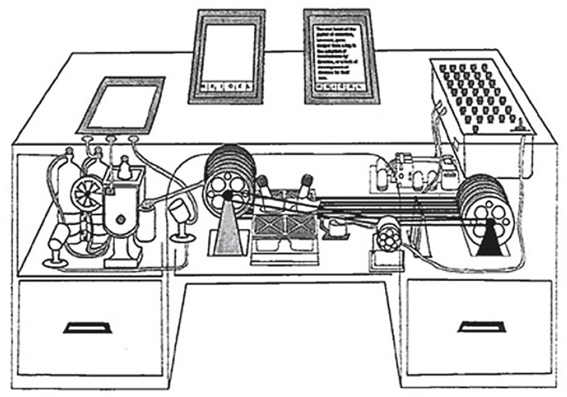
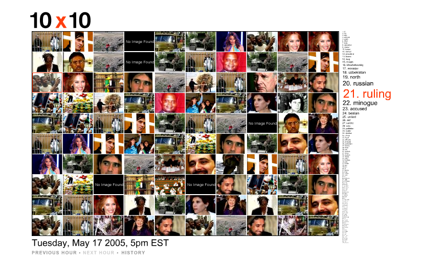
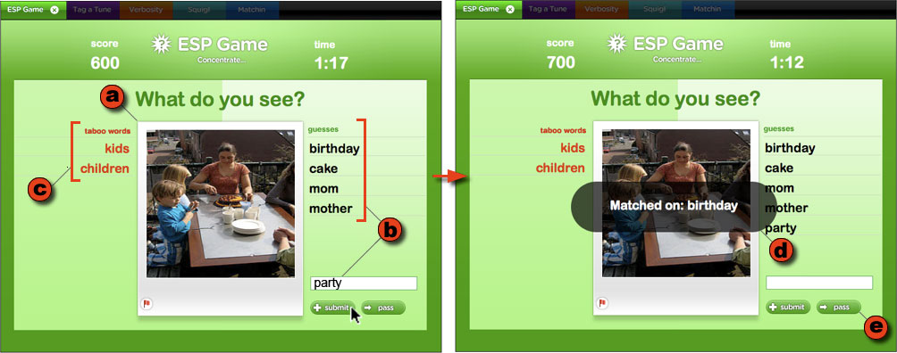
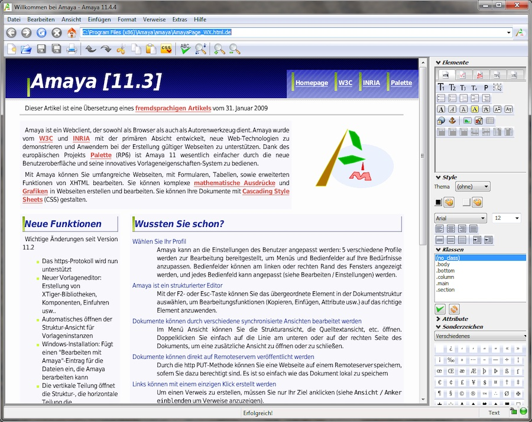
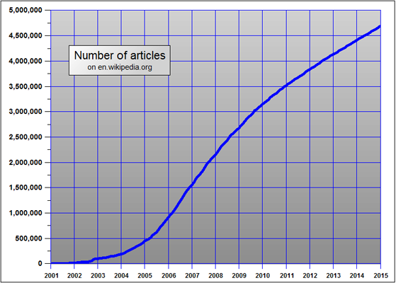
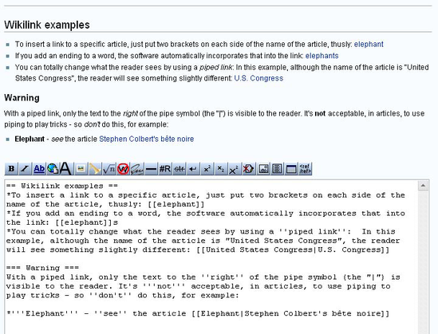

# Σύνθεση

> Ελπίζουμε ότι, σε όχι πάρα πολλά χρόνια, τα ανθρώπινα μυαλά και οι υπολογιστικές μηχανές θα συνδεθούν πολύ στενά μεταξύ τους, και ότι η συνεργασία που θα προκύψει θα σκέφτεται όπως δεν έχει σκεφτεί ποτέ ο ανθρώπινος εγκέφαλος και θα επεξεργάζεται τα δεδομένα με τρόπο που δεν έχουν πλησιάσει οι μηχανές διαχείρισης της πληροφορίας που γνωρίζουμε σήμερα. J. C. R. Licklider

### Περίληψη

Η μελέτη του προγραμματισμού της διάδρασης για την περίπτωση των συνεργατικών συστημάτων -καθώς και για συστήματα που είναι σύνθεση επιμέρους συστημάτων- απαιτεί επιπλέον μεθόδους και τεχνικές από εκείνες που είδαμε στο δεύτερο κεφάλαιο. Επίσης, ο βαθμός συμμετοχής των χρηστών στη διαδικασία της σχεδίασης, της ανάπτυξης, της εισαγωγής και της ενημέρωσης ενός συστήματος απαιτεί μια διαφορετική αντιμετώπιση. Συμπληρωματικά, στην περιοχή της διάδρασης ανθρώπου και υπολογιστή, έχουμε περιοχές όπως τα κοινωνικά και συνεργατικά συστήματα καθώς και τα πληροφοριακά συστήματα διοίκησης που αναλύουν φαινόμενα διάδρασης, τα οποία συμβαίνουν σε σύνθετα κοινωνικά και τεχνολογικά συστήματα, και μπορεί να λειτουργούν σε πολύ μεγαλύτερη κλίμακα από αυτήν της διάδρασης ενός ανθρώπου με έναν υπολογιστή. Τόσο η σύνθεση, όσο και η κλίμακα ενός συστήματος διάδρασης απαιτούν μια διαφορετική προσέγγιση στη μεθοδολογία της σχεδίασης από εκείνη που καλύπτει τη βασική περίπτωση ανθρώπου και υπολογιστή.

O ένας πυλώνας του γνωστικού αντικειμένου του προγραμματισμού της διάδρασης είναι η επικοινωνία ανάμεσα σε έναν τουλάχιστον άνθρωπο και σε μία ή περισσότερες συσκευές. Ο δεύτερος πυλώνας είναι ο προγραμματισμός υπολογιστών.

## Πλοήγηση στην πληροφορία

Σε αυτήν την ενότητα θα μελετήσουμε τα είδη της διάδρασης, τα στοιχεία που τη συνθέτουν, καθώς και το φυσικό, το κοινωνικό και το οργανωσιακό πλαίσιο μέσα στο οποίο μπορεί να συντελεστεί. Ακόμη, θα εξετάσουμε πόσο καλά μπορούν να υποστηρίξουν τις ανθρώπινες διαδικασίες τα διαφορετικά είδη της διάδρασης. Με αυτές τις γνώσεις σε αυτήν την ενότητα μπορούμε να μελετήσουμε πώς ο άνθρωπος χρησιμοποιεί τις συσκευές κυρίως ως εργαλεία, αλλά και ως μέσα επικοινωνίας, ψυχαγωγίας και συνεργασίας.

Τα συνεργατικά συστήματα είναι από τις σημαντικότερες και πιο γρήγορα αναπτυσσόμενες υποπεριοχές της διάδρασης ανθρώπου και υπολογιστή, πράγμα αναμενόμενο, αφού ασχολείται με τα πολύ σημαντικά ζητούμενα της συνεργασίας και της επικοινωνίας μεταξύ ανθρώπων όταν αυτές γίνονται μέσω υπολογιστή. Στην πιο κλασική ταξινόμησή τους, οι συνεργατικές εφαρμογές διακρίνονται βάσει των διαστάσεων της απόστασης και του χρόνου. Οι πιο δημοφιλείς είναι οι εφαρμογές επικοινωνίας και συνεργασίας (είτε σύγχρονης είτε ασύγχρονης) από απόσταση, όπου το ζητούμενο είναι ο συντονισμός ομάδων χρηστών. Αναφορικά με την τροπικότητά τους, οι εφαρμογές συνεργασίας βασίζονται συνήθως, σε κείμενο, εικόνα, ήχο, ενώ τα συστήματα υπερμέσων, όπως ο παγκόσμιος ιστός διευκολύνουν τη σύνθεση συστημάτων σε μεγάλη κλίμακα για την εξυπηρέτηση πολλών χρηστών.

Ενώ προχωράμε σε όλο και πιο σύνθετες μορφές διάδρασης, δεν σημαίνει ότι οι προηγούμενες βασικές μορφές χάνονται. Αντίθετα, οι βασικές μορφές διάδρασης συνεχίζουν να παίζουν σημαντικό ρόλο ως συστατικά στοιχεία των πιο σύνθετων συστημάτων. Για παράδειγμα, ένα ηλεκτρονικό κατάστημα περιέχει πολλές χρήσιμες λειτουργίες, όπως το εικονικό καλάθι αγορών στο οποίο ο χρήστης-καταναλωτής συγκεντρώνει τα προϊόντα που θέλει να αγοράσει. Το ηλεκτρονικό καλάθι αγορών (εκτός από οικεία μεταφορά του καλαθιού από τον πραγματικό κόσμο) είναι ένα εργαλείο που διευκολύνει τη διάδραση με το εικονικό κατάστημα. Επιπλέον, ένα σύγχρονο ηλεκτρονικό κατάστημα περιλαμβάνει και κάποια συνεργατικά στοιχεία, όπως την επικοινωνία με ηλεκτρονικούς πωλητές ή την ανάγνωση και συγγραφή σχολίων για τα προϊόντα. Επομένως, τα πιο χρήσιμα συστήματα αποτελούν σύνθεση από επιμέρους ιδέες, τεχνολογίες και πρακτικές, που θα πρέπει να ολοκληρωθούν σε μεγάλη κλίμακα, ούτως ώστε να εξυπηρετήσουν πολλούς και διαφορετικούς χρήστες.

Η περιοχή της επικοινωνίας ανθρώπου και υπολογιστή έδωσε αρχικά έμφαση στη διάδραση με εφαρμογές γραφείου, αναφερόμενη στην αξία της απόδοσης και της παραγωγικότητας. Είναι χαρακτηριστικό ότι ο Licklider, στη δεκαετία του 1950, δημιούργησε τις προδιαγραφές που πρέπει να ικανοποιεί η διάδραση του ανθρώπου με τον υπολογιστή, μελετώντας τις εργασίες που έκανε ο ίδιος κατά τη διάρκεια μιας τυπικής ημέρας του. Διαπίστωσε ότι τον περισσότερο χρόνο του τον αφιέρωνε στην ανάκτηση πληροφορίας, καθώς και στην επεξεργασία και στην οπτικοποίηση της πληροφορίας, ενώ αφιέρωνε ελάχιστο μόνο χρόνο στην κατανόηση της πληροφορίας και στη λήψη αποφάσεων, που ήταν και πιο σημαντικά για τον άνθρωπο. Λίγο καιρό αργότερα, από τη θέση του υπεύθυνου χρηματοδότησης, στήριξε την έρευνα του Engelbart που οδήγησε στη δημιουργία της συσκευής εισόδου ‘ποντίκι’, καθώς και σε μια σειρά από τεχνολογίες που χρησιμοποιούνται σήμερα σε όλα τα γραφεία. Από τη μια πλευρά βλέπουμε ότι το αρχικό όραμα πήρε πάρα πολύ καιρό μέχρι να γίνει μέρος της καθημερινότητας, αλλά από την άλλη πλευρά το μεγαλύτερο μέρος της προσπάθειας ξεκίνησε με κίνητρο να βελτιώσει ένα πολύ συγκεκριμένο (αν και σίγουρα όχι το σημαντικότερο) πεδίο της ανθρώπινης δραστηριότητας (αυτό της εργασίας).

Ταυτόχρονα με την ανάπτυξη των υπολογιστών που διευκολύνουν την εργασία, αυξάνουν την παραγωγικότητα και κερδίζουν χρόνο για τον άνθρωπο, δημιουργούνται νέες εφαρμογές σε πεδία, όπως στην εκπαίδευση και στην ψυχαγωγία. Οι εκπαιδευτικές και ψυχαγωγικές εφαρμογές -αν και σε πολλές περιπτώσεις εκτελούνται σε υλικό και λογισμικό παρόμοιο με εκείνο των εφαρμογών γραφείου- έχουν πολύ διαφορετικές απαιτήσεις στον προγραμματισμό της διάδρασης με τον χρήστη. Ειδικά οι ψυχαγωγικές εφαρμογές, αλλά και πολλές εκπαιδευτικές εφαρμογές που στόχο έχουν να κεντρίσουν το ενδιαφέρον του χρήστη, δίνουν χαμηλή προτεραιότητα στην απόδοση της διεργασίας και στον χρόνο που αυτή παίρνει, ενώ δίνουν έμφαση στην ευχάριστη διάδραση. Για να το πετύχουν αυτό χρησιμοποιούν τεχνικές όπως τα πολυμέσα, η αφήγηση, η συμμετοχή πολλών χρηστών, και επιπλέον κάνουν χρήση συσκευών διάδρασης, που διευκολύνουν την εμβύθιση του χρήστη σε ένα εικονικό ή επαυξημένο περιβάλλον. Η εμβύθιση του χρήστη μεγιστοποιείται με τη χρήση συσκευών διάδρασης εικονικής πραγματικότητας, ενώ η μεγιστοποίηση της προσβασιμότητας στην πληροφορία (από διαφορετικούς χρήστες και σε διαφορετικά πλαίσια χρήσης) επιτυγχάνεται με τις τεχνικές της πολυτροπικής διάδρασης, η οποία δίνει έμφαση σε συσκευές διάδρασης πέρα από το πληκτρολόγιο και το ποντίκι.

Η χρησιμότητα των υπερμέσων μπορεί να θεωρείται δεδομένη, αφού έγινε δημοφιλής με την ανάπτυξη του παγκόσμιου ιστού, αλλά η αρχική ιδέα ήταν του Ted Nelson από το 1965 και περιλαμβάνει επιπλέον λειτουργίες, όπως η σημασιολογία (semantics) και το αρχείο αλλαγών, με σκοπό να ενθαρρύνει τη μη-γραμμική ανάγνωση καθώς και την ενεργή συμμετοχή των χρηστών ως συγγραφέων και όχι μόνο ως αναγνωστών.

Η χρησιμότητα των υπερμέσων, αν και είχε προταθεί από τον Ted Nelson ήδη από το 1965, αρχικά έγινε αισθητή στους χρήστες με το Hypercard, και λίγο αργότερα με τον παγκόσμιο ιστό (WWW) που επέτρεψε τη διασύνδεση αντικειμένων που βρίσκονταν σε απομακρυσμένους δικτυωμένους υπολογιστές.

Ο προγραμματισμός της διάδρασης για τις εφαρμογές υπερμέσων είναι μια απαιτητική δραστηριότητα, αλλά αυτό δε σημαίνει ότι θα πρέπει να γίνεται μόνο από τους έμπειρους και εκπαιδευμένους χρήστες. Για παράδειγμα, το πολύ πετυχημένο λογισμικό Hypercard της Apple έδωσε τη δυνατότητα σε όλους τους χρήστες να δημιουργήσουν τα δικά τους υπερμεσικά και πολυμεσικά προγράμματα στον υπολογιστή, χωρίς να έχουν γνώσεις προγραμματισμού, με αποτέλεσμα να δημιουργηθούν πολλά νέα προϊόντα από ανθρώπους που διαφορετικά δεν θα είχαν πρόσβαση σε αυτήν την τεχνολογία. Όπως η επιφάνεια εργασίας, έτσι ακριβώς και το WWW εξελίχθηκε πολύ γρήγορα από μια απλή εφαρμογή στον υπολογιστή του χρήστη σε μια πλατφόρμα πάνω στην οποία εκτελούνται όλες οι εφαρμογές του χρήστη, τόσο οι παραδοσιακές (π.χ., εφαρμογές γραφείου) όσο και οι νέες εφαρμογές, όπως η κοινωνική δικτύωση, οι εμπορικές συναλλαγές και η ανάκτηση πληροφορίας.

Το πιο συνηθισμένο λάθος στον προγραμματισμό της διάδρασης για σύνθετα συστήματα τα οποία θα χρησιμοποιήσουν πολλοί και διαφορετικοί χρήστες, είναι να θεωρήσουμε ότι η τεχνολογία μπορεί να προσφέρει μια συνολική λύση, ή ακόμη χειρότερα, ότι η διαδικασία σχεδίασης μπορεί να προσφέρει μια λύση από μόνη της χωρίς τη συμμετοχή του ανθρώπινου παράγοντα. Ακόμη και στα συστήματα αυτοματισμού γραφείου, όπου μπορούμε να υποθέσουμε ότι οι χρήστες είναι έμπειροι, η έρευνα έχει δείξει πως υπάρχουν αναγκαίες διεργασίες συντονισμού ή ακόμη και αντικείμενα, όπως το χαρτί, που είναι προτιμότερο να μην γίνουν μέρος του υπολογιστικού συστήματος, αλλά να παραμείνουν μέρος ενός συνολικού πληροφοριακού συστήματος που περιλαμβάνει υπολογιστές, αντικείμενα, ανθρώπους, και πρακτικές. Επιπλέον, επειδή οι προδιαγραφές που αντικατοπτρίζουν τις ανθρώπινες δραστηριότητες είναι φευγαλέες κατά την εισαγωγή μιας τεχνολογικής παρέμβασης, ένας τρόπος να κρατήσουμε το σύστημα χρήσιμο είναι να επιτρέπουμε, ή ακόμη καλύτερα να ενθαρρύνουμε τη συμμετοχή του τελικού χρήστη στη σχεδίαση αλλά και στην κατασκευή του.

Μια από τις πιο σημαντικές δυνατότητες των ηλεκτρονικών υπολογιστών είναι ότι διευκολύνουν την εκτέλεση διεργασιών που βασίζονται στην επεξεργασία πληροφορίας. Για παράδειγμα, ένας υπολογιστής μπορεί να μας διευκολύνει να βρούμε άμεσα όλα τα άρθρα ενός συγγραφέα που περιέχουν κάποιες λέξεις κλειδιά, κάτι που διαφορετικά θα απαιτούσε -πέρα από την επίσκεψη σε έναν ή περισσότερους χώρους- πολλές ώρες αναζήτησης στα ράφια της βιβλιοθήκης. Παράλληλα με τη μετάβαση από το απλό κείμενο στο εμπλουτισμένο με πολυμέσα κείμενο, η ανάκτηση της πληροφορίας επεκτάθηκε σε νέες μορφές περιεχομένου, όπως είναι το περιεχόμενο που προσφέρει η κοινωνική δικτύωση, καθώς και το περιεχόμενο που παράγεται σε πραγματικό χρόνο από πολλούς χρήστες. Για παράδειγμα, η βραβευμένη εφαρμογή ‘We Feel Fine’ καταγράφει συνεχώς τα συναισθήματα που εκφράζονται από τους χρήστες ιστολογίων και προσφέρει εναλλακτικούς τρόπους πλοήγησης (π.χ., με αφαιρετική οπτικοποίηση) στα συναισθήματα που εκφράζονται ατομικά ή συλλογικά από τους χρήστες του διαδικτύου. Βλέπουμε ότι η παραδοσιακή ανάκτηση της πληροφορίας έχει διαχρονική αξία, αλλά ταυτόχρονα γίνεται μέσα στα χρόνια πολύ διαφορετική, καθώς οι δραστηριότητες και τα ενδιαφέροντα των χρηστών της μετασχηματίζονται.

Η μεγάλη αποδοχή των υπερμέσων και των πολυμέσων ως δικτυακών εφαρμογών που βασίζονται σε ψηφιακά διασυνδεδεμένο υλικό (π.χ., σε blogs, εικόνες, μουσική, ειδήσεις, κτλ.) δημιούργησε την ανάγκη για εύχρηστους και διασκεδαστικούς τρόπους ανάκτησης της πληροφορίας. Η χρήση κειμένου σε μια μηχανή αναζήτησης είναι ένας πολύ αποτελεσματικός τρόπος ανάκτησης της πληροφορίας, όταν γνωρίζουμε με σχετική ακρίβεια τι ψάχνουμε, ειδικά αν αυτό που ψάχνουμε περιγράφεται με κείμενο όπως αυτό που χρησιμοποιούμε για την αναζήτηση. Υπάρχουν όμως πολλές περιπτώσεις που μια αναζήτηση μπορεί να έχει περισσότερο τη μορφή της ανοιχτής εξερεύνησης της πληροφορίας, όπως για παράδειγμα η επίσκεψη σε μια βιβλιοθήκη και η ελεύθερη πλοήγηση στα εξώφυλλα και στο περιεχόμενο των βιβλίων.

Αντίστοιχα, η πληθώρα της διαθέσιμης πληροφορίας και πιο συγκεκριμένα, η πολυμεσική της φύση, δημιούργησε την ανάγκη για νέες μορφές οπτικοποίησης και αναζήτησης της πληροφορίας, που να βασίζονται περισσότερο στα πολυμέσα και στην αφαίρεση και λιγότερο στο κείμενο και στη στοχευμένη αναζήτηση. Για παράδειγμα, η εφαρμογή “We Feel Fine” οπτικοποιεί τις προτάσεις που περιέχουν την λέξη “feel” όταν τις βρίσκει στα ιστολόγια των χρηστών, τα οποία συνήθως χρησιμοποιούν ως προσωπικά ημερολόγια. Το αποτέλεσμα αυτής της τεχνικής του προγραμματισμού της διάδρασης με πολυμέσα και υπερμέσα είναι μια αφαιρετική απεικόνιση των συναισθημάτων της μπλογκόσφαιρας (blogosphere). Αντίστοιχα, η εφαρμογή tenbyten δημιουργεί κάθε μια ώρα ένα μωσαϊκό της τρέχουσας ειδησεογραφίας, όπως την ανακτά από εκατό δημοφιλή πρακτορεία ειδήσεων. Συνολικά, βλέπουμε πως ο προγραμματισμός της διάδρασης μπορεί να δημιουργήσει ένα νέο επίπεδο ανάγνωσης και αντίληψης του κόσμου που βασίζεται στη σύνθεση των επιμέρους στοιχείων του.

## Πολυμεσική διάδραση

Αυτή η σχετικά απλή μετατροπή πάνω στην προηγούμενη ιδέα δημιούργησε μια νέα κατηγορία βιντεοπαιχνιδιών και κυρίως δημιούργησε τις προδιαγραφές για τον σχεδιασμό του Apple II, έτσι ώστε να μπορεί κάποιος να προγραμματίσει μια εκδοχή του βιντεοπαιχνιδιού στην BASIC, το ίδιο δηλαδή σκεπτικό που είχε και ο Alan Kay για το Dynabook και το Spacewar.

Το πλαίσιο της τυπολογίας των διαδράσεων που έχουν δημιουργηθεί μέχρι τώρα μπορεί να εξηγηθεί από τις αντίστοιχες ανάγκες στα πρώτα στάδια αυτής της περιοχής. Τα πρώτα βήματα του προγραμματισμού της διάδρασης ανθρώπου και υπολογιστή έγιναν σε τερματικά κειμένου, ενώ ακόμη και τα πρώτα γραφικά περιβάλλοντα, όπως η επιφάνεια εργασίας, έδιναν έμφαση στις εφαρμογές γραφείου, ειδικά στην επεξεργασία κειμένου και αριθμών. Το αποτέλεσμα ήταν να δημιουργηθούν, να βελτιωθούν, και να γίνουν δημοφιλείς, εκείνες οι συσκευές εισόδου-εξόδου καθώς και εκείνα τα στυλ διάδρασης που είχαν σχέση με κείμενο. Αντίθετα, τα γραφικά είχαν αρχικά περισσότερο διακοσμητικό ρόλο ως εικονίδια και παράθυρα, τα οποία σίγουρα διευκολύνουν τον αρχάριο χρήστη και προσελκύουν ειδικά τον νέο χρήστη. Καθώς όμως έγιναν περισσότερο δημοφιλή τα πολυμεσικά συστήματα (που δίνουν πρόσβαση σε δικτυακά υπερμέσα καθώς και σε εικόνα, βίντεο, κείμενο, ήχο, και γραφικά), ο προγραμματισμός της διάδρασης επεκτάθηκε για να καλύψει και αυτές τις περιοχές. Με αυτόν τον τρόπο, ο προγραμματισμός της διάδρασης μετατρέπεται πλέον στο αναγκαίο μέσο που συνθέτει όλα τα επιμέρους στοιχεία για τη δημιουργία πληροφοριακών συστημάτων μεγάλης κλίμακας, είτε λόγω του πλήθους των χρηστών είτε λόγω του εύρους του πληροφοριακού περιεχομένου.

Ταυτόχρονα, τα συστήματα που επέτρεπαν τη διασύνδεση μεταξύ περιεχομένου (ανεξάρτητα από το είδος του, π.χ., κείμενο, εικόνες κτλ.), καθώς και εκείνα τα συστήματα που βασίζονταν σε πολλαπλά μέσα (στα οποία το κείμενο είχε έναν ισότιμο ρόλο ανάμεσα σε βίντεο, φωτογραφίες, γραφικά, και ήχο), έγιναν διαθέσιμα στους προσωπικούς υπολογιστές τη δεκαετία του 1990, και σε δικτυακή μορφή από την δεκαετία του 2000. Το αποτέλεσμα ήταν να δημιουργηθεί μια νέα σειρά από συστήματα εισόδου, εξόδου, καθώς και νέα στυλ διάδρασης, ώστε να εξυπηρετηθούν οι νέες ανάγκες των χρηστών, οι οποίες δημιουργήθηκαν από τη χρήση περιεχομένου που βασίζεται στα υπερμέσα και στα πολυμέσα.

Στο τεχνολογικό πεδίο η αναφορά στα πολυμέσα (multimedia) είναι συνήθως συνώνυμη με την τεχνολογική ολοκλήρωση διαφορετικών μορφών επικοινωνίας (κείμενο, εικόνα, ήχος, βίντεο, κτλ.). Όμως, τα πολυμέσα περιέχουν ακόμη περισσότερα στοιχεία, όπως είναι τα υπερμέσα (hypermedia), η διάδραση, η συμμετοχή των χρηστών στην παραγωγή του περιεχομένου, η αφηγηματικότητα και η εμβύθιση. Στην προσπάθεια για μεγιστοποίηση της εμβύθισης, οι προγραμματιστές της διάδρασης χρησιμοποιούν φωτορεαλιστικά γραφικά καθώς και νέες συσκευές εισόδου και εξόδου, όπως είναι τα συστήματα εικονικής πραγματικότητας. Σύμφωνα με τον Ted Nelson ο όρος υπερμέσα περιγράφει με συνοπτικό τρόπο τον συνδυασμό των πολυμέσων με τη διάδραση, ο οποίος δίνει τη δυνατότητα για συμμετοχή, μη γραμμική αφήγηση, και μεγαλύτερη εμβύθιση. Ειδικά για την ενίσχυση της εμβύθισης του χρήστη σε ένα ψηφιακό περιβάλλον, το οποίο δημιουργεί δυναμικά ο υπολογιστής, έχουν κατασκευαστεί μια σειρά από νέες συσκευές εισόδου (π.χ., χειριστήρια αεροσκάφους, αυτοκινήτου) και συσκευές εξόδου, όπως μάσκες εικονικής πραγματικότητας. Η μεγάλη υπόσχεση που δίνουν τα συστήματα εικονικής πραγματικότητας είναι ότι στο μέλλον δε θα χρειάζεται να έχουμε διαφορετικές τεχνητές διεπαφές για τη διάδραση μέσω του υπολογιστή, αφού αυτές θα μοιάζουν με τις διεπαφές που έχουμε για τη διάδραση με τους ανθρώπους και το φυσικό μας περιβάλλον.

Ο προγραμματισμός της διάδρασης ήταν αρχικά μια δουλειά μόνο για εξειδικευμένο προσωπικό σε ερευνητικά εργαστήρια και εταιρείες υψηλής τεχνολογίας. Σύμφωνα με αυτήν την αυστηρά ιεραρχική και γραμμική αντίληψη της σχεδίασης, το αποτέλεσμα της εργασίας μιας μικρής αλλά εξειδικευμένης ομάδας σχεδιαστών της τεχνολογίας γινόταν προϊόν για τους πολλούς χρήστες. Αυτή η προσέγγιση χρησιμοποιείται με επιτυχία για πολλά χρόνια από εταιρείες όπως η Apple, η οποία δοκιμάζει εσωτερικά πολλές εκδοχές για ένα προϊόν και μετά την αρχική παραγωγή του φροντίζει να το αναβαθμίζει σταδιακά. Άλλες εταιρείες όπως η Microsoft χρησιμοποιούν πολλούς χρήστες κατά τη διαδικασία σχεδίασης και ανάπτυξης, είτε για να κάνουν αξιολόγηση είτε απλά για να ακούσουν τη γνώμη τους. Από την άλλη πλευρά, υπάρχουν εφαρμογές με μια εντελώς μη γραμμική και μη ιεραρχική αντίληψη της σχεδίασης, οι οποίες αφήνουν ακόμη μεγαλύτερο περιθώριο στους χρήστες για να επεξεργαστούν απευθείας την εμφάνιση και τη λειτουργία τους, όπως για παράδειγμα το Winamp, ένα δημοφιλές λογισμικό αναπαραγωγής μουσικών αρχείων κατά τα τέλη της δεκαετίας του 1990. Το Winamp έγινε γνωστό όχι τόσο επειδή είχε κάποιο λειτουργικό πλεονέκτημα έναντι του ανταγωνισμού (που ήταν πολύ έντονος, καθώς οι κατασκευαστές λειτουργικών συστημάτων έβαζαν δωρεάν το δικό τους λογισμικό σε κάθε νέα εγκατάσταση, όπως π.χ. το Windows Media Player), όσο επειδή είχε μια μεγάλη συλλογή από μορφές και οπτικοποιήσεις, τις οποίες έφτιαχναν και διαμοίραζαν μεταξύ τους πολλοί από τους τελικούς χρήστες, χωρίς κάποιον κεντρικό έλεγχο από τον αρχικό κατασκευαστή.

## Ομάδες και οργανισμοί

Η ευρύτερη περιοχή της διάδρασης ανθρώπου και υπολογιστή ξεκίνησε και εξακολουθεί να αναπτύσσεται δίνοντας έμφαση στον διάλογο ανάμεσα σε έναν άνθρωπο και έναν ΗΥ. Στην πορεία έχουν δημιουργηθεί νέες υποπεριοχές, οι οποίες αναπτύσσονται τουλάχιστον το ίδιο γρήγορα, που μελετούν ζητήματα όπως η επικοινωνία, η συνεργασία και η οργάνωση μικρότερων ή μεγαλύτερων ομάδων ανθρώπων. Ειδικότερα, η ανάπτυξη μιας από αυτές, της περιοχής των κοινωνικών και συνεργατικών συστημάτων, σηματοδοτεί τη μετατόπιση του ενδιαφέροντος από την απλή διάδραση ανθρώπου και υπολογιστή και τον ΗΥ ως απλό εργαλείο επίλυσης προβλημάτων, στον ΗΥ ως μέσο επικοινωνίας που διευκολύνει τη διάδραση ανάμεσα στους ανθρώπους.

Εκ των πραγμάτων, αυτές οι πολύ δημοφιλείς υποπεριοχές της διάδρασης, λόγω του ανθρωποκεντρικού τους χαρακτήρα αντλούν ερευνητικά δεδομένα και από τις ανθρωπιστικές επιστήμες. Εκτός από την επιστήμη της ψυχολογίας και τη γνωστική επιστήμη, βασίζονται επίσης στην κοινωνιολογία, την επικοινωνία και την οργάνωση επιχειρήσεων. Επιπλέον, οι νέες αυτές περιοχές προσαρμόζουν και χρησιμοποιούν μεθόδους και τεχνικές έρευνας που έχουν αναπτυχθεί στις ανθρωπιστικές επιστήμες, για να μελετήσουν και να σχεδιάσουν νέα διαδραστικά φαινόμενα, όπως είναι η συνεργασία και η επικοινωνία ομάδων ανθρώπων μέσω ΗΥ, τόσο στο γραφείο, όσο και στις νέες μορφές ΗΥ, στον κινητό και διάχυτο υπολογισμό.

Αν έπρεπε να διαλέξουμε μία μόνο συνεισφορά των συνεργατικών συστημάτων στην κατανόηση του προγραμματισμού της διάδρασης, τότε αυτή θα ήταν η ταξινόμηση των εφαρμογών σε δύο διαστάσεις: στον χώρο και στον χρόνο. Στην διάσταση του χώρου, τα δύο άκρα της κλίμακας ορίζονται από τη δια ζώσης και την εξ’ αποστάσεως επικοινωνία, ενώ στη διάσταση του χρόνου, τα δύο άκρα της κλίμακας ορίζονται από τη σύγχρονη και την ασύγχρονη επικοινωνία. Για παράδειγμα, το email είναι μια μορφή ασύγχρονης επικοινωνίας εξ’ αποστάσεως, ενώ το chat είναι μια σύγχρονη επικοινωνία εξ’ αποστάσεως. Στις παραπάνω βασικές διαστάσεις (σύγχρονης / ασύγχρονης και δια ζώσης / εξ’ αποστάσεως), μπορούμε να προσθέσουμε επίσης τη διάσταση της λεκτικής και μη-λεκτικής επικοινωνίας, η οποία έχει γίνει πολύ δημοφιλής με τα εικονίδια emoticons. Το κείμενο, ο ήχος, και το βίντεο ανήκουν τόσο στα παραδοσιακά μέσα επικοινωνίας όσο και στη διαμεσολαβούμενη από υπολογιστή επικοινωνία, ο ΗΥ όμως πρόσθεσε και νέες εκφράσεις, όπως π.χ. τη μη λεκτική επικοινωνία με τα emoticons, τα οποία αρχικά σχηματίζονταν μόνο με τη χρήση συμβόλων κειμένου.

Όλες οι γνώσεις και οι τεχνικές για τον προγραμματισμό της διάδρασης μεταξύ ανθρώπου και υπολογιστή ισχύουν αναφορικά με τον συνεργατικό παράγοντα καθώς και με το τεχνολογικό δίκτυο επικοινωνίας των ΗΥ. Επιπλέον, πρέπει να σχεδιάσουμε και να αναλύσουμε αυτά τα συστήματα λαμβάνοντας υπόψη τα παραπάνω. Επομένως, η κατασκευή αυτών των συστημάτων είναι περισσότερο δύσκολη από τη βασική περίπτωση όπου έχουμε έναν άνθρωπο και έναν υπολογιστή, αλλά αποτελεί και μια δημιουργική-επιχειρηματική πρόκληση, όπως δείχνει το φαινόμενο της μαζικής αποδοχής των κοινωνικών δικτύων. Το εύρος των συνεργατικών συστημάτων καλύπτει τεχνολογίες όπως οι εικονικοί κόσμοι, τα δικτυακά βίντεοπαιχνίδια, η τηλεδιάσκεψη, η ανταλλαγή αρχείων, οι οποίες έχουν πολλές εφαρμογές τόσο στην εργασία, όσο και στην εκπαίδευση, στην ψυχαγωγία και στην καθημερινότητα. Συνολικά, με τη μεσολάβηση του υπολογιστή, όχι μόνο ως προσωπικού εργαλείου αλλά και ως μέσου επικοινωνίας και συνεργασίας με άλλους χρήστες, ενθαρρύνεται ο διαμοιρασμός της γνώσης, των ικανοτήτων και των ιδεών. Τα μέλη μιας ομάδας μπορούν να συζητήσουν και να συνεισφέρουν με μοναδικές απόψεις σε ένα πρόβλημα, συνθέτοντας από κοινού μια λύση που δε θα μπορούσαν να δώσουν ατομικά ούτε τα ικανότερα μέλη της ομάδας, αφού ακόμη και οι πιο μικρές προσθήκες μπορεί να δώσουν αξία στις αρχικές προτάσεις.

Μια πολύ σημαντική εφαρμογή των υπολογιστών έχει να κάνει με τη διευκόλυνση της επικοινωνίας και της συνεργασίας μικρών ομάδων ανθρώπων. Για να κατασκευάσουμε ένα σύστημα που θα υποστηρίζει την εργασία σε ομάδες, θα πρέπει να κατανοήσουμε τον ρόλο του κάθε μέλους της ομάδας στις κοινές διεργασίες. Αν και η σημασία της κοινωνικής διάστασης της συνεργασίας ήταν ήδη γνωστή σε συναφείς ερευνητικές περιοχές όπως τα πληροφοριακά συστήματα διοίκησης (Management Information Systems) και η οργανωσιακή συμπεριφορά, η εξειδικευμένη περιοχή των κοινωνικών και συνεργατικών συστημάτων (Social & Collaborative Systems) δημιουργήθηκε στα τέλη της δεκαετίας του 1980. Αρχικά, οι ερευνητές ασχολήθηκαν με τις ανάγκες που προκύπτουν κατά τη συνεργασία στον χώρο της εργασίας με επιτραπέζιους υπολογιστές και ενσύρματα δίκτυα. Στη συνέχεια, το ενδιαφέρον τους στράφηκε προς τον κινητό υπολογισμό, τα κοινωνικά δίκτυα, και τα δικτυακά βιντεο-παιχνίδια ρόλων. Τέλος, πρέπει να τονιστεί ότι οι εφαρμογές αυτής της περιοχής δεν περιορίζονται πλέον στο πεδίο της εργασίας, αλλά έχουν επεκταθεί σε πολλά ακόμη σημαντικά πεδία κοινωνικής δραστηριότητας, όπως αυτό της εκπαίδευσης.

Η θεωρία για τη διάδραση ανθρώπου και υπολογιστή εμφανίζεται με διαφορετικές μορφές σε πολλές διαφορετικές περιοχές, οι οποίες έχουν σχετικά διαφορετικούς στόχους (goals, objectives). Για παράδειγμα, η Εργονομία έχει εστιάσει κυρίως στις σωματικές εργασίες των ανθρώπων που δουλεύουν με βιομηχανικές μηχανές ή ρομπότ, στην είσοδο δεδομένων και στον χειρισμό εξοπλισμού ασφαλείας (π.χ., σε αεροσκάφη και πλοία, σε συστήματα ενέργειας, κτλ.). Από την άλλη πλευρά, η περιοχή των Πληροφοριακών Συστημάτων Διοίκησης λειτουργεί σε μεγαλύτερη κλίμακα, εκεί όπου πολλοί άνθρωποι συνεργάζονται ως μέλη επιμέρους ομάδων για να πάρουν αποφάσεις και να πετύχουν κοινούς στόχους, στα πλαίσια ενός ή περισσότερων διασυνδεδεμένων οργανισμών και ιεραρχικών δομών αποφάσεων. Ανάμεσα στα δύο άκρα της κλίμακας της διάδρασης (άνθρωπος-υπολογιστής και οργανισμός που συντονίζει ομάδες ανθρώπων) βρίσκεται η σχετικά νεότερη περιοχή των Κοινωνικών και Συνεργατικών Συστημάτων. Εκεί η διάδραση συμβαίνει ανάμεσα στα μέλη μιας μικρής ομάδας ανθρώπων, η οποία συντονίζεται με τη βοήθεια υπολογιστών. Φυσικά, ο διαχωρισμός ανάμεσα στις παραπάνω περιοχές δεν είναι στεγανός και παρατηρούνται αρκετές επικαλύψεις, όπως για παράδειγμα σε θέματα ιδιωτικότητας.

Αν και υπάρχει μια μικρή επικάλυψη της περιοχής των Συνεργατικών Συστημάτων με το αντικείμενο μελέτης των Πληροφοριακών Συστημάτων Διοίκησης, τα Συνεργατικά Συστήματα συνήθως δεν έχουν να κάνουν με τα φαινόμενα μεγάλης κλίμακας που συμβαίνουν σε οργανισμούς και μεγάλες ομάδες. Η ανάπτυξη και η μελέτη των συνεργατικών συστημάτων σε μεγάλη κλίμακα αφορά κυρίως τον συντονισμό των χρηστών που συνεργάζονται εξ αποστάσεως. Η ανάπτυξη του λογισμικού ανοικτού κώδικα ήταν μια από τις πρώτες περιπτώσεις όπου μελετήθηκε η συνεργασία ομάδων σε μεγάλη κλίμακα μέσω της τεχνολογίας, αλλά σίγουρα δεν είναι η μοναδική περίπτωση πλέον, αφού υπάρχουν πολλά σύνθετα κοινωνικά και τεχνολογικά συστήματα που λειτουργούν με παρόμοιο τρόπο, όπως για παράδειγμα η ανάπτυξη της εγκυκλοπαίδειας Wikipedia, των χαρτών του OpenStreetMap, της ψηφιοποίησης βιβλίων, κ.ά. Επομένως, στην ανάπτυξη των πληροφοριακών συστημάτων εστιάζουμε στον προγραμματισμό της διάδρασης σε μεγάλη κλίμακα με τη συμμετοχή πολλών χρηστών. Για παράδειγμα, ακόμη και ένας απλός επεξεργαστής κειμένου που απευθύνεται κυρίως σε έναν χρήστη μπορεί να προσθέσει λειτουργικότητα μεγάλης κλίμακας, αν παρέχει συντονισμό με άλλους χρήστες, οι οποίοι θα κάνουν έλεγχο του κειμένου ή μετάφραση σε άλλες γλώσσες.

Τα πληροφοριακά συστήματα διοίκησης ξεκίνησαν τη δεκαετία του 1970 ως μια εκδοχή εφαρμοσμένης επιστήμης των υπολογιστών, αλλά στην πορεία εξελίχθηκαν σε μια εκδοχή κοινωνικής επιστήμης με έμφαση στην εργασία και στην οικονομική δραστηριότητα μέσω υπολογιστή. Ο βασικός πυλώνας διαφοροποίησης αυτής της περιοχής από άλλες είναι η έμφαση σε επιχειρήσεις και σε διοίκηση πόρων. Από τη στιγμή που η απευθείας διάδραση με υπολογιστές εξαπλώθηκε σε ανθρώπινες δραστηριότητες πέρα από την εργασία, τα πληροφοριακά συστήματα διοίκησης άρχισαν να ενδιαφέρονται περισσότερο για τη διάδραση ανθρώπου και υπολογιστή, και κυρίως για τα κοινωνικά και συνεργατικά συστήματα. Για παράδειγμα, η άνοδος του ηλεκτρονικού εμπορίου και γενικότερα των ηλεκτρονικών συναλλαγών επιβάλλει μια καλύτερη κατανόηση των επιμέρους κανόνων που καθορίζουν τη διάδραση ενός ανθρώπου με έναν υπολογιστή, και ειδικά για την περίπτωση του εμπορίου με το ηλεκτρονικό καλάθι, επιβάλλεται η καταγραφή αξιολογήσεων για προϊόντα και η μέτρηση της αξιοπιστίας των πωλητών που είναι απλοί χρήστες. Αντίστοιχα, η καθιέρωση της ηλεκτρονικής συνεργασίας των ανθρώπων (ακόμα και όταν αυτοί βρίσκονται στο ίδιο δωμάτιο, πόσο μάλλον όταν βρίσκονται σε μεγάλες αποστάσεις), επέβαλε την ενασχόληση με τα Κοινωνικά και Συνεργατικά Συστήματα, τα οποία έχουν μελετήσει το φαινόμενο της επικοινωνίας των ανθρώπων μέσω υπολογιστή στην κλίμακα της μικρής ομάδας.

Τα Πληροφοριακά Συστήματα Διοίκησης είναι μια συγγενής περιοχή των Συνεργατικών Συστημάτων, αφού και στις δύο περιπτώσεις η μελέτη εστιάζει σε ομάδες ανθρώπων και σε εργασία με τον υπολογιστή. Από την άλλη πλευρά, οι δύο αυτές περιοχές έχουν περισσότερες διαφορές παρά ομοιότητες, τουλάχιστον αναφορικά με την κλίμακα και το είδος των φαινομένων που μελετούν. Τα πληροφοριακά συστήματα διοίκησης έχουν ως αντικείμενο μελέτης μεγάλες ομάδες εργασίας και οργανισμούς, ενώ ο ρόλος του υπολογιστή και του λογισμικού είναι συμπληρωματικός και σε καμία περίπτωση ισάξιος με τον ρόλο των ανθρώπων και των ομάδων εργασίας. Αντίθετα, τα συνεργατικά συστήματα εστιάζουν στην ομάδα εργασίας ανθρώπων και υπολογιστών σε μικρή κλίμακα και έχουν μεγαλύτερο ενδιαφέρον για την κατασκευή και χρήση του λογισμικού διάδρασης. Για παράδειγμα, είναι χαρακτηριστικό ότι ο όρος “υλοποίηση” στην περίπτωση των πληροφοριακών συστημάτων διοίκησης χρησιμοποιείται με αναφορά στην εισαγωγή κάποιου λογισμικού στον οργανισμό και όχι με αναφορά στην κατασκευή του. Ακόμη, τα μεν πρώτα εστιάζουν περισσότερο στις επιπτώσεις σε οικονομικές μετρικές του οργανισμού, ενώ τα δεύτερα σε μετρικές που επηρεάζουν την σχεδίαση του λογισμικού.

Αν και γίνεται μεγάλη προσπάθεια για πάρα πολλές δεκαετίες να δημιουργηθεί ένας υπολογιστής με τεχνητή νοημοσύνη παρόμοια με του ανθρώπου, στην πράξη τα καλύτερα αποτελέσματα και σε πολύ μικρότερο χρόνο τα έχουμε πετύχει όταν μεγάλες ομάδες ανθρώπων συνεργάζονται με έμμεσο τρόπο για να λύσουν ένα δύσκολο πρόβλημα. Για παράδειγμα, το σύστημα Captcha χρησιμοποιείται σε πρώτο επίπεδο για να διασφαλίσει ότι ο χρήστης είναι άνθρωπος και όχι υπολογιστής, αλλά στην πράξη η αναγνώριση του κειμένου χρησιμοποιείται σε ένα δεύτερο επίπεδο για την ψηφιοποίηση βιβλίων. Ομοίως, η αναγνώριση αντικειμένων μέσα σε μια φωτογραφία μπορεί να γίνει αν έχουμε δύο ανθρώπους να ανταγωνίζονται ποιος θα αναγνωρίσει τα πιο πολλά αντικείμενα μέσα σε μια φωτογραφία με αποτέλεσμα την καταγραφή αυτών των αντικειμένων στα οποία δύο ή περισσότερα ζευγάρια χρηστών συμφωνούν. Βλέπουμε λοιπόν, ότι μια χρήσιμη κατεύθυνση -συμπληρωματική της προσπάθειας για αυτόνομη τεχνητή νοημοσύνη- είναι η προσπάθεια να οργανώσουμε και να καταμερίσουμε σε πολλούς ανθρώπους δύσκολα προβλήματα με τρόπο ευχάριστο ή τουλάχιστον έμμεσο. Ο προγραμματισμός της διάδρασης αυτών των συστημάτων είναι το πιο σημαντικό κεφάλαιο στα συστήματα συνεργασίας μεγάλης κλίμακας.

Τα ψηφιακά προϊόντα αρχικά αναπτύσσονταν μόνο από μεγάλες εταιρείες, γιατί μόνο αυτές είχαν τους αντίστοιχους πόρους (π.χ., οικονομικούς, ανθρώπινους, τεχνογνωσία), αλλά σταδιακά η καινοτομία πέρασε και στις μικρότερες εταιρείες, ενώ πλέον ακόμη και η χρηματοδότηση μπορεί να γίνει από το πλήθος (πληθοπορισμός), όπως στην περίπτωση του έξυπνου ρολογιού pebble που κατασκευάστηκε μόνο από έναν σχεδιαστή, ο οποίος όμως φρόντισε να κάνει τον κατάλληλο καταμερισμό της εργασίας, και κυρίως τον καταμερισμό της ανάγκης χρηματοδότησης. Το μοντέλο του πληθοπορισμού της χρηματοδότησης για νέα προϊόντα έχει εφαρμοστεί επίσης με επιτυχία στην περίπτωση της παραγωγής ψυχαγωγικού περιεχομένου. Το βασικό πλεονέκτημα που έχει το μοντέλο της χρηματοδότησης μέσω του πληθοπορισμού είναι ότι παρέχει μια πολύ γρήγορη ανάδραση για το πραγματικό ενδιαφέρον των χρηστών να αγοράσουν, οπότε αν αυτό είναι μικρό μεταφράζεται σε μη-χρηματοδότηση, άρα ο δημιουργός μπορεί να περάσει γρήγορα στην επόμενη ιδέα.

Η διαδικασία της συνεργατικής σχεδίασης έρχεται να ενισχύσει τον ήδη σημαντικό ρόλο του χρήστη στον προγραμματισμό της διάδρασης. Ο ρόλος του τελικού χρήστη ενός υπολογιστικού συστήματος είναι κεντρικός στη διαδικασία της ανθρωποκεντρικής σχεδίασης, αφού με βάση τον χρήστη καθορίζονται οι προδιαγραφές του συστήματος και γίνονται οι ενδιάμεσες αξιολογήσεις της καταλληλότητάς του. Στη συνεργατική σχεδίαση ο χρήστης κρατάει αυτόν τον κεντρικό ρόλο και επιπλέον αναλαμβάνει έναν ρόλο δίπλα στους σχεδιαστές του συστήματος που πιθανώς να χρησιμοποιήσει στο μέλλον είτε προσωπικά είτε στην εργασία του. To πρόγραμμα Apple Hypercard ήταν από τα πρώτα εμπορικά λογισμικά ευρείας χρήσης που έδωσαν στους τελικούς χρήστες πολλές δυνατότητες αλλαγής της συμπεριφοράς του, μια πρακτική που συνεχίστηκε με τη δυνατότητα αυτοματοποίησης συχνών ενεργειών σε επίπεδο λειτουργικού συστήματος (π.χ., Apple Scripts) ή εφαρμογών γραφείου (π.χ., Microsoft Office Macros). Σταδιακά, η ενίσχυση του ρόλου του χρήστη ως ισότιμου σχεδιαστή και κατασκευαστή του προγραμματισμού της διάδρασης καλύπτει όχι μόνο το λογισμικό αλλά και το υλικό του υπολογιστή, αφού με τη διάχυση των οικονομικών και ευέλικτων μικρο-υπολογιστών (π.χ., Arduino, RaspberryPi, κτλ.) οι χρήστες μπορούν να κατασκευάσουν αυτό που θέλουν. Με αυτόν τον τρόπο, στα αρχικά κινήματα ανεξάρτητων κατασκευαστών βιντεοπαιχνιδιών, έρχονται να προστεθούν τα ομότιμα εργαστήρια κατασκευής νέων τεχνολογιών διάδρασης, τα οποία έγιναν γνωστά με ονόματα όπως makerlab, hackerspace.

## Η περίπτωση του παγκόσμιου ιστού

Η κατασκευή του συστήματος World Wide Web (WWW) και κυρίως η πολύ γρήγορη αποδοχή του από ένα μεγάλο εύρος χρηστών ήταν μια εξέλιξη κομβικής σημασίας για την ανάπτυξη και ολοκλήρωση της διάδρασης με τον επιτραπέζιο υπολογιστή. Σε πλήρη αναλογία με την αρχική κατασκευή της διάδρασης με την επιφάνεια εργασίας του επιτραπέζιου υπολογιστή (με σκοπό τη διευκόλυνση της εκδοτικής εργασίας), έτσι και το σύστημα WWW σχεδιάστηκε για να διευκολύνει τον διαμοιρασμό επιστημονικών δημοσιεύσεων. Η αναλογία του WWW με το Desktop συνεχίζεται και στη μετεξέλιξή τους, αφού και τα δύο μετασχηματίστηκαν και προσαρμόστηκαν για να εξυπηρετήσουν τις ανάγκες των χρηστών και σε άλλες εφαρμογές, όπως η επικοινωνία, η διασκέδαση, η εκπαίδευση, κτλ.

Η ιστορία του WWW ξεκίνησε με μια ασύμμετρα χαμηλή αποδοχή όταν η περιγραφή του συστήματος πέρασε σχεδόν απαρατήρητη από την επιστημονική κοινότητα, αφού υπήρχαν ήδη αντίστοιχα συστήματα που ήταν περισσότερο πλήρη, όπως η Standard Generalized Markup Language (SGML). Αν και η γλώσσα Hyper-Text Markup Language (HTML) δεν θεωρήθηκε ως επιστημονική πρόοδος, έγινε διαθέσιμη τη σωστή στιγμή, ήταν εύχρηστη, και είχε όσες λειτουργίες ήταν χρήσιμες τότε, με αποτέλεσμα να πετύχει μεγάλη αποδοχή από μια ευρύτατη ομάδα χρηστών σε πολύ μικρό χρονικό διάστημα. Αυτό το γεγονός από μόνο του αποτελεί ένα σημαντικό παράδειγμα της περιοχής του προγραμματισμού της διάδρασης, όπου δεν κερδίζει ούτε η καλύτερη κατασκευή, ούτε η καλύτερη σχεδίαση, αλλά η πιο κατάλληλη και η πιο προσαρμόσιμη στις συνεχώς μεταλλασσόμενες τεχνολογικές ανάγκες των χρηστών. Η ανάπτυξη του WWW τόσο από την πλευρά των χρηστών που έβαζαν περιεχόμενο, όσο και από την πλευρά των κατασκευαστών που ανέπτυσσαν τις τεχνολογίες έγινε με τρόπο περισσότερο οργανικό, παρά με τρόπο ιεραρχικό και συντονισμένο βάσει κάποιων κοινά συμφωνημένων προδιαγραφών που προέρχονταν από συστηματική ανάλυση των αναγκών των χρηστών.

Πράγματι, το σύστημα WWW αποδείχτηκε εξαιρετικά προσαρμόσιμο σε νέα πεδία εφαρμογών, όπως το ηλεκτρονικό εμπόριο. Αν και αρχικά το σύστημα WWW σχεδιάστηκε για τον διαμοιρασμό επιστημονικών εργασιών, χάρη στην πολύ απλή δηλωτική γλώσσα οργάνωσης και μορφοποίησης της πληροφορίας, σε πολύ σύντομο χρονικό διάστημα γνώρισε την αποδοχή χρηστών που ήθελαν να μοιραστούν με τον υπόλοιπο κόσμο κάθε λογής πληροφορία. Πριν συμπληρώσει την πρώτη δεκαετία ζωής του, το σύστημα WWW με τη βοήθεια τεχνολογικών επεκτάσεων έδωσε τη δυνατότητα -εκτός από την ανάκτηση πληροφορίας- και για ηλεκτρονικές συναλλαγές. Φυσικά, η γλώσσα SGML αν και φαινομενικά χάθηκε, στην πορεία αποτέλεσε τη βάση για την XML που έγινε μέρος της XHTML και καθόρισε την HTML5, με την οποία το WWW απέκτησε πλέον τη μορφή πλατφόρμας εκτέλεσης γενικών υπολογιστικών εφαρμογών, κι όχι απλών εφαρμογών του Internet όπως ήταν ο αρχικός ρόλος του.

Η σημαντικότερη εξέλιξη του συστήματος WWW πραγματοποιήθηκε κατά την πρώτη δεκαετία του 2000, όταν ο συνδυασμός του δυναμικού προγραμματισμού στις τεχνολογίες του εξυπηρετητή και του φυλλομετρητή επέτρεψαν την ανάπτυξη πλήρως λειτουργικών εφαρμογών χρήστη. Αν και τα πρώτα δημοφιλή παραδείγματα δυναμικών εφαρμογών ήταν αυτά των ηλεκτρονικών συναλλαγών (π.χ., ebay, paypal) και του ηλεκτρονικού καλαθιού (π.χ., Amazon), η δικτυακή εφαρμογή που επαναπροσδιόρισε την αντίληψη που έχουμε για το WWW ήταν το Google Mail (Gmail). Το Gmail προσφέρει όλες τις λειτουργίες του ηλεκτρονικού ταχυδρομείου χωρίς να υπάρχει ανάγκη για την αντίστοιχη εφαρμογή που τρέχει πάνω από το λειτουργικό σύστημα. Με αυτόν τον τρόπο το Gmail αποτέλεσε το πρώτο μεγάλο βήμα για την αντιμετώπιση του απλού μέχρι τότε φυλλομετρητή ως λειτουργικού συστήματος και του WWW ως πλατφόρμας δικτυακού υπολογισμού (cloud computing).

Η καθιέρωση του συστήματος WWW συνεχίστηκε με ακόμη πιο έντονους ρυθμούς και μετά το 2005 με την ολοκλήρωση όλο και περισσότερων λειτουργιών, με περισσότερο χαρακτηριστικές περιπτώσεις το YouTube, το Facebook, και το Twitter, που σε μεγάλο βαθμό επαναπροσδιόρισαν το σύστημα WWW περισσότερο ως ένα ευέλικτο μέσο επικοινωνίας παρά ως ένα απλό εργαλείο για τον διαμοιρασμό επιστημονικών δημοσιεύσεων, όπως ήταν ο αρχικός σκοπός του. Ειδικά η ραγδαία ανάπτυξη και αποδοχή του Facebook αποτελεί παράδειγμα ανάλογο του ίδιου του WWW, όπου ένα τεχνολογικό σύστημα -χωρίς να έχει κάποια ιδιαίτερη τεχνολογική ή σχεδιαστική υπεροχή έναντι του ανταγωνισμού- προσαρμόζεται και εξυπηρετεί τις ανάγκες των χρηστών του, ενώ διαχρονικά και σταδιακά εξελίσσεται το ίδιο σε πλατφόρμα εφαρμογών.

Οι τεχνολογικές εξελίξεις μετά το 2010 έδωσαν στο αρχικό σύστημα WWW τη δυνατότητα ανάπτυξης ενός πολύ μεγάλου εύρους εφαρμογών χρήστη (π.χ., ανταλλαγή μηνυμάτων, παιχνίδια), σε βαθμό τέτοιο που να μπορούμε πλέον να μιλάμε για μια πλατφόρμα ανάπτυξης αντίστοιχη με τα μέχρι τότε διαδεδομένα επιτραπέζια λειτουργικά συστήματα. Πράγματι, ο μετασχηματισμός της αντίληψης που έχουμε για το WWW, αφού έκανε το πρώτο βήμα με τις εφαρμογές (π.χ., Wikipedia, Gmail), σταδιακά μετατράπηκε σε πλατφόρμα για την εκτέλεση εφαρμογών, όπου ο φυλλομετρητής αντικαθιστά το λειτουργικό σύστημα (π.χ., ChromeOS) και ο χρήστης έχει στην διάθεσή του δημοφιλείς εφαρμογές επικοινωνίας και γραφείου.

Συνολικά, η ερευνητική μελέτη περίπτωσης του συστήματος World Wide Web (WWW) αποτελεί μια σύνθεση των διαφορετικών θεωρήσεων της διάδρασης, εξίσου ενδιαφέρουσα με εκείνη του επιτραπέζιου υπολογιστή. Όπως και ο επιτραπέζιος υπολογιστής, έτσι και το σύστημα WWW, μέσα στο χρονικό διάστημα μιας δεκαετίας, μετατράπηκε από ένα απλό σύστημα διαμοιρασμού ερευνητικών δημοσιεύσεων σε μια υπολογιστική πλατφόρμα πάνω στην οποία μπορούν να εκτελεστούν πολύ διαφορετικές εφαρμογές, από ψυχαγωγικά παιχνίδια, μέχρι εφαρμογές γραφείου, επικοινωνίας, και εμπορικών συναλλαγών. Τελικά, ο φυλομετρητής του παγκόσμιου ιστού μετατράπηκε από μια απλή εφαρμογή σε ένα λειτουργικό σύστημα με τις δικές του εφαρμογές, όπως φαίνεται στην περίπτωση του ChromeOS.

## Η περίπτωση της Wikipedia

Η συμμετοχική ανάπτυξη και η ευέλικτη διανομή και αλλαγή ενός προϊόντος για υπολογιστές ξεκίνησε με την περίπτωση του λογισμικού ανοικτού κώδικα. Όμως, η διαδικασία αυτή έγινε δημοφιλής και γνωστή με την περίπτωση της δικτυακής εγκυκλοπαίδειας Wikipedia. Προσπάθειες παρόμοιες με της Wikipedia, όπως εκείνη της Nupedia -η οποία είχε ένα πιο ιεραρχικό και δομημένο μοντέλο δημοσίευσης και ενημέρωσης άρθρων, παρόμοιο με αυτό μια έντυπης εγκυκλοπαίδειας- δεν πέτυχαν στην πράξη. Βλέπουμε, λοιπόν, ότι ο πετυχημένος προγραμματισμός της διάδρασης είναι κάτι περισσότερο από τη μετατροπή μιας υπάρχουσας διαδικασίας σε ψηφιακή, αφού τουλάχιστον σε κάποιες -πετυχημένες- περιπτώσεις, όπως της Wikipedia, απαιτεί και την υιοθέτηση ενός νέου παραγωγικού μοντέλου, το οποίο έχει και αντίστοιχα διαφορετικές προδιαγραφές λειτουργίας και χρήσης. Η αποτελεσματικότητα της Wikipedia ήταν τόσο μεγάλη που μέσα σε λιγότερο από δέκα χρόνια οδήγησε την Encyclopaedia Britannica στην κατάργηση της έντυπης έκδοσης. Φυσικά, όπως και οι παραδοσιακές εγκυκλοπαίδειες, έτσι και η Wikipedia έχει δεχτεί κριτική για κάποια άρθρα της, με τη διαφορά όμως ότι στη Wikipedia η διαδικασία αποσαφήνισης είναι ανοικτή και τεκμηριωμένη.

Το προϊόν της Wikipedia βασίζεται σε δύο πυλώνες που είναι καινοτομικοί σε σχέση με την κυρίαρχη πρακτική εκείνης της εποχής (2000) για την παραγωγή και διανομή ψηφιακού περιεχομένου. Πρώτον, οι τελικοί χρήστες δημιουργούν και συντηρούν το περιεχόμενο της εγκυκλοπαίδειας και δεύτερον, η επεξεργασία ενός άρθρου γίνεται με το πρόγραμμα περιήγησης. Αν και αυτές οι δύο πρακτικές μπορεί να φαίνονται σήμερα κοινή λογική, εκείνη την εποχή η λογική αυτή είχε αποδοχή μόνο σε έναν πολύ μικρό κύκλο προγραμματιστών ανοικτού κώδικα, όπως ο Richard Stallman. Μάλιστα, στην πρώτη προσπάθεια δημιουργίας μιας ελεύθερης δικτυακής εγκυκλοπαίδειας οι ίδιοι οι δημιουργοί της Wikipedia προσπάθησαν χωρίς επιτυχία (π.χ., Nupedia) να χρησιμοποιήσουν ειδικούς ανά θεματική κατηγορία και μια αυστηρή διαδικασία ελέγχου των άρθρων, ακριβώς όπως έκαναν οι έντυπες εγκυκλοπαίδειες. Ταυτόχρονα, οι περισσότεροι χρήστες και παραγωγοί περιεχομένου για τον ιστό είχαν την αντίληψη ότι άλλο είναι το πρόγραμμα περιήγησης που απλά διαβάζει μια σελίδα από τον εξυπηρετητή και άλλο είναι το πρόγραμμα επεξεργασίας που δημιουργεί και αλλάζει μια σελίδα για να τη βάλει προς διανομή στον εξυπηρετητή.

H Wikipedia είναι ένα σπουδαίο παράδειγμα προγραμματισμού της διάδρασης για τους παρακάτω λόγους: Πρώτον, βλέπουμε για μια ακόμη φορά (π.χ., Facebook) ότι ένα σύστημα διάδρασης ανθρώπου και υπολογιστή μπορεί να γίνει πολύ επιτυχημένο, όχι επειδή είναι το πιο προηγμένο τεχνολογικά, αλλά επειδή είναι αυτό που εξυπηρετεί με απλό τρόπο τις πραγματικές ανάγκες των χρηστών (π.χ., επεξεργασία περιεχομένου χωρίς την ανάγκη πρόσθετου λογισμικού) και μάλιστα την κατάλληλη χρονική στιγμή. Δεύτερον, το μοντέλο λογισμικού τύπου wiki, μετά την επιτυχία που είχε με τη Wikipedia, χρησιμοποιήθηκε σε πάρα πολλές άλλες περιπτώσεις, όπως στην κατασκευή προσωπικών ιστοσελίδων από τους τελικούς χρήστες (π.χ., Wordpress). Τέλος, αν και μια εγκυκλοπαίδεια που δίνει εύκολη πρόσβαση στην ανθρώπινη γνώση σε πολλές γλώσσες είναι από μόνη της ένα σπουδαίο προϊόν, αυτό που κάνει πραγματικά ξεχωριστή τη Wikipedia είναι ότι αποτελεί την καλύτερη απόδειξη ότι ένα απλό λογισμικό και μερικοί κοινώς αποδεκτοί κανόνες συνεργασίας (π.χ., αρχείο αλλαγών και περιοχή συζήτησης) μπορούν να αντικαταστήσουν τη μέχρι τότε ιεραρχική και κερδοσκοπική διαδικασία παραγωγής προϊόντων περιεχομένου.

Το παραπάνω παράδειγμα λειτουργίας (καθολική συμμετοχή και συνεργατικό λογισμικό) της Wikipedia εφαρμόστηκε σε πολλές ακόμη περιπτώσεις συνεργατικής παραγωγής περιεχομένου, με ιδιαίτερη έμφαση στις περιπτώσεις εκείνες που οι κερδοσκοπικοί οργανισμοί δεν είχαν κίνητρα συμμετοχής (π.χ., Ushahidi). Ένα ακόμη πολύ επιτυχημένο παράδειγμα είναι η παραγωγή χαρτογραφικής πληροφόρησης και ειδικά η προσπάθεια του OpenStreetMap, το οποίο επιτρέπει σε όλους τους χρήστες να εισάγουν δρόμους και χαρτογραφική πληροφορία σε μια κοινή περιοχή, με σκοπό να δημιουργηθεί μια εναλλακτική στα κυρίαρχα προϊόντα, όπως το Google Maps, που ελέγχονται από κερδοσκοπικές εταιρείες. Για τους δημιουργούς των αντίστοιχων συστημάτων ανοικτής πρόσβασης, τα κίνητρα συμμετοχής τους είναι συνήθως κάτι περισσότερο από μια φιλοσοφική άρνηση του μοντέλου λειτουργίας των κερδοσκοπικών επιχειρήσεων, αφού ο στόχος τους είναι περισσότερο η πρόσβαση σε μια διαφορετική αντίληψη στην παραγωγή του περιεχομένου. Άλλωστε, ακόμη και οι κυρίαρχες πλατφόρμες χαρτών αποδέχτηκαν την αδυναμία τους να καλύψουν τις επιμέρους ανάγκες που συνέχεια προκύπτουν, και έδωσαν (από το 2013) τη δυνατότητα στους χρήστες να κάνουν προτάσεις για αλλαγές στους χάρτες τους (π.χ., Google Map Maker, Here Map Creator).

## Σύντομη βιογραφία του Ted Nelson

O Ted Nelson αναφέρεται συχνά ως ένας από τους θεωρητικούς του παγκόσμιου ιστού, αλλά αυτό είναι μόνο εν μέρει σωστό. Πράγματι ασχολήθηκε με τα ψηφιακά έγγραφα και κυρίως με την φύση των υπερσυνδέσμων ανάμεσα τους, έτσι ώστε να είναι πάντα σαφές το νόημα ενός κειμένου που είναι παράθεση από άλλο κείμενο. Για αυτόν τον σκοπό η σχεδίαση του επιβάλει την ύπαρξη αμφίδρομων υπερσυνδέσμων, που εμπλουτίζουν και το νόημα της αρχικής πηγής, σε αντίθεση με τον σύγχρονο παγκόσμιο ιστό που βασίζεται σε μονόδρομους υπερσυνδέσμους.

Οι μονόδρομοι υπερσύνδεσμοι είναι σίγουρα πολύ απλοί στην υλοποίηση, αλλά τελικά έχουν ένα πολύ μεγάλο κόστος μακροπρόθεσμα, το οποίο δεν είναι μόνο οικονομικό. Το οικονομικό κόστος αφορά στην ανάγκη να δημιουργηθούν εμπορικές υπηρεσίες που θα παρέχουν την λειτουργικότητα των αμφίδρομων συνδέσμων όπως είναι οι Google και Faceobok, για τις περιπτώσεις των ψηφιακών εγγράφων και κοινωνικών δικτύων αντίστοιχα. Η συγκέντρωση της οικονομικής ισχύος σε μοναδικούς πυλώνες ενισχύει την οικονομική ανισότητα και ταυτόχρονα μειώνει την πολυφωνία και τελικά απειλεί την δημοκρατία, ειδικά σε μια κοινωνία που λειτουργεί πάνω σε ατελή ψηφιακά μέσα.

Όπως και ο καλός του φίλος ο Douglas Engelbart που έμεινε γνωστός περισσότερο για το ποντίκι, έτσι ακριβώς και ο Ted Nelson είναι γνωστός ως ο δημιουργός του πλήκτρου της επιστροφής από ένα ψηφιακό έγγραφο στο προηγούμενο, το οποίο όμως δεν είναι παρά μια μικρή τεχνολογική συνεισφορά σε ένα πολύ ευρύτερο όραμα. Το όραμα του βασίζεται στην θεώρηση των ψηφιακών εγγράφων ως ένα νέο μέσο και όχι ως μια προσομοίωση των φυσικών εγγράφων που τυπώνονται σε χαρτί. Σε αυτό το όραμα ο υπολογιστής δεν είναι απλά ένα εργαλείο, αλλά ένα νέο μέσο, το οποίο διατηρεί το ιστορικό για κάθε έγγραφο που είναι μοναδικό, έτσι ώστε να μην υπάρχει η ανάγκη για αντιγραφή και επικόλληση, αλλά μόνο για δημιουργία υπερσυνδέσμων που αυξάνουν το νόημα, αλλά και την αξία κάθε εγγράφου, είτε αυτό είναι κείμενο, είτε πολυμεσικό υλικό.

Το έργο του Ted Nelson θέτει θεμελιώδη ερωτήματα στην τεχνολογία λογισμικού και στα διαδραστικά συστήματα, γιατί είναι από τους λίγους που συμετείχε στις συζητήσεις δημιουργίας των πρώτων προσωπικών υπολογιστών και είχε άποψη ορμώμενος από τις ανθρωπιστικές επιστήμες και ιδεώδη. Αν και ο ίδιος δεν κατάφερε να υλοποιήσει σε μεγάλη κλίμακα το όραμα του, οι ιδέες του για την φύση των υπολογιστών ως μέσα επικοινωνίας και έκφρασης αποτελούν προδιαγραφές για μελλοντικά διαδραστικά συστήματα, τα οποία δεν θα είναι απλά μια προσομοίωση της πραγματικότητας.

## Βιβλιογραφία

Baecker, Ronald M. 1993. *Readings in groupware and computer-supported cooperative work: Assisting human-human collaboration*. Elsevier.

Barnet, Belinda. 2013. *Memory machines: The evolution of hypertext*. Anthem Press.

Berners-Lee, Tim. 1996. ‘WWW: Past, present, and future’. *Computer* 29 (10): 69–77.

Bernstein, Michael S, Greg Little, Robert C Miller, Björn Hartmann, Mark S Ackerman, David R Karger, David Crowell, και Katrina Panovich. 2010. ‘Soylent: a word processor with a crowd inside’. Στο *Proceedings of the 23nd annual ACM symposium on User interface software and technology*, 313–22. ACM.

Bush, Vannevar κ.ά. 1945. ‘As we may think’. *The atlantic monthly* 176 (1): 101–8.

Garrett, Jesse James. 2010. *Elements of user experience, the: user-centered design for the web and beyond*. Pearson Education.

Herbsleb, James D. 2007. ‘Global software engineering: The future of socio-technical coordination’. Στο *Future of Software Engineering (FOSE’07)*, 188–98. IEEE.

Jaimes, Alejandro, και Nicu Sebe. 2007. ‘Multimodal human–computer interaction: A survey’. *Computer vision and image understanding* 108 (1-2): 116–34.

Licklider, Joseph Carl Robnett. 1960. ‘Man-computer symbiosis’. *IRE transactions on human factors in electronics*, τχ. 1: 4–11.

Malone, Thomas W, και Kevin Crowston. 1994. ‘The interdisciplinary study of coordination’. *ACM Computing Surveys (CSUR)* 26 (1): 87–119.

Nelson, Theodor H. 1974. ‘Computer lib/Dream machines’.

Nelson, Theodor H κ.ά. 2010. *POSSIPLEX: movies, intellect, creative control, my computer life and the fight for civilization: an autobiography of Ted Nelson*. Mindful Press.

Norman, Don. 2014. *Things that make us smart: Defending human attributes in the age of the machine*. Diversion Books.

Packer, Randall, και Ken Jordan. 2002. *Multimedia: from Wagner to virtual reality*. WW Norton & Company.

Sellen, Abigail J, και Richard HR Harper. 2003. *The myth of the paperless office*. MIT press.

Shiffman, Daniel. 2009. *Learning Processing: a beginner’s guide to programming images, animation, and interaction*. Morgan Kaufmann.
