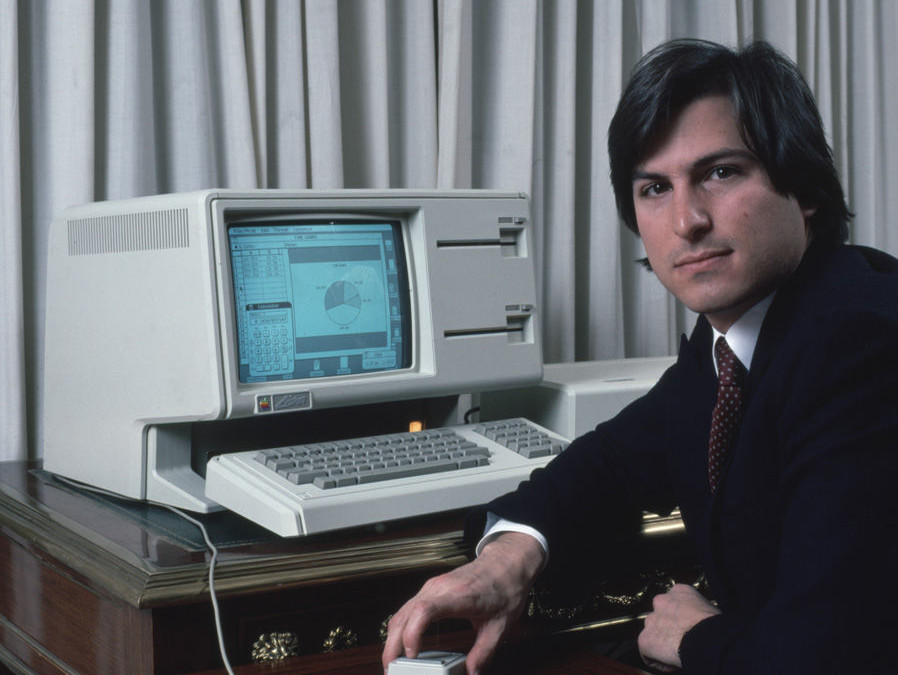

# Τεχνολογία

> Οι κατασκευαστές που σχεδιάζουν προσεκτικά το λογισμικό τους,
> φτιάχνουν και το δικό τους υλικό. Alan Kay

### Περίληψη

Η τεχνολογία διάδρασης είναι πλέον ευρέως διαθέσιμη σε κάποιες λίγες
μορφές που καθιστούν δύσκολη την διάκριση ανάμεσα στην βασική τεχνολογία
και στα στιγμιότυπα οργάνωσής της. Ο δημοφιλής επιτραπέζιος υπολογιστής
για αρκετές δεκαετίες συνοδεύεται από ένα γραφικό περιβάλλον εργασίας,
το οποίο από τους περισσότερους θεωρείται τεχνολογία, αλλά, όπως είδαμε
στα προηγούμενα, είναι περισσότερο μια τεχνολογική μορφή, που
κατασκευάστηκε σε ένα δεδομένο τεχνο-οικονομικό πλαίσιο. Παρόμοια, η
τεχνολογία εμβύθισης των συστημάτων εικονικής πραγματικότητας μπορεί να
χρησιμοποιηθεί για την επαύξηση της ανθρώπινης εμπειρίας προς
κατευθύνσεις που δεν είναι απαραίτητα συμβατές με το φυσικό περιβάλλον.
Στην πράξη όμως, τα περισσότερα συστήματα εικονικής πραγματικότητας
χρησιμοποιούνται για να δημιουργήσουν προσομοιώσεις της φυσικής
πραγματικότητας. Ιδιαίτερο ενδιαφέρον παρουσιάζει η τεχνολογία ανοιχτού
κώδικα, ο οποίος επιτρέπει την μελέτη και ανάλογα με την άδεια χρήσης
την προσαρμογή του αρχικού κώδικα για διαφορετικούς σκοπούς. Ο ανοιχτός
κώδικας είναι μια σημαντική ιδιότητα στην τεχνολογία διάδρασης, αλλά δεν
μπορεί να είναι ο σκοπός της, γιατί τότε τα νέα συστήματα διάδρασης
μπορεί να είναι απλά αντίγραφα των μορφών διάδρασης από τα ήδη υπάρχοντα
κλειστού κώδικα.

## Τεχνολογικά προϊόντα

Στην τεχνολογία λογισμικού υπάρχουν συνήθως πολλά επίπεδα αφαίρεσης που
κάνουν δύσκολη την διάκριση ανάμεσα σε βασική τεχνολογία και τεχνολογικό
προϊόν. Επίσης, συμβαίνει συχνά κάποια δημοφιλή προϊόντα να δίνουν το
όνομα τους σε όλην την κατηγορία, όπως ακριβώς συμβαίνει σε πολλά
καταναλωτικά προϊόντα. Για παράδειγμα, υπήρχε μια περίοδος που η
οδοντόκρεμα λεγόταν kolynos και η χλωρίνη καθαρισμού λεγόταν kleenex.
Αντίστοιχα, ο παγκόσμιος ιστός δεν είναι τεχνολογία, αλλά ένα δημοφιλές
προϊόν της τεχνολογικής κατηγορίας των υπερμέσων. Το ίδιο ισχύει και για
τις δημοφιλείς γλώσσες αντικειμενοστραφούς προγραμματισμού, όπως είναι η
Java, η οποία δημιουργήθηκε για εξυπηρετήσει τις ανάγκες μιας εποχής,
οπότε έχει πολλές ιδιότητες διαφορετικές από αυτές της Smalltalk, που
ήταν η πρώτη γλώσσα του είδους είκοσι χρόνια νωρίτερα. Η διάκριση
ανάμεσα σε τεχνολογία και προϊόν γίνεται ακόμη δυσκολότερη στην
περίπτωση που πολλές διαφορετικές εταιρείες χρησιμοποιούν την ίδια
έννοια, όπως για παράδειγμα τα αρχεία και τις εφαρμογές. Η συμφωνία
χρήσης αρχείων και εφαρμογών σε προϊόντα διαφορετικών εταιρειών
δημιουργεί την ψευδαίσθηση ότι αυτά είναι βασικές τεχνολογίες διάδρασης,
αλλά στην πράξη είναι απλά δημοφιλείς και οικείες συμβάσεις για χρήστες
που δεν θέλουν να κατανοήσουν άλλες κατευθύνσεις της τεχνολογίας
διάδρασης.

Η κατανόηση της τεχνολογίας απαιτεί αρχικά μια σημειωτική ανάλυση των
βασικών λέξεων που χρησιμοποιούμε, γιατί υπάρχουν πολλά προϊόντα τα
οποία θεωρούνται τεχνολογίες, αλλά δεν είναι. Αν θέλουμε να έχουμε
κατανόηση πέρα από τα συμφέροντα των κατασκευαστών και τις εμπορικές
συγκυρίες, τότε η ονομασία μιας τεχνολογίας διάδρασης θα πρέπει να
σχετίζεται άμεσα με την λειτουργία που πραγματικά κάνει. Για παράδειγμα,
το σύστημα SwyftWare σχεδιάστηκε από τον Jef Raskin για να κάνει
επεξεργασία κειμένου, που είναι μια από τις πιο δημοφιλείς χρήσεις για
τον επιτραπέζιο υπολογισμό. Για αυτόν τον σκοπό, από την πλευρά του
χρήστη, δεν έχει ούτε λειτουργικό σύστημα, ούτε σύστημα αρχείων, ούτε
εφαρμογές, αφού όλα αυτά είναι απλά προϊόντα και όχι βασικές τεχνολογίες
που είναι απαραίτητες για να έχουμε μια ποιοτική διάδραση με την
επεξεργασία μικρών ή μεγάλων κειμένων και με ότι αυτή συνδέεται, όπως
σημειώσεις και αλληλογραφία.

Το σύστημα αρχείων είναι η πιο δημοφιλής περίπτωση προϊόντος που οι
περισσότεροι θεωρούν πως είναι τεχνολογία. Στην πραγματικότητα, η
θεώρηση ενός συστήματος λογισμικού ως σύνολο αρχείων έγινε δημοφιλής με
το σύστημα UNIX. Η σημασία των αρχείων ενδυναμώθηκε στην συνέχεια από
την επιφάνεια εργασίας και τα έγγραφα που αναπαραστάθηκαν ως αρχεία.
Τόσο το υλικό του συστήματος, όσο και το βασικό επίπεδο λογισμικού δεν
έχουν αρχεία, τα οποία είναι ένα κατασκεύασμα που εξυπηρετεί καλά
πολλούς σκοπούς, αλλά σίγουρα δεν είναι ο μόνος τρόπος οργάνωσης του
λογισμικού. Για παράδειγμα, την ίδια περίοδο που οι μηχανικοί στα Bell
Labs κατασκεύασαν το σύστημα αρχείων του UNIX, οι μηχανικοί στο Xerox
PARC κατασκεύασαν μια εναλλακτική οργάνωση του λογισμικού που βασίζεται
στα αντικείμενα, τα οποία ανταλλάσσουν μηνύματα. Επίσης, η επεξεργασία
εγγράφων κειμένου στο SwyftWare δεν είχε αρχεία, όπως αρχεία δεν είχαν
οι αρχικές εκδόσεις του λειτουργικού συστήματος iOS για τις κινητές
συσκευές της Apple.

Αμέσως μετά τα αρχεία, το λειτουργικό σύστημα και οι εφαρμογές του
επιτραπέζιου και κινητού υπολογισμού αποτελούν σημαντικά παραδείγματα
προϊόντων, τα οποία όμως δεν είναι βασική τεχνολογία για το λογισμικό
διάδρασης. Το λειτουργικό σύστημα παρέχει στον προγραμματιστή και στον
απλό χρήση ένα ενιαίο περιβάλλον διάδρασης για πολλές διαφορετικές
εφαρμογές. Το λειτουργικό σύστημα είναι μια ιδέα χρήσιμη για πολύ ακριβά
μηχανήματα για τα οποία δεν γνωρίζουμε τις πιθανές εφαρμογές τους. Από
την πλευρά του χρήστη, για μια δεδομένη λειτουργία, όπως η επεξεργασία
κειμένου, το λογισμικό διάδρασης δεν χρειάζεται να έχει ενδιάμεσα
επίπεδα ή αρχιτεκτονικές της πληροφορίας που εξυπηρετούν και άλλους
σκοπούς. Ειδικά οι εφαρμογές, όπως τις γνωρίζουμε από τις δημοφιλείς
γραφικές διεπαφές σε επιτραπέζια και κινητά συστήματα δημιουργούν ένα
περιβάλλον χρήστη με έμφαση στην κατανάλωση παρά στην δημιουργία.
Πράγματι, αν μια εφαρμογή δεν έχει μια λειτουργία, τότε ο χρήστης θα
πρέπει να αγοράσει κάποια άλλη εφαρμογή που πιθανόν είναι πολύ παρόμοια
με την αρχική. Επίσης, πολλές λειτουργίες παγιδεύονται σε μια εφαρμογή
και δεν μπορούν να χρησιμποιηθούν σε άλλη ή να γίνει μια σύνθεση τους με
τρόπο που να βολεύει. Για παράδειγμα, η γραμμή εντολών όπως έγινε αρχικά
γνωστή με το Unix δεν περιέχει εφαρμογές, αλλά την δυνατότητα
διασύνδεσης εντολών για την δημιουργία σύνθετων προγραμμάτων, που
μπορούν να κάνουν ότι και μια εφαρμογή, χωρίς να παγιδεύονται σε ένα
κλειστό κουτί. Από τις αρχές της δεκαετίας του 1980 ο Gary Kildall είχε
διαπιστώσει ότι ακόμη και όταν υπάρχει ανάγκη για διακριτό λειτουργικό
σύστημα και εφαρμογές, αυτά δεν θα πρέπει να φτιάχνονται από τον ίδιο
κατασκευαστή, γιατί δημιουργείται σύγκρουση συμφερόντων.

Η γραφική διεπαφή των δημοφιλών επιτραπέζιων συστημάτων όπως είναι τα
Windows, MacOS, GNOME, συνήθως αποτελείται από παράθυρα που
αντιπροσωπεύουν εφαρμογές ή έγγραφα, καθώς επίσης και από μενού
εργαλείων που εμφανίζονται ως εικονίδια. Όπως ακριβώς είδαμε και στις
προηγούμενες περιπτώσεις προϊόντων παραπάνω, αυτή η τόσο δημοφιλής
οργάνωση και η σημασιολογία των γραφικών στοιχείων είναι ένα ακόμη
δημοφιλές προϊόν, το οποίο οι περισσότεροι θεωρούν ως τεχνολογία χωρίς
εναλλακτικές. Πράγματι είναι πολύ δύσκολο να εντοπίσουμε εμπορικές
εναλλακτικές καθώς η ευχρηστία αυτού του μοντέλου έχει επικρατήσει για
πολλές δεκαετίες και οποιαδήποτε αλλαγή είναι τουλάχιστον τόσο δύσκολη
όσο η οδήγηση από την αντίθετη κατεύθυνση. Η ευχρηστία αυτού του
μοντέλου διάδρασης μπορεί να ερμηνευτεί τόσο από καθολική επικράτηση
του, όσο και από την οικειότητα που έχει δημιουργηθεί, καθώς είναι το
πιο απλό στην εκμάθηση, ειδικά για περιστασιακούς χρήστες. Τα
εναλλακτικά συστήματα γραφικής διεπαφής που υπάρχουν βασίζονται
περισσότερο στις προσαρμογές που θα κάνει ένας προγραμματιστής ή είναι
λιγότερο εύχρηστα γιατί απευθύνονται σε συχνούς χρήστες μεγαλύτερης
δεξιότητας. Για παράδειγμα τα συστήματα Xerox Cedar και Oberon
δημιουργήθηκαν με έμπνευση το Alto, αλλά με χρήση δομημένης γλώσσας
προγραμματισμού όπως είναι οι Mesa και η Pascal. Αυτά τα ερευνητικά
συστήματα δίνουν κεντρικό ρόλο στα έγγραφα, τα οποία εμφανίζονται στα
παράθυρα, ενώ η διάδραση γίνεται με σύνθεση εντολών όπως στο UNIX, οι
οποίες επιτρέπουν τους υπερσυνδέσμους ανάμεσα στα έγγραφα καθώς και τον
διαμοιρασμό τους με άλλους χρήστες. Ο παγκόσμιος ιστός και τα κοινωνικά
δίκτυα είναι τα πιο πρόσφατα παραδείγματα προϊόντων, τα οποία όμως δεν
αποτελούν βασικές τεχνολογίες.

Η τεχνολογία του αντικειμενοστραφούς προγραμματισμού έχει γίνει
δημοφιλείς με γλώσσες προγραμματισμού όπως η Java και η C++, αλλά αυτές
όχι μόνο είναι απλά προϊόντα, αλλά και έχουν συγκεκριμένες ιδιότητες που
δεν ταιριάζουν με την αρχική σχεδίαση. Η αρχική σχεδίαση και υλοποίηση
του αντικειμενοστραφούς προγραμματισμού από τον Άλαν Κέη ήταν
εμπνευσμένη από την περιοχή της βιολογίας, τα κύταρα, και την πολύπλοκη
κλίμακα των ζωντανών οργανισμών. Αντί να βασίζεται σε πολύπλοκες δομές
δεδομένων, η Smalltalk βασίζεται σε πολύ απλές δομές που ανταλλάσσουν
μηνύματα μεταξύ τους, έτσι ώστε να είναι εφικτή η δημιουργία κλίμακας
από απλά δομικά στοιχεία. Για την δημιουργία πολύπλοκων συστημάτων δεν
υπάρχει λόγος να έχουμε πολύπλοκες γλώσσες προγραμματισμού, αφού αρκεί
να έχουμε ένα συμβολικό σύστημα που ταιριάζει στο πεδίο εφαρμογής. Για
τον σκοπό αυτό, τα σύγχρονα συστήματα που βασίζονται στην φιλοσοφία της
Smalltalk κατασκευάζονται με την σταδιακή υλοποίηση ενός μεταφραστή που
είναι γραμμένος στην ίδια γλώσσα πρόγραμματισμού με αυτήν που μετατρέπει
σε εκτελέσιμο. Με αυτόν τον τρόπο, οι προδιαγραφές του συστήματος είναι
καθολικές ανάμεσα σε συστήματα με διαφορετικό υλικό. Τα παραπάνω δεν
σημαίνουν ότι υπάρχει κάποια σωστή ή λάθος σχεδίαση, αλλά σίγουρα
σημαίνει ότι πολλές τεχνολογικές ετικέτες θα πρέπει να χρησιμοποιούνται
με περισσότερες εξηγήσεις σχετικά με το πεδίο ερφαρμογής και τους
τυπικούς χρήστες έτσι ώστε να είναι διακριτό το πραγματικό τους νόημα.

## Εξομοίωση και προσομοίωση

Η εξομοίωση και η προσομοίωση παρέχουν δύο σημαντικούς τρόπους θεώρησης
της λειτουργίας του υπολογισμού και των εφαρμογών του. Χρονολογικά, η
εξομοίωση είναι προγενέστερη της προσομοίωσης, καθώς περιγράφεται από
τον Άλαν Τούρινγκ ως ένα χαρακτηριστικό της γενικής μηχανής υπολογισμού.
Η δυνατότητα της εξομοίωσης επιτρέπει σε ένα μηχάνημα να εξομοιώνει την
λειτουργία κάποιου άλλου διαφορετικού μηχανήματος. Για παράδειγμα,
υπάρχουν πολλές δημοφιλείς μηχανές εξομοίωσης για τους μικροϋπολογιστές
και τις παιχνιδομηχανές της δεκαετίας του 1980. Η προσομοίωση αναφέρεται
στην δυνατότητα ενός μηχανήματος να υπολογίζει και να οπτικοποιεί την
συμπεριφορά συστήματων για τα οποία δεν μπορεί να γνωρίζει ακριβώς την
λειτουργία τους. Για παράδειγμα, οι πρώτοι υπολογιστές χρησιμοποιήθηκαν
για τον υπολογισμό της τροχιάς ενός πυραύλου καθώς και για την πρόβλεψη
του καιρού.

Οι εφαρμογές της προσομοίωσης είναι από τις πιο πετυχημένες εμπορικά
εφαρμογές των υπολογιστών, αλλά αυτή η επιτυχία τους έχει επισκιάσει την
συμπληρωματική θεώρηση του υπολογισμού που βρίσκεται στην εξομοίωση.
Πράγματι, οι σύγχρονες προσομοιώσεις είναι τόσο εξελιγμένες σε
συμπεριφορά που μοιάζουν πολύ με το αντίστοιχο φαινόμενο που
προσομοιώνουν. Για παράδειγμα, ένας προσομοιωτής πτήσης, από τον πιο
απλό οικιακό, μέχρι τον πιο εξελιγμένο που χρησιμοποιείται για την
εκπαίδευση των πιλότων, μοιάζει πάρα πολύ με τον χειρισμό ενός αληθινού
αεροσκάφους. H θεώρηση της εξομοίωσης δεν έχει γίνει ακόμη τόσο
δημοφιλής όσο η προσομοίωση γιατί είναι πιο δύσκολη και απαιτεί
δημιουργικότητα και φαντασία. Η προσομοίωση ενός φυσικού φαινομένου
απαιτεί από εμάς την παρατήρηση και την κατανόηση του, αλλά η εξομοίωση
ενός νέου μηχανήματος απαιτεί από εμάς να το σχεδιάσουμε και να
φανταστούμε κάτι που δεν υπάρχει. Για παράδειγμα, πολλά βιντεοπαιχνίδια,
αν και αρχικά ο κλάδος ξεκίνησε επίσης ως προσομοίωση, παρουσιάζουν
γραφικά και συμπεριφορές που δεν βασίζονται σε προσομοίωση της
πραγματικότητας.

Η δημοφιλία της προσομοίωσης και η δυσκολία που παρουσιάζει η εξομοίωση
έχουν οδηγήσει τις περισσότερες εφαρμογές του παραδοσιακού επιτραπέζιου
υπολογισμού στην κατεύθυνση της προσομοίωσης του πραγματικού κόσμου. Για
παράδειγμα, η γραφική διεπαφή στον επιτραπέζιο υπολογιστή είναι μια
προσομοίωση της επιφάνειας εργασίας στον αληθινό χώρο του γραφείου.
Αντίστοιχα, οι εφαρμογές επεξεργασίας εγγράφων είναι μια προσομοίωση των
χάρτινων εγγράφων του αληθινού κόσμου. Στην πραγματικότητα όμως, ο
υπολογιστής, με γραφικά ή χωρίς, δεν έχει κανένα περιορισμό για το πως
θα είναι μια γραφική διεπαφή ή μια εφαρμογή επεξεργασιάς εγγράφων.
Σίγουρα η προσομοίωση του αληθινού κόσμου στον κόσμο του υπολογιστή
δημιουργεί μια αρχική αίσθηση ευχρηστίας μέσα από την οικειότητα.
Επομένως, για τα μηχανήματα εκείνα που πρέπει να είναι εύχρηστα η
προσομοίωση είναι μια χρήσιμη τεχνική, αλλά σίγουρα δεν είναι
αντιπροσωπευτική των δυνατοτήτων που θέλουμε να έχουμε αν ο στόχος μας
είναι η επαύξηση της ανθρώπινης νοημοσύνης.

Η πιο δημοφιλής μορφή και ταυτόχρονα ιδιάζουσα περίπτωση προσομοίωσης
συναντάται στον κινητό υπολογισμό της δεκαετίας του 2010, όπου οι
συσκευές διάδρασης μικραίνουν σε μέγεθος και προσομοιώνουν τις εφαρμογές
του επιτραπέζιου υπολογισμού, αντί να ορίσουν νέα παραδείγματα συμβατά
με το κινητό πλαίσιο χρήσης. Για παράδειγμα, τα πρώτα κινητά λειτουργικά
συστήματα της Microsoft έχουν γραφικό περιβάλλον με κουμπί εκκίνησης,
ενώ όλα τα συστήματα βασίζονται στην ιδέα των εφαρμογών για την οργάνωση
του λογισμικού τους. Όπως έχουμε ήδη αναλύσει στην ενότητα των Μορφών,
οι εφαρμογές λογισμικού είναι μια πολύ συγκεκριμένη μορφή οργάνωσης του
λογισμικού, η οποία ωφελεί κυρίως την κυρίαρχη πλατφόρμα λειτουργικού
συστήματος. Με άλλα λόγια, οι κατασκευαστές λογισμικού επέλεξαν, για
άλλη μια φορά, να βελτιστοποιήσουν τα συμφέροντα τους, τα οποία
παρουσιάζουν στους χρήστες ως οικειότητα και ευχρηστία. Στην πράξη όμως,
αυτό που πραγματικά προσφέρουν στους τελικούς χρήστες είναι μια
προσομοίωση ενός παραδείγματος του επιτραπέζιου υπολογισμού σε ένα νέο
πλαίσιο χρήσης, το οποίο είναι πολύ διαφορετικό. Με αυτόν τον τρόπο, τα
κινητά συστήματα είναι μια ακόμη χαμένη ευκαιρία, μετά τα επιτραπέζια,
αφού παγιδεύονται στην θεώρηση της προσομοίωσης και δεν εξετάζουν
καθόλου την εξομοίωση νέων συστήματων διάδρασης.

Η περίπτωση των συστημάτων διάδρασης ανοιχτού κώδικα είναι εξίσου
ιδιάζουσα με αυτή του κινητού υπολογισμού γιατί προσομοιώνει το γραφικό
περιβάλλον εργασίας και τις εφαρμογές των κυρίαρχων συστήματων. Για
παράδειγμα, τα πιο δημοφιλή γραφικά περιβάλλοντα με επιφάνεια εργασίας
όπως τα Gnome, KDE, είναι αντίγραφα των Windows, MacOS. Ταυτόχρονα, οι
αντίστοιχες εφαρμογές γραφείου ανοιχτού κώδικα OpenOffice, LibreOffice
είναι επίσης αντίγραφα των αντίστοιχων εφαρμογών Microsoft Office, Apple
iWork. Ο ανοιχτός κώδικας σε επίπεδο εφαρμογής και περιβάλλοντος ήταν
δεδομένος στο σύστημα Smalltalk του Alto, αλλά οι κατασκευαστές του
είχαν κάνει πολλές ακόμη αρχιτεκτονικές επιλογές που αναλύουμε σε άλλα
μέρη του κειμένου. Ακόμη και πέρα από τον χώρο της διάδρασης που
διαπραγματευόμαστε εδώ, οι κατασκευαστές ανοιχτού λογισμικού φαίνονται
παγιδευμένοι στην αναπαραγωγή της υπάρχουσας κατάστασης παρά στην
καινοτομία. Πράγματι, ο κατασκευαστής του πυρήνα του Linux επέλεξε στις
αρχές τις δεκαετίας του 1990 να φτιάξει μια εκδοχή ενός παραδοσιακού
πυρήνα που υπάρχει από τις αρχές του 1970 και ταυτόχρονα να βρει
καθολική ανταπόκριση από πολλές διαφορετικές ομάδες χρηστών. Σίγουρα η
διάθεση του λογισμικού με ανοιχτού κώδικα έχει περισσότερα πλεονεκτήματα
από το ίδιο με κλειστό κώδικα, αλλά αν η αρχιτεκτονική του και η
διάδραση του είναι ίδια ακριβώς με αυτή του κλειστού κώδικα, τελικά το
κίνημα του ανοιχτού κώδικα καταλήγει να εξυπηρετεί όχι μόνον τον εαυτό
του, αλλά κυρίως τα συμφέροντα των κατασκευαστών κλειστού λογισμικού, οι
οποίοι μπορούν πλέον να ετεροπροσδιορίζονται ως τεχνολογία, οπότε τελικά
δεν εξυπηρετεί την πραγματική βελτίωση της ποιότητας του λογισμικού
διάδρασης.

Τόσο τα πρώτα, όσο και τα δημοφιλή βιντεοπαιχνίδια των επόμενων
δεκαετιών συνήθως βασίζονται στην θεώρηση της προσομοίωσης. Για
παράδειγμα, το βιντεοπαιχνίδι Tennis for two δημιουργήθηκε το 1958 για
έναν αναλογικό υπολογιστή με οπτικοποίηση στην οθόνη ενός
φασματοσκόπιου, όπου οι δύο παίκτες έπαιζαν τένις σε πρόσοψη. Μερικά
χρόνια αργότερα, το δημοφιλές βιντεοπαιχνίδι Pong χρησιμοποιεί την
οπτικοποίηση της κάτοψης. Επίσης, ένα από τα πρώτα δημοφιλή
βιντεοπαιχνίδια την δεκαετία του 1960 σε μίνι-υπολογιστές είναι το
Spacewar, στο οποίο οι παίκτες κάνουν μια αερομαχία στο διάστημα σε
συνθήκες βαρύτητας γύρω από πλανητικό κέντρο. Αντίστοιχα, την δεκαετία
του 1970, πολλοί προγραμματιστές αποκτούν την πρώτη τους επαφή με τον
υπολογιστή με τον ευρέως διαθέσιμο κώδικα του βιντεοπαιχνιδιού Lunar
Lander, όπου ο παίκτης προσπαθεί να προσγειώσει ένα διαστημόπλοιο στην
σελήνη. Παρατηρούμε ότι και στις δύο περιπτώσεις εκτός από την
προσομοίωση της φυσικής πραγματικότητας (π.χ., βαρύτητα) η θεματολογία
των βιντεοπαιχνιδιών είναι έντονα επηρεασμένη από την τότε πολιτική και
πολιτιστική πραγματικότητα ή από μια αθλητική και παιγνιώδη
δραστηριότητα. Μετά την δεκαετία του 1970 εμφανίζονται καινοτόμα
βιντεοπαιχνίδια, αλλά το παράδειγμα της προσομοίωσης παραμένει κυρίαρχο.

Τα βιντεοπαιχνίδια σε κονσόλες και σε μικροϋπολογιστές των δεκαετιών του
1970 και 1980 απέκτησαν μια δεύτερη ζωή μακρυά από το αρχικό υλικό τους
με την τεχνολογία της εξομοίωσης μετά το 2000. Η βελτιωμένη
επεξεργαστική ισχύς των επιτραπέζιων συστημάτων επέτρεψε την ανάπτυξη
εξομοιωτών που μπορούσαν να εκτελέσουν το παλαιότερο λογισμικό σε μια
αντίστροφη κίνηση, όπου τα διαθέσιμα συστήματα και η θεώρηση της
εξομοίωσης δεν χρησιμοποιούνται για να μας πάνε παρακάτω, αλλά πίσω στον
χρόνο. Με αυτόν τον τρόπο, μια νέα γενιά χρηστών χρησιμοποιεί συστήματα
που δεν υπάρχουν, ενώ και πολλοί παλιότεροι ζουν στην πράξη τις
αναμνήσεις τους. Σίγουρα η εξομοίωση παλιών συστήματων που δεν είναι
πλέον ευρέως διαθέσιμα είναι μια άριστη πρακτική για να έχουμε πρόσβαση
σε παλαιότερο λογισμικό, ακόμη και για να αναπτύξουμε νέο λογισμικό για
αυτό το δυσεύρετο πλέον υλικό. Ταυτόχρονα όμως αυτή η κάπως
οπισθοδρομική εφαρμογή της θεώρησης της εξομοίωσης επιβεβαιώνει ότι τόσο
οι κατασκευαστές όσο και η χρήστες έχουν μια έμφυτη τάση στην
αναπαραγωγή της υπάρχουσας κατάστασης, παρά στην δημιουργία καινοτομίας,
ακόμη και όταν έχουν στην διάθεση τους τα κατάλληλα εργαλεία, όπως είναι
οι ισχυροί και δικτυωμένοι προσωπικοί υπολογιστές και η τεχνική της
εξομοίωσης.

![Ο εξομοιωτής σε ένα σύγχρονο γραφικό περιβάλλον μπορεί να εκτελέσει το λογισμικό για ένα παλιότερο γραφικό περιβάλλον, το οποίο με την σειρά του μπορεί να εκτελέσει έναν εξομοιωτή για ένα ακόμη παλιότερο σύστημα με γραμμή εντολών. Με αυτόν τον τρόπο, μπορούμε να εξομοιώσουμε ένα παλιότερο σύστημα ακόμη και αν δεν έχουμε εξομοιωτή για αυτό, αρκεί να έχουμε για μια σειρά από ενδιάμεσα συστήματα. Το ιδανικό είναι να εκμεταλευτούμε αυτήν την τεχνική για νέα συστήματα και όχι μόνο για αναβίωση των παλιότερων.](images/emulators.jpg)

Πέρα από το γραφικό περιβάλλον και τα έγγραφα στον επιτραπέζιο
υπολογισμό, η μονοθεματική θεώρηση της προσομοίωσης είναι επίσης το
κυρίαρχο παράδειγμα ακόμη και σε καινοτόμα συστήματα διάδρασης, όπως
είναι η εικονική πραγματικότητα. Η εικονική πραγματικότητα όπως
περιγράφηκε αρχικά από τον Jaron Lanier ήταν μια προσπάθεια εξομοίωσης
ενός κόσμου που δεν υπάρχει. Δεν είναι τυχαίο ότι ο δημιουργός και νονός
της θεωρεί ατυχές το όνομα εικονική πραγματικότητα, αφού δηλώνει μια
προσομοίωση. Για παράδειγμα, σε πειραματικές εφαρμογές εικονικής
πραγματικότητας ο χαρακτήρας δεν μοιάζει με άνθρωπο, αλλά με χταπόδι, ή
με κάποιο άλλο δημιούργημα που δεν υπάρχει. Ταυτόχρονα η οπτικοποίηση
και η συμπεριφορά του εικονικού κόσμου δεν προσομοιώνει τον πραγματικό
κόσμο της ανθρώπινης εμπειρίας, αλλά έναν κόσμο που δεν υπάρχει. Ο
στόχος της εξομοίωσης μιας δυνητικής πραγματικότητας είναι να
εμπλουτίσει την ανθρώπινη εμπειρία και να επαυξήσει την ανθρώπινη
νοημοσύνη σε ευρύτερα πεδία, όπου δεν υπάρχει απευθείας πρόσβαση μέσα
από το φυσικό περιβάλλον. Αντίθετα, οι περισσότερες εφαρμογές εικονικής
πραγματικότητας προσπαθούν να προσομοιώσουν την πραγματικότητα όσο πιο
πιστά γίνεται, τόσο στην εμφάνιση της με γραφικά, όσο και στην
συμπεριφορά του κόσμου και των χαρακτήρων. Αν και τα συστήματα εικονικής
πραγματικότητας έχουν μικρή εμβέλεια για πολλές δεκαετίες, αποτελούν
άλλη μια σημαντική χαμένη ευκαιρία για την εξερεύνηση της εξομοίωσης ως
βασικής θεώρησης κατασκευής νέων διαδραστικών συστημάτων.

Όσο εύκολο είναι να περιγράψουμε τα δημοφιλή συστήματα διάδρασης που
βασίζονται στην θεώρηση της προσομοίωσης, άλλο τόσο δύσκολο είναι να
περιγράψουμε εκείνα που βασίζονται στην εξομοίωση, αφού δεν έχουμε
κρίσιμη μάζα γνώσης για αυτά. Ένα από τα λίγα γνωστά συστήματα διάδρασης
που βασίζονται στην εξομοίωση περιγράφεται από τον Alan Kay στην
κατασκευή του Alto. Το λογισμικό για το διαδραστικό προτότυπο του Alto
που βασίζεται στην περιβάλλον προγραμματισμού Smalltalk κατασκευάστηκε
με την εξομοίωση του πάνω σε έναν μίνι-υπολογιστή στις αρχές του 1970
και πολύ πριν οι ερευνητές του Xerox PARC κατασκευάσουν το πραγματικό
υλικό του Alto. Εκείνος ο μίνι-υπολογιστής δούλευε με τηλέτυπο χωρίς
οθόνη γραφικών και ποντίκι ενώ και η γλώσσα προγραμματισμού του ήταν
πολύ διαφορετική από την Smalltalk, αλλά αυτά δεν εμπόδισαν τους
κατασκευαστές του Alto να φανταστούν ένα διαδραστικό γραφικό περιβάλλον
και να το εξομοιώσουν αρχικά πάνω σε ξένο υλικό, πριν τελικά το
κατασκευάσουν και στην πραγματικότητα. Παρόμοια τεχνική εξομοίωσης
χρησιμοποίησε και ο Bill Atkinson για την κατασκευή του λογισμικού
διάδρασης για το Apple Lisa. Για τον σκοπό αυτό, χρησιμοποίησε μια
επέκταση του δημοφιλούς εκείνη την εποχή Apple II για να κατασκευάσει
σταδιακά με την γλώσσα PASCAL ένα γραφικό περιβάλλον που λίγο διαφέρει
από αυτό των σύγχρονων επιτραπέζιων συστημάτων και όλα αυτά ενώ είχε
μπροστά του μόνο έναν μικροϋπολογιστή με διάδραση σε γραμμή εντολών και
χωρίς ποντίκι και παραθυρικό περιβάλλον.

Αμέσως μετά τους πρωτοπόρους του δημιουργικού μετασχηματισμού του
υπολογιστών σε μια νέα μορφή Douglas Engelbart και Ivan Sutherland, οι
ερευνητές του Xerox PARC εφάρμοσαν την τεχνική της εξομοίωσης, έτσι ώστε
να μπορούν να εργάζονται με το σύστημα που ήθελαν και όχι απλά με αυτό
που είχαν διαθέσιμο. Πράγματι, η Xerox μόλις είχε αγοράσει την
Scientific Data Systems και αγνόησε το αίτημα των ερευνητών του PARC για
την αγορά του ανταγωνιστικού DEC PDP, το οποίο ήταν πολύ δημοφιλές
ανάμεσα στους συναδέλφους ερευνητές σε άλλους οργανισμούς και στο δίκτυο
ερευνητικής συνεργασίας ARPANET. Στην πράξη όμως αυτό δεν ήταν μεγάλο
πρόβλημα, αφού με την τεχνική της εξομοίωσης οι ερευνητές του PARC
δημιούργησαν το PDP με μικροκώδικα πάνω στο φυσικό μηχάνημα της SDS. Με
τον ίδιο ακριβώς τρόπο, χρησιμοποίησαν το μηχάνημα Data General Nova για
να αναπτύξουν το λογισμικό για το Alto, πολύ πριν έχουν στην διάθεση
τους το υλικό της αρχική έκδοση του Alto. Παρόμοια ο Niklaus Wirth θα
καταφέρει να εκτελέσει και να ενημερώσει είκοσι-πέντε χρόνια μετά την
βάση για το αρχικό λογισμικό διάδρασης για το σύστημα Oberon με την
δημιουργία ενός νέου υπολογιστή με την τεχνική των προγραμμάτων για
FPGA, δηλαδή υλικό που επιτρέπει την εξομοίωση άλλου υλικού υπολογιστή.
Για τους ερευνητές του PARC και τους συνεργάτες τους, η διάδραση με τους
υπολογιστές σημαίνει κυρίως την κατασκευή ενός νέου υπολογιστή και του
περιβάλλοντος ανάπτυξης που περιλαμβάνει τον μεταγλωτιστή και τον
επεξεργαστή κειμένου, τα οποία αρχικά θα πρέπει να εξομοιωθούν στα πρώτα
στάδια της ανάπτυξης πάνω σε ένα διαφορετικό από το τελικό φυσικό
μηχάνημα. Η επιλογή της εξομοίωσης μπορεί να γίνει αρχιτεκτονική
επιλογή, όπως στην περίπτωση της JAVA όπου ο κατασκευαστής φροντίζει για
την εκτέλεση μόνο πάνω σε μια εικονική μηχανή και αφήνει την υλοποίηση
του κατώτερου επιπέδου στους επιμέρους κατασκευαστές υλικού.

## Μοντελοποίηση και Αναλογία

Η βασική τεχνολογία για την κατασκευή της διάδρασης παραμένει διαχρονικά
ο προγραμματισμός ενός υπολογιστή. Ο προγραμματισμός με την σειρά του
είναι μια σημαντική αλλά ξεχωριστή περίπτωση διάδρασης με τον υπολογιστή
που έχει περάσει από πολλά στάδια και συνεχίζει να εξελίσεται. Οι πρώτοι
κεντρικοί υπολογιστές όπως και ο πρώτος μικροϋπολογιστής Altair
προγραμματίζονταν με τους φυσικούς διακόπτες, αλλά αυτό ήταν δύσκολο
ειδικά για μεγάλα προγράμματα και σετ δεδομένων. Για αυτόν τον λόγο, ο
προγραμματισμός των υπολογιστών ξεκίνησε να γίνεται με ασύγχρονο τρόπο
μέσω της χρήσης διάτριτων καρτών σε σετ, ή ακόμη καλύτερα με την χρήση
διάτρητης χαρτοταινίας. Η εγγραφή και ανάγνωση από διάτρητη χαρτοταινία
ήταν πολύ οικονομική και τόσο δημοφιλής για να βρίσκεται ενσωματωμένη
ακόμη και πάνω στα νέα μοντέλα συσκευής εισόδου και εξόδου που
βασίζονταν στον τηλέτυπο, ο οποίος ήταν για πολλές δεκαετίες ο βασικός
τρόπος συγγραφής προγραμμάτων υπολογιστή και επόμενως διάδρασης, αφού το
πληκτρολόγιο και η διάτρητη χαρτοταινία ήταν τα συστήματα εισόδου, ενώ η
χαρτοταινία πάλι και η εκτύπωση ήταν τα συστήματα εξόδου. Με αυτόν τον
τρόπο, φτιάχτηκαν και τα πρώτα συστήματα διάδρασης σε πραγματικό χρόνο,
όπως ήταν η LISP και το JOSS, αλλά η πλειοψηφία των συστημάτων
λειτουργούσε ασύγχρονα με εργασίες δέσμης. Όλα αυτά τα ηλεκτρομηχανικά
συστήματα εισόδου και εξόδου από τον υπολογιστή που βασίζονταν στο χάρτι
θα αντικατασταθούν από τις ηλεκτρονικές και αργότερα ψηφιακές οθόνες και
το ποντίκι την δεκαετία του 1980, αλλά ο προγραμματισμός του υπολογιστή
θα παραμείνει μια διαδικασία που βασίζεται σε γραπτές γλώσσες κειμένου
που εισάγονται με το πληκτρολόγιο.

Οι γλώσσες προγραμματισμού με την ευρεία έννοια τους είναι οι δομικές
τεχνολογίες για τα συστήματα διάδρασης, αφού με αυτές υλοποιούνται και
καθορίζεται η ποιότητα των διαδραστικών συστημάτων. Οι γλώσσες
προγραμματισμού που βασίζονται σε γραπτό κείμενο είναι ο βασικός τρόπος
διάδρασης για όσους θέλουν να κατασκευάσουν ένα διαδραστικό σύστημα,
ακόμη και αν αυτό χρησιμοποιεί μια άλλη συμβολική γλώσσα πέρα από το
κείμενο για την αλληλεπίδραση με τον χρήστη. Για παράδειγμα, το UNIX
κατασκευάστηκε με την γλώσσα προγραμματισμού C, αλλά οι χρήστες θα
αλληλεπιδράσουν με ένα κέλυφος που παρέχει ένα σετ από βασικές εντολές
που μπορούν να συνδυαστούν σε απλά προγράμματα. Αντίθετα, το σύστημα του
Alto βασίζεται μόνο στην Smalltalk η οποία εκτός από γλώσσα
προγραμματισμού καθορίζει και την συμπεριφορά του συστήματος διάδρασης
συνολικά τόσο στην βάση του, όσο και στις τελικές εφαρμογές, ενώ στο
UNIX αν θέλουμε μια νέα διαφορετική εντολή ή σημαντικές αλλαγές στο
σύστημα, αυτό μπορεί να γίνει με την γλώσσα C. Το χάσμα ανάμεσα στην
γλώσσα προγραμματισμού και στην διάδραση γίνεται ακόμη μεγαλύτερο κατά
την μετάβαση στις γραφικές διεπαφές επιφάνειας εργασίας, όπου η διάδραση
βασίζεται στον απευθείας χειρισμό αντικειμένων στην οθόνη. Για να
γεφυρωθεί αυτό το χάσμα προγραμματισμού έχει αναπτυχθεί η τεχνική του
προγραμματισμού με παραδείγματα, όπου ο προγραμματιστής αντί να
περιγράφει στον υπολογιστή πως θα εκτελέσει μια λειτουργία, χρησιμοποιεί
την διάδραση με απευθείας χειρισμό για να δείξει το αποτέλεσμα που
θέλει. Η τεχνική του προγραμματισμού με παραδείγματα μπορεί θεωρητικά να
δώσει τις δυνατότητες του προγραμματισμού σε χρήστες με μικρότερες
δεξιότητες, αλλά στην πράξη δεν έχει αποδειχτεί χρήσιμη ούτε
εκπαιδευτικά, ούτε στην αποτελεσματικότητα των νέων δημιουργιών,
αφήνοντας έτσι όλο το βάρος στην ανάπτυξη δεξιοτήτων με τις γλώσσες
προγραμματισμού ή ακόμη καλύτερα στην ανάπτυξη νέων γλωσσών
προγραμματισμού.

Ανάμεσα στις πολλές τεχνολογίες λογισμικού για την κατασκευή νέων
διαδραστικών συστημάτων, οι γλώσσες προγραμματισμού που επιτρέπουν τόσο
την ανάπτυξη νέων συστημάτων όσο και την εξέλιξη της ίδιας της γλώσσας
έχουν διαχρονική αποτελεσματικότητα, αλλά με μεγάλο κόστος στην
εκμάθηση. Για παράδειγμα, η εκφραστική δύναμη της αρχικής γλώσσας Lisp
επιτρέπει την συγγραφή του μεταγλωτιστή της στην ίδια την γλώσσα, μια
επιλογή που δείχνει προς την κατεύθυνση της συνεχούς βελτίωσης της
γλώσσας προγραμματισμού, η οποία δεν είναι πλέον κάτι στατικό. Αυτή η
τεχνική χρησιμοποιήθηκε και κατά την δημιουργία του διαδραστικού
περιβάλλοντος Smalltalk, η οποία εκτός από γλώσσα πρόγραμματισμού για
τον χρήστη επιτρέπει και την μεταβολή του αρχικού συστήματος, δηλαδή και
της ίδιας της γλώσσας. Παρόμοια τακτική ακολούθησαν και άλλοι
κατασκευαστές για να δημιουργήσουν από την αρχή νέα διαδραστικά
συστήματα, όπως είναι τα Lilith, Oberon, τα οποία υλοποιήθηκαν με τις
Modula, Oberon, οι οποίες με την σειρά τους δεν ήταν εντελώς νέες αλλά
επεκτάσεις της δομημένης και στατικής Pascal, ώστε να είναι συμβατή με
το πλαίσιο ανάπτυξης του νέου διαδραστικού συστήματος. Η βασική διαφορά
που έχουν αυτά τα συστήματα από το αρχικό Alto και την Smalltalk είναι
ότι επιλέγουν μια δομημένη γλώσσα προγραμματισμού με στατικό ορισμό
τύπων, παρότι και στις δύο περιπτώσεις αυτά τα συστήματα στόχευαν στο
ίδιο κοινό, δηλαδή στην εκπαίδευση. Από αυτές τις προσπάθειες προκύπτει
ότι οι ίδιες οι γλώσσες και τα περιβάλλοντα προγραμματισμού δεν είναι
ποτέ τεχνολογίες, οι οποίες αναφέρονται κυρίως σε κάποιες σημαντικές
ιδιότητες τους. Επίσης, προκύπτει η κατανόηση ότι η δεξιότητα χρήσης
ενός ισχυρού και εκφραστικού συστήματος διαδραστικής κατασκευής και
δημιουργίας είναι συνήθως αντιστρόφως ανάλογο με την ευκολία εκμάθησης
του.

![Το περιβάλλον προγραμματισμού JOSS δεν έκανε διάκριση ανάμεσα σε γλώσσα προγραμματισμού και λειτουργικό σύστημα και επηρέασε την έκδοση της BASIC για μικροϋπολογιστές της δεκαετίας του 1980, γιατί βασιζόταν σε μια σύγχρονη αλληλεπίδραση ανθρώπου και υπολογιστή, σε αντίθεση με τα συστήματα εκείνης της εποχής που βασίζονταν κυρίως σε εργασίες δέσμης. Επίσης, η JOSS δείχνει την κατανόηση της διάδρασης ως διαλογική επικοινωνία ανθρώπου-υπολογιστή και ταυτόχρονα αποτυπώνει τον ρόλο των συσκευών διάδρασης σε αυτόν τον διάλογο, που στην περίπτωση της ήταν ο τηλέτυπος.](images/joss.jpg)

Μια θεμελιώδης τεχνική που διατρέχει την δημιουργία όλων των καινοτόμων
τεχνολογιών διάδρασης είναι ότι βασίζονται σε ένα μικρό σύνολο από
αρχιτεκτονικές επιλογές περισσότερο ως αναλογία και λιγότερο ως
προσομοίωση του πραγματικού κόσμου. Για παράδειγμα, η δημιουργία της
Smalltalk και της ανταλλαγής μηνυμάτων ανάμεσα σε αντικείμενα είναι
εμπνευσμένη από την λειτουργία του βιολογικού κυτάρου. Όπως δηλαδή ένα
κύταρο αλληλεπιδρά δυναμικά και χωρίς κάποιο πλάνο και δομή με διπλανά
του κύταρα, έτσι ακριβώς και τα αντικείμενα στην Smalltalk ανταλλάσσουν
μηνύματα δημιουργώντας συνδέσμους δυναμικά κατά την εκτέλεση, ακόμη και
αν αυτές οι διαδράσεις δεν είχαν αρχικά σχεδιαστεί. Αν και η
αρχιτεκτονική για την κατασκευή της Smalltalk βασίζεται στην εξομοίωση,
ένα από τα βασικά κίνητρα της δημιουργίας καθώς και ένα από τα πεδία
εφαρμογής έχει να κάνει με την προσομοίωση του φυσικού κόσμου, έτσι ώστε
οι προγραμματιστές να μπορούν να μελετήσουν την συμπεριφορά πολύπλοκων
συστημάτων που θα μοντελοποιήσουν. Βλέπουμε δηλαδή ότι οι κατασκευαστές
του Alto και της Smalltalk όχι μόνο δεν είναι αντίθετοι στην εξομοίωση,
αλλά είναι πολύ θετικοί, αρκεί όμως αυτό να μην γίνεται εμπόδιο για την
διαδικασία κατασκευής η οποία θα πρέπει να βασίζεται στην εξομοίωση ενός
νέου καινοτόμου συστήματος. Μια αντίστοιχη αλλά πολύ διαφορετική
αναλογία μπορούμε να εντοπίσουμε και στην περίπτωση του UNIX, όπου οι
κατασκευαστές χρειάστηκε μαζί με το λειτουργικό σύστημα να δημιουργήσουν
και την νέα γλώσσα προγραμματισμού C, η οποία σχεδιάστηκε έτσι ώστε να
είναι κατάλληλη για την συνεχή βελτίωση αυτού του λειτουργικού
συστήματος και του διαδραστικού κελύφους γραμμής εντολών, το οποίο
απευθύνεται αρχικά σε εργαζόμενους τηλεφωνικών οργανισμών που πρέπει να
διαχειριστούν δεδομένα σε αρχεία και να ετοιμάσουν τεκμηρίωση για τις
τηλεπικοινωνιακές τεχνολογίες. Στην περίπτωση του UNIX, η αναλογία είναι
ότι όλα τα δομικά στοιχεία του συστήματος είναι αρχεία, μια αναλογία που
έφτασε στην ωρίμανση της με το επόμενο δημιούργημα των ερευνητών στα
Bell Labs, το Plan9.

![Σε αναλογία με την τεχνολογία εξομοιωτή τερματικού κειμένου, η τεχνολογία εικονικού υπολογιστή επιτρέπει την διάδραση με γραφικές διεπαφές και συσκευές εισόδου πέρα από το πληκτρολόγιο. Η διαθεσιμότητα των ευρυζωνικών δικτύων έδωσε την δυνατότητα της μετάδοσης σε πραγματικό χρόνο μιας γραφικής διεπαφής από έναν απομακρυσμένο υπολογιστή σε ένα απλό τερματικό που έχει μόνο συστήματα εισόδου και εξόδου με τον χρήστη. Το τερματικό αναλαμβάνει την απεικόνιση της διεπαφής και την είσοδο από τον χρήστη, αλλά όλη η επεξεργασία καθώς και η σύνθεση της εικόνας γίνεται στον απομακρυσμένο υπολογιστή και στέλνεται ως συμπιεσμένη εικόνα.](images/vnc.png)

Στις προηγούμενες ενότητες είδαμε τον κεντρικό ρόλο του τηλέτυπου, ο
οποίος μετασχηματίστηκε σταδιακά από ένα αυτόνομο τερματικό για την
αποστολή μηνυμάτων στην βασική συσκευή διάδρασης για την κατασκευή
πολλών καινοτόμων συστήματων όπως τα Sketchpad, NLS, UNIX, Smalltalk,
JOSS, CPM, MS-BASIC. Ταυτόχρονα παρατηρούμε ότι ο ρόλος του τηλέτυπου
στα ίδια αυτά συστήματα είχε πολύ διαφορετικό βαθμό επιροής στο τελικό
τερματικό διάδρασης με τον χρήστη. Για παράδειγμα, η διάδραση στο τελικό
σύστημα Sketchpad δεν περιλαμβάνει καθόλου στοιχεία ούτε από το
περιβάλλον ανάπτυξης, αλλά ούτε και από τις συσκευές διάδρασης κατά την
ανάπτυξη του. Στην πιο σύγχρονη εκδοχή του αυτό το σενάριο παρουσιάζεται
στην περίπτωση ανάπτυξης κινητών εφαρμογών σε έναν επιτραπέζιο
υπολογιστή, αλλά η διάδραση θα γίνει με διαφορετικά συστήματα εισόδου
και εξόδου στο έξυπνο κινητό. Σε ένα ενδιάμεσο επίπεδο συναντάμε το
σύστημα NLS καθώς και την Smalltalk όπου το κείμενο και η επεξεργασία
του έχουν κεντρικό ρόλο, αλλά αυτό είναι μόνο ένα μικρό υποσύνολο από
τις δυνατότητες του γραφικού περιβάλλοντος, αλλά και της συσκευής
εισόδου ποντίκι που είναι κάτι νέο. Στο αντίθετο άκρο τα συστήματα JOSS,
UNIX, όχι μόνο έχουν τον τηλέτυπο ως βασικό μοντέλο για την διάδραση με
τον χρήστη, αλλά ϋοθετούν τον τηλέτυπο και ως συσκευή εισόδου και εξόδου
για την διάδραση με τον τελικό χρήστη, όπου έχει κεντρικό ρόλο στο
τερματικό γραμμής εντολών. Μια διαφορετική αναλογία αντί για τον
τηλέτυπο μπορούμε να εντοπίσουμε στην τεχνολογία του εικονικού
τερματικού εικονοστοιχείων VNC, το οποίο επιτρέπει την διάδραση με
γραφική διεπαφή με έναν απομακρυσμένο υπολογιστή. Με αυτήν την
τεχνολογία η διάδραση σε ένα τερματικό χρήστη ενορχηστρώνεται σε έναν
απομακρυσμένο υπολογιστή, ο οποίος με την τεχνική της εξομοίωσης μπορεί
να έχει όποια συμπεριφορά μπορούμε να φανταστούμε και να υλοποιήσουμε.

## Η περίπτωση του Xerox Alto

Ο προσωπικός υπολογιστής θεωρείται δεδομένος για τους χρήστες μετά την
δεκαετία του 1980, αλλά ήταν μόνο μια ιδέα για πολύ λίγους ερευνητές την
δεκαετία του 1970. Η αρχή έγινε με το όραμα για το Dynabook, το οποίο
έμοιαζε με ένα σύγχρονο τάμπλετ. Αν και ήταν αδύνατο να κατασκευαστεί
ένα τάμπλετ τότε, οι ερευνητές αποφάσισαν να χρησιμοποιήσουν το υλικό
της εποχής τους, ώστε να φτιάξουν ένα σχετικά μικρό υπολογιστή, πάνω
στον οποίο θα αναπτύξουν το λογισμικό του μελλοντικού προσωπικού
υπολογιστή.

Ο προσωπικός υπολογιστής Xerox Alto δημιουργήθηκε με το υλικό των
μίνι-υπολογιστών εκείνης της εποχής, αλλά με έμφαση στην διάδραση με
έναν χρήστη που γινόταν με οθόνη γραφικών και ποντίκι. Αρχικά, οι
σχεδιαστές του χρησιμοποίησαν έναν μίνι-υπολογιστή για να εξομοιώσουν
την λειτουργία του και στην συνέχεια κατασκεύασαν εκατοντάδες αντίγραφα
του, έτσι ώστε πολλοί διαφορετικοί χρήστες να αποκτήσουν πρόσβαση και να
δημιουργηθεί μια κοινότητα γύρω από αυτόν. Με αυτόν τον τρόπο, το Alto
ήταν κάτι περισσότερο από ένα εύθραστο εργαστηριακό πείραμα και επέτρεψε
στους χρήστες του όχι απλά να πάρουν μια γεύση από το μέλλον αλλά να
μεταφερθούν σε αυτό.

Η επιτραπέζια μορφή του Alto ήταν απλά ένα ενδιάμεσο στάδιο πριν
φτάσουμε στους φορητούς προσωπικούς υπολογιστές, αλλά το λογισμικό του
αναπτύχθηκε με αφετηρία το όραμα του Dynabook για έναν υπολογιστή για
παιδιά, όλων των ηλικιών. Πράγματι, το σύστημα προγραμματισμού Smalltalk
διεύκολυνε την γρήγορη ανάπτυξη εφαρμογών και κυρίως τον πειραματισμό με
στόχο την κατανόηση της επιστήμης και της τεχνολογίας. Τα παιδιά
ανέπτυξαν εφαρμογές ζωγραφικής και κίνησης, ενώ παράλληλα έμαθαν να
σκέφτονται μαζί με το σύστημα Alto, το οποίο εκτός από εργαλείο ήταν και
μέσο επικοινωνίας.

![To Xerox Alto ήταν ένα ενδιάμεσο πρωτότυπο για το Dynabook, που απευθύνεται σε παιδιά, οπότε οι χρήστες στις πρώτες δοκιμές ήταν πολύ συχνά παιδιά από το δημοτικό. Με αυτόν τον τρόπο, το σύστημα διάδρασης με ποντίκι και με γραφικό περιβάλλον που αναπτύχθηκε εκεί απευθύνεται κυρίως σε χρήστες μικρότερης ηλικίας. Ταυτόχρονα, το σύστημα αυτό δεν περιλαμβάνει λειτουργικό σύστημα ή αρχεία και προτρέπει τους μικρούς χρήστες να αναπτύξουν μαζί με την καθοδήγηση του δασκάλου τις εφαρμογές που τους ενδιαφέρουν.](images/children-alto.png)

Εκτός από τα παιδιά, οι προγραμματιστές του Alto ανέπτυξαν λογισμικό και
για πολλές άλλες κατηγορίες χρηστών όπως είναι οι υπάλληλοι γραφείου, οι
οποίοι αποτελούν βασικούς πελάτες της Xerox. Ο Larry Tesler μετέτρεψε
τον επεξεργαστή κειμένου Bravo στον Gypsy, έτσι ώστε η χρήση του να
είναι μη τρόπικη. Με αυτόν τον τρόπο, το Alto αποτέλεσε παράδειγμα για
την ανάπτυξη των επόμενων επιτραπέζιων προσωπικών υπολογιστών όπως είναι
το Xerox Star και ο Apple Macintosh, ενώ το λογισμικό του έθεσε την βάση
για τις αντικειμενοστραφείς γλώσσες προγραμματισμού, τα παραθυρικά
περιβάλλοντα, και τις δικτυακές εφαρμογές.

## Η περίπτωση του ερευνητικού κέντρου Xerox PARC

Το ερευνητικό κέντρο της Xerox με την ονομασία PARC (Palo Alto Research
Center) δημιουργήθηκε το 1970 με στόχο να επενδύσει τα μεγάλα κέρδη που
είχε η μητρική εταιρεία από την αγορά των βιομηχανικών εκτυπώσεων σε
έρευνα και ανάπτυξη νέων προϊόντων και υπηρεσιών. Ειδικά η πρώτη
δεκαετία λειτουργίας του PARC θα είναι γεμάτη εφευρέσεις που θα
καθορίσουν το μέλλον του προσωπικού επιτραπέζιου υπολογιστή με επιφάνεια
εργασίας, αφού εκεί θα ωριμάσουν σημαντικές τεχνολογίες όπως το ποντίκι,
η γραφική επιφάνεια εργασίας, και οι αντικειμενοστραφεις γλώσσες
προγραμματισμού. Ειδικά, η δημιουργική σύνθεση αυτών των τεχνολογιών
στον Xerox Alto και αργότερα στον Xerox Star θα βάλουν τα θέμελια για
τον επιτραπέζιο υπολογιστή με γραφική επιφάνεια εργασίας.

Ένας από τους βασικούς παράγοντες επιτυχίας του PARC είναι οι άνθρωποι
που δούλεψαν εκεί. Ένας από τους πρώτους ήταν ο Alan Kay, ο οποίος,
εκτός από την επιμέρους συμβολή του, είχε καταλυτικό ρόλο στην
ανθρωποκεντρική φιλοσοφία που διαπνέει τις καινοτομίες του PARC.
Επιπλέον, η δημιουργία του εργαστηρίου συνέπεσε με την περίοδο που το
σπουδαίο εργαστήριο SRI (Stanford Research Institute) είχε προβλήματα
χρηματοδότησης με αποτέλεσμα σημαντικοί επιστήμονες όπως ο Bill English
να αναζητήσουν δουλειά στο PARC. Εκτός λοιπόν από την γεωγραφική
εγκύτητα με το πανεπιστήμιο του Stanford, το οποίο παράγει συνέχεια
νέους ερευνητές, το εργαστήριο είχε την τύχη να πάρει την σκυτάλη από
την ομάδα του SRI που δημιούργησε το σύστημα NLS και το πρώτο ποντίκι.

Την δεκαετία του 1980 η άνθιση της βιομηχανίας των προσωπικών
υπολογιστών θα δελεάσει με την σειρά της πολλούς από τους ερευνητές του
PARC, οι οποίοι θα δουλέψουν σε εταιρείες όπως η Apple για την
δημιουργία επιτυχημένων εμπορικών εκδόσεων των δημιουργιών του PARC. Δεν
είναι τυχαίο ότι ο Steve Jobs το 1980 εμπνεύστηκε τον Macintosh κατά την
διάρκεια μιας επίσκεψης εκεί. Το γεγονός ότι η ίδια η μητρική εταιρεία
Xerox δεν μπόρεσε να εκμεταλευτεί τις δικιές της εφευρέσεις είναι
αντιπροσωπευτικό της ανάγκης η έρευνα και η γνώση να είναι ανοιχτά για
όλους, καθώς πολλές φορές οι χρηματοδότες της μπορεί να μην βλέπουν ή να
μην ενδιαφέρονται για ευρήματα που τελικά είναι χρήσιμα για τους
πολλούς.

Το 2020 το PARC συμπληρώνει πενήντα χρόνια συμβολής στην περιοχή της
διάδρασης ανθρώπου-υπολογιστή, περίοδος που αντιστοιχεί και στην ηλικία
αυτής της περιοχής. Αν και έχουν υπάρξει πολλά πανεπιστημιακά ή
βιομηχανικά ερευνητικά κέντρα, καθώς και πολλές εταιρείες με μεγάλη
συμβολή σε αυτόν τον χώρο, το PARC είναι με διαφορά το μόνο που έχει μια
διαχρονική συμβολή. Πράγματι, την δεκαετία του 2010, ο επιτραπέζιος
υπολογισμός δίνει την θέση του στον διάχυτο υπολογισμός (κινητά,
τάμπλετες, φορετά) και τα οικοσυστημάτα συνεργασίας ανθρώπων και
συσκευών, που ήταν ένα από τα βασικά ερευνητικά θέματα του Marc Weiser
στο Parc στις αρχές της δεκαετίας του 1990.

## Σύντομη βιογραφία του Alan Kay

Από πολύ μικρή ηλικία ο Alan Kay έχει παρουσιάσει σημαντικά ταλέντα,
όπως ανάγνωση πριν πάει στο δημοτικό, με αποτέλεσμα να βαριέται στην
τάξη, αφού ήδη γνώριζε την ύλη. Οι βασικές του σπουδές ήταν σε
μαθηματικά και βιολογία, ενώ ο ίδιος για μεγάλο διάστημα
αυτοπροσδιορίζεται περισσότερο ως μουσικός παρά ως επιστήμονας των
υπολογιστών, που ήταν τελικά η επαγγελματική κατεύθυνση που τον έκανε
γνωστό. Μάλιστα, λέγεται ότι αποφεύγει τα ταξίδια και τις μετακινήσεις
μακρυά από το σπίτι του γιατί θέλει να μπορεί να συντηρεί και να παίζει
στο μεγάλο εκλησιαστικό μουσικό όργανο που έχει σπίτι του.

Η πρώτη σημαντική συνεισφορά του ήταν το όραμα και ο σχεδιασμός του
Dynabook το 1968, το οποίο μορφολογικά και λειτουργικά μοιάζει πολύ με
ένα σύγχρονο (2010) τάμπλετ. Αυτός ο αρχικός σχεδιασμός όμως ήταν τόσο
φιλόδοξος που ακόμη και ο ίδιος θεωρεί πως οι σύγχρονοι υπολογιστές δεν
εφαρμόζουν ακόμη όλες εκείνες τις οδηγίες τουλάχιστον από την ποιοτική
πλευρά. Για να φτάσει στο όραμα του Dynabook ο Alan Kay εστίασε την
προσοχή του στο λογισμικό, το οποίο αρχικά ήταν το περιβάλλον Smalltalk
που έτρεχε σε έναν από τους πρώτους πειραματικούς επιτραπέζιους
υπολογιστές, τον Xerox Alto.

Μετά την εργασία του στο Xerox Parc συνέχισε να δουλεύει στην Apple και
μετά στο Viewpoints Institute, αλλά σε κάθε περίπτωση συνέχισε να
εργάζεται πάνω στο αρχικό όραμα του Dynabook με ιδιαίτερη έμφαση στον
τρόπο που μαθαίνουν τα παιδιά. Δουλεύοντας επίμονα πάνω στο ίδιο
αντικείμενο έκανε πολλές επαναλήψεις με το προσωρινό Dynabook (Xerox
Alto, Xerox Notetaker), τα οποία μπορούσαν να εκτελέσουν προγράμματα
Smalltalk. Το περιβάλλον Smalltalk αποτέλεσε την βάση για την δημιουργία
της Squeak (eToys), η οποία με την σειρά της επηρέασε τα σύγχρονα
εργαλεία εκμάθησης προγραμματισμού όπως το Scratch Blocks. Τρεις
δεκαετίες μετά θα συμβάλει στην δημιουργία της διεπαφής για το πρόγραμμα
του ενός φορητού υπολογιστή για κάθε παιδί.

Δεν είναι τυχαίο ότι ο Alan Kay επηρεάστηκε ιδιαίτερα από το έργο του
Ivan Sutherland (δημιουργός του Sketchpad το 1963), ενώ o ίδιος ο Alan
Kay αποτέλεσε σημαντική επιροή του Bret Victor. Παρατηρούμε ότι η
δουλειά όλων βασίζεται στον προγραμματισμό της διάδρασης με αντικείμενα
στην οθόνη του υπολογιστή με στόχο την διευκόλυνση της επεξεργασίας της
πληροφορίας και κυρίως της προσωπικής έκφρασης. Η πιο σημαντική όμως
συνεισφορά του Alan Kay δεν είναι τόσο το ίδιο το υλικό και λογισμικό
των υπολογιστών που οραματίστηκε και έφτιαξε, αλλά η προσπάθεια να
ενδυναμώσει την ανθρώπινη σκέψη και αντίληψη μέσα από τον προγραμματισμό
της διάδρασης.

## Βιβλιογραφία
