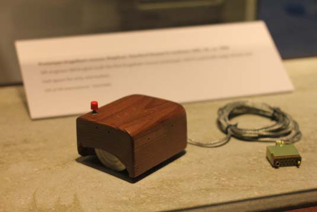
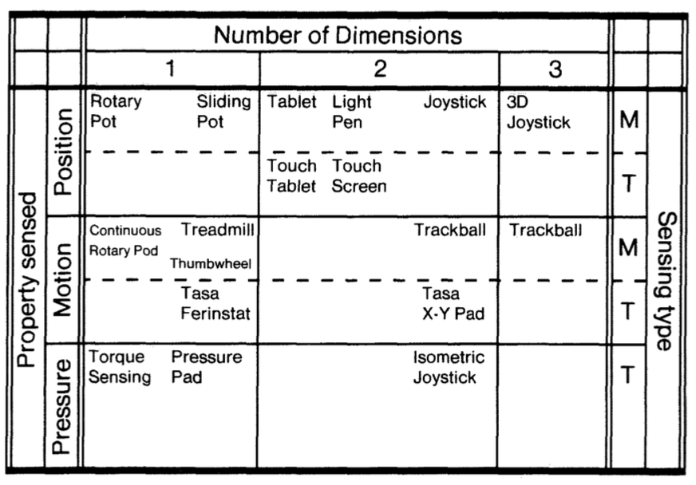
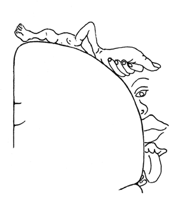
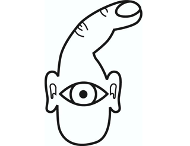
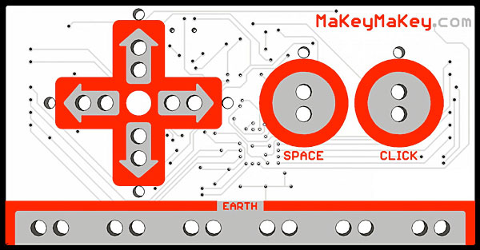
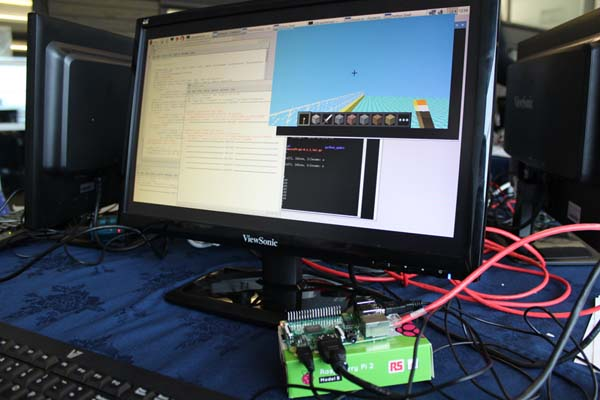
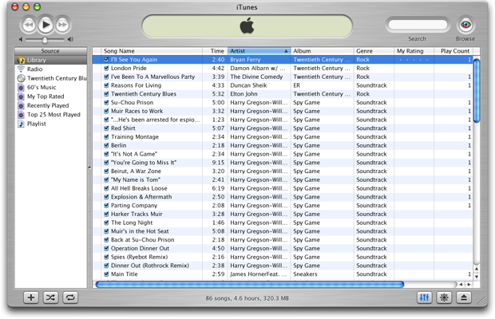

# Αρχέτυπα

> O Leonardo da Vinci δεν μπορούσε να εφεύρει ούτε έναν κινητήρα για
> κάποιο από τα οχήματά του. Μπορεί να ήταν ο εξυπνότερος άνθρωπος στην
> εποχή του, αλλά γεννήθηκε στη λάθος εποχή. Το IQ του δεν μπορούσε να
> υπερβεί την εποχή του. Alan Kay

## Περίληψη

Σε αυτό το κεφάλαιο μελετάμε τις ιδιότητες του υπολογιστή που επιτρέπουν
τη διάδραση με τον άνθρωπο. Εδώ εστιάζουμε την προσοχή μας στις
ιδιότητες του υπολογιστή και ειδικά στα συστήματα εισόδου και εξόδου. Θα
μελετήσουμε τα παραδοσιακά συστήματα εισόδου και εξόδου, όπως είναι το
πληκτρολόγιο και το ποντίκι, καθώς και τα κινητά και διάχυτα συστήματα
εισόδου και εξόδου, που έχουν πολύ περισσότερες σε αριθμό και είδος
συσκευές διάδρασης με τον χρήστη, όπως τον εντοπισμό γεωγραφικής θέσης,
την αφή, την κάμερα, κτλ.

## Δομικά στοιχεία

Οι περισσότεροι είμαστε πολύ καλοί ή ακόμη και άριστοι χρήστες του
επιτραπέζιου ΗΥ. Η κατεύθυνση του κινητού και του διάχυτου υπολογισμού
αποτελεί μια πρόκληση για όλους τους χρήστες αλλά και για τους
προγραμματιστές επιτραπέζιων ΗΥ, επειδή τα οικεία συστήματα
εισόδου/εξόδου αλλάζουν δραστικά προς την κατεύθυνση της φυσικής
διάδρασης (π.χ., αφή, φυσική γλώσσα, αναγνώριση εικόνας). Επιπλέον, ο
κινητός και διάχυτος υπολογισμός σε κάποιες περιπτώσεις δεν έχει όλους
του υπολογιστικούς πόρους (π.χ., επεξεργαστή, μνήμη, αποθήκευση) στα
οποία έχουμε συνηθίσει από τους μοντέρνους ΗΥ γραφείου.

O σχεδιασμός του υπολογιστή και ειδικά των συσκευών εισόδου και εξόδου
μπορεί να επιφέρει συγκεκριμένη ανάδραση από τους χρήστες. Το αν οι
χρήστες θα αγοράσουν, θα μάθουν, θα χρησιμοποιήσουν ένα προϊόν ή αν θα
συνεργαστούν με άλλους, εξαρτάται σε μεγάλο βαθμό από το πόσο άνετα
νιώθουν όταν βλέπουν και κρατάνε το αντίστοιχο σύστημα, καθώς και από το
πόσο το εμπιστεύονται. Εάν ο υπολογιστής αργεί και είναι ενοχλητικός,
τότε είναι πιθανό οι χρήστες να αποφύγουν τη διάδραση. Εάν όμως το
σύστημα εισόδου και εξόδου είναι ευχάριστο και γρήγορο τότε η χρήση του
γίνεται περισσότερο επιθυμητή και άνετη, οπότε οι χρήστες είναι πιθανό
να το αγοράσουν και να το χρησιμοποιήσουν.

## Ιστορικό και πολιτισμικό πλαίσιο

Ένα μεγάλο μέρος της προόδου στα πρώτα βήματα της διάδρασης έγινε στις
συσκευές εξόδου, όπως είναι η οθόνη και ο τρόπος που απεικονίζεται η
πληροφορία πάνω σε αυτή. Από την πλευρά των συσκευών εισόδου, εκτός από
το κλασικό πληκτρολόγιο, η μεγαλύτερη επιτυχία ήταν το ποντίκι, το οποίο
ανήκει στην ομάδα των συσκευών έμμεσης εισόδου. Με βάση τις δυνατότητες
που έχουν οι αρχικά διαθέσιμες συσκευές εισόδου, εξόδου και επεξεργασίας
δεδομένων, μια σειρά από μορφές διάδρασης έγιναν διαθέσιμες και
αποδεκτές από τους χρήστες: 1) γλώσσα εντολών, 2) μενού και φόρμες, 3)
φυσική γλώσσα, 4) απευθείας χειρισμός, 5) επαυξημένη και εικονική
πραγματικότητα.

Τα πρώτα βήματα της διάδρασης έγιναν στον χώρο της εργασίας και ειδικά
στις εκδόσεις έντυπου υλικού, και όπως ήταν επόμενο, ένα μεγάλο μέρος
από αυτό που αργότερα έγινε γνωστό ως επιτραπέζιο γραφικό περιβάλλον
εργασίας βασίζεται στις αντίστοιχες ανάγκες. Το πληκτρολόγιο ήταν
απαραίτητο για την εισαγωγή και την επεξεργασία του κειμένου, ενώ το
καινοτόμο ποντίκι επέτρεψε την εύκολη πλοήγηση ανάμεσα σε πολλές
επιλογές υπολογισμού, που αλλιώς θα έπρεπε να απομνημονεύσει ο χρήστης.

Το ποντίκι στα πρώτα συστήματα διάδρασης ήταν απλώς μια συσκευή επιλογής
κειμένου. Στην πορεία, και καθώς η οθόνη εμπλουτίστηκε με περισσότερα
στοιχεία γραφικών όπως τα παράθυρα και τα εικονίδια, το ποντίκι κράτησε
τον ρόλο του ως η πιο αποδοτική συσκευή επιλογής στόχου και μετακίνησης
αντικειμένων πάνω στην οθόνη. Από τα πρώτα εμπορικά βήματα, το ποντίκι
είχε διαφορετικό αριθμό πλήκτρων ανάλογα με τις ανάγκες του χρήστη. Για
παράδειγμα, οι υπολογιστές της Apple συνοδεύονταν από ποντίκι με ένα
κουμπί, ενώ οι περισσότερες από τις άλλες εμπορικές προτάσεις είχαν δύο
ή τρία κουμπιά. Στο πέρασμα των χρόνων και καθώς το ποντίκι κέρδιζε τη
θέση του σε περισσότερες και πιο πολύπλοκες εφαρμογές, ο σχεδιασμός του
επαυξήθηκε, τόσο με επιπλέον κουμπιά όσο και με νέες λειτουργίες που
γεφύρωσαν το χάσμα με τις πολύ δημοφιλείς οθόνες αφής.

Ο αριθμός των κουμπιών σε ένα ποντίκι δεν είναι από μόνος του ικανός να
καθορίσει την αποτελεσματικότητά του, αν δεν γνωρίζουμε τις ανάγκες και
τις διεργασίες του χρήστη. Έτσι, το ποντίκι με ένα κουμπί είναι
ιδιαιτέρως κατάλληλο για αρχάριους χρήστες, καθώς δεν επιτρέπει το
λάθος, αφού υπάρχει μόνο μία λειτουργία. Καθώς ο υπολογιστής απέκτησε
μεγαλύτερη ισχύ και δικτύωση, και κυρίως, καθώς οι ανθρώπινες ανάγκες
και χρήσεις του υπολογιστή επεκτάθηκαν και σε άλλους τομείς πέρα από την
εργασία, νέες συσκευές εισόδου και εξόδου, όπως η κάμερα, το μικρόφωνο,
τα ηχεία, απέκτησαν σημασία. Η πρώτη περίοδος των υπερμέσων και
πολυμέσων ήταν περιορισμένη σε στατικά αποθηκευτικά μέσα όπως οι οπτικοί
δίσκοι, αλλά η εξάπλωση της δικτύωσης μετέφερε την αποθήκευση, την
επεξεργασία, και τη διανομή τους μέσω του δικτύου των υπολογιστών με τη
συμμετοχή των χρηστών.

## Είσοδος, έξοδος, και μοντέλα διάδρασης

Αν και η τεχνολογία των υπολογιστών έχει κάνει πολύ μεγάλη ποσοτική
πρόοδο αναφορικά με την ταχύτητα και το μέγεθος των δεδομένων που
μπορούν να επεξεργαστούν, την ίδια στιγμή, η πρόοδος αυτή δεν έχει
μεγάλο αντίκρισμα στην ποιότητα της διάδρασης ανθρώπου και υπολογιστή. Η
ποιότητα της διάδρασης εξαρτάται, τόσο από τον υπολογιστή, όσο και από
τον άνθρωπο. Μπορούμε να σκεφτούμε και να δημιουργήσουμε πολλές
διαφορετικές συσκευές εισόδου και εξόδου για την επικοινωνία με τον
άνθρωπο, όμως αν αυτές δεν είναι συμβατές με τις ανάγκες του, ή αν δεν
γίνουν αποδεκτές, τότε δεν έχουμε πετύχει κάποια πρόοδο. Επομένως, η
πρόκληση που παραμένει ανοικτή είναι να κατασκευάσουμε εκείνες τις
συσκευές εισόδου και εξόδου που είναι κατάλληλες για τις ανάγκες του
ανθρώπου και των δραστηριοτήτων του.

Η διάκριση ανάμεσα σε συσκευές εισόδου και εξόδου είναι περισσότερο
τεχνητή παρά πραγματική και γίνεται χάριν ανάλυσης, αφού τελικά αυτό που
μας ενδιαφέρει, δηλαδή το μοντέλο της διάδρασης είναι πάντα ένας
συνδυασμός αυτών των δύο. Ο χρήστης μέσω της συσκευής εισόδου θα
μεταδώσει την πρόθεσή του στον υπολογιστή, ο οποίος θα επικοινωνήσει την
κατάστασή του μέσω μιας συσκευής εξόδου. Έχοντας προσεγγίσει τη διάδραση
τόσο από την πλευρά του ανθρώπου όσο και από την πλευρά του υπολογιστή,
θα στρέψουμε την προσοχή μας στον μεταξύ τους διάλογο, όπου θα
εξετάσουμε διάφορα μοντέλα διάδρασης.

Η μεγάλη πρόκληση στη σχεδίαση των μοντέλων διάδρασης βρίσκεται στο
γεφύρωμα των διαφορών που υπάρχουν ανάμεσα στην εικόνα που έχει ο
τελικός χρήστης για το σύστημα και σε εκείνη που έχουν οι κατασκευαστές
του για το πώς λειτουργεί το σύστημα εσωτερικά. Το χάσμα αυτό αποτελεί
πρόκληση, κυρίως γιατί οι ανάγκες των χρηστών είναι ένας κινούμενος
στόχος, αφού οι χρήστες έχουν μεγάλες διαφορές μεταξύ τους και επιπλέον,
ο ίδιος χρήστης έχει διαφορετικές ανάγκες και προτιμήσεις ανάλογα με τη
χρονική στιγμή και την περίσταση, καθώς και διαχρονικά. Τέλος, η κάθε
τεχνολογική παρέμβαση επηρεάζει (ή τουλάχιστον επαναπροσδιορίζει) τις
ανάγκες των χρηστών, και δημιουργεί μια αυτοτροφοδοτούμενη ανάγκη για
νέα μοντέλα διάδρασης.

Οι σχεδιαστές προσπαθούν να γεφυρώσουν το χάσμα με γενικά μοντέλα
διάδρασης. Τα μοντέλα διάδρασης μας βοηθούν να κατανοήσουμε τι συμβαίνει
κατά την επικοινωνία μεταξύ του χρήση και του συστήματος. Η εργονομία
ασχολείται με τα φυσικά χαρακτηριστικά της διάδρασης, και πώς αυτά
επηρεάζουν την αποτελεσματικότητά της. Ο διάλογος μεταξύ του χρήστη και
του συστήματος επηρεάζεται από το στυλ της διεπαφής ανθρώπου και
υπολογιστή, και το στυλ αυτό είναι το βασικό αντικείμενο της σχεδίασης,
όπως τουλάχιστον θα φανεί στον τελικό χρήστη. Η διάδραση λαμβάνει χώρα
μέσα σε ένα κοινωνικό και οργανωτικό πλαίσιο, το οποίο επηρεάζει τόσο
τον χρήστη, όσο και το σύστημα. Τα υποδείγματα διάδρασης παρέχουν μια
καλή θεώρηση του ιστορικού των διαδραστικών συστημάτων υπολογιστών.

### Είσοδος

Υπάρχει μια πολύ μεγάλη ποικιλία από συσκευές εισόδου για τον υπολογιστή
και η επιλογή της κατάλληλης συσκευής εξαρτάται λιγότερο από την
τεχνολογία και περισσότερο από τον χρήστη, το πλαίσιο χρήσης, καθώς και
από τις διεργασίες του χρήστη. Αρχικά, στους πρώτους κεντρικούς
υπολογιστές η είσοδος βασιζόταν στο χαρτί, αφού το χαρτί ήταν από πολύ
παλιά ένα μέσο οικείο για τον άνθρωπο. Καθώς, όμως, οι υπολογιστές
μετασχηματίζονται, με νέες φόρμες και χρήσεις, σε επιτραπέζιους,
κινητούς και διάχυτους, δημιουργούνται νέοι τρόποι ελέγχου και νέες
συσκευές εισόδου. Μερικές από τις πιο δημοφιλείς συσκευές εισόδου στους
επιτραπέζιους υπολογιστές είναι το πληκτρολόγιο, το ποντίκι, η πένα, το
χειριστήριο (παιχνιδιών), το trackpad, η κάμερα, κ.ά. Στον κινητό
υπολογισμό έχουμε επιπλέον συστήματα εισόδου όπως η γεωγραφική θέση, ο
προσανατολισμός, το επιταγχυσιόμετρο, ενώ στον διάχυτο υπολογισμό (π.χ.,
φορετοί υπολογιστές, έξυπνα ρολόγια) έχουμε επιπλέον συστήματα εισόδου
όπως οι αισθητήρες περιβαλλοντικών και βιολογικών σημάτων. Η επιλογή
συσκευών εισόδου γίνεται περισσότερο ενδιαφέρουσα (και περίπλοκη) όταν
θέλουμε να συνδυάσουμε διαφορετικές συσκευές εισόδου.

Ένας δημοφιλής και απλός τρόπος για να ταξινομήσουμε τις συσκευές
εισόδου είναι με δύο παραμέτρους που αντιστοιχούν στον αριθμό των
διαστάσεων και στην ιδιότητα που παρακολουθεί η συσκευή εισόδου. Για
παράδειγμα, το ποντίκι μπορεί να έχει μια ροδέλα κύλισης η οποία
επιτρέπει την εύκολη κατακόρυφη ροή των σελίδων κειμένου στην οθόνη, ενώ
ταυτόχρονα παρακολουθεί τη θέση της συσκευής πάνω στις δύο διαστάσεις
του τραπεζιού για να μετακινήσει αντίστοιχα τον δείκτη στην οθόνη. Με τη
χρήση μιας κάμερας βάθους πεδίου μπορούμε να παρακολουθήσουμε την κίνηση
των δακτύλων ή όλου του σώματος σε τρεις διαστάσεις. Βλέπουμε λοιπόν ότι
για την ίδια παράμετρο (αριθμός διαστάσεων) μπορούμε να έχουμε την ίδια
ή διαφορετικές συσκευές εισόδου, καθώς και ένα μεγάλο εύρος από
αισθητήρες, που μπορεί να αποτελούνται από μηχανικά, ηλεκτρονικά, και
οπτικά μέρη. Εκτός από την παράμετρο του αριθμού των διαστάσεων που
καταγράφει μια συσκευή εισόδου, η δεύτερη παράμετρος είναι το είδος της
κίνησης που καταγράφεται. Το είδος της κίνησης μπορεί να είναι η θέση
(π.χ., ποντίκι πάνω σε τραπέζι), η κίνηση (π.χ., ροδέλα κύλισης), και η
πίεση (π.χ., πλήκτρο). Η αποτύπωση των παραμέτρων και η συμπλήρωση των
αντίστοιχων συσκευών εισόδου, μας επιτρέπει να δημιουργήσουμε έναν
σχεδιαστικό χώρο όπου φαίνονται άμεσα οι ευκαιρίες για νέες συσκευές
εισόδου.

Η κατασκευή νέων συσκευών εισόδου είναι μια πολύ ενδιαφέρουσα αλλά και
σύνθετη εργασία. Από τη μια πλευρά, η κατασκευή νέων συσκευών εισόδου
δίνει στον άνθρωπο νέες επαυξημένες δυνατότητες για να ενεργήσει στον
κόσμο της πληροφορίας, ο οποίος αντιπροσωπεύει ή ακόμη και ελέγχει τον
πραγματικό κόσμο. Από την άλλη πλευρά, η κατασκευή νέων συσκευών εισόδου
επηρεάζεται από ένα μεγάλο εύρος παραμέτρων, των οποίων η σύνθεση
δύσκολα γίνεται γνωστή σε βάθος από τους σχεδιαστές. Για παράδειγμα, η
σχεδίαση της συσκευής εισόδου 'ποντίκι' υλοποίησε στο ακέραιο το όραμα
του σχεδιαστή της για την επαύξηση της ανθρώπινης σκέψης, αφού έδωσε
πρόσβαση στους υπολογιστές και στην πληροφορία σε ένα μεγάλο εύρος
χρηστών πέρα από τους ειδικούς. Ταυτόχρονα, η κατασκευή της συσκευής
εισόδου 'ποντίκι' δεν ήταν άμεσα προφανής, αφού υπάρχουν πάντα πολλές
εναλλακτικές συσκευές εισόδου για τον ίδιο σκοπό. Ακόμη, η συσκευή
εισόδου 'ποντίκι' βρίσκεται σε έναν συνεχή μετασχηματισμό, καθώς
επηρεάζεται από πολλούς παράγοντες όπως το πλαίσιο χρήσης, οι
προτιμήσεις, και η κατανόηση που έχουν οι σχεδιαστές της. Για
παράδειγμα, τα δημοφιλή δικτυακά βιντεοπαιχνίδια δράσης τρίτου προσώπου
δημιούργησαν την ανάγκη για ποντίκια με πολλά πλήκτρα. Αντίστοιχα, η
κατασκευή κάθε νέας συσκευής εισόδου θα πρέπει να ισορροπήσει ανάμεσα σε
όλες τις παραπάνω δυνάμεις.

### Έξοδος

Οι υπολογιστές έχουν τη δυνατότητα να επεξεργάζονται πληροφορία που
τελικά αναπαριστούν μέσα από πολλά διαφορετικά κανάλια. Οι πρώτοι
κεντρικοί υπολογιστές είχαν ως έξοδο το χαρτί, ακριβώς όπως είχαν το
χαρτί ως είσοδο, γιατί αυτός ήταν ο πιο αποτελεσματικός τρόπος διάδρασης
με τους ανθρώπους, οι οποίοι από πολύ παλιά έχουν μια οικειότητα με το
χαρτί. Καθώς ο υπολογιστής απέκτησε νέες μορφές (όπως είναι ο
επιτραπέζιος, ο κινητός, και ο διάχυτος), αναπτύχθηκαν νέοι τρόποι
αναπαράστασης της πληροφορίας. Η οθόνη του υπολογιστή είναι με μεγάλη
διαφορά η πιο δημοφιλής συσκευή εξόδου, επειδή μπορεί να έχει πολλά
σχήματα και μεγέθη, ανάλογα με τη φόρμα του υπολογιστή (π.χ.,
επιτραπέζιος, φορητός, φορετός, δωματίου, κτλ.), και στην περίπτωση που
πρόκειται για οθόνη εικονοστοιχείων, μπορεί να οπτικοποιήσει την
πληροφορία με πολλούς διαφορετικούς τρόπους. Εκτός από την οθόνη, τα
ηχεία επιτρέπουν στον υπολογιστή να επικοινωνήσει μέσω του ήχου ή ακόμη
και μέσω της φυσικής γλώσσας με ομιλία. Στις μικρότερες φόρμες των
υπολογιστών (π.χ., κινητός, φορετός) καθώς και στα πλαίσια χρήσης όπου η
οπτική προσοχή του ανθρώπου είναι στραμμένη αλλού (π.χ., οδήγηση,
άθληση), οι ενδεικτικές λυχνίες καθώς και η δόνηση αποκτούν σημαντικό
ρόλο.

Η κυριαρχία της οθόνης ως συσκευής εξόδου είναι τόσο μεγάλη που στις
περισσότερες πηγές για την κατασκευή της διάδρασης υπονοείται η χρήση
της, χωρίς να αφήνονται περιθώρια για τη θεώρηση εναλλακτικών συσκευών
εξόδου. Επιπλέον, η ωριμότητα και το προσιτό κόστος των προβολών σε δύο
διαστάσεις έχει αφήσει στο περιθώριο την πιο φυσική για τον άνθρωπο
προβολή σε τρεις διαστάσεις και τα αντίστοιχα εικονικά περιβάλλοντα. Από
μια ανθρωποκεντρική σκοπιά, αν εξετάσουμε τα αισθητήρια όργανα του
ανθρώπου διαπιστώνουμε ότι η αίσθηση της αφής, ειδικά αυτή στις άκρες
των δακτύλων, είναι από τις πιο πλούσιες σε νευρικές απολήξεις, τόσο σε
εύρος όσο και σε είδος, αφού μπορεί να αντιληφθεί την υφή, το σχήμα, τη
θερμοκρασία των υλικών. Με δεδομένο ότι οι διαθέσιμες τεχνολογίες που
επαυξάνουν την αφή δεν είναι ακόμη τόσο ώριμες όσο οι τεχνολογίες για
τις οθόνες, γίνεται φανερό ότι η κυριαρχία της οθόνης ως συσκευής εξόδου
είναι περισσότερο αποτέλεσμα μιας τεχνολογικής περίστασης και όχι τόσο
της ανάγκης για ανθρωποκεντρική κατασκευή της διάδρασης. Όπως και στην
περίπτωση των συσκευών εισόδου, έτσι και για τις συσκευές εξόδου τα πιο
ενδιαφέροντα αλλά και δύσκολα στην κατασκευή συστήματα διάδρασης
βασίζονται στη σύνθετη ή πολυτροπική διάδραση, που εξετάζεται στην
επόμενη ενότητα.

### Πολυτροπική διάδραση

Στις προηγούμενες ενότητες είδαμε ξεχωριστά μια σειρά από συσκευές
εισόδου (π.χ., ποντίκι) και εξόδου (π.χ., οθόνη), καθώς και τα στυλ
διάδρασης που επιτρέπουν (π.χ., μενού), αλλά δεν έχουμε δει καθόλου τους
συνδυασμούς τους. Ειδικά η δημοφιλής επιφάνεια εργασίας στον επιτραπέζιο
υπολογιστή είναι παράδειγμα μονοδιάστατης αντίληψης για τη διάδραση
ανθρώπου και υπολογιστή. Αν φανταστούμε πώς βλέπει τον χρήστη ένας
υπολογιστής με διάδραση τύπου επιφάνειας εργασίας, τότε καταλήγουμε ότι
η εικόνα που έχει ο υπολογιστής για εμάς δεν είναι πλήρης αλλά μοιάζει
με μια παλάμη, ένα δάκτυλο, κι ένα μάτι, αφού αυτά αρκούν για αυτό τον
τύπο διάδρασης. Με δεδομένη τη δυνατότητα του ανθρώπου να εκφράζει τις
προθέσεις του και να προσλαμβάνει ερεθίσματα με ένα πολύ πλουσιότερο
φάσμα κινήσεων και αισθήσεων, καταλήγουμε ότι η διάδραση με την
επιφάνεια εργασίας είναι απλά μια μικρή υποπερίπτωση της διάδρασης
ανθρώπου και υπολογιστή.

Το συμπέρασμα από τη σύγκριση της καθιερωμένης διάδρασης με την
επιφάνεια εργασίας και των δυνατοτήτων του ανθρώπου μας δίνει νέους
ορίζοντες για το πεδίο ορισμού του φαινομένου της διάδρασης. Το
διευρυμένο πεδίο ορισμού της διάδρασης μπορεί να προσδιοριστεί με βάση
τις δυνατότητες του ανθρώπου που δεν έχουν ακόμη ρόλο σε συνδυασμό με
ένα νέο πλαίσιο χρήσης, πέρα από το γραφείο και τον επιτραπέζιο
υπολογιστή.

### Φυσική διάδραση

Με τον όρο φυσική διάδραση εννοούμε ένα σύνολο από δεξιότητες που είναι
δεδομένες για τους ανθρώπους, όπως είναι οι χειρονομίες, οι εκφράσεις
του προσώπου, η αναγνώριση φυσικής γλώσσας, κτλ. Η φυσική διάδραση
ανθρώπου και υπολογιστή φαίνεται να είναι ο πιο λογικός τρόπος για να
γεφυρώσουμε τις διαφορές που έχουν άνθρωποι και υπολογιστές. Στην πράξη,
αν και τα συστήματα φυσικής διάδρασης έχουν ωριμάσει αρκετά, η
αποτελεσματικότητά τους είναι αποδεκτή μόνο σε πολύ στενά πλαίσια της
ανθρώπινης δραστηριότητας. Οι περιορισμοί που έχουν τα συστήματα φυσικής
διάδρασης έχουν να κάνουν με την αδυναμία να δώσουν ανάδραση για την
παρούσα κατάσταση, και κυρίως με την περιορισμένη εικόνα που έχει ο
χρήστης για τις πιθανές δράσεις. Από τη μία πλευρά, ο χρήστης δε
χρειάζεται να προσαρμοστεί στο μοντέλο λειτουργίας του συστήματος (αφού
αυτό είναι τελείως φυσικό και βασίζεται απόλυτα στις ανθρώπινες
δεξιότητες), από την άλλη πλευρά όμως, η φυσική διάδραση δεν επιτρέπει
τη δημιουργία σύνθετων συστημάτων, αφού είναι δύσκολο να ξέρει ο χρήστης
πού βρίσκεται και τι μπορεί να κάνει. Επιπλέον, η φυσική διάδραση σε
πολλές περιπτώσεις είναι δύσκολο να κατασκευαστεί με τρόπο γενικό, που
να καλύπτει όλους τους ανθρώπους, επειδή υπάρχει πολύ μεγάλη διακύμανση
σε φυσικές δεξιότητες, όπως είναι οι χειρονομίες ή η ομιλία.

### Άμεση και έμμεση διάδραση

Ανάμεσα στους πολλούς τρόπους για να ταξινομήσουμε τις συσκευές εισόδου
ξεχωρίζουμε τη διάκριση στις κατηγορίες της άμεσης και της έμμεσης
διάδρασης. Το ποντίκι είναι ο βασικός εκπρόσωπος της έμμεσης διάδρασης,
αφού για να μετακινήσουμε τον δείκτη σε μια συσκευή εξόδου (π.χ., οθόνη)
μετακινούμε μια διαφορετική συσκευή, όπως είναι το ποντίκι. Από την άλλη
πλευρά, η οθόνη αφής ανήκει στις συσκευές εισόδου άμεσης διάδρασης, αφού
για να επιλέξουμε έναν στόχο ή για να μετακινήσουμε ένα αντικείμενο το
κάνουμε απευθείας με τα χέρια μας πάνω στην οθόνη, χωρίς να μεσολαβεί
κάποια ενδιάμεση μετάφραση. Από την άποψη της διάκρισης σε άμεσες και
έμμεσες συσκευές, ιδιαίτερο ενδιαφέρον έχει και η συσκευή εισόδου της
πένας, η οποία μπορεί να ανήκει και στις δύο κατηγορίες.

Αν και σε πρώτη ανάγνωση οι συσκευές άμεσης διάδρασης φαίνεται να έχουν
πολλά πλεονεκτήματα, τουλάχιστον αναφορικά με την ευκολία εκμάθησής
τους, υπάρχουν πολλές περιπτώσεις όπου μια συσκευή έμμεσης διάδρασης
υπερτερεί. Για παράδειγμα, η επιλογή μικρών στόχων ή ακόμη δυσκολότερα ο
χειρισμός τους με άμεση διάδραση (π.χ., πάνω σε μια οθόνη αφής) δεν
είναι εύκολος, εκτός αν υπάρχει ειδική υποστήριξη από το αντίστοιχο
λογισμικό. Για το τελευταίο, χαρακτηριστική περίπτωση είναι η
μικρομετρική αναζήτηση πάνω στον χρόνο για ένα βίντεο ή για ένα μουσικό
τραγούδι.Εκτός από το ποντίκι, οι ερευνητές δοκίμασαν και άλλες συσκευές
εισόδου όπως την πένα, η οποία επιτρέπει τόσο άμεση όσο και έμμεση
διάδραση.

![Το σύστημα Sketchpad θεωρείται το πρώτο σημαντικό σύστημα αλληλεπίδρασης ανθρώπου και υπολογιστή με χρήση γραφικών. Οι κεντρικοί υπολογιστές εκείνής της εποχής συνήθως βασίζονταν σε διάτρητες κάρτες ή σε τερματικά γραμμής. Με αυτόν τον τρόπο, το Sketchpad έδειξε ότι είναι εφικτό να έχουμε έναν υπολογιστή, ο οποίος να μην αλληλεπιδρά με τον χρήστη με τον τρόπο που βολεύει μόνον τον υπολογιστή. Εκτός από το ποντίκι, οι ερευνητές δοκίμασαν και άλλες συσκευές εισόδου όπως την πένα, η οποία επιτρέπει τόσο άμεση όσο και έμμεση διάδραση. Η πένα αν και φαίνεται πιο φυσική στη χρήση για τον άνθρωπο, αποδείχτηκε πως έχει το μειονέκτημα της μικρότερης ακρίβειας καθώς και της κούρασης του χεριού σε σχέση με το ποντίκι.](images/sketchpad.png)

Η συσκευή εισόδου πένα έχει ιδιαίτερο ενδιαφέρον, καθώς συνδυάζει και
τους δύο τύπους διάδρασης με συσκευές εισόδου, αλλά κυρίως επειδή
ιστορικά εμφανίστηκε ταυτόχρονα με το ποντίκι, αλλά δεν είχε την ίδια
αποδοχή. Πρώτα από όλα, η πένα είναι μια συσκευή εισόδου που μπορεί να
λειτουργήσει τόσο ως συσκευή άμεσης όσο και έμμεσης διάδρασης. Για
παράδειγμα, μπορούμε να χρησιμοποιήσουμε την πένα απευθείας πάνω σε μια
οθόνη, οπότε έχουμε μια διάδραση που είναι ανάλογη της χρήσης του
μολυβιού πάνω σε χαρτί. Επιπλέον, μπορούμε να χρησιμοποιήσουμε την πένα
ως συσκευή έμμεσης εισόδου, όπως χρησιμοποιούμε το ποντίκι, και τότε η
διαφορά, εκτός από το κράτημα της συσκευής, βρίσκεται στο γεγονός ότι η
πένα μπορεί να έχει ένα-προς-ένα σχέση με τη συσκευή εξόδου ακόμη και
στην περίπτωση που λειτουργεί ως έμμεση συσκευή εισόδου. Αν και από τα
παραπάνω η πένα φαίνεται να είναι μια ευέλικτη και επιθυμητή συσκευή
εισόδου, στην πράξη έχει αποδειχτεί ότι κουράζει το χέρι, ενώ δεν έχει
την ταχύτητα και την ακρίβεια του ποντικιού. Φυσικά, υπάρχουν κάποιες
επιμέρους χρήσεις, όπως στη σχεδίαση, όπου η πένα μπορεί να έχει πολλά
πλεονεκτήματα έναντι του ποντικιού.

### Μικρο-επεξεργαστές ως υλικό σχεδίασης

Τα Lilypad και MakeyMakey είναι μικρο-επεξεργαστές (Arduino) που
αποδεικνύουν την ευελιξία της πλατφόρμας και ανταποκρίνονται στην ανάγκη
να προγραμματίσουμε τη διάδραση γρήγορα, οικονομικά και πέρα από τις
συσκευές εισόδου και εξόδου του επιτραπέζιου υπολογιστή. Οι σχεδιαστές
του MakeyMakey παρατήρησαν ότι μεγάλο μέρος της χρήσης του κλασικού
Arduino περιλάμβανε τη δοκιμή νέων συσκευών εισόδου. Οι επίδοξοι
σχεδιαστές έπρεπε να φτιάξουν ένα εξωτερικό κύκλωμα που να διευκολύνει
την αγωγιμότητα ανάμεσα στη νέα συσκευή εισόδου και στο Arduino. Ενώ το
Arduino λειτουργεί ως γέφυρα ανάμεσα στην είσοδο του χρήστη και στον
επιτραπέζιο υπολογιστή, ο υπολογιστής επεξεργάζεται την εντολή που
λαμβάνει από το Arduino. Στις περισσότερες περιπτώσεις, μάλιστα, οι
εντολές από το Arduino έχουν αντιστοιχία με κουμπιά από το πληκτρολόγιο,
επειδή αυτή η επιλογή διευκολύνει πολύ την ανάπτυξη του προγράμματος
διάδρασης στον επιτραπέζιο υπολογιστή με οποιοδήποτε λογισμικό, από έναν
φυλλομετρητή μέχρι ένα εξειδικευμένο λογισμικό. Για αυτόν τον λόγο, το
MakeyMakey είναι ένα Arduino που λαμβάνει σήμα εισόδου από αγώγιμα υλικά
και τα μεταφράζει σε πατήματα του πληκτρολογίου.

Μαζί με το Arduino, το RaspeberryPi είναι μια ακόμη συσκευή που
βασίζεται στον ανοικτό κώδικα για να προσφέρει έναν μικρό σε μέγεθος και
οικονομικό υπολογιστή. Οι ομοιότητες ανάμεσα στο Arduino και στο
RaspberryPi δεν σταματούν στον ανοικτό κώδικα και στην οικονομία, αλλά
συνεχίζονται και στα κίνητρα, αφού και στις δύο περιπτώσεις η εκπαίδευση
έπαιξε κυρίαρχο ρόλο, τουλάχιστον στον αρχικό σχεδιασμό. Η διαφορά στην
περίπτωση του RaspberryPi είναι ότι σχεδιάστηκε για την εκπαίδευση στον
προγραμματισμό των υπολογιστών με έμφαση στα παιδιά. Η έμπνευση για το
RaspberryPi είναι οι πρώτοι οικιακοί υπολογιστές της δεκαετίας του
1970-80. Ήταν πολύ απλές συσκευές που μπορούσαν να συνδεθούν στην
τηλεόραση και αμέσως μετά κάποιος μπορούσε να αρχίσει να δημιουργεί (ή
έστω να έχει μια διάδραση) σε επίπεδο που να βοηθάει στην κατανόηση της
λειτουργίας του υπολογιστή. Σε αντίθεση με την εικόνα που δίνει ο
παγκόσμιος ιστός και τα κοινωνικά δίκτυα (τα κυρίαρχα μέσα με τα οποία
μεγάλωσε η νέα γενιά του 1990-2000), το RaspberryPi βασίζεται στο
λειτουργικό σύστημα Linux και πρεσβεύει μια πιο κοντινή σχέση με τον
υπολογιστή.

Αν και σε πρώτη ανάγνωση τα RaspberryPi και Arduino μπορεί να φαίνονται
ανταγωνιστικά, αφού από την πλευρά της φόρμας και τους κόστους
βρίσκονται στην ίδια κατηγορία, στην πράξη η λειτουργικότητά τους είναι
συμπληρωματική, κυρίως επειδή καλύπτουν πολύ διαφορετικές ανάγκες. Το
RaspberryPi είναι ένας πολύ ισχυρός πολυμεσικός υπολογιστής, κατάλληλος
για πολλές από τις εργασίες που κάνουν οι προσωπικοί επιτραπέζιοι και
φορητοί υπολογιστές. Στο πλαίσιο της κατασκευής συσκευών εισόδου και
εξόδου μπορεί να χρησιμοποιηθεί για την κατασκευή πρωτοτύπων που
απαιτούν μεγάλη υπολογιστική ισχύ κατά την επεξεργασία αλλά και την
είσοδο-έξοδο προς τον χρήστη, αφού εκτός από έναν δυνατό κεντρικό
επεξεργαστή, προσφέρει και μεγάλο εύρος ζώνης στα κανάλια εισόδου και
εξόδου. Αντιθέτως, το Arduino ξεχωρίζει για τη χαμηλή υπολογιστική ισχύ
και το στενό εύρος ζώνης, που όμως έρχονται με μικρότερο κόστος
ενεργειακής λειτουργίας, γεγονός που το κάνει κατάλληλο για την
κατασκευή πρωτοτύπων για συσκευές που πρέπει να έχουν χαμηλή κατανάλωση
ενέργειας, όπως είναι οι φορετοί και οι διάχυτοι υπολογιστές. Στην
πορεία, οι κατασκευαστές των RaspberryPi και Arduino έχουν δημιουργήσει
επιμέρους εκδόσεις των βασικών συστημάτων διευρύνοντας τις δυνατότητές
τους, είτε προς το οικονομία, είτε προς την ισχύ, ενώ υπάρχουν και πολλά
άλλα παρόμοια συστήματα από ανταγωνιστές.

## Σύνθετα στυλ διάδρασης

Ο συνδυασμός των συστημάτων εισόδου και εξόδου έχει επιτρέψει τη
δημιουργία μιας σειράς από επιτυχημένα στυλ διάδρασης, τα οποία
εμφανίζονται είτε ανεξάρτητα είτε σε σύνθετες μορφές. Το πιο παλιό στυλ
διάδρασης είναι η γραμμή εντολών, σύμφωνα με το οποίο ο χρήστης
πληκτρολογεί τις εντολές. Η φόρμα είναι ένα εξίσου παλιό στυλ διάδρασης,
αφού μπορεί να εμφανιστεί ακόμη και σε τερματικά κειμένου, ενώ το ίδιο
ισχύει και για το μενού εντολών. Ο απευθείας χειρισμός βασίζεται είτε
στην αφή, είτε σε μια συσκευή εισόδου όπως η πένα και το ποντίκι, καθώς
και σε εικονίδια που αναπαριστούν αντικείμενα και δράσεις. Η φυσική
γλώσσα βασίζεται στην απευθείας αναγνώριση της ανθρώπινης γλώσσας από
τον υπολογιστή και έχει πολλές μορφές, όπως την αναγνώριση κειμένου από
το πληκτρολόγιο, και την αναγνώριση γραφής και ομιλίας. Η επαυξημένη
πραγματικότητα επιτρέπει την διάδραση με ψηφιακά αντικείμενα τα οποία
φαίνονται να εμφανίζονται πάνω στον πραγματικό κόσμο, όπως αυτός
φαίνεται μέσα από μια κάμερα. Τέλος, η εικονική πραγματικότητα είναι ένα
στυλ διάδρασης που προσομοιώνει τη διάδραση του ανθρώπου με τον
πραγματικό κόσμο και απαιτεί την χρήση συσκευών εμβύθησης.

Η δημοφιλής επιφάνεια εργασίας είναι ένα σύνθετο στυλ διάδρασης με τον
χρήστη, που στηρίζεται στον απευθείας χειρισμό (π.χ, εικονίδια που
αντιπροσωπεύουν φακέλους και εργασίες) αλλά περιέχει και μενού (π.χ.,
για τις επιμέρους λειτουργίες πάνω σε ένα αρχείο ή φάκελο), φόρμες
(π.χ., για τις επιμέρους ρυθμίσεις μιας εφαρμογής ή του λειτουργικού
συστήματος), καθώς και γραμμή εντολών (π.χ., για την αναζήτηση αρχείων ή
για άνοιγμα εφαρμογών). Επίσης, από την πλευρά των συσκευών εισόδου, η
επιφάνεια εργασίας μπορεί να λειτουργήσει με διαφορετικούς τρόπους
(π.χ., ποντίκι, πληκτρολόγιο, φωνή, γραφή, πένα, κτλ.) και ανάλογα με
τις ανάγκες και προτιμήσεις του χρήστη. Η ανάγκη συνδυασμού των
διαφορετικών στυλ διάδρασης δείχνει ότι δεν υπάρχει κάποιο που να
υπερτερεί έναντι των άλλων, αλλά όλα παίζουν έναν διαφορετικό ρόλο
ανάλογα με τις ανάγκες και τους σκοπούς του χρήστη.

Ένα παράδειγμα σύνθετης διάδρασης, η οποία κάνει ένα βήμα μπροστά και
εμπλουτίζει την επιφάνεια εργασίας με περισσότερες κινήσεις από το
ανθρώπινο ρεπερτόριο, είναι αυτό του υπολογιστή ταμπλέτας με είσοδο από
πένα. Το σύστημα αυτό παρουσιάζει ένα πλεονέκτημα τουλάχιστον στις
διεργασίες επεξεργασίας κειμένου, καθώς ο χρήστης δε χρειάζεται να πάρει
το χέρι του από το πληκτρολόγιο και να μετακινήσει το ποντίκι για να
επιλέξει μια επιπλέον λειτουργία. Αντί αυτής της εναλλαγής των δύο
διαφορετικών συσκευών εισόδου, η διάδραση με την ταμπλέτα και την πένα
επιτρέπει τη χρήση φυσικής γλώσσας για τη συγγραφή με την πένα, ενώ η
πένα μπορεί να λειτουργήσει και ως δείκτης, ώστε να γίνει η επιλογή
κάποιας επιπλέον λειτουργίας.

Σε έναν επιτραπέζιο υπολογιστή με πληκτρολόγιο, ποντίκι και οθόνη δύο
διαστάσεων συνήθως έχουμε τα παράθυρα και την επιφάνεια εργασίας ως
βασική αναλογία/μεταφορά της διάδρασης με τον χρήστη. Στην κατηγορία
αυτή εμπίπτουν πολλά συστήματα τα οποία μπορεί να έχουν επιμέρους
διαφορές τόσο στην εμφάνιση όσο και στη λειτουργία τους. Για παράδειγμα,
η πιο απλή επιφάνεια εργασίας στο λειτουργικό σύστημα UNIX (που
βασίζεται στο παραθυρικό σύστημα X-Windows) χρησιμοποιεί τα παράθυρα για
να οργανώσει εφαρμογές, οι οποίες έχουν διεπαφή με κείμενο και όχι με
εικονίδια. Φυσικά, υπάρχουν παραθυρικά συστήματα στο UNIX τα οποία είναι
εξίσου πλούσια με αυτά που συναντάμε στα εμπορικά συστήματα (π.χ., MAC
OS X, Microsoft Windows), όμως ένα μεγάλο μέρος του πλαισίου χρήσης του
UNIX αφορά λειτουργίες διαχείρισης συστήματος στα χαμηλότερα επίπεδα
(π.χ., χρήστες, βάση δεδομένων, δίκτυα, κτλ.), λειτουργίες που έχουν
μεγάλο όφελος από την ύπαρξη ενός πλήρους παραθυρικού περιβάλλοντος. Το
συμπέρασμα από αυτό το παράδειγμα είναι ότι τα παράθυρα είναι απλώς ένα
από τα αρχέτυπα διάδρασης που συνιστούν την επιφάνεια εργασίας στους
επιτραπέζιους υπολογιστές, και με τον κατάλληλο συνδυασμό των επιμέρους
αρχετύπων διάδρασης, η επιφάνεια εργασίας μπορεί να εξυπηρετήσει
διαφορετικούς χρήστες και τις ανάγκες τους.

![Σε ένα παραθυρικό περιβάλλον εργασίας τα μενού μπορούν να βρίσκονται στην κορυφή των παραθύρων την εφαρμογής, το οποίο προσφέρει μια συνοχή ειδικά όταν έχουμε πολλά ανοικτά, ορατά, και επικαλυπτόμενα παράθυρα, αλλά ταυτόχρονα κάνει κάπως δυσκολότερη την επιλογή των μενού με τον δείκτη του ποντικιού. Αυτή η σχεδίαση είναι η πιο δημοφιλής καθώς χρησιμοποιείται από τα Microsoft Windows και από πολλές εκδοχές στα παραθυρικά περιβάλλοντα του Linux, ενώ ήταν και η πρώτη που δοκιμάστηκε εργαστηριακά από τους σχεδιαστές του Apple Liza.](images/menus-on-windows.png)

Το σύνθετο στυλ διάδρασης της επιφάνειας εργασίας (WIMP: Windows, Icons,
Menus, Pointer) εκτός από τα παράθυρα και τα εικονίδια περιέχει και
μενού που μπορεί να επιλέξει ο χρήστης και να εξερευνήσει με τη βοήθεια
του δείκτη του ποντικιού ή με ανάλογη συσκευή εισόδου. Τα μενού αλλάζουν
περιεχόμενο ανάλογα με την εφαρμογή χρήστη που είναι στο προσκήνιο, αλλά
η σημαντικότερη διαφορά ανάμεσα στα διαθέσιμα λειτουργικά συστήματα
αφορά στη θέση τους, που μπορεί να είναι είτε πάνω στο παράθυρο της
εφαρμογής (π.χ., Microsoft Windows) είτε στην κορυφή της οθόνης (π.χ.,
Apple Mac OS). Τα παραθυρικά συστήματα πάνω από το λειτουργικό σύστημα
Linux ακολουθούν έναν από τους δύο τρόπους, με αποτέλεσμα να
δημιουργείται μια ασυνέπεια μεταξύ τους, ακόμη και σε αυτό το βασικό
στυλ διάδρασης (μενού). Αν και τα περισσότερα στοιχεία της διάδρασης με
τον χρήστη εμπεριέχουν και στοιχεία συνήθειας και προτίμησης, τα μενού
στην κορυφή της οθόνης είναι πιο εργονομικά, αφού ο δείκτης δεν μπορεί
να κινηθεί πέρα από αυτήν.

Η επιφάνεια εργασίας σε συνδυασμό με τις συσκευές εισόδου ποντίκι και
πληκτρολόγιο αντιπροσωπεύει ένα στυλ διάδρασης με τον χρήστη δημοφιλές
στους επιτραπέζιους υπολογιστές γραφείου, καθώς είναι μια κοντινή
μεταφορά του πλαισίου εργασίας του χρήστη. Όταν οι υπολογιστές βρίσκουν
εφαρμογή εκτός του πλαισίου του γραφείου είναι επόμενο να χρειαζόμαστε
διαφορετικά μοντέλα διάδρασης, τα οποία ναι μεν θα ανταποκρίνονται στις
βασικές ιδιότητες του ανθρώπου (που δεν είναι πολύ διαφορετικές
ανεξάρτητα από το πλαίσιο χρήσης), αλλά θα ταιριάζουν και στο αντίστοιχο
πλαίσιο και στις ανάγκες που αυτό δημιουργεί, οι οποίες μπορεί να είναι
πολύ διαφορετικές σε σχέση με εκείνες της χρήσης εντός του γραφείου.

## Η περίπτωση του Apple iPod

Η περίπτωση της συσκευής αναπαραγωγής μουσικής iPod σήμανε την αρχή της
γρήγορης μετατόπισης της διάδρασης από τον επιτραπέζιο προς τον κινητό
και διάχυτο υπολογισμό. Η μετάβαση του υπολογισμού από τον επιτραπέζιο
στον κινητό συνοδεύτηκε από μια ριζική αναθεώρηση τόσο των συστημάτων
εισόδου όσο και των μοντέλων διάδρασης.

Η πρώτη έκδοση του iPod περιέχει έναν μικρό σκληρό δίσκο και λειτουργεί
ως συσκευή αποθήκευσης αρχείων, όπως πολλές αντίστοιχες εμπορικές
συσκευές εκείνης της εποχής, με τη διαφορά ότι ο περιστρεφόμενος τροχός
επιτρέπει τη γρήγορη πλοήγηση σε μεγάλες λίστες μουσικών αρχείων. Οι
άλλες συσκευές της κατηγορίας του αντί για τον τροχό έχουν πλήκτρα
βήματος, τα οποία είναι πιο δύσχρηστα, ειδικά στην περίπτωση που ο
σκληρός δίσκος είναι γεμάτος με μουσικά αρχεία. Οι περισσότερες
ανταγωνιστικές συσκευές εισόδου βασίζονται σε μια απευθείας απεικόνιση
(direct mapping) της λίστας πολυμεσικών αρχείων με τα κουμπιά εισόδου,
τα οποία είναι οργανωμένα κατακόρυφα. Αν και ο τροχός κύλισης του iPod
παραβαίνει τον κανόνα της απευθείας απεικόνισης αποδικνύεται περισσότερο
εύχρηστος, γιατί πολύ γρήγορα οι χρήστες καταλαβαίνουν ότι με την
περιστροφή του τροχού μπορούν να κινηθούν πάνω-κάτω, και ακόμη
γρηγορότερα μπορούν να επιλέξουν ένα αρχείο από την λίστα, γιατί ο
τροχός προσφέρει εκτός από τον έλεγχο της κατεύθυνσης και τον έλεγχο της
επιτάγχυνσης.

Βλέπουμε, λοιπόν, ότι η επιτυχία (κατά ένα μέρος) οφείλεται στη
δημιουργία μιας νέας συσκευής εισόδου που δίνει έμφαση στην πιο συχνή
διεργασία του χρήστη. Όπως ακριβώς το ποντίκι ήρθε να διευκολύνει την
επιλογή κειμένου στην οθόνη και το έκανε αποδεδειγμένα πολύ καλύτερα από
όλες τις εναλλακτικές (όπως είδαμε στην ερευνητική μελέτη περίπτωσης),
έτσι και ο τροχός του πρώτου iPod είναι ο πιο αποτελεσματικός τρόπος για
την επιλογή μέσα σε λίστες με πολλές καταχωρήσεις. Κάποιος θα μπορούσε
να προσθέσει ότι πέρα από λειτουργικός, ο τροχός του iPod είναι και
διασκεδαστικός, αφού θυμίζει την κίνηση που κάνουν οι DJs, όταν
διαλέγουν μουσική.

Ένα ακόμη στοιχείο που συνέβαλε στην επιτυχία του iPod ήταν η ολοκλήρωσή
του με ένα σύστημα διανομής μουσικής που περιλάμβανε μια εφαρμογή
επιτραπέζιου υπολογιστή, καθώς και ένα ηλεκτρονικό κατάστημα. Στα τέλη
της δεκαετίας του 1990, η επικράτηση των αρχείων μουσικής τύπου MP3 και
η εύκολη διανομή τους μέσω του δικτύου, επέτρεψε στους χρήστες να
συγκεντρώσουν πολύ μεγάλες συλλογές μουσικών αρχείων, που ήταν δύσκολο
να οργανώσουν και να ακούσουν. Η εφαρμογή iTunes και το αντίστοιχο
ηλεκτρονικό κατάστημα επεδίωξε να λύσει αυτό το πρόβλημα και το έκανε με
μεγάλη επιτυχία, ενώ ταυτόχρονα το iTunes έγινε η πύλη για την εισαγωγή
νέων πολυμεσικών αρχείων πέρα από τη μουσική, όπως βίντεο και
φωτογραφίες, και αργότερα εφαρμογές για την κατηγορία των έξυπνων
κινητών (iPod Touch, iPhone).

Η εφαρμογή iTunes, εκτός από το να οργανώνει και να διανέμει τα
πολυμεσικά πλέον αρχεία του χρήστη, μετατρέπεται σταδιακά στον Δούρειο
Ίππο που θα φέρει τις κινητές εφαρμογές στη συσκευή του χρήστη. Οι
πρώτες εκδόσεις του iTunes είναι επιτραπέζιες εφαρμογές εκτέλεσης
μουσικών αρχείων και συγχρονισμού με το iPod, ενώ οι τελευταίες εκδόσεις
συνδέονται και ενημερώνουν το λογισμικό για όλες τις κινητές συσκευές
του χρήστη (π.χ., smart phone, tablet, smart watch, κτλ.). Ταυτόχρονα,
συνδέονται και με τα οικιακά συστήματα ψυχαγωγίας, όπως ηχεία και
τηλεόραση, ώστε να επιτρέψουν την εκτέλεση των πολυμεσικών αρχείων σε
συσκευές εξόδου υψηλότερης πιστότητας σε σχέση με εκείνες του
επιτραπέζιου υπολογιστή.

Ένα σημαντικό μάθημα που μας δίνει η ιστορία του iPod είναι πως τα
σύγχρονα διαδραστικά συστήματα δε στέκονται από μόνα τους, αλλά
λειτουργούν σε ένα οικοσύστημα συσκευών και εφαρμογών. Ένα ακόμη μάθημα
είναι πως η εισαγωγή της καινοτομίας πρέπει να γίνει τόσο σταδιακά που η
μετάβαση να είναι διαφανής για τον τελικό χρήστη. Όταν οι πρώτοι χρήστες
του iPod έβαζαν το iTunes ήθελαν απλώς να οργανώσουν καλύτερα τη μουσική
τους, ένα πρόβλημα που ήδη αντιμετώπιζαν στον επιτραπέζιο υπολογιστή.
Καθώς απέκτησαν οικειότητα με το iTunes, το είδαν να μεταμορφώνεται σε
ένα πολυεργαλείο για όλες τις κινητές συσκευές τους.

## Η περίπτωση της συσκευής εισόδου ποντίκι

Αν και σήμερα η χρήση της συσκευής εισόδου 'ποντίκι' σε συνδυασμό με τη
γραφική επιφάνεια εργασίας και τις αντίστοιχες εφαρμογές γραφείου και
παραγωγικότητας φαίνεται προφανής επιλογή χωρίς εναλλακτικές, αυτό δεν
ήταν αυτονόητο μερικές δεκαετίες πριν. Στις αρχές της δεκαετίας του
1970, οι ερευνητές είχαν στη διάθεσή τους πολλές διαφορετικές συσκευές
εισόδου για τον ίδιο σκοπό, δηλαδή την εργασία με εφαρμογές επεξεργασίας
κειμένου σε έναν επιτραπέζιο υπολογιστή. Αν και η γραφική επιφάνεια
εργασίας δεν ήταν ακόμη διαθέσιμη με την πλήρη μορφή της, η
λειτουργικότητα των εφαρμογών επέτρεπε πολλές από τις διεργασίες που
υποστηρίζει ένας σύγχρονος επιτραπέζιος υπολογιστής, όπως είναι η
επιλογή μιας λέξης ή πρότασης και η αλλαγή ή η μετακίνησή της.

Το πρώτο πράγμα που πρέπει να οριστεί με μεγάλη ακρίβεια σε ένα πείραμα
συγκριτικής αξιολόγησης εναλλακτικών συσκευών εισόδου, είναι ο στόχος
και οι αντίστοιχες μετρικές και διεργασίες χρήστη που θα μπορούσαν να
επιβεβαιώσουν τον βαθμό επιτυχίας του στόχου. Στην περίπτωση των
συσκευών εισόδου, για τη διευκόλυνση της επεξεργασίας κειμένου, βλέπουμε
ότι ανάμεσα στις πολλές λειτουργίες που εκτελεί ένας χρήστης υπάρχουν
κάποιες που ξεχωρίζουν, γιατί είναι πολύ συχνές και πολύ απλές, και
αυτές είναι η επιλογή αντικειμένων (target acquisition) στην οθόνη καθώς
και η μετακίνησή τους σε μια άλλη θέση (object docking). Με δεδομένο ότι
η εφαρμογή επεξεργασίας κειμένου εκτελείται σε ένα περιβάλλον γραφείου
με σκοπό την αύξηση της παραγωγικότητας, μπορούμε να ορίσουμε ως
αντιπροσωπευτικές μετρικές τον χρόνο που χρειάζεται ο χρήστης για να
πραγματοποιήσει τις παραπάνω βασικές διεργασίες, καθώς και τα λάθη που
κάνει. Στη συνέχεια, οι ερευνητές δοκιμάζουν τις εναλλακτικές λύσεις με
τους χρήστες, συλλέγουν τα δεδομένα μέσω παρατήρησης, και κυρίως μέσω
των αρχείων διάδρασης του λογισμικού προσομοίωσης, και δημιουργούν
γραφήματα για να τα συγκρίνουν.

Από την πλευρά της πειραματικής μεθοδολογίας, αυτό που κάνει τη μελέτη
των συσκευών εισόδου ιδιαίτερα ενδιαφέρουσα είναι η επιλογή των χρηστών
και ειδικά ο αριθμός τους. Οι ερευνητές διάλεξαν ως χρήστες τις
γραμματείς που εργάζονταν στο εργαστήριό τους και δικαιολόγησαν την
επιλογή τους με δεδομένο ότι οι διεργασίες που τους έδωσαν, όπως η
επεξεργασία κειμένου, είχαν να κάνουν με δουλειά γραφείου, επομένως ήταν
εντός του πλαισίου εργασίας τους. Η εύκολη πρόσβαση στους χρήστες είναι
σίγουρα μια σημαντική παράμετρος, ειδικά όταν έχουμε να κατασκευάσουμε
επαναληπτικά μια νέα διάδραση, αλλά αυτό που έχει τη μεγαλύτερη σημασία
είναι ο καθορισμός του πλήθους των χρηστών. Για αυτήν την παράμετρο, οι
ερευνητές της συσκευής εισόδου 'ποντίκι' διάλεξαν μόνο πέντε χρήστες. Αν
και σε πρώτη ανάγνωση ο αριθμός φαίνεται μικρός για οποιαδήποτε
στατιστική ανάλυση, με μια προσεκτικότερη ματιά διαπιστώνουμε ότι το
αντικείμενο ανάλυσης δεν ήταν οι πέντε χρήστες, αλλά οι διεργασίες που
έκαναν με τις εναλλακτικές συσκευές εισόδου. Οι διεργασίες που έπρεπε να
εκτελεστούν από τους πέντε χρήστες του πειράματος ήταν εκατοντάδες και
πάνω σε αυτά τα δεδομένα οι ερευνητές αιτιολόγησαν τα συμπεράσματά τους.

Τα αποτελέσματα της συγκριτικής μελέτης των εναλλακτικών συσκευών
εισόδου (έμμεσης διάδρασης) για τη μετακίνηση του δείκτη στην οθόνη
έδειξαν πολλά περισσότερα από το γεγονός ότι το ποντίκι ήταν η πιο
γρήγορη, ακριβής και εργονομική συσκευή για πολύωρη χρήση. Ανάλογα με
τον κάθε χρήστη, οι ερευνητές διαπίστωσαν ότι από τη στιγμή που μπορεί
να θεωρηθεί έμπειρος -πράγμα που πετύχαιναν με τις πολλές επαναλήψεις
των τυπικών διεργασιών- η απόδοση της συσκευής εισόδου 'ποντίκι'
σχετιζόταν με τις δυνατότητες του χρήστη να συντονίζει το χέρι με την
όρασή του. Αυτή η διαπίστωση είναι πολύ σημαντική, καθώς καθορίζει ότι
υπάρχει ένα άνω φράγμα στις επιδόσεις που μπορούμε να πετύχουμε με τη
συσκευή εισόδου 'ποντίκι', το οποίο δεν εξαρτάται τόσο από τις επιμέρους
ιδιότητες της συσκευής εισόδου, αλλά από τις ιδιότητες του ανθρώπινου
καναλιού επικοινωνίας που συνδέει το χέρι με τον εγκέφαλο και τα μάτια.
Η πληροφορία αυτή είναι πολύ σημαντική, επειδή όταν γνωρίζουμε τα
ανθρώπινα όρια και τις ιδιότητες μιας νέας συσκευής εισόδου μπορούμε να
αξιολογήσουμε νέες συσκευές εισόδου με στρατηγικό τρόπο. Στην πράξη
βέβαια, οι παραπάνω γνώσεις έχουν φανεί περισσότερο χρήσιμες όταν έχουμε
ήδη έτοιμες κάποιες συσκευές εισόδου, παρά όταν προσπαθούμε να
σχεδιάσουμε κάποια εντελώς νέα, όπως στην περίπτωση του iPod click
wheel.

## Σύντομη βιογραφία του Larry Tesler

Ο Larry Tesler στην πρώτη προγραμματιστική δουλειά του προσπάθησε να
βελτιώσει την ευχρηστία μιας διεπαφής σχεδίασης γραφικών για μεγάλες
οθόνες σε στάδια ποδοσφαίρου, έτσι ώστε να είναι προσβάσιμη από τους
γραφίστες και όχι μόνο από τους προγραμματιστές. Αν και δεν είχε κάποια
εκπαίδευση σε θέματα ευχρηστίας, στο μέλλον θα έκανε πολλές συνεισφορές
σε αυτήν την περιοχή ως εργαζόμενος στο Xerox PARC και στην Apple.

Η σημαντικότερη συνεισφορά του έγινε πραγματικότητα με την επιμονή του
στην μη-τροπικότητα της διεπαφής. Σε μια εποχή που όλες οι διεπαφές,
όπως η γραμμή εντολών και τα πρώτα γραφικά περιβάλλοντα, βασίζονται στην
τροπικότητα, σχεδίασε, υλοποίησε και δοκίμασε με απλούς χρήστες μια μη
τροπική διεπαφή. Πράγματι, οι αρχάριοι χρήστες φάνηκε να προτιμάνε πρώτα
την επιλογή ενός αντικειμένου στην διεπαφή, π.χ., λέξη, παράγραφος,
εικόνα, και μετά την επιλογή της ενέργειας, παρά το αντίθετο, που μέχρι
τότε ήταν το κυρίαρχο τροπικό στυλ διάδρασης.

Το μεγαλύτερο μέρος της αρχικής προγραμματιστής δουλειάς του έγινε για
περιβάλλον γραφείου με έμφαση στον επεξεργαστή κειμένου. Με αυτόν τον
τρόπο μετέτρεψε τον αρχικό οπτικό επεξεργαστή κειμένου Xerox Bravo, σε
μια μη-τροπική έκδοση που λεγόταν Gypsy και η οποία ελάχιστα διαφέρει
από τους σύγχρονους οπτικούς επεξεργαστές κειμένου, όπως το Microsoft
Word. Επιπλέον, ανέπτυξε το σύστημα PUΒ, το οποίο αποτελέσε την έμπνευση
για την μελλοντική ανάπτυξη του συστήματος LaTex.

Η πιο δημοφιλής συνεισφορά του Larry Tesler είναι η διάδραση αντιγραφής
και επικόλλησης μέσω του προχείρου, το οποίο πλέον βρίσκεται σε όλες τις
γραφικές διεπαφές. Λιγότερη γνωστή αλλά εξίσου σημαντική είναι η
κατασκευή του πρώτου περιηγητή κώδικα στο περιβάλλον Smalltalk. Μετά την
δεκαετία του 1980, από την θέση του συμβούλου θα συνεχίσει να επηρεάζει
την κατασκευή της διάδρασης για περισσότερο η λιγότερο γνωστά συστήματα
όπως το Apple Newton και Amazon Books.
