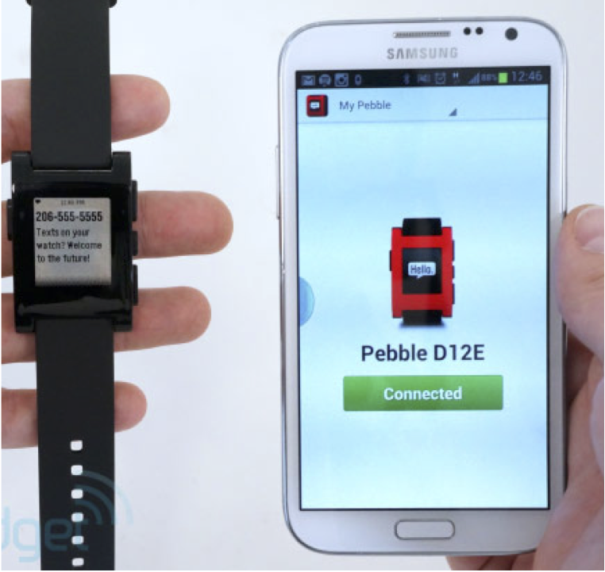
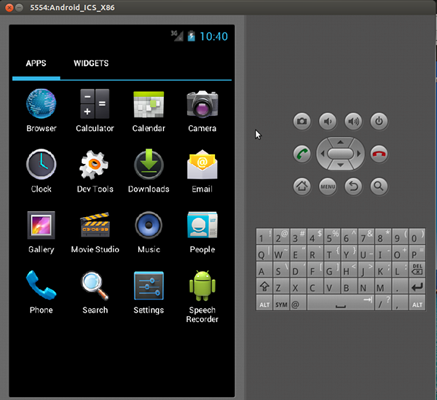
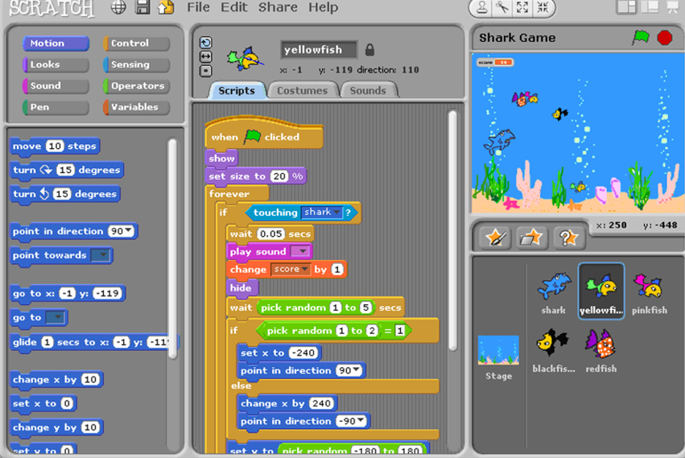
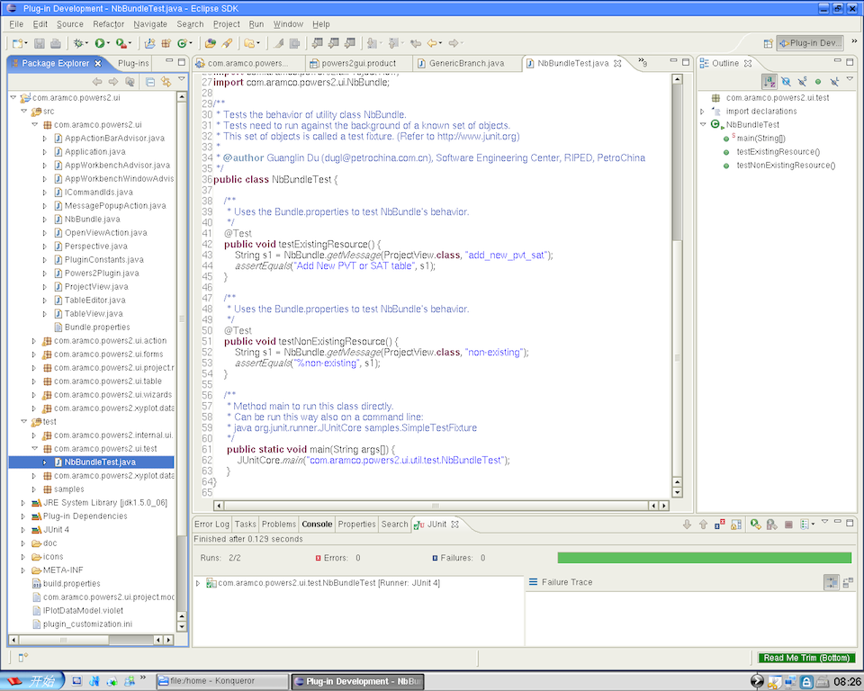
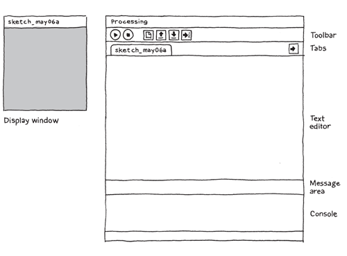
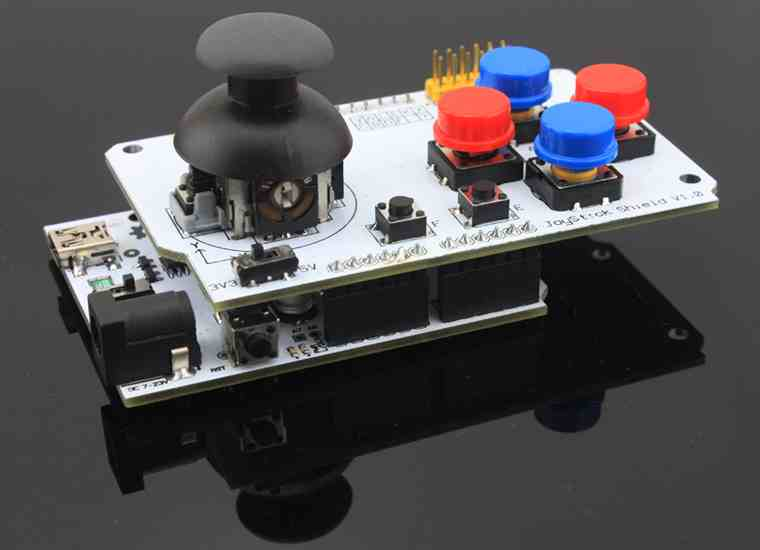
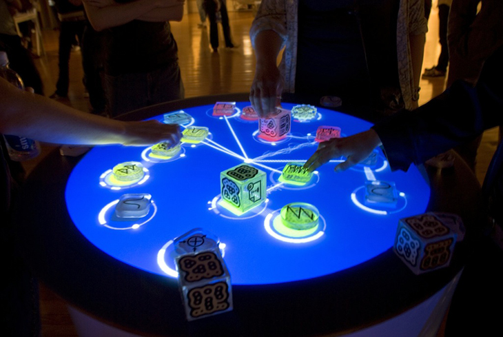

# Τεχνικές

> Μπορώ να κατανοήσω μόνο αυτό που μπορώ να φτιάξω. Ρίτσαρντ Φευνμαν

## Περίληψη

Αυτό το κεφάλαιο περιγράφει τα βασικά δομικά στοιχεία και τις τεχνικές
του προγραμματισμού της διάδρασης, επομένως απευθύνεται σε όσους έχουν
λίγες γνώσεις στις επιμέρους περιοχές ή στον συνδυασμό τους. Παρέχει
συνοπτικά τις βασικές γνώσεις τόσο για τη γενική πλευρά του
προγραμματισμού όσο και για την ειδική περίπτωση της διάδρασης. Ο
αναγνώστης θα μάθει τα θεμελιώδη που απαιτούνται για τον προγραμματισμό
της διάδρασης. Επίσης, θα διαβάσει για τις τεχνικές και τις διαδικασίες
που χρησιμοποιούνται για την κατασκευή μιας διεπαφής με τον χρήστη.
Συνοπτικά, το κεφάλαιο αυτό προσφέρει τις βασικές γνώσεις από τις
περιοχές του προγραμματισμού συστημάτων με έμφαση στον ανθρωποκεντρικό
σχεδιασμό.

Η διαδικασία υλοποίησης ενός συστήματος διάδρασης ανθρώπου και
υπολογιστή μπορεί να διευκολυνθεί, αν ο προγραμματιστής έχει στη διάθεσή
του επιμέρους εργαλεία και τεχνικές που βοηθούν στην κατασκευή των
πρωτοτύπων και κυρίως στην κατασκευή του τελικού συστήματος διάδρασης.
Τα συστήματα υποστήριξης της κατασκευής διάδρασης είναι σχετικά απλά
στην περίπτωση του παραδοσιακού επιτραπέζιου συστήματος, γιατί το
λεξιλόγιο της διάδρασης (π.χ., παράθυρο, μενού, φόρμα, παλέτα, έγγραφο,
κτλ.) είναι σχετικά περιορισμένο. Η σχεδίαση του υλικού/λογισμικού για
τον διάχυτο ΗΥ έχει αυξήσει (και ουσιαστικά έχει αλλάξει) τις
παραμέτρους της διάδρασης, τόσο που τα περισσότερα εργαλεία να είναι
ακατάλληλα, αφού δεν μπορούν να δώσουν μια πλήρη εικόνα της εκτέλεσης
στην τελική συσκευή του χρήστη. Από την άλλη πλευρά, οι γενικές τεχνικές
προδιαγραφών διατηρούν την αξιοπιστία τους, όπως το μοντέλο
ελεγκτής-όψη, οι δηλωτικές γλώσσες προδιαγραφών, και τα διαγράμματα ροής
και κατάστασης.

Τα περισσότερα βιβλία προγραμματισμού διαλέγουν από την αρχή κάποια από
τα τρέχοντα διαθέσιμα εργαλεία με έμφαση συνήθως στη γλώσσα
προγραμματισμού (π.χ., Java), το λειτουργικό σύστημα (π.χ., Windows),
και το περιβάλλον ανάπτυξης (π.χ., Eclipse), και από εκεί και πέρα
περιγράφουν τα επιμέρους ζητήματα. Αντίθετα, σε αυτό το βιβλίο,
αντιμετωπίζουμε όλα τα εργαλεία του προγραμματισμού ως ζητούμενα τα
οποία έχουν διαφορετικές τιμές ανάλογα με τις απαιτήσεις του έργου. Για
τον σκοπό αυτό, δίνουμε μια επισκόπηση των διαθέσιμων εργαλείων και
τεχνικών ανάπτυξης με έμφαση στα κριτήρια επιλογής τους ανάλογα με τις
περιπτώσεις του προγραμματισμού της διάδρασης. Επίσης, σε αντίθεση με τα
περισσότερα βιβλία που επιλέγουν περισσότερο ή λιγότερο ρητά μια
δημοφιλή τεχνική και διαδικασία ανάπτυξης, εδώ περιγράφουμε τις
ιδιότητές τους και αξιολογούμε την καταλληλότητά τους ανάλογα με το
ζητούμενο. Για παράδειγμα, κάποια βιβλία θεωρούν δεδομένο ότι θα πρέπει
να ξεκινήσουμε τον προγραμματισμό μόνο αφού έχουμε καθορίσει με ακρίβεια
τις προδιαγραφές, ενώ υπάρχουν και περιπτώσεις χρήσης όπου ο ίδιος ο
προγραμματισμός της διάδρασης μπορεί να μας βοηθήσει να κατανοήσουμε
καλύτερα ποιες είναι οι προδιαγραφές.

## Ιστορικό και πολιτισμικό πλαίσιο

Τα εργαλεία που διευκολύνουν την ανάπτυξη υλικού και λογισμικού
διάδρασης έχουν αποδειχθεί ιδιαίτερα αποτελεσματικά σε πολλές
περιπτώσεις, αρχίζοντας από το γραφικό περιβάλλον του επιτραπέζιου
υπολογιστή. Ο κάθε κατασκευαστής λειτουργικού συστήματος, σε διαφορετικό
βαθμό, παρέχει ένα σύνολο από μοτίβα τα οποία επιτρέπουν μια ομοιόμορφη
εμφάνιση και κυρίως μια συνεπή συμπεριφορά ανάμεσα στις πολλές
διαφορετικές εφαρμογές χρήστη. Ήταν η Apple που πρώτη έδωσε στους
κατασκευαστές εφαρμογών ένα σετ από οδηγίες και μοτίβα σωστού σχεδιασμού
της διάδρασης με τον υπολογιστή Macintosh, ενώ ταυτόχρονα τα αντίστοιχα
εργαλεία ανάπτυξης του λογισμικού σέβονταν αυτές τις οδηγίες. Για
παράδειγμα, η θέση, η εμφάνιση και η λειτουργία των κουμπιών που
καθορίζουν το μέγεθος του παραθύρου έχουν προκαθορισμένες ιδιότητες ώστε
να μοιάζουν ανάμεσα στις διαφορετικές εφαρμογές του χρήστη,
δημιουργώντας μια αίσθηση οικειότητας. Ο κατασκευαστής εφαρμογών χρήστη
μπορεί πάντα να αγνοήσει τις οδηγίες και τα έτοιμα μοτίβα, αν επιθυμεί
να φτιάξει μια εφαρμογή που έχει λόγους να διαφέρει.

Πέρα από την Apple, και οι άλλοι κατασκευαστές λειτουργικών συστημάτων
με γραφικό περιβάλλον, σε μικρότερο (π.χ., Linux) ή μεγαλύτερο βαθμό
(π.χ., Windows), παρέχουν πλέον τα αντίστοιχα σετ οδηγιών, καθώς και
"προκάτ" δομικά στοιχεία κατασκευής της διάδρασης. Υπάρχουν δύο κύριοι
λόγοι για τους οποίους ένας κατασκευαστής της διάδρασης θα ήθελε να
κινηθεί έξω από την ασφάλεια που του προσφέρει το στενό και
προκαθορισμένο σύνολο οδηγιών που του παρέχει ο κατασκευαστής της
αρχικής πλατφόρμας. Ο πρώτος λόγος είναι να θέλει να φτιάξει μια
εφαρμογή που πρέπει να δείχνει και να συμπεριφέρεται διαφορετικά -
επειδή αυτό εξυπηρετεί τις ανάγκες του. Χαρακτηριστικά παραδείγματα
είναι τα skinable mp3 players καθώς και οι εφαρμογές με φίλτρα ψηφιακής
φωτογραφίας (Kai Tools). Ο δεύτερος και σημαντικότερος λόγος που κάνει
έναν κατασκευαστή να κινηθεί έξω από τους κανόνες, είναι η ανάπτυξη ενός
συστήματος που δε μοιάζει καθόλου με το σύστημα του υπολογιστή εργασίας
του, όπως για παράδειγμα η ανάπτυξη κινητών εφαρμογών σε επιτραπέζιο
υπολογιστή.

Δεν είναι τυχαίο που κάποιες από τις πρώτες προσπάθειες κατασκευής
κινητών εφαρμογών έμοιαζαν πολύ με τις αντίστοιχες επιτραπέζιες (π.χ.,
οι πρώτες εκδόσεις των Windows Mobile). Φυσικά, αυτό δε βοήθησε στην
αποδοχή αυτών των κινητών εφαρμογών στα πρώτα στάδια, μέχρι που η Apple
με το iPhone έδωσε έναν νέο ορισμό του πλαισίου μέσα στο οποίο θα πρέπει
να κινούνται οι εφαρμογές χρήστη στις κινητές συσκευές, για να είναι
χρήσιμες, εύχρηστες και αποδεκτές. Αντίστοιχα, κάθε νέα τεχνολογία που
μετατοπίζει τη διάδραση πέρα από τον επιτραπέζιο υπολογιστή,
αντιμετωπίζει τις ίδιες προκλήσεις. Στα πρώτα στάδια, οι κατασκευαστές
εφαρμογών χρήστη θα δανειστούν (λανθασμένα) πάρα πολλά στοιχεία από
συσκευές που φαίνονται παρόμοιες, αλλά στην πορεία (και μετά από
μερικούς κύκλους δοκιμής και λάθους) θα καταλήξουν σε ένα ενημερωμένο
σύνολο από οδηγίες και εργαλεία που θα τους βοηθήσουν στην παραγωγή
κατάλληλων εφαρμογών χρήστη. Συνοπτικά, όταν κατασκευάζουμε εφαρμογές
(λειτουργικού συστήματος ή χρήστη) που θα εκτελεστούν σε υπολογιστή που
διαφέρει από τον επιτραπέζιο, θα πρέπει να προσέχουμε πρώτα από όλα τις
συσκευές εισόδου και εξόδου (είναι πληκτρολόγιο και ποντίκι ή μήπως κάτι
άλλο;) και το πλαίσιο χρήσης (είναι περιβάλλον γραφείου και εργασία με
εκδόσεις ή κάτι άλλο;).

Το τελικό αποτέλεσμα, και κυρίως το πλαίσιο ορισμού στο οποίο μπορεί να
κινηθεί ένα νέο πρόγραμμα διάδρασης, εξαρτάται από τα βασικά μοτίβα
σχεδίασης που είδαμε παραπάνω. Αλλά εξαρτάται και από τα εργαλεία, την
οργάνωση και τη διαδικασία κατασκευής. Όπως ακριβώς τα βασικά
σχεδιαστικά και τεχνολογικά μοτίβα που έχει στη διάθεσή του ένας
κατασκευαστής μπορούν να δώσουν συγκεκριμένες μορφές και λειτουργίες στη
διάδραση, έτσι και η μέθοδος κατασκευής μπορεί να επιτρέψει ή να
αποτρέψει κάποιες μορφές και λειτουργίες της διάδρασης. Τα πρώτα
συστήματα προγραμματισμού της διάδρασης δεν είχαν καμία διαφορά από
εκείνα για τον προγραμματισμό του συστήματος, οπότε πολλοί δυνητικοί
κατασκευαστές της διάδρασης δεν είχαν καταφέρει να δώσουν τη συνεισφορά
τους. Μετά τη δεκαετία του 1970, οι αντικειμενοστραφείς γλώσσες
προγραμματισμού (π.χ., SmallTalk, C++, Java, JavaScript) και τα οπτικά
περιβάλλοντα ανάπτυξης (π.χ, KidSim, MIT Scratch, Processing) επέτρεψαν
σε γνώστες της περιοχής του προγραμματισμού της διάδρασης να
συμμετάσχουν. Ταυτόχρονα, η διευκόλυνση κάποιων πτυχών του
προγραμματισμού της διάδρασης, ακόμη και από τον τελικό χρήστη,
ολοκληρώνει τη διαχρονική τάση που ενθαρρύνει τη συμμετοχικότητα του
τελικού χρήστη, όχι μόνο στην απλή χρήση, αλλά και στη δημιουργία.

## Τεχνολογίες διάδρασης

### Επιτραπέζιος υπολογιστής

Για πολλά χρόνια η ανάπτυξη και εκτέλεση εφαρμογών στον επιτραπέζιο
υπολογιστή ήταν μονόδρομος, αφού οι άλλες μορφές υπολογιστή δεν ήταν
ιδιαίτερα διαδεδομένες. Πάντα υπήρχαν υπερ-υπολογιστές καθώς και
παιχνιδομηχανές, αλλά η ανάπτυξη για αυτές τις πλατφόρμες γινόταν από
ειδικευμένο προσωπικό που λάμβανε την αντίστοιχη εκπαίδευση. Η ανάπτυξη
και εκτέλεση εφαρμογών διάδρασης στον επιτραπέζιο υπολογιστή έχει πολλές
παραμέτρους που πρέπει να αξιολογήσει ο κατασκευαστής και δεν είναι
καθόλου τετριμμένη περίπτωση. Όμως, έχει ένα βασικό πλεονέκτημα σε σχέση
με την ανάπτυξη για τον κινητό και διάχυτο υπολογισμό. Η βασική διαφορά
στην ανάπτυξη λογισμικού διάδρασης ανάμεσα σε επιτραπέζιο και κινητό ή
διάχυτο υπολογισμό είναι το γεγονός ότι το πρόγραμμα εκτελείται στην
πρώτη περίπτωση πάνω στον ίδιο τον υπολογιστή ανάπτυξης, ενώ στη δεύτερη
περίπτωση το πρόγραμμα εκτελείται πάνω σε διαφορετικό υλικό.

Όταν το πρόγραμμα που κατασκευάζουμε εκτελείται τελικά πάνω σε
διαφορετικό υλικό από εκείνο του υπολογιστή ανάπτυξης, τότε η δυνατότητα
που έχουμε για εφαρμογή του ανθρωποκεντρικού κύκλου σχεδίασης μειώνεται
ανάλογα με τον βαθμό και το είδος της διάδρασης. Αν, για παράδειγμα,
κατασκευάζουμε ένα πρόγραμμα για έξυπνο κινητό που έχει πληκτρολόγιο και
δεν έχει οθόνη αφής, τότε μπορούμε σχετικά εύκολα να κάνουμε τις
επαναληπτικές δοκιμές της διάδρασης πάνω στον επιτραπέζιο υπολογιστή, ο
οποίος έχει πληκτρολόγιο που ναι μεν διαφέρει από το μικρό πληκτρολόγιο
του κινητού, όμως δεν είναι δραματικά διαφορετικό. Στην περίπτωση, όμως,
που το έξυπνο κινητό έχει μόνο πολυαπτική οθόνη αφής, τότε η δοκιμή της
διάδρασης στον επιτραπέζιο υπολογιστή γίνεται πιο δύσκολη -αφού συνήθως
δε συνοδεύεται από τέτοια συσκευή εισόδου. Η δοκιμή της διάδρασης
γίνεται ακόμη δυσκολότερη όταν η διάδραση βασίζεται σε αισθητήρες
εισόδου, όπως ο εντοπισμός θέσης ή το γυροσκόπιο, αφού αυτά δεν υπάρχουν
στον επιτραπέζιο υπολογιστή και απαιτείται πλέον η σύνδεσή του με την
τελική συσκευή για την πραγματοποίηση των επαναληπτικών δοκιμών κατά το
στάδιο της ανάπτυξης.

### Κινητός, φορετός και διάχυτος υπολογισμός

Όπως είδαμε παραπάνω, το βασικό μειονέκτημα της κατασκευής στην
περίπτωση του κινητού και διάχυτου υπολογισμού είναι ότι τα περισσότερα
εργαλεία ανάπτυξης είναι διαθέσιμα κυρίως για τον επιτραπέζιο
υπολογιστή, που μπορεί να διαφέρει -από λίγο έως πάρα πολύ- από την
τελική πλατφόρμα, αναφορικά με τις συσκευές εισόδου και εξόδου. Για
παράδειγμα, ένας επιτραπέζιος υπολογιστής έχει είσοδο κυρίως από το
πληκτρολόγιο και το ποντίκι, ενώ ένα έξυπνο κινητό έχει κυρίως είσοδο
από μια πολυαπτική οθόνη. Το αποτέλεσμα είναι ότι, εκτός από κάποιες
απλές επιλογές αντικειμένων πάνω στην οθόνη, πολλές από τις πιθανές
διαδράσεις που είναι χρήσιμες στο έξυπνο κινητό δεν είναι διαθέσιμες για
δοκιμή στην πλατφόρμα ανάπτυξης, όταν αυτή είναι ο επιτραπέζιος
υπολογιστής. Από αυτήν την άποψη θα μπορούσαμε να φανταστούμε ότι τα
μελλοντικά εργαλεία ανάπτυξης για κινητό υπολογισμό θα εκτελούνται
απευθείας πάνω στο κινητό. Αυτό φυσικά υπαγορεύει ένα πολύ διαφορετικό
μοντέλο ανάπτυξης αναφορικά με τα εργαλεία και τις διαδικασίες
κατασκευής του προγράμματος διάδρασης.

## Εργαλεία

Η κατασκευή προγραμμάτων διάδρασης διευκολύνεται από εργαλεία και
τεχνικές, τα οποία είναι τόσο διαφορετικά, όσο και το εύρος των συσκευών
εισόδου, εξόδου, και υπολογισμού. Επιπλέον, τα εργαλεία και οι
διαδικασίες κατασκευής εξαρτώνται από τις προτιμήσεις του κατασκευαστή,
οι οποίες μπορεί να γίνουν αρκετά πολύπλοκες στην περίπτωση μεγάλων
οργανισμών και ομάδων ανάπτυξης, επομένως τότε αναφερόμαστε στην
κουλτούρα ανάπτυξης του κάθε κατασκευαστή.

Μετά τον καθορισμό του στόχου και των αναγκών του χρήστη, το επόμενο
βήμα είναι η επιλογή των εργαλείων ανάπτυξης, καθώς και ο καθορισμός του
πλάνου ανάπτυξης που θα διευκολύνει τη σωστή παράδοση του προγράμματος
της διάδρασης. Το πλάνο ανάπτυξης περιλαμβάνει ένα σύνολο από παραδοτέα
της μορφής αναφορά/πρωτότυπο, ενώ η σωστή οργάνωση της ομάδας ανάπτυξης
περιλαμβάνει ρόλους όπως προγραμματιστής, δοκιμαστής,
αναλυτής-σχεδιαστής. Σε ένα πραγματικό έργο ανάπτυξης λογισμικού, αν ο
οργανισμός χρησιμοποιήσει περισσότερους ανθρώπινους πόρους από όσους
χρειάζεται θα πέσει έξω οικονομικά, αφού το να δουλεύει το έργο δεν
είναι ο μοναδικός στόχος ενός οργανισμού. Θα πρέπει το έργο να έχει
παραχθεί και με μικρό κόστος, ώστε να είναι ανταγωνιστικό. Υπό αυτήν τη
σκοπιά, θα πρέπει να γίνει μια συζήτηση για τη σκοπιμότητα επιλογής
εργαλείων ανάπτυξης που να βασίζεται στις δεξιότητες των
προγραμματιστών, αλλά και στους στόχους του έργου.

### Επεξεργαστής κειμένου

Το πιο σημαντικό, διαχρονικά, εργαλείο στην ανάπτυξη νέων συστημάτων
είναι ο επεξεργαστής κειμένου. Η σημασία του κειμένου οφείλεται στο
γεγονός ότι πολλές γλώσσες προγραμματισμού είναι γραπτές. Αν και η
επεξεργασία κειμένου είναι μια σχετικά απλή δραστηριότητα, υπάρχουν πάρα
πολλά είδη επεξεργαστή κειμένου, γιατί οι προτιμήσεις των
προγραμματιστών και οι απαιτήσεις των έργων ανάπτυξης έχουν μεγάλη
ποικιλία. Για παράδειγμα, μπορούμε να χρησιμοποιήσουμε από έναν
επεξεργαστή κειμένου γενικής χρήσης, που συνήθως είναι ελεύθερα
διαθέσιμος με το λειτουργικό σύστημα του υπολογιστή, μέχρι έναν
εξειδικευμένο επεξεργαστή κειμένου που είναι μέρος ενός εξειδικευμένου
συνόλου εργαλείων ανάπτυξης για μια συγκεκριμένη πλατφόρμα υπολογιστή.
Ανάμεσα σε αυτά τα δύο άκρα υπάρχει ένα πολύ μεγάλο φάσμα από είδη
επεξεργαστών κειμένου, τα οποία διευκολύνουν τη συγγραφή, την ανάγνωση
και τις αλλαγές στον κώδικα, καθώς και τις συνήθειες του προγραμματιστή.
Όπως θα δούμε παρακάτω, η σχετική σημασία του επεξεργαστή κειμένου
μειώνεται στις περιπτώσεις που έχουμε μια μετατόπιση προς οπτικές
γλώσσες προγραμματισμού και προς ολοκληρωμένα περιβάλλοντα ανάπτυξης.

### Μετατροπή σε εκτελέσιμο και αποσφαλμάτωση

Μετά τη συγγραφή του πηγαίου κώδικα, το επόμενο βασικό εργαλείο που
απαιτείται για τον προγραμματισμό είναι η δυνατότητα της μετάφρασης ή
της μεταγλώττισης σε εκτελέσιμο κώδικα της τελικής πλατφόρμας. Στο
πλαίσιο του προγραμματισμού και ειδικά των λειτουργικών συστημάτων αυτό
είναι μια μεγάλη ενότητα, αλλά στο πλαίσιο του προγραμματισμού της
διάδρασης η προτεραιότητα είναι στη γρήγορη δημιουργία εναλλακτικών
προγραμμάτων και κυρίως στις επαναληπτικές αλλαγές. Για τον σκοπό αυτό,
αν υπάρχει μια παράμετρος της κατασκευής κατά τον προγραμματισμό της
διάδρασης που έχει μεγάλη σημασία, αυτή είναι η ταχύτητα με την οποία
μπορεί ο κατασκευαστής να εναλλάσσει την ανάπτυξη με τη δοκιμή. Όσο πιο
γρήγορα μπορεί ο κατασκευαστής να περνάει από το στάδιο της σχεδίασης
της διάδρασης στο στάδιο της δοκιμής της διάδρασης -στο πλαίσιο δοκιμών
είτε με ειδικούς είτε με τελικούς χρήστες- τόσο πιο γρήγορα το πρόγραμμα
της διάδρασης θα αποκτήσει την επιθυμητή ποιότητα.

### Πλαίσιο και βιβλιοθήκες προγραμματισμού

Καθώς τα προγράμματα διάδρασης γίνονται περισσότερο σύνθετα και
πολύπλοκα, η σημασία των παραπάνω βασικών εργαλείων και διαδικασιών
(π.χ., επεξεργαστής κειμένου, μετατροπή σε εκτελέσιμο) γίνονται λιγότερα
σημαντικά από την πλευρά του προγραμματιστή της διάδρασης, αφού
προτεραιότητα έχει η επιλογή του κατάλληλου πλαισίου προγραμματισμού
ανάλογα με τις ανάγκες. Για παράδειγμα, ο προγραμματισμός της διάδρασης
για μια εφαρμογή που θα εκτελείται στο διαδίκτυο επιβάλλει τη χρήση των
τεχνολογιών του ιστού και ειδικά εκείνων που διευκολύνουν τη δημιουργία
της διάδρασης στο τερματικό του χρήστη. Στην περίπτωση που είναι
αναγκαίο η δικτυακή εφαρμογή να εκτελείται σε τερματικές συσκευές
διαφορετικού μεγέθους, επιβάλλεται η χρήση των αντίστοιχων τεχνολογικών
αρχετύπων που διευκολύνουν την κλιμάκωση της εφαρμογής σε συσκευές
χρήστη με διαφορετικές δυνατότητες (π.χ., επιτραπέζιος, φορητός,
κινητός, τάμπλετ, κτλ.). Ταυτοχρόνως, αν η δικτυακή φύση της εφαρμογής
απαιτεί και τη διατήρηση της κατάστασης, τότε επιβάλλεται και η χρήση
των τεχνολογιών του εξυπηρετητή σε απομακρυσμένο υπολογιστή.

Εξίσου πολύπλοκο τεχνολογικό πλαίσιο μπορεί να έχουμε και για την
ανάπτυξη μιας εφαρμογής επιτραπέζιου υπολογιστή όταν υπάρχει η απαίτηση
η είσοδος να γίνεται από συσκευή χειρονομίας και η έξοδος να γίνεται σε
περιβάλλον εικονικής πραγματικότητας. Γίνεται, λοιπόν, κατανοητό ότι σε
ένα τόσο διευρυμένο τεχνολογικό πλαίσιο, αναφορικά με τις συσκευές
εισόδου και εξόδου με τον χρήστη, ο προγραμματισμός της διάδρασης έχει
περισσότερο να κάνει με τη δοκιμή και την επιλογή των κατάλληλων για την
περίσταση εργαλείων (π.χ., βιβλιοθήκη προγραμματισμού), παρά με τις
λεπτομέρειες της υλοποίησης, οι οποίες μπορεί να είναι τόσο διαφορετικές
όσο και οι διαφορετικές πλατφόρμες ανάπτυξης (π.χ., επιτραπέζιος ΗΥ,
απομακρυσμένος εξυπηρετητής) και εκτέλεσης (π.χ., έξυπνο κινητό, έξυπνο
ρολόι). Φυσικά, υπάρχουν κάποιες σταθερές αξίες που ισχύουν ανεξάρτητα
από το τεχνολογικό πλαίσιο και τις λεπτομέρειες της κάθε βιβλιοθήκης
προγραμματισμού, όπως είναι ο συνεχής έλεγχος που είδαμε στην
προηγούμενη ενότητα, καθώς και ο έλεγχος σε ένα περιβάλλον που θα
μοιάζει με αυτό της τελικής πλατφόρμας εκτέλεσης, τον οποίο θα δούμε
στην επόμενη ενότητα.

### Προσομοιωτές και εξομοιωτές

Όταν η τελική εφαρμογή έχει ως πλατφόρμα εκτέλεσης την ίδια την
πλατφόρμα ανάπτυξης (π.χ., ανάπτυξη εφαρμογής για την επιφάνεια εργασίας
σε επιτραπέζιο υπολογιστή), τότε η μετατροπή του πηγαίου κώδικα σε
εκτελέσιμο κώδικα μπορεί να δοκιμαστεί άμεσα από τον προγραμματιστή πάνω
στον ίδιο υπολογιστή. Στην περίπτωση όμως που η τελική πλατφόρμα
εκτέλεσης είναι διαφορετική από την πλατφόρμα ανάπτυξης μιας εφαρμογής,
τότε η δουλειά του προγραμματιστή διευκολύνεται από έναν προσομοιωτή.
Στην περίπτωση που η εφαρμογή δεν έχει διεπαφή με τον χρήστη, τότε ο
προσομοιωτής είναι απλά αναγκαίος για τη δοκιμή και αποσφαλμάτωση του
πηγαίου κώδικα. Όμως, στην πιο ενδιαφέρουσα περίπτωση που η τελική
εφαρμογή περιλαμβάνει και την ανάγκη για διάδραση με τον χρήστη, τότε
έχουμε την απαίτηση ο προσομοιωτής να είναι κάτι παραπάνω από ένα μαύρο
κουτί. Αν και στην απλή εκτέλεση κώδικα υψηλού επιπέδου (π.χ., Java) για
διαφορετική τελική συσκευή είναι δόκιμο να χρησιμοποιήσουμε την έννοια
του εξομοιωτή (emulator), αυτό σίγουρα δεν είναι σκόπιμο για την
περίπτωση του προγραμματισμού της διάδρασης, όπου η χρήση του
προσομοιωτή (simulator) είναι περισσότερο εύστοχη.

Ένας προσομοιωτής για τη δοκιμή εφαρμογών με διάδραση χρήστη που
εκτελούνται σε διαφορετική πλατφόρμα ανάπτυξης θα πρέπει να περιλαμβάνει
και την αντίστοιχη διεπαφή ή τουλάχιστον κάποια προσομοίωση αυτής. Για
παράδειγμα, ο προσομοιωτής για τα έξυπνα κινητά τηλέφωνα περιλαμβάνει
οθόνη, τα αντίστοιχα εικονικά κουμπιά και την προσομοίωση για κάποιες
χειρονομίες. Η οθόνη του προσομοιωτή δεν είναι ίδια με αυτήν της τελικής
συσκευής, αφού η οθόνη του υπολογιστή ανάπτυξης τις περισσότερες φορές
έχει διαφορετικές προδιαγραφές, αλλά σίγουρα είναι πολύ κοντά. Από την
άλλη πλευρά, οι συσκευές εισόδου σε ένα έξυπνο κινητό (π.χ., κουμπιά
πάνω στη συσκευή, αισθητήρες κίνησης και θέσης, πολυαπτική οθόνη, κτλ.)
είναι πολύ διαφορετικές από το πληκτρολόγιο και το ποντίκι του
επιτραπέζιου υπολογιστή ανάπτυξης, με αποτέλεσμα ο βαθμός προσομοίωσης
της διάδρασης να είναι μικρός.

Συμπερασματικά, ο προσομοιωτής είναι ένα αναγκαίο κακό που διευκολύνει
μεν τις δοκιμές κατά τα πρώτα στάδια της ανάπτυξης, αλλά δεν μπορεί να
αντικαταστήσει τις δοκιμές στην τελική συσκευή, επειδή η διάδραση με τον
χρήστη δεν μπορεί να προσομοιωθεί εν γένει. Μάλιστα, όσο πιο πολύ
διαφέρει η διάδραση με τον προσομοιωτή από εκείνη με την τελική συσκευή,
τόσο πιο αναγκαίο είναι ένα μεγάλο μέρος της ανάπτυξης να γίνει στην
τελική συσκευή.

### Οπτικός προγραμματισμός

Ο οπτικός προγραμματισμός έχει γνωρίσει μεγάλη αποδοχή στις περιπτώσεις
της εκμάθησης προγραμματισμού, στον αντικειμενοστραφή προγραμματισμό,
και ειδικά στον σχεδιασμό της διεπαφής με χρήστη. Αρχικά, ο οπτικός
προγραμματισμός επιτρέπει την οπτική οργάνωση και επισκόπηση στην
περίπτωση που έχουμε πηγαίο κώδικα μεγάλης κλίμακας. Σε αυτήν την
περίπτωση, ο οπτικός προγραμματισμός λειτουργεί ως ένα επίπεδο αφαίρεσης
των λεπτομερειών της υλοποίησης, έτσι ώστε ο κατασκευαστής να μπορεί να
εστιάσει αρχικά στον συνδυασμό των επιμέρους αντικειμένων και στη
συνολική αρχιτεκτονική της διάδρασης. Με αυτόν τον τρόπο, ο
αντικειμενοστραφής προγραμματισμός μπορεί να διευκολυνθεί από ένα οπτικό
περιβάλλον προγραμματισμού.

Στην περίπτωση του σχεδιασμού της διεπαφής με τον υπολογιστή, ο οπτικός
προγραμματισμός επιτρέπει στον κατασκευαστή να χρησιμοποιήσει έτοιμα
μοτίβα ή να φτιάξει τα δικά του. Για παράδειγμα, η Visual Basic ήταν μια
πολύ διαδεδομένη γλώσσα προγραμματισμού για το λειτουργικό σύστημα
Microsoft Windows, γιατί παρείχε ένα οπτικό περιβάλλον σχεδιασμού της
διεπαφής. Ο προγραμματιστής μπορούσε να διαλέξει οπτικά τα εικονίδια, τα
μενού και τις φόρμες που ήθελε να συμπεριλάβει στην εφαρμογή του και
έπειτα να τα συνδυάσει με τις ενέργειες και τις λειτουργίες του
προγράμματος. Με αυτόν τον τρόπο δημιουργείται ένας διαχωρισμός ανάμεσα
στη διεπαφή και την υλοποίηση των λειτουργιών, που διευκολύνει και τον
καταμερισμό της εργασίας ανάμεσα στους προγραμματιστές των λειτουργιών
και σε εκείνους της διεπαφής.

Από την άλλη πλευρά, ο οπτικός προγραμματισμός μπορεί να λειτουργεί και
ως μια μεταφορά για τις σχετικά λιγότερο ελκυστικές, βασικές έννοιες,
όπως είναι ο έλεγχος ροής και η επανάληψη. Όπως ακριβώς στο παρελθόν
αρχικά η γλώσσα Assembly επέτρεψε σε περισσότερους να προγραμματίσουν σε
μια γλώσσα που έμοιαζε έστω και λίγο με τη φυσική γλώσσα, και έπειτα οι
γλώσσες υψηλού επιπέδου (π.χ., Cobol, C, Pascal, κτλ.) έφυγαν από τις
λεπτομέρειες της αρχιτεκτονικής του υλικού του κάθε υπολογιστή που
επέβαλε η Assembly, έτσι και ο οπτικός προγραμματισμός έδωσε τη
δυνατότητα σε ακόμη περισσότερους να μιλήσουν μια γλώσσα κατανοητή μεν
από τον υπολογιστή, αλλά και πλησιέστερη στην ανθρώπινη λογική. Ο
οπτικός προγραμματισμός έδωσε τη δυνατότητα ακόμη και στις μικρές
ηλικίες να δημιουργήσουν παιχνίδια με εργαλεία όπως το MIT Scratch.

Ο οπτικός προγραμματισμός είναι μια αναγκαία προϋπόθεση για τον γρήγορο
και εύκολο προγραμματισμό της διάδρασης, αλλά δεν είναι και ικανή
συνθήκη της κατασκευής ενός πετυχημένου συστήματος διάδρασης. Υπάρχει η
ανάγκη να βλέπουμε ταυτόχρονα με την κατασκευή και τη συμπεριφορά του
προγράμματος (και όχι μόνο τη στατική του κατάσταση όπως μας την
παρουσιάζει ο πηγαίος κώδικας). Σε αναλογία με τον μαθηματικό συμβολισμό
για την κίνηση του απλού εκκρεμούς, ο πηγαίος κώδικας είναι μεν πολύ
ευέλικτος, αλλά δεν επιτρέπει την άμεση κατανόηση κατά τις διάφορες
φάσεις της εκτέλεσης του προγράμματος. Η γρήγορη δοκιμή και η
επαναληπτική βελτίωση του προγράμματος διάδρασης διευκολύνεται από
εκείνα τα περιβάλλοντα ανάπτυξης που ενθαρρύνουν την προσομοίωση της
εκτέλεσης του προγράμματος και τον διαδραστικό έλεγχο της συμπεριφοράς
του.

### Ολοκληρωμένο περιβάλλον

Είναι τόσα πολλά τα πιθανά επιμέρους εργαλεία που έχει ανάγκη ένας
προγραμματιστής, που δημιουργήθηκε μια νέα κατηγορία υπερ-εργαλείου, το
ολοκληρωμένο περιβάλλον ανάπτυξης, το οποίο περιλαμβάνει όλα τα παραπάνω
μέσα στην ίδια εφαρμογή.

Το ολοκληρωμένο περιβάλλον ανάπτυξης αποτελείται από μια οργάνωση
εργαλείων με εύκολη πρόσβαση σε δομές και τεχνικές που βοηθούν στην
παραγωγή του τελικού προϊόντος. Ανάλογα με την εμπειρία και τις
προτιμήσεις του κατασκευαστή, το περιβάλλον ανάπτυξης μπορεί να έχει
πάρα πολλές μορφές και επίπεδα λειτουργίας. Για παράδειγμα, οι αρχάριοι
χρήστες συνήθως διευκολύνονται από οπτικά περιβάλλοντα ανάπτυξης
λογισμικού τα όποια δεν δίνουν άμεση πρόσβαση στον τελικό πηγαίο κώδικα,
αλλά δίνουν πολύ εύκολη πρόσβαση σε βασικά μοτίβα χρήσης. Από την άλλη
πλευρά, οι έμπειροι κατασκευαστές που θέλουν να φτιάξουν κάτι εντελώς
καινούριο, όχι μόνο χρησιμοποιούν πολύ απλά και ευέλικτα εργαλεία (π.χ.,
έναν απλό επεξεργαστή κειμένου), αλλά ξοδεύουν και αρκετό χρόνο
φτιάχνοντας δικά τους εργαλεία και τεχνικές. Ανάμεσα σε αυτές τις δύο
ακραίες περιπτώσεις, υπάρχουν πάρα πολλά εργαλεία και τεχνικές τις
οποίες μπορεί να χρησιμοποιήσει κάποιος, ανάλογα με τις ικανότητες και
τον σκοπό του.

Ιδιαίτερη αναφορά αξίζει να γίνει στο ολοκληρωμένο περιβάλλον του
Processing.org, το οποίο έχει φτιαχτεί σκόπιμα έτσι ώστε να μοιάζει
περισσότερο με εφαρμογή εκτέλεσης πολυμεσικών αρχείων παρά με ένα
προγραμματιστικό περιβάλλον. Σε αντίθεση με τα δημοφιλή ολοκληρωμένα
περιβάλλοντα, η εμφάνιση του Processing είναι τουλάχιστον "σπαρτιάτικη",
πράγμα που έχει γίνει για να διευκολύνει τον νέο προγραμματιστή. Ίσως
περισσότερο αντισυμβατική και από την εμφάνιση είναι η ορολογία σε αυτό
το περιβάλλον, αφού σκόπιμα αναφέρεται στον πηγαίο κώδικα ως "διάγραμμα"
(sketch). Η πρόθεση των σχεδιαστών είναι να παροτρύνουν τον
προγραμματιστή σε αυτό το περιβάλλον να πειραματιστεί και να βελτιώσει
την ιδέα του κάνοντας δοκιμή και λάθος. Σε αντίθεση λοιπόν με την
παραδοσιακή συμβουλή της αρχικής αναλυτικής σχεδίασης ενός προγράμματος
πριν την υλοποίησή του, το περιβάλλον αυτό προτρέπει στον αυτοσχεδιασμό.

### Γλώσσα προγραμματισμού

Τελευταία σε αυτήν την ενότητα αφήσαμε τη γλώσσα προγραμματισμού,
επειδή, τουλάχιστον στην περίπτωση του προγραμματισμού της διάδρασης,
έχει τη λιγότερη σημασία σε σχέση με τις παραμέτρους που εξετάσαμε
παραπάνω. Τα περισσότερα βιβλία για τον προγραμματισμό ασχολούνται
αποκλειστικά με μία γλώσσα προγραμματισμού. Αυτό είναι σωστό μόνο στην
περίπτωση που κάποιος θέλει να μάθει μια γλώσσα προγραμματισμού, και
λάθος όταν κάποιος θέλει να μάθει τη λογική πίσω από τον προγραμματισμό
υπολογιστών -πράγμα πιο σημαντικό από τις συντακτικές λεπτομέρειες της
κάθε γλώσσας. Η γλώσσα προγραμματισμού είναι σίγουρα μια σπουδαία
παράμετρος, τόσο στην εκμάθηση προγραμματισμού όσο και στον
προγραμματισμό της διάδρασης, αλλά δεν είναι η μόνη παράμετρος, ούτε η
σημαντικότερη. Ειδικά για τη συγγραφή κώδικα κατά τον προγραμματισμό της
διάδρασης, ισχύει ότι η κατάλληλη γλώσσα είναι εκείνη που διευκολύνει τη
γρήγορη δημιουργία και επαναληπτική αλλαγή για πολλά εναλλακτικά
πρωτότυπα υψηλής πιστότητας.

### Έτοιμα παραδείγματα και διαμοιρασμός

Σε πολλά από τα παλιά βιβλία προγραμματισμού και σχεδίασης λογισμικού
υπάρχει η εξειδανικευμένη εικόνα ότι η σχεδίαση ξεκινάει από μια λευκή
σελίδα. Στην πράξη αυτό είναι πολύ σπάνιο, μάλιστα στις περισσότερες
περιπτώσεις όπου η σχεδίαση ενός προγράμματος ξεκινάει από μια λευκή
σελίδα, συνήθως οδηγείται προς μια σχετικά ελλιπή εκδοχή ενός
προγράμματος που ήδη υπάρχει κάπου αλλού σε πολύ πιο βελτιωμένη μορφή.
Φυσικά υπάρχουν και οι εξαιρέσεις, όπου θα πρέπει να δημιουργηθεί μια
πραγματικά πρωτότυπη εφαρμογή στον υπολογιστή, αλλά στις περισσότερες
περιπτώσεις αυτό που βλέπουμε είναι παραλλαγές, ή ακόμη καλύτερα,
δημιουργικές συνθέσεις πάνω σε βασικά αρχέτυπα που ήδη υπάρχουν και τα
οποία αναφέρονται σε κάποιες ανθρώπινες ανάγκες και συνήθειες.

Στο πλαίσιο του διαμοιρασμού εργαλείων και τεχνικών, έχει δημιουργηθεί
μια ευρεία κίνηση από χομπίστες και ερευνητές οι οποίοι συνεργάζονται,
είτε σε ειδικές συναντήσεις είτε με τη βοήθεια του δικτύου για τη
σχεδίαση και κατασκευή νέων εργαλείων που διευκολύνουν τη δουλειά τους ή
απλώς για διασκέδαση, χωρίς να έχουν εξωτερικά κίνητρα. Η κίνηση του
Do-It-Yourself σίγουρα δεν είναι νέα, και δεν αφορά μόνο το υλικό και
λογισμικό, αλλά πλέον αναπτύσσεται και σε αυτόν τον τομέα πολύ γρήγορα,
και προσφέρει ιδέες που δεν θα βρούμε στο εμπόριο.

## Ιδιοκτησία και συστήματα διάδρασης

Η ιδιοκτησία ενός συστήματος διάδρασης είναι ένα πολύπλοκο φαινόμενο,
γιατί ένα σύστημα διάδρασης είναι συνήθως μια σύνθεση από υλικό και
λογισμικό που απευθύνεται σε έναν άνθρωπο, στον χρήστη του. Από τη μια
πλευρά, το υλικό και το λογισμικό καλύπτονται από διαφορετική νομοθεσία
για την ιδιοκτησία, με το υλικό να καλύπτεται από δίπλωμα ευρεσιτεχνίας
(πατέντα, αγγλ. patent) ενώ το λογισμικό να θεωρείται κείμενο και να
καλύπτεται από την πνευματική ιδιοκτησία (copyright). Από την άλλη
πλευρά, η ανθρωποκεντρική διαδικασία ανάπτυξης ενός συστήματος διάδρασης
άπτεται της νομοθεσίας για την εργονομία, που αφορά κυρίως τις πατέντες.
Οι παραδοσιακές επιχειρήσεις στον χώρο του λογισμικού είναι
υπερπροστατευτικές με την πνευματική ιδιοκτησία τους και περιχαρακώνουν
την περιοχή που τους ανήκει. Αντιθέτως, οι επιχειρήσεις που βασίζονται
στις τεχνολογίες του υπολογισμού και του δικτύου προσπαθούν να είναι όσο
γίνεται περισσότερο ανοικτού κώδικα και ταυτόχρονα να δημιουργούν
συνέργειες με άλλες επιχειρήσεις.

Στην πράξη, το νομικό πλαίσιο είναι τόσο ασαφές και πολύπλοκο εξαιτίας
της φύσης των συστημάτων διάδρασης, που οι εταιρείες οχυρώνονται με όσες
περισσότερες πατέντες μπορούν να αγοράσουν ή να κατοχυρώσουν· κάνουν
εκατέρωθεν μηνύσεις, και τελικά συμβιβάζονται εξωδικαστικά. Για
παράδειγμα, εταιρείες όπως η Microsoft ή η Apple, οι οποίες αναπτύχθηκαν
πολύ πριν τη διάχυση της δικτυακής κουλτούρας, βασίζουν τη δραστηριότητά
τους σε σχετικά κλειστά συστήματα, τα οποία προστατεύουν με πολλούς
τρόπους. Ένας τρόπος με τον οποίο προσπάθησαν οι εταιρείες του χώρου να
προστατέψουν το λογισμικό τους -ειδικά το τμήμα της διεπαφής- είναι οι
πατέντες. Η Apple είχε κάνει μήνυση στη Microsoft για την ομοιότητα που
παρουσίαζε η διεπαφή των πρώτων εκδόσεων των Windows με το αντίστοιχο
λειτουργικό σύστημα του Macintosh. Πιο πρόσφατα, η Amazon προσπάθησε να
κερδίσει πατέντα για τη δυνατότητα που έδινε στους αγοραστές να ψωνίζουν
με ένα μόνο κλικ (*one-click buying*) του ποντικιού ένα προϊόν από το
δικτυακό μαγαζί της.

Πολλοί επικριτές τους έχουν παρομοιάσει τις παραπάνω πατέντες με την
προσπάθεια να κερδίσει μια εταιρεία πατέντα για ένα εργαλείο όπως το
σφυρί: δεν υπάρχουν πολλοί τρόποι που να μπορεί ο άνθρωπος να κρατήσει
και να χρησιμοποιήσει ένα σφυρί, και αν κάποιος κατοχυρώσει αυτήν την
πατέντα αποκτά ένα ανταγωνιστικό πλεονέκτημα που τελικά δεν θα βοηθήσει
την κοινωνία συνολικά. Ενώ, λοιπόν, είναι αποδεκτό ότι η αποτελεσματική
προστασία της πνευματικής ιδιοκτησίας είναι σημαντικό κίνητρο για τους
δημιουργούς, ταυτόχρονα έχει γίνει κατανοητό ότι υπάρχει μια πολύ λεπτή
διαχωριστική γραμμή ανάμεσα στην καινοτομία που πρέπει να προστατευτεί
και στο προφανές που πρέπει να είναι διαθέσιμο σε όλους. Δυστυχώς, αυτή
η λεπτή διαχωριστική γραμμή δεν είναι ευδιάκριτη, ενώ με τη συνεχή
εξέλιξη της τεχνολογίας και των ανθρώπινων αναγκών είναι μετακινούμενη.

### Ανοικτός κώδικας και δεδομένα

Οι οργανισμοί και οι εταιρείες της οικονομίας του δικτύου εντοπίζουν και
ορίζουν την ταυτότητα και τον σκοπό τους όχι με βάση μια αγορά, αλλά με
βάση τους συνδέσμους συνεργασίας που έχουν με όλους τους παίκτες σε μια
αγορά. Για παράδειγμα, πάρα πολλά από τα δεδομένα του Google και του
Twitter είναι ελεύθερα διαθέσιμα, επειδή -αν και έτσι δίνουν πρόσβαση σε
αυτά και στους ανταγωνιστές τους- η αύξηση της χρήσης τους κάνει τις
ίδιες τις εταιρείες πιο σημαντικές. Με άλλα λόγια αυξάνει έμμεσα την
αγορά τους. Συνοπτικά, η πρώτη προσέγγιση βλέπει την αγορά σαν μια πίτα
σταθερού μεγέθους από την οποία προσπαθεί να πάρει το καλύτερο ή
μεγαλύτερο κομμάτι. Η δεύτερη προσέγγιση φαντάζεται μια πίτα που
μεγαλώνει συνέχεια. Την ενδιαφέρει να κρατήσει το κομμάτι που έχει, ενώ
δεν την πειράζει και να χάσει κάτι από αυτό, αρκεί η συνολική πίτα-αγορά
να μεγαλώνει και το δικό της κομμάτι να βρίσκεται σε ανάπτυξη. Αυτή η
μικρή φαινομενικά διαφορά αντιμετώπισης της αγοράς λογισμικού έχει πολύ
μεγάλες συνέπειες στην επιχειρηματική πρακτική και το ακριβές μείγμα της
μπορεί να υλοποιηθεί από τον τρόπο που ορίζει μια εταιρεία τη διεπαφή
του προγραμματιστή.

## Η περίπτωση του Arduino

Το Arduino είναι ένας πολύ δημοφιλής μικροελεγκτής που φτιάχτηκε με
αρχικό σκοπό τον προγραμματισμό και την εκπαίδευση των φοιτητών της
διάδρασης ανθρώπου και υπολογιστή με συστήματα εισόδου-εξόδου, πέρα από
τα κλασικά πληκτρολόγιο, ποντίκι, και οθόνη που έχουμε στους
επιτραπέζιους ΗΥ. Πριν το Arduino, οι φοιτητές και οι ερευνητές που
ήθελαν να δημιουργήσουν και να πειραματιστούν με νέα συστήματα εισόδου
και εξόδου έπρεπε πρώτα να συνδέσουν στον επιτραπέζιο υπολογιστή
κάποιους αισθητήρες και ελεγκτές μέσω ενός εξωτερικού μικροεπεξεργαστή
που μεταφράζει τα αναλογικά σήματα σε ψηφιακά και αντίστροφα. Μεγάλο
μέρος αυτής της διαδικασίας είναι όμοιο ανεξάρτητα από το είδος του
αισθητήρα που συνδέουμε, επομένως, ένα σημαντικό μέρος της προ-εργασίας
που γινόταν ήταν απλά εμπόδιο και καθυστέρηση για τον βασικό στόχο, ενώ
ταυτόχρονα απαιτούσε και ειδικές δεξιότητες στην ηλεκτρονική και στους
μικροεπεξεργαστές, που πολλοί δημιουργικοί κατασκευαστές της διάδρασης
δεν είχαν. Αυτήν την ανάγκη ήρθε να καλύψει το Arduino που δημιουργήθηκε
από τους καθηγητές της μεταπτυχιακής σχολής διάδρασης ανθρώπου και
υπολογιστή στο Ινστιτούτο Ιβρέα της Ιταλίας.

Το βασικό μοντέλο Arduino (π.χ., Uno) έρχεται με μια θύρα USB η οποία
αποτελεί το κύριο κανάλι δικτυακής επικοινωνίας με έναν επιτραπέζιο ΗΥ.
Η θύρα USB είναι πολύ χρήσιμη για να φορτώσουμε μια νέα έκδοση της
εφαρμογής μας, καθώς και για να δοκιμάσουμε μια εφαρμογή που θα πρέπει
να έχει πρόσβαση σε δεδομένα του ευρύτερου δικτύου του επιτραπέζιου ΗΥ.
Αν και αυτές οι δυνατότητες δικτυακής επικοινωνίας είναι συνήθως αρκετές
για τα περισσότερα εκπαιδευτικά και οικιακά έργα που γίνονται με
Arduino, είναι πολύ περιορισμένες για κάτι εμπορικό ή για κάτι που είναι
ανεξάρτητο από τον παραδοσιακό επιτραπέζιο ΗΥ. Για αυτόν τον σκοπό οι
σχεδιαστές του Arduino έχουν προβλέψει την τοποθέτηση επεκτάσεων με έναν
τυποποιημένο τρόπο που λέγεται shield.

Το Arduino έχει πολλές εισόδους, τόσο ψηφιακές όσο και αναλογικές, που
μπορούν να συνδεθούν με μια μεγάλη ποικιλία απλών αισθητήρων, αλλά και
με πιο πολύπλοκες κατασκευές. Ο ευκολότερος τρόπος για να δώσουμε είσοδο
στο Arduino είναι η απευθείας σύνδεση ενός αισθητήρα με τις
ψηφιακές/αναλογικές εισόδους του. Σε πιο πολύπλοκα συστήματα εισόδου ο
σχεδιαστής μπορεί να φτιάξει ένα ηλεκτρικό κύκλωμα στο συνοδευτικό
breadboard. Εκτός από τη δυνατότητα για είσοδο από εναλλακτικά
συστήματα, πέρα από το πληκτρολόγιο/ποντίκι, το Arduino σχεδιάστηκε για
να δίνει και έξοδο σε εναλλακτικά συστήματα, πέρα από την παραδοσιακή
οθόνη και τον εκτυπωτή. Φυσικά, όπως και στην περίπτωση των εισόδων, οι
χρήστες του Arduino έχουν βρει πολλές ακόμη εφαρμογές, οι περισσότερες
από τις οποίες εμπνέονται από τα συστήματα ελέγχου (π.χ., βιομηχανία,
ασφάλεια, κτλ.).

Το Arduino δεν ήταν η πρώτη προσπάθεια κατασκευής ενός μικροελεγκτή που
διασυνδέεται εύκολα με επιπλέον αισθητήρες, αφού στο παρελθόν είχαν
γίνει αντίστοιχες προσπάθειες τόσο από μεγάλα ερευνητικά έργα και
πανεπιστήμια όσο και από εταιρείες, αλλά κανένα δεν είχε την αποδοχή του
Arduino σε τόσο μικρό χρονικό διάστημα. Αν και δεν είναι εύκολο να
εντοπίσουμε όλες τις παραμέτρους που συνέβαλαν στην επιτυχία του,
σίγουρα μια από αυτές ήταν το γεγονός ότι το έργο βασιζόταν σε
τεχνολογία με ευέλικτη άδεια χρήσης, η οποία επέτρεψε σε άλλους
κατασκευαστές να φτιάξουν τις δικές του εκδοχές. Επιπλέον, η φύση του
ανοικτού κώδικα έδωσε την αυτοπεποίθηση σε πολλούς σχεδιαστές να το
επιλέξουν, αφού έτσι θα είχαν μεγαλύτερη ασφάλεια από πιθανές αλλαγές
που θα αποφάσιζε μονομερώς μια εταιρεία. Στα λίγα χρόνια της κυκλοφορίας
του, η αποδοχή και η ευελιξία του Arduino αποδείχτηκαν τόσο μεγάλες, που
δημιουργήθηκε μια αντίστοιχα μεγάλη και ενεργή κοινότητα χρηστών που
ασχολούνται με εφαρμογές πολύ πέρα από τους αρχικούς στόχους του
σχεδιασμού του.

Συνολικά, το Arduino δίνει την ελευθερία στον σχεδιαστή της διάδρασης
ανθρώπου και υπολογιστή να σκεφτεί και να κατασκευάσει σχετικά εύκολα
και οικονομικά εναλλακτικούς τρόπους διάδρασης, πέρα από τον επιτραπέζιο
ΗΥ. Όπως ακριβώς το Linux και το Processing, το Arduino βασίζεται
περισσότερο σε μια κοινότητα χρηστών παρά σε μια ιεραρχικά οργανωμένη
εταιρεία για την παροχή μιας σειράς υπηρεσιών όπως η πώληση, η
τεκμηρίωση και η υποστήριξη. Οι ομοιότητες μεταξύ του Processing και του
Arduino δε σταματούν στα κίνητρα και στην ανοικτή κοινότητα ανάπτυξης,
αλλά συνεχίζονται και στην υιοθέτηση του περιβάλλοντος ανάπτυξης του
Processing από το Arduino. Βλέπουμε, λοιπόν, ότι ένα απλό περιβάλλον
ανάπτυξης που βασίζεται στις συνεχείς αλλαγές του κώδικα και στον
γρήγορο έλεγχο του αποτελέσματος είναι βασική προϋπόθεση για τον
προγραμματισμό της διάδρασης ανεξάρτητα από το τεχνολογικό πλαίσιο
(π.χ., πολυμέσα, επιτραπέζιος, διάχυτος υπολογισμός).

## Η περίπτωση του Reactable

Το Reactable είναι ένα ψηφιακό μουσικό σύστημα που βασίζεται στη
διάδραση με την αφή και με απτά αντικείμενα. Εκτός από την εκθεσιακή του
εγκατάσταση και την πειραματική του χρήση, έχει χρησιμοποιηθεί σε
συναυλίες από γνωστά συγκροτήματα και μουσικούς, όπως οι Coldplay και η
Bjork. Το σύστημα -που είναι πλέον εμπορικό- ξεκίνησε από ένα ερευνητικό
έργο σε πανεπιστήμιο και οι δημιουργοί του έκαναν διαθέσιμο μεγάλο μέρος
από το λογισμικό και τις οδηγίες για την κατασκευή του υλικού, έτσι ώστε
να μπορούν περισσότεροι χρήστες να το φτιάξουν και να το τροποποιήσουν.

Το υλικό του Reactable βασίζεται σε έναν βίντεο-προβολέα και μία κάμερα,
που λειτουργούν ως συσκευές άμεσης εισόδου και εξόδου πάνω σε μια
οριζόντια επιφάνεια, η οποία έχει τη μορφή ενός στρογγυλού τραπεζιού. Η
επιφάνεια διάδρασης μπορεί και αναγνωρίζει την αφή σε πολλαπλά σημεία
και την τοποθέτηση αντικειμένων τα οποία έχουν ένα είδος γραμμοκώδικα
(fiducials). Το μεγάλο μέγεθος της οθόνης σε συνδυασμό με τη δυνατότητα
αναγνώρισης πολλαπλών σημείων αφής και πολλών αντικειμένων επιτρέπει την
ταυτόχρονη και συνεργατική διάδραση πολλών χρηστών, καθώς και την
κατασκευή σύνθετων αναπαραστάσεων που στην περίπτωση του Reactable είναι
φίλτρα ηλεκτρονικής μουσικής. Φυσικά, τίποτα δεν εμποδίζει έναν
κατασκευαστή να χρησιμοποιήσει τα αρχέτυπα διάδρασης του Reactable
(πολυαπτικό, απτά αντικείμενα) για να αναπτύξει εφαρμογές σε άλλα πεδία,
όπως π.χ. στην εκπαίδευση.

Από τη σκοπιά των εργαλείων και της διαδικασίας ανάπτυξης, το πιο
ενδιαφέρον τμήμα του λογισμικού ReacTIVision που χρησιμοποιείται στο
σύστημα Reactable είναι το υποσύστημα της προσομοίωσης. Η δοκιμή για
νέες χειρονομίες, για συνεργατικές εφαρμογές σε πολυαπτική οθόνη, μπορεί
να ξεκινήσει από τον προσομοιωτή που εκτελείται πάνω στον επιτραπέζιο
υπολογιστή και επιτρέπει στον κατασκευαστή να εξερευνήσει σχετικά άμεσα,
μέσα από γρήγορη δοκιμή και επανάληψη, πιθανές εναλλακτικές. Στη
συνέχεια, βέβαια, θα πρέπει να έχει στη διάθεσή του και την αντίστοιχη
πραγματική πολυαπτική επιφάνεια, αφού είναι διαφορετικό για τους χρήστες
να χειρίζονται απτά αντικείμενα και τα δάκτυλά τους, από το να
προσομοιώνουν όλες αυτές τις κινήσεις μέσω του ποντικιού.

Συνοπτικά, βλέπουμε ότι η περίπτωση του προγραμματισμού της διάδρασης
για το Reactable, που αντιπροσωπεύει ένα νέο σύστημα διάδρασης, απαιτεί
πολλές δεξιότητες πέρα από τη γλώσσα προγραμματισμού. Αρχικά, οι
κατασκευαστές του Reactable είχαν ως στόχο να ικανοποιήσουν τις ανάγκες
μιας πολύ συγκεκριμένης ομάδας χρηστών, των μουσικών που παίζουν ζωντανά
ηλεκτρονική μουσική. Με αφετηρία τις ειδικές ανάγκες αυτής της ομάδας
σχεδίασαν και κατασκεύασαν τόσο το υλικό όσο και το λογισμικό για τη νέα
συσκευή διάδρασης. Σε αυτήν την προσπάθεια δε χρειάστηκε να επανεφεύρουν
τον τροχό. Αντιθέτως, ενσωμάτωσαν όσα περισσότερα έτοιμα στοιχεία
μπορούσαν από σχετικά έργα (π.χ., πολυαπτική οθόνη προβολής, αναγνώριση
εικόνας, πρωτόκολλο μετάδοσης δεδομένων). Σε αναλογία με την περίπτωση
της γραφικής επιφάνειας εργασίας του επιτραπέζιου υπολογιστή, η οποία
στόχευε να διευκολύνει την εργασία στο γραφείο, οι κατασκευαστές του
Reactable οδηγήθηκαν σε μια νέα συσκευή διάδρασης που εξυπηρετεί τις
ανάγκες της ζωντανής ηλεκτρονικής μουσικής με έναν νέο τρόπο, ο οποίος
όμως βασίζεται σε στοιχεία από προηγούμενη έρευνα και ταυτόχρονα έχει
την ευελιξία να εξυπηρετεί και σχετικές ομάδες χρηστών.

## Σύντομη βιογραφία του Bill Atkinson

Το πιο δημοφιλές λογισμικό που δημιούργησε ο Bill Atkinson ήταν η
γραφική διεπαφή χρήστη για την επιφάνεια εργασίας του πρώτου Apple
Macintosh, όπου καθόρισε την λειτουργία των μενού που τραβιούνται προς
τα κάτω και το διπλό κλικ. Με αφετηρία έναν εξομοιωτή για τον υπολογιστή
Liza που έτρεχε στον Apple II σταδιακά κατασκεύασε την διάδραση για το
παραθυρικό περιβάλλον, καθώς και την εφαρμογή MacPaint, ως παράδειγμα
για το νέο είδος φιλικών και δημιουργικών εφαρμογών που θα αναπτύσονταν
μελλοντικά πάνω σε αυτήν την πλατφόρμα.

Εκτός από το ευρέως γνωστό λογισμικό διάδρασης της πλατφόρμας του
Macintosh, δημιούργησε την εφαρμογή Hypercard, η οποία έδωσε σημαντικές
δυνατότητες ανάπτυξης νέων εφαρμογών σε χρήστες που δεν είχαν γνώσεις
προγραμματισμού. Το Hypercard έδωσε πίσω στους χρήστες της γραφικής
επιφάνειας εργασίας έναν μικρό τουλάχιστον έλεγχο των διαθέσιμων
εφαρμογών, ενώ παράλληλα αποτέλεσε το βασικό συγγραφικό εργαλείο για μια
νέα κατηγορία πολυμεσικών εφαρμογών. Με την εφαρμογή Hypercard, οι
χρήστες μπορούσαν να πλοηγούνται σε υπερμεσικό περιεχόμενο και την ίδια
στιγμή να επεξεργάζονται την πληροφορία, δυνατότητες που θα χαθούν σε
μεταγενέστερα συστήματα.

Η έμφαση στην εικόνα, στην δημιουργία, και στην ενδυνάμωση τους μέσω της
τεχνολογίας δεν είναι τυχαία. Ο Bill Atkinson μεγάλωσε με χόμπυ την
φωτογραφία, που συνέχισε να υπηρετεί σε όλη του την ζωή και επηρέασε
λιγότερο ή περισσότερο άμεσα το λογισμικό που δημιούργησε. Εκτός από τα
QuickDraw, MacPaint, Hypercard, ως απάντηση στο ανερχόμενο Instagram
κατασκεύασε την κινητή εφαρμογή PhotoCard, η οποία χρησιμοποιεί τις
δυνατότητες του έξυπνου κινητού ώστε να δώσει νέα ζωή στις παραδοσιακές
κάρτ ποστάλ. Για την κατασκευή του λογισμικού διάδρασης χρησιμοποιεί
πάντα μεταφορές από τον φυσικό κόσμο, ενώ προτιμάει να εργάζεται σε
απόλυτη συγκέντρωση στο σπίτι και επισκέπτεται την εταιρία για να κάνει
δοκιμές με τους χρήστες.

Η πολυμεσική επικοινωνία ήταν επίσης το αντικείμενο της εταιρίας General
Magic, η οποία με το λογισμικό Magic Cap ήταν η πρώτη που προσπάθησε να
μεταφέρει τις δυνατότητες του επιτραπέζιου προσωπικού υπολογιστή σε μια
μικρή φορετή συσκευή χεριού. Αν και η εταιρία αυτή δεν πέτυχε, η
τεχνογνωσία που ανέπτυξαν οι συντελεστές της μεταφέρθηκε στους νεότερους
υπαλλήλους της και οδήγησε τελικά στην δημιουργία των iPhone και Android
που κυριάρχησαν δύο δεκαετίες αργότερα. Αυτό που διατρέχει την δουλειά
του διαχρονικά είναι η έμφαση στην σημασία του προγραμματισμού που
βρίσκεται στην υπηρεσία της ανθρώπινης έκφρασης και δημιουργικότητας.
